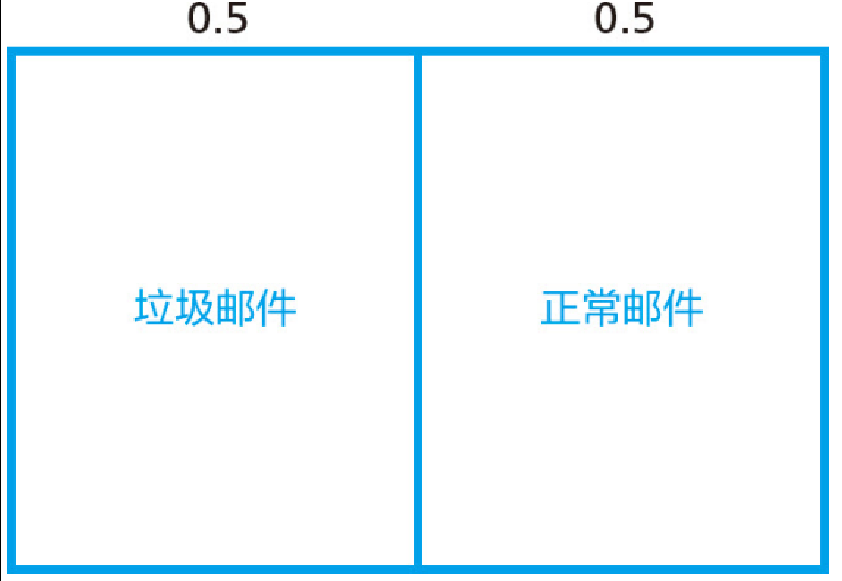

# 貝氏機率

## 貝氏機率

<figure><figcaption>
傳統統計學和貝氏統計的比較
</figcaption></figure>

### 頻率派與貝氏派的思考方法

貝葉斯統計的優勢在於在資料較少的情況下，也可以進行推論，且資料越多，推論結果越準確。以及對所獲得的資訊可做出即時反應，自動升級「推論」的學習功能。

貝葉斯公式中，包含了先驗機率(主觀機率)，因此在頻率學派(客觀機率)中不易被接受。

1. 通過經驗(主觀)設定先驗機率(prob. of hypothesis， P(H))。
2. 觀察不同假設下事件發生的機率(likelihood， P(data/H))。

共同點：

* 兩派都承認樣本有機率分佈，且分佈的計算方法有相同的準則。
* 頻率派推論與貝氏推論的中心都圍繞似然 likelihood的概念。然而二者對似然提供的資訊之理解和解釋完全不同。

相異點：頻率派把未知參數$$\theta$$看成一個固定量，而貝氏派將$$\theta$$視為隨機變數，且隨機變數的分佈隨著觀察到的資料而調整。

<mark style="color:red;">貝氏機率的精神在於會隨著新的資料(証據)，而不斷更新之前的信念(先驗機率)，保留不確定性，很少會做出絕對的判斷</mark>。

<mark style="color:red;">頻率學派將機率視為長時間內事件發生的頻率或某事件在多次重複觀察實驗結果中發生次數所佔的比例</mark>。 但對於沒有長期頻率的事件難以解釋，例如選舉中某侯選人勝選的機率，但選舉只選一次。

* 因此頻率學派採用替代現實的想法，即在許多個平行世界中有多次選舉，侯選人勝選的次數比例(客觀)。
* 貝式學派將勝選的機率解釋為選勝的信心(主觀)。

頻率派把需要推論的參數(向量)$$\theta$$看成固定的未知參數。即$$\theta$$是未知的固定值。同時樣本$$X$$是隨機變數，所以頻率學派研究樣本空間，大部份的機率都是討論樣本$$X$$的分佈。

貝氏學派認為參數$$\theta$$是隨機變數，而樣本$$X$$是已觀察到的固定實現值，因此研究重點是$$\theta$$的分佈。

* <mark style="background-color:red;">先驗分佈</mark>$$\mathrm{P}(\theta)$$<mark style="background-color:red;">+ 樣本資訊</mark>$$X$$<mark style="background-color:red;">=後驗分佈</mark>$$\mathrm{P}(\theta~|~X)$$<mark style="background-color:red;">。</mark>

貝氏統計的優勢在於，「在資料較少的情況下也可以進行推論，且資料越多，推論結果越準確」，以及「對所獲的信息可做出瞬時反應，自動升級推論」的學習功能。

#### 貝氏機率推理/逆機率 (Bayesian reasoning/inverse probability)

所有的機率都是條件機率。

* 根據已知的資訊所得出。
* 或一般性大家都接受的某種假設條件。

其次，機率，並不是“長遠”地重複觀察獲得的事件發生頻率。相反地，機率的大小取決與自身和感興趣的話題（事件）。例如：

* 明天會下雨嗎(頻率或信心)？
* 下一場比賽會贏還是會輸(頻率或信心)？
* 期末考試能不能過(信心)？

#### 主觀機率解釋

Savage運用的是經濟學傳統方法：假設，若事件$$A$$發生，可獲得1萬元的$$f$$獎;若事件$$B$$發生，可獲得1萬元的$$g$$獎。 現在的問題是:你想要哪一個獎項?

假設你的回答是$$f$$獎。那麼經濟學上將這個答案記做$$f>g$$。此時，相比於$$B$$，你更相信$$A$$的「準確性」， 這點是無疑的。 如果將所有的事件都做成上述調查問卷的形式，那麼根據你的答案，就可以判斷出所有事物的準 性的大小關係，而這個關係就可以被定義為「機率」。

在剛才的例子中，則顯示為$$\mathrm{P}(A)> \mathrm{P}(B)$$，而這個機率不等式，是根據人們的主觀判斷而得來的。 Savage主張，像這樣得來的便是「主觀機率」。

### 貝氏統計推論中所使用的三種資訊

統計推論的主要任務是使用樣本估計總體。樣本有兩重性：

* 當樣本視為隨機變數時，它有機率分佈，稱為總體分佈。如果已經知道總體的分佈形式，則樣本提供了我們<mark style="color:red;">總體資訊</mark>。如已知樣本為常態分佈時，可知道樣本的形狀等資訊。但獲取總體的資訊要付出許多成本。
* 另一種資訊為<mark style="color:red;">樣本資訊</mark>，就是從總體中抽出的樣本所提供的資訊。樣本越多，提供的資訊越多。我們希望通過對樣本的加工、整理、對總體的分佈和某些特徵做出統計推論。

<mark style="color:blue;">總體資訊和樣本資訊</mark>放在一起時，稱為抽樣資訊(sampling information)。而以抽樣資訊進行統計推論的方法稱為<mark style="color:blue;">經典(古典)統計學(classical statistics)</mark>。其基本觀點時將樣本看成來自有一定機率分佈的總體，所研究的對象是這個總體而不限於資料本身。

另一種資訊為<mark style="color:red;">先驗資訊(prior information)</mark>，就是在抽樣之前，有關統計推論問題中未知參數的一些資訊，一般來自於經驗或歷史資料。

基於<mark style="color:blue;">總體資訊、樣本資訊和先驗資訊</mark>進行統計推論的方法稱為<mark style="color:blue;">貝氏統計學(Bayesian statistics)</mark>。其於經典統計學的主要區別在於是否使用先驗資訊，且在使用樣本中也存在差異。

* 貝氏方法重視已觀察到的樣本，不考慮尚未發生的樣本。
* 貝氏統計重視先驗資訊的收集，使其形成先驗分佈加到統計推論中。

### 先驗、似然、後驗機率(prior， likelihood， posterior probability)

統計歸納是從一種族群成員的子集中瞭解該族群的一般特徵的過程。

<mark style="color:blue;">總體的特徵的數值通常用</mark>$$\theta$$<mark style="color:blue;">表示</mark>，<mark style="color:blue;">子集的數值描述形成了資料集</mark>$$X$$。在得到資料集之前時，總體特徵和資料集的數值都無法確定。而在得到資料集$$X$$之後，它所包含的資訊可用於降低對總體特徵的不確定性。量化不確定性的這種變化是貝氏推理的目的。

### 貝氏推理流程

樣本空間$$Y$$是所有可能的資料集的集合，從中將生成單個資料集$$y$$。參數空間$$\Theta$$ 是一組可能的參數值，我們希望從中確定最能代表真實總體特徵的值。貝氏學習的理想化形式始於關於 $$y$$ 和 $$\theta$$ 的聯合信念 (joint belief)的數值公式，以$$Y$$ 和$$\Theta$$的機率分佈表示。

* 對於每個總體數值 $$\theta \in \Theta$$，先驗分佈$$\mathrm{P}(\theta)$$ 描述了我們認為$$\theta$$ 代表真實總體特徵的信念。
* 對於每個$$\theta \in \Theta$$ 和$$y \in Y$$，抽樣模型$$\mathrm{P}(y|\theta)$$ 描述了我們的信念，即如果我們知道 $$\theta$$ 為真，$$y$$ 將是我們研究的出像。

一旦我們獲得了資料(實現值)$$y$$，最後一步就是更新對$$\theta$$的信念：

* 對於$$\theta \in \Theta$$ 的每個數值，後驗分佈$$\mathrm{P}(\theta|y)$$ 描述了我們在觀察資料集$$y$$ 之後，認為$$\theta$$ 是真實值的信念。
* <mark style="color:red;">後驗分佈是從先驗分佈和採樣中獲得的</mark>。

在貝式統計中，一個隨機事件或者一個不確定事件的後驗機率是在考慮和給出相關證據或數據後所得到的條件機率。 同樣，後驗機率分布是一個未知量（視為隨機變量）基於試驗和調查後得到的機率分佈。

**「後驗」在此中代表考慮了被測試事件的相關證據**。

* 後驗機率(posterior probability)是隨機變數$$\theta$$且先驗分佈為$$\mathrm{P}(\theta)$$，在給定證據(evidence) $$X$$後的條件機率：$$\mathrm{P}(\theta \vert X)$$。
* 與似然函數(likelihood function)相反，其為證據$$X$$給定了參數$$\theta$$後的機率：$$\mathrm{P}(X \vert \theta)$$。
* 首先定義統計模型參數$$\theta$$，將$$\theta$$視為隨機變數，且在觀察到樣本之前，分配一個機率分佈給$$\theta$$稱為先驗分佈(prior distribution)，記為$$\mathrm{P}(\theta)$$<mark style="color:blue;">。當樣本足夠多時，先驗分佈的選取就不重要了</mark>。但實際上，選擇一個恰當的先驗分佈能夠大大地節省後驗分佈的計算時間，甚至可以匯出後驗分佈的解析表示式。

則樣本在此參數的可能性為$$\mathrm{P}(X|\theta)$$，因此使用貝式定理得後驗機率為：

$$
\mathrm{P}(\theta | X)=\frac{\mathrm{P}(\theta， X)}{\mathrm{P}(X)}=\frac{\mathrm{P}(X|\theta)\mathrm{P}(\theta)}{\mathrm{P}(X)}=\frac{(X|\theta)\mathrm{P}(\theta)}{\int_{\theta^{'}}\mathrm{P}(X| \theta^{'})\mathrm{P}(\theta^{'})d\theta^{'}}
$$

* 後驗機率可以寫成更易記憶的形式，為後驗機率(posterior probability) ∝似然率(likelihood)×先驗機率(prior probability)。
* Posterior = ( Likelihood \* Prior ) / Evidence。

通常先驗概率可通過經驗來判斷；在特殊情況下，即使沒有類似經驗，也可以進行判斷。「事前」的含義是：在獲得某項信息之前。此處的信息是指附加的狀況 。

這個定理也告訴我們為什麼貝氏推論在18，19世紀時被叫做「逆機率推理」。因為似然率$$\mathrm{P}(X|\theta)$$與先驗機率$$\mathrm{P}(\theta)$$相乘後， 機率發生了逆轉$$\mathrm{P}(\theta|X)$$。

**貝氏推論過程**

1. 關於類別的先驗機率(經驗或觀察)
2. 關於類別的條件機率(從資料中分析)
3. 對行為的觀察
4. 排除不可能的情形
5. 類別的機率正規化
6. 得到後驗機率

在頻率派的推理中，顯著水平是其風險的指標。 其含義是:例如，將顯著水平設定 $$\alpha$$，那麼如果用同一種方法，反覆使用假設檢驗的話，有$$\alpha$$的概率會得出錯誤的結論。

根據貝氏推理得出的結論的風險，其實就是「後驗機率」本身。

### 範例：顧客是買東西還是逛逛而已(由經驗得到先驗機率)

推算的第一步：將兩種顧客（來買東西的顧客(A)、隨便逛逛的顧客(B)）的比例進行數值分配(先驗機率)。 假設買東西和隨便逛逛顧客機率分別為20%: 80% (先驗機率$$\mathrm{P}(A)=0.2，~\mathrm{P}(B)=0.2$$)。

第二步是觀察資料，得到兩類人(買東西:隨便逛逛)分別向店員循問(事件$$X$$)的機率分別為90%與30%(似然率$$\mathrm{P}(X~|~A)=0.9，~\mathrm{P}(X~|~B)=0.3$$)。

| 類別        | 循問店員的機率  | 不問店員的機率  |
| --------- | -------- | -------- |
| 買東西的人(A)  | 20%\*90% | 20%\*10% |
| 隨便逛逛的人(B) | 80%\*30% | 80%\*70% |

上表可得四種聯合機率(宇集合)：

* P(買東西的人且循問店員)=$$\mathrm{P}(X，A)=20% \times 90%=18%$$。
* P(買東西的人且不循問店員)=$$\mathrm{P}P(X^c， A)=20% \times 10%=2%$$。
* P(隨便逛逛的人且循問店員)=$$\mathrm{P}(X，B)=80% \times 30%=24%$$。
* P(隨便逛逛的人且不循問店員)=$$\mathrm{P}(X^c， B)=80% \times 70%=56%$$。

在現實生活中，若店員遇到客人來循問店員(新增訊息，或已觀察到資料)，則此時可將不問店員的事件排除，因此只剩兩種情況：

* P(買東西的人|循問店員)=$$20% \times 90%=18%$$。
* P(隨便逛狂的人|循問店員)=$$80% \times 30%=24%$$。

正規化後得後驗機率$$\mathrm{P}(A~|~X)~\mathrm{P}(B~|~X)$$，<mark style="color:red;">可判定循問店員的人屬於隨便逛逛類型的機率較高</mark>。

* P(買東西的人|循問店員)=$$\frac{0.18{{0.24+0.18}=42.9%$$。
* P(隨便逛逛的人|循問店員)=$$\frac{0.24}{0.24+0.18}=57.1%$$。

### 範例：檢驗陽性得病的機率(由經驗得到先驗機率)

假設，某種特定的癌症的患病率為0.1%。而得到這癌症的人中有95%的機率被診斷為陽性。 但另一方面，健康人群也有2%的可能性被誤診為陽性。 那麼，如果在這個檢查中被診斷為陽性的時候，實際患上這種癌症的機率為多少呢?

先驗分佈: 癌症患者(A):健康的人(B) = $$\mathrm{P}(A)=0.1\%$$， $$\mathrm{P}(B)=99.9\%$$。

| 類別    | 陽性        | 陰性         |
| ----- | --------- | ---------- |
| 癌症(A) | 0.1%\*95% | 0.1%\*5%   |
| 健康(B) | 99.9%\*2% | 99.9%\*98% |

聯合分佈: 檢驗為陽性$$X$$時，聯合機率為

* 檢驗為陽性且確實得癌症: $$\mathrm{P}(X， A)=0.1\% \times 95\%=0.095\%$$
* 檢驗為陰性且確實得癌症: $$\mathrm{P}(X^c， A)=0.1\% \times 5\%= 0.005\%$$
* 檢驗為陽性且為健康的人: $$\mathrm{P}(X， B)=99.9\% \times 2\%= 1.998\%$$
* 檢驗為陰性且為健康的人: $$\mathrm{P}(X^c， B)=99.9\% \times 98\%= 97.9\%$$

因此在已知陽性時，可排除掉陰性的事件，得條件機率：

* 已知檢驗為陽性且確實得癌症: $$\mathrm{P}(A|X)=0.095\%$$
* 已知檢驗為陽性且為健康的人: $$\mathrm{P}(X|B)=1.998\%$$

正規化後得後驗機率：

* 已知得癌症且檢驗為陽性: $$\mathrm{P}(X|A)=\frac{0.095\%}{0.095\%+1.998\%}=4.54\%$$
* 已知為健康的人且檢驗為陽性: $$\mathrm{P}(X|B)=\frac{1.998\%}{0.095\%+1.998\%}=95.46\%$$

因此檢驗出陽性時，為健康的人的機率還是比較高。

### 範例：是否有好感(主觀的先驗機率)

在情人節那天，你收到了女同事的巧克力，那麼她喜歡自已的機率為何?

先驗分佈(主觀機率): 喜歡(A):不喜歡(B) = $$\mathrm{P}(A)=50\%$$， $$\mathrm{P}(B)=50\%$$。

聯合分佈：由雜誌做過調查，職場女性對喜歡的人送出巧克力的平均機率為40%，而對一般人送出巧克力的平均機率為20%。

| 類別     | 送出巧克力      | 不送出巧克力     |
| ------ | ---------- | ---------- |
| 喜歡(A)  | 50% \* 40% | 50% \* 60% |
| 不喜歡(B) | 50% \* 20% | 50% \* 80% |

聯合分佈: 送出巧克力為$$X$$時，聯合機率為：

* 送出巧克力且喜歡的人: $$\mathrm{P}(X， A)=40\% \times 50\%=20\%$$。
* 不送出巧克力且喜歡的人$$\mathrm{P}(X^c， A)=60\% \times 50\%=30\%$$
* 送出巧克力且不喜歡的人: $$\mathrm{P}(X， B)=20\% \times 50\%=10\%$$。
* 不送出巧克力且不喜歡的人: $$\mathrm{P}(X^c， B)=80\% \times 50\%=40\%$$。

因此在已知送出巧克力時，可排除掉沒收到巧克力的事件，得條件機率：

* 送出巧克力且喜歡的人: $$\mathrm{P}(X| A)=20\%$$。
* 送出巧克力且不喜歡的人: $$\mathrm{P}(X| B)=10\%$$。

正規化得後驗機率：

* 已知送出巧克力且喜歡的人: $$\mathrm{P}(A| X)=\frac{0.2}{0.2+0.1}=66.67\%$$。
* 已知送出巧克力且不喜歡的人: $$\mathrm{P}(B| X)=\frac{0.1}{0.2+0.1}=33.33\%$$。

因此收到巧克力時，為女同事喜歡的人的機率為66.67%。

### 範例：貝氏推論求黑壺或白壺

有兩外表相同的壺，A壺中有9個白球1個黑球，B壺中有1個白球9個黑球。現在面前有一未知類別的壺， 從中取出1球為黑球，則此壺為A或B壺?

先驗機率：因為無法從外表分辨壺，因此令$$\mathrm{P}(A)=0.5$$， $$\mathrm{P}(B)=0.5$$。

聯合分佈：

* $$\mathrm{P}(A， Black) = 0.5 * 0.1 = 0.05$$
* $$\mathrm{P}(A， White) = 0.5 * 0.9 = 0.45$$
* $$\mathrm{P}(B， Black) = 0.5 * 0.8 = 0.4$$
* $$\mathrm{P}(B， White) = 0.5 * 0.2 = 0.1$$

已知抽出黑球，因此可排除白球的事件得：

* $$\mathrm{P}(A| Black) = 0.05$$
* $$\mathrm{P}(B| Black) = 0.4$$

正規化後得後驗機率

* $$\mathrm{P}(Black|A) = \frac{0.05}{0.05+0.4}=11.11\%$$
* $$\mathrm{P}(Black|B) = \frac{0.4}{0.05+0.4}=88.89\%$$

因此抽出黑球時，此壺為$$B$$的機率為88.89%。

## 悖論：Monte Hall(三羊)與三個囚犯問題

#### Monty Hall問題

玩家面前有A、B、C三道門。其中一道門後面停著一輛轎車作為獎品。你需要在這三道門中任選一道，如果 開門，後面有轎車的話，那麼轎車就歸你所有了。

而當你選擇了A門之後，主持人會從剩下的兩道簾子中， 選擇B門打開，而B門後面並沒有轎車。這時，主持人會問你:「現在只剩下你所選的A門和尚未打開的C門這兩種 選擇了，那麼現在你要不要改變主意呢?」這時，你認為該不該改變最初的選擇呢?

實際上，這個問題的正確答案是:應該選擇換門。 理由是在C門後面停有轎車的(主觀)機率比A門大。

#### 三囚問題

有A、B、C三個囚犯。所有人都知道，這三人中，有兩人要被處死，剩下一人被釋放，但不知道被釋放的會是誰。

這時A對看守說:「反正三個人中有兩人要被處死，所以B 、C中兩個人中，至少有一個是要被處死的。 即使你告訴我這兩人中誰要被處死，對我來說也沒什麼益處。那麼，能不能請你告訴我，究竟誰要被處死呢?」

看守聽後，同意了A的看法，於是告訴他:B將要被處死。A聽了這話，心中竊喜。 因為A是這樣考慮的:在什麼情況都不瞭解的時候，我被釋放的概率是1/3;但在，我知道了B要被處死， 那麼我和C之中，如果一方被處死，另一方肯定會被釋放。這樣一來，我釋放的機率就上升到了1/2。

之所以將三個囚犯的問題稱為「悖論」，是因為A的理由無法讓大多數人信服。A僅僅通過知道除自己之外 將要被處死的人的名字，他被釋放的機率就得到提升，或者說被處死的機率降低，這總讓人覺得有些奇怪。事 上，即使A被告知，將被處死的人是C，結果也是一樣的。也就是說，即使完全不知道C、B 將被處死， A也可以推斷出自己被釋放的機率是1/2。

### 這兩個問題的本質相同

這兩個問題的關鍵點都在於：由於獲得了一定資訊而導致機率發生變化。但這一點與大多數人的直覺是相反的。

以下列出了關於這個問題的兩種想法:

1. 主持人打開B門後，可保證汽車一定藏在A門和C門這兩者之一的後面，所以機率也變為了兩種可能性各佔一半。 因此A門後藏有汽車的機率從1/3上升到1/2。
2. 即使知道了B門後面沒有汽車，A門後面藏有汽車的機率仍然不會變化。因此A門後藏有汽車的機率仍然是1/3不變。 而這同時意味著，C門後藏有汽車的機率從1/3上升到了2/3。

多數人會選擇上述兩種想法中的前者，而二者區別的關鍵在於：究竟是A和C的機率同時發生變化，還是僅僅C 機率發生了變化。隨著B的可能性被排除，那麼理所當然地，A和C的機率至少有一個會發生變化(標準化 件)，而問題是究竟是其中只有一個發生了變化，還是兩者都發生了變化呢?

針對同樣的問題使用三個囚犯的案例進行討論。

1. 已知B會被處死，可知被釋放的人肯定是A和C中的一人，所以機率也變成了二者各佔一半。因此A被釋放的機率從1/3 上升到1/2。
2. 即使已知B將會被處死，但A被釋放的概率仍然不會變化。因此，A被釋放的機率仍是1/3。而C被 釋放的概率從1/3上升到了2/3。

如果多數人在Monty Hall問題中選擇了想法1的話，那麼在三個囚犯問題中也會選擇想法1，結果就會和囚犯A的想法一樣。 相反，如果覺得三個囚犯問題中，囚犯A高興的理由很奇怪的話，就會選擇想法2，那麼在Monty Hall問題中， 也不得不改變之前選擇的門。

很多文獻都認為想法2是正確的，並對此進行了如下解釋：選擇者自身的機率不會發生變化，而非選擇者那一 的概率會發生變化。但再考慮以下的彩券問題。

### 彩券問題

假設你從海量的彩券中選出1張。之後主持人在剩餘的所有彩券中只選出1張留下，剩下的彩券全部銷毀， 並告訴你:剛才撕碎的彩券中沒有頭獎。這時你是應該改選主持人留下的那1張彩券，還是繼續堅持最初 選擇的那張彩券不變呢?

此時大多數人會毫不猶豫地認為「改選主持人留下的那1張勝算更大一些」。這是因為在最初自己選 那1張彩券的時候，這張彩券為頭獎的機率非常低;另一方面，頭獎在主持人手中剩餘的海量彩券之中的機率 有壓倒性優勢。而現在主持人手中所有不是頭獎的彩券都被銷毀了，因此可以推算出剩下的那1張彩券是頭獎 的可能性非常大。

如果按照這個理由來思考的話，那麼因獲得資訊而發生機率變化的，其實並不是你選擇的一方，而是你未選擇 那一方。

但順著這個思路來解決Monty Hall問題時，卻發現無法使用。這是因為該案例可以理為「將門的數量增加到極大值」 之後的模型，這與原本在三個門之中選擇其一的問題是完全不同的類別。

不過這裡提到的「機率」本身就是主觀性的概念。這是因為在你選出某1張彩券的時刻，它是不是頭獎就已經是 定不變的事實了，後來發生變化的只是「你的主觀推測值」。 既然是主觀的機率，那麼答案自然不止一個了。

### 回到Monty Hall問題

先驗機率：三個門後面有汽車的機率均相同，因此$$\mathrm{P}(A)=\mathrm{P}(B)=\mathrm{P}(C)=1/3$$。

| 類別   | 開B門         | 開C門         |
| ---- | ----------- | ----------- |
| A門有車 | 1/3\* 50%   | 1/3\*50%    |
| B門有車 | 0           | 1/3 \* 100% |
| C門有車 | 1/3 \* 100% | 0           |

聯合分佈：玩家選擇A門後，

* 若A門後面有車，則主持人開B，C門的機率相同。
* 若B門後面有車，則主持人只能開C門。
* 若C門後面有車，則主持人只能開B門。

已知主持人開B門，因此可排除開C門的情形．因此剩下：

* 若A門後面有車，且主持人開B門，機率為1/2 \* 1/3。
* 若C門後面有車，則主持人只能開B門， 機率為1/3。

正規化後得後驗機率分佈：

* 主持人開B門時，A門面後面有車的機率為 1/3。
* 主持人開B門時，C門面後面有車的機率為 2/3。

因此玩家應該要換選C門。
