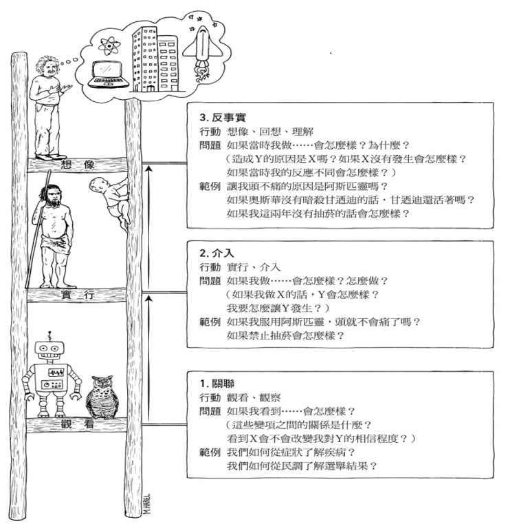

# 因果的三個層級

## 簡介

以下三點符合因果階梯的理論特性：機器不可能從原始資料得到解釋，它需要助力。

1. 在演化初期，人們就知道這世界不是只有單純事實\(資料\)，而且這些事實由複雜的因果關係彼此牽連。
2. **構成知識主體的要角是因果解釋，而不是單純事實**。而且因果關係應該是機器智慧的基礎。
3. 最後，**人類從資料處理者轉變成解釋提供者的過程不是漸近的，而是跳躍**的\(就像人類社會的進步不是漸近的，而是突發事件後，人們的行為跳躍式的大幅改變\)。

## 因果的三個層級

因果學習者要掌握三個不同層級的**認知能力：觀看、實行、想像**。

* 觀看：探知環境中的規律。
* 實行：預測刻意改變環境中的效果，並在這些改變中選擇適當的，以獲得想要的結果。如刻意的使用工具。
* 想像：對使用工具有「想法」，知道工具為何可用，以及工具不可用時如何處理。

因果階梯，每個層級都具備前一層級缺少的能力。可由「具備因果推論的生物才能推斷，但不具這種模型的生物無法推斷的事物是什麼？」得知。

### 第一層：關聯

大多數的動物和ML屬於第一級，他們透過「關聯」學習。

* **此階級需要被動的觀察結果進行預測**。
* 貓頭鷹觀察老鼠移動，思考下一刻牠會在那邊。
* 電腦圍棋程式研究棋局資料庫，尋找走那一步勝率較高。
* 這些行為都是在尋找規律。
* 當某個事件可能改變另一個事件出現的機率，稱兩事件有關聯。

常見的問題是：「如果我看到了…，會怎麼樣？」例：\[ 一個客人買了牙膏又買了牙線的機率為何？」。首先先蒐集分析資料。先蒐集所有客戶的購物行為資料，先選出買了牙膏者的資料，再針對買牙膏的族群，算出同時買牙線的比例，可得條件機率$$P(牙線|牙膏)$$。

也可用迴歸分析（regression analysis）分析兩變數之間的關聯性。但兩變數只有「相關」關係，無法分辨因果關係。

強AI的目標是打造具備人類智慧的機器，而深度學習的目標是打造具備超強能力，但不具智慧的機器，兩者最大的區別在於是否具有現實世界模型。

ML的模型（包括NN）大多以關聯模式運作。由一連串觀察結果主導，程式試圖配適（fit）吻合這些結果的函數，類似於統計迴歸方法。**而資料（特徵）為擬合過程的主要因素**。程式缺乏彈性與適應性。

### 第二級：介入

而工具使用者，如果行動是出於計畫而不是單純模仿，則屬於第二級。我們可以透過實驗得知介入的結果而得到因果的知識。

如上一級的問題，「如果把牙膏的價格翻倍，牙線的銷售量會有什麼變化？」這個問題需要介入才能回答，因為不只需要觀察，還要改變現狀。傳統統計學無法處理這類需要介入的問題。

銷售資料庫中，可以找到歷史牙膏加倍時的狀況，可能是因為貨源短決等原因。**但介入是探討是不管市場狀況，刻意改善價格的狀況**。結果可能會完全不同。

預測介入的結果，直接的方式就是在細心控制的條件下進行實驗。廣告公司常用網頁上的配置改變或是客戶收到不同提示（價格）會出現什麼狀況。

有時候不必做實驗，就可預測介入的效果。例如業務部可以開發包含市場狀況的的客戶行為模型。即使沒有各個因素的資料，可能有足夠的關鍵代理（key surrogate）資料進行預測。好的因果模型，可用第一層（觀察）資料回答第二層（介入）查詢。

第二層的查詢型式是：「如果我做…，會怎麼樣？」。例如改變牙膏的價格，則以某個價格賣出牙線的機率是多少？。沒有因果模型，無法由第一層資料回答第二層的查詢，因此ML無法回答介入的問題。

第二層另一個常見的問題是：「怎麼做？」。例如牙膏庫存太多，則問題是：「該怎麼賣出牙膏？」也就是：「該以什麼價格賣出牙膏？」

日常生活中，我們經常介入，例如使用阿斯匹靈（介入變項）解除頭痛（狀態）。如果因果正確，則結果狀態會從「頭痛」變成「頭不痛」。但如果在推理過程中，有其它的（介入）行為時，如吃東西、喝咖啡，則無法明確確定那一個介入導致狀態改變。

### 第三級：反事實

* 反事實學習者，可想像不存在的世界，推知眼前現象的原因。

