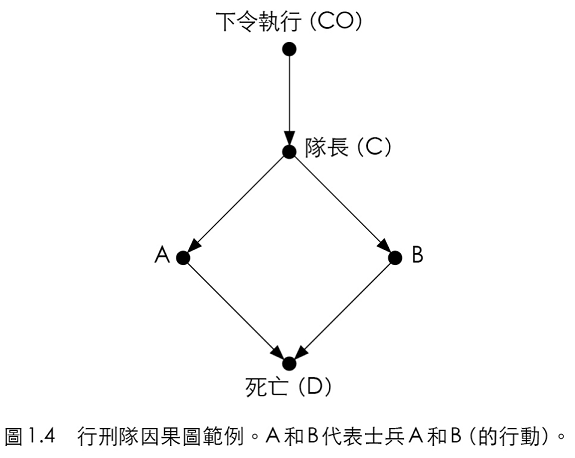
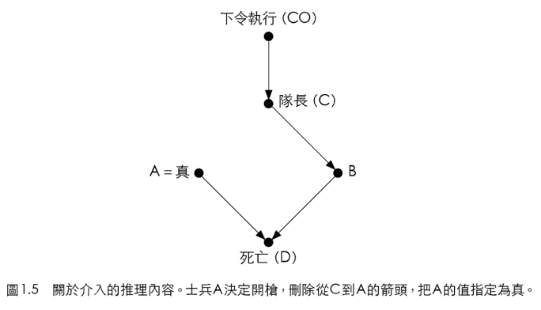
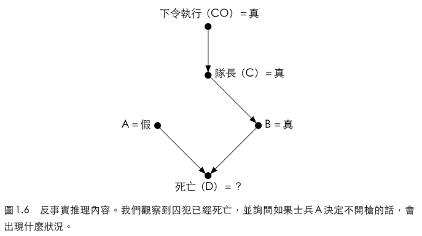
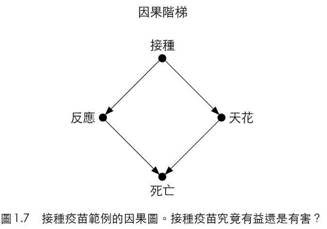

# 因果的三個層級

## 簡介

以下三點符合因果階梯的理論特性：機器不可能從原始資料得到解釋，它需要助力。

1. 在演化初期，人們就知道這世界不是只有單純事實\(資料\)，而且這些事實由複雜的因果關係彼此牽連。
2. **構成知識主體的要角是因果解釋，而不是單純事實**。而且因果關係應該是機器智慧的基礎。
3. 最後，**人類從資料處理者轉變成解釋提供者的過程不是漸近的，而是跳躍**的\(就像人類社會的進步不是漸近的，而是突發事件後，人們的行為跳躍式的大幅改變\)。

## 因果的三個層級

因果學習者要掌握三個不同層級的**認知能力：觀看、實行、想像**。

* 觀看：探知環境中的規律。
* 實行：預測刻意改變環境中的效果，並在這些改變中選擇適當的，以獲得想要的結果。如刻意的使用工具。
* 想像：對使用工具有「想法」，知道工具為何可用，以及工具不可用時如何處理。

因果階梯，每個層級都具備前一層級缺少的能力。可由「具備因果推論的生物才能推斷，但不具這種模型的生物無法推斷的事物是什麼？」得知。

### 第一層：關聯，討論眼前的世界

大多數的動物和ML屬於第一級，他們透過「關聯」學習。

* **此階級需要被動的觀察結果進行預測**。
* 貓頭鷹觀察老鼠移動，思考下一刻牠會在那邊。
* 電腦圍棋程式研究棋局資料庫，尋找走那一步勝率較高。
* 這些行為都是在尋找規律。
* 當某個事件可能改變另一個事件出現的機率，稱兩事件有關聯。

常見的問題是：「如果我看到了…，會怎麼樣？」例：\[ 一個客人買了牙膏又買了牙線的機率為何？」。首先先蒐集分析資料。先蒐集所有客戶的購物行為資料，先選出買了牙膏者的資料，再針對買牙膏的族群，算出同時買牙線的比例，可得條件機率$$P(牙線|牙膏)$$。

也可用迴歸分析（regression analysis）分析兩變數之間的關聯性。但兩變數只有「相關」關係，無法分辨因果關係。

強AI的目標是打造具備人類智慧的機器，而深度學習的目標是打造具備超強能力，但不具智慧的機器，兩者最大的區別在於是否具有現實世界模型。

ML的模型（包括NN）大多以關聯模式運作。由一連串觀察結果主導，程式試圖配適（fit）吻合這些結果的函數，類似於統計迴歸方法。**而資料（特徵）為擬合過程的主要因素**。程式缺乏彈性與適應性。

### 第二級：介入，討論可見的全新世界

而工具使用者，如果行動是出於計畫而不是單純模仿，則屬於第二級。我們可以透過實驗得知介入的結果而得到因果的知識。

如上一級的問題，「如果把牙膏的價格翻倍，牙線的銷售量會有什麼變化？」這個問題需要介入才能回答，因為不只需要觀察，還要改變現狀。傳統統計學無法處理這類需要介入的問題。

銷售資料庫中，可以找到歷史牙膏加倍時的狀況，可能是因為貨源短決等原因。**但介入是探討是不管市場狀況，刻意改善價格的狀況**。結果可能會完全不同。

預測介入的結果，直接的方式就是在細心控制的條件下進行實驗。廣告公司常用網頁上的配置改變或是客戶收到不同提示（價格）會出現什麼狀況。

有時候不必做實驗，就可預測介入的效果。例如業務部可以開發包含市場狀況的的客戶行為模型。即使沒有各個因素的資料，可能有足夠的關鍵代理（key surrogate）資料進行預測。好的因果模型，可用第一層（觀察）資料回答第二層（介入）查詢。

第二層的查詢型式是：「如果我做…，會怎麼樣？」。例如改變牙膏的價格，則以某個價格賣出牙線的機率是多少？。沒有因果模型，無法由第一層資料回答第二層的查詢，因此ML無法回答介入的問題。

第二層另一個常見的問題是：「怎麼做？」。例如牙膏庫存太多，則問題是：「該怎麼賣出牙膏？」也就是：「該以什麼價格賣出牙膏？」

日常生活中，我們經常介入，例如使用阿斯匹靈（介入變項）解除頭痛（狀態）。如果因果正確，則結果狀態會從「頭痛」變成「頭不痛」。但如果在推理過程中，有其它的（介入）行為時，如吃東西、喝咖啡，則無法明確確定那一個介入導致狀態改變。

### 第三級：反事實：看不見的幻想世界

反事實學習者，可想像不存在的世界，推知眼前現象的原因。就定義而言，資料就是事實，無法告知我們已知事實消失後，反事實或想像世界可能發生的狀況。但人類可以穩定的得到這類尋求解釋的推論。

以吃阿斯匹靈解除頭痛的例子，反事實層級問的是：「如果當初沒有服用阿斯匹靈，會出現什麼狀況？」。

而物理定律也可以解釋成反事實的推論。例如虎克定律：「掛在彈簧下的重量加倍，彈簧的長度也會加倍。」，這個論述是許多實驗（第二層）的結論。而主導函數的關係也就確定了，這麼多重量為$$X$$公斤，而彈簧長度為$$L_X$$公分的世界，都被視為同時運行的世界，但只有一個真實的世界存在。

以牙膏的例子來看，問題為「如果把牙膏的價格加倍，買過牙膏的人還會買的機率是多少？」。這是在比較真實世界（現在牙膏的價格）和虛構世界（牙膏價格加倍）。

**人類由反事實取得的優勢有靈活性、回想以及改變過往行為的能力**。

第三層的查詢問題是：「如果當時我做…會怎麼樣？」和「為什麼？」這兩個問題都要比較現實世界和反現實世界，單靠實驗無法解答。

## 迷你圖靈測試（mini Turing test）

1950年代，圖靈想知道如何電腦能夠像人類一樣思考會有什麼影響，於是提出了模仿遊戲（the imitation game），也稱圖靈測試（Turing test）。此外，圖靈還提出通過測驗的策略：「與其製造程式模擬大人的思考，何不試著模擬小孩的思考？」。如果做的到，就可以用教小孩的方式訓練程式，而智慧的關鍵在於因果關係。但小孩的大腦一樣有複雜的機制和範本，到今日還沒有機器可以通過圖靈測試。

迷你圖靈測試：「機器（和人）應該如何呈現因果知識，才能像三歲小孩般快速取得所需要資訊，正確回答問題，且能夠迅速執行？」。**此測試的主要構想是選擇一個簡短的故事，以某種方式編碼後輸入機器，測試機器能否回答人類能夠理解的因果關係**。

稱為「迷你」圖靈測試的原因有二：

1. 測驗僅限於因果推理，不含視覺或自然語言其它智慧。
2. 允許參與者以任意方式編碼故事，機器不必由自身經驗擷取故事。

**AI對於認知研究的重要貢獻是「先談呈現，再談獲取」**。良好的呈現方式，通常可讓我們了解，要如何從資料或程式設計師等來源獲取知識。

迷你圖靈測試不太可能以暴力法記住所有的結果，因為變數和解答之間是指數成長的複雜度。人類大腦一定有某種密集資訊呈現法和高效率程序，來正確解譯每個問題，再從儲存的呈現取出答案。因此要通過迷你圖靈測試，機器也要具備同樣高效的的呈現法和答案擷取演算法。

**上述的高效呈現法就是因果圖（causal diagram）**。這類的模型可通過迷你圖靈測試。

### 死刑犯與行刑隊

囚犯被槍決的流程：法院（CO）下執行命令給隊長（C），隊長下令給兩個士兵（A與B）開槍。假設兩名士兵槍法很好，只要有一人開槍，囚犯（D）必定死亡。

每個變數都是二元（真/假）變數。$$D=True (False)$$表示囚犯死亡（存活）。$$CO=True (False)$$代表法院有（沒有）下達命令。可用這張圖回答因果問題。

#### 關聯問題：（由某個事實知道關於另一個事實的某些事情）

如果囚犯死亡，是否表示法院已經下達命令？是。因為隊長沒有下令，兩個士兵不會開槍；而隊長沒有收到法院命令，不會下令開槍。

如果士兵A開了槍，可斷定B也開了槍，因為隊長沒有下令時，A不會開槍，因此B也開了槍。

#### 介入問題

如果士兵A在沒有隊長命令時，自作主張開了槍，但這與問題描述矛盾。我們必須教導電腦，「只是觀察事件」與「造成事件」間的差異。

「造成事件」時，去除所有指向事件的箭頭，繼續以一般的邏輯分析。當成箭頭原本就不存在。因此把指向A的箭頭去除，且把A設為True滿足題目需求。這次介入必定造成囚犯死亡，產生從A到D的箭頭。

原理：「造成某個事件」也就是排除其它影響，只保留促成事件發生的影響。

上圖與A沒有接受命令就開槍囚犯造成死亡的結論相同。此外還可判斷B極有可能不會開槍。

* 如果我們「看見」A開了槍，則可斷定B也開了槍。
* 如果A「決定」開槍，或我們「造成」A開了槍，則B可能沒有開槍。

這就是「觀察」與「介入」的主要區別。而電腦必須能夠理解其中的區別才能通過迷你圖靈測試。

如果只是單純的蒐集資料，而沒有建立模型得到因果關係，是無法預測A自作主張時的結果的。

#### 反事實問題

由前述已知若囚犯已經死亡，（由第一層）可得A、B開槍了，隊長下命令，且法院也下命令。但如果A決定不開槍時，囚犯會活下來嗎？此問題必須比較真實世界與A沒有開槍的虛構世界。

此虛擬世界中，A不必聽命於C，與命題相符。要通過迷你圖靈測試，電腦必須斷定士兵B會開槍殺死囚犯，所以囚犯在此虛擬世界中會死亡。

上面的因果推理，必須選擇性的違反邏輯，對於人類打破規則相當簡單，但對於電腦十分困難。迷你圖靈測試的重點，是讓電腦可以進行因果推理。

但在更複雜的狀況下，人類更難得到正確的因果推論。比如說變項可能更多，不是簡單的二元變數，而是實數值。除此之外，可能還會有突發的外在因素或異常，比如說行刑時，士兵B的槍突然卡彈。

### 天花疫苗接種問題

天花疫苗剛問市時，資料顯示死於接種疫苗的人，多過感染天花死亡的人數。

假設100萬人中有99%接種疫苗，1% 沒有接種。接種的人中，出現不良反應的是1% \(9900人\)，出現反應後導致死亡的是1% \(99人\)，而接種後得天花的機率是0。而沒有接種疫苗，對疫苗產生不良反應的機率是0，但感染天花的機率是2% \(200人\)，而感染天花後死亡的機率是20% \(40人\)。接種疫苗死亡的人數多於感染天花死亡的人數。

反事實的問題是：「如果全部的人都不接種疫苗，會怎麼樣？」可得100萬人中，有2萬人會得天花，4000人死亡。比較兩個世界可得不接種疫苗會造成4000-139=3861人死亡。

因果模型中，畫出$$X \rightarrow Y$$時，是在表達某個機率規則或函數指出$$X$$改變時，$$Y$$會如何跟著改變。在許多例子中，因果圖本身的結構，通常就能讓我們推測出各種因果和反事實關係。

故事改變時，不一定要用新查詢讓機器學習，因果圖的學習方法很強，只要畫的出來就可以。畫圖的重點在於因果關係，如果只問關聯，而不考慮因果，就無法得知介入與反事實的結果。

