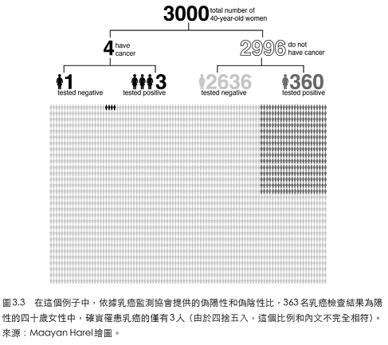

# 從證據到原因

## 貝式網路（Bayesian network）簡介

演繹：從假設到證據（下至上）。歸納：由證據產生假設（上至下）。福爾摩斯：「排除所有不可能之後，剩下的即使再不可能，也一定是真相」。

貝式網路的應用：語音辨識、垃圾郵件過濾、氣象預報、探勘油井等。

**因果圖和貝式網路的關係很簡單，因果圖就是貝式網路**。圖中的箭頭代表直接或可能存在的因果關係，以箭頭方向為準。貝式網路不一定有因果性，但如果要分析第二、三層的關係時，就要注意因果性。

P\(證據\|假設\)：正機率；P\(假設\|證據\)：逆機率（因果）。如果已經知道原因，大多數人都很容易預料到結果。例如把球丟向窗戶，窗戶應該會被球打破。但如果已知道到結果，則需要更多資訊才能知道原因。如窗戶被打破，還需要知道被什麼打破才能推出原因。

### 貝式定理

> $$\mathrm{P}(X|Y)\mathrm{P}(Y) = \mathrm{P}(Y|X)\mathrm{P}(X)$$或
>
> $$\mathrm{P}(X|Y) = \frac{\mathrm{P}(X,Y)}{\mathrm{P}(Y)}$$

$$\mathrm{P}(X|Y) = \frac{\mathrm{P}(X,Y)}{\mathrm{P}(Y)} = \frac{\mathrm{P}(Y|X)\mathrm{P}(X)}{\mathrm{P}(Y)}$$\(QED\)

我們也可以使用貝式定理隨時更新對某個假設的置信程度。但此處的置信程度是（主觀）的機率，即不同人對於相同的事件會有相異的主觀機率。

貝式定理為依據證據更新假設的基準法則。一個人發現$$X$$之後，對$$Y$$的置信度，永遠不低於他發現$$X$$之前對$$X$$和$$Y$$的置信度。

證據$$Y$$越驚奇（也就是$$P(Y)$$越小），則更應該相信他的原因$$X$$。

### 乳房X光的案例

40歲女性接受乳房X光，檢查是否得乳癌，檢驗結果為陽性。

假設$$D$$為得癌症，證據$$T$$是檢驗的結果。

* 前向機率（敏感度）：$$\mathrm{P}(T=True|D=True)$$病人有乳癌，且檢驗為陽性的機率。對所有病人都相同，只依賴儀器探測的靈敏度，而對病人的家族史與環境不敏感。
* 逆向機率：$$\mathrm{P}(D=True|T=True)$$假設檢驗結果為陽性，病人確實得到乳癌的機率。依不同類型（如有無家族病史、環境等敏感）的患者而異。

\(D更新後的機率\) = P\(D\|T\) = \(似然比\) \*\( D的事前機率\)

* 似然比（likelihood ratio）由$$\mathrm{P}(T|D)/ \mathrm{P}(D)$$決定，表示該疾病的患者得到陽性檢測結果的機率，比一般群體高多少。
* 因此不管先驗機率多少，新證據$$T$$都會通過一個固定的比例（似然比）提高$$D$$的機率。
* 令先驗機率$$\mathrm{P}(D)=1/700$$為40歲女性得乳癌的機率。
* $$\mathrm{P}(T|D)=0.73$$為40歲女姓乳房X光檢查的敏感度。
* $$\mathrm{P}(T)$$計算需要考慮$$\mathrm{P}(T|D)$$\[敏感度，得病患者檢測結果為陽性\]與$$\mathrm{P}(T|D^c)=0.12$$\[偽陽性率，未得病患者檢測結果為陽性\]的加權平均。所以$$\mathrm{P}(T) = \frac{1}{700} \times 0.73 + \frac{699}{700} \times 0.12 = 0.121$$。
* 更新後的$$\mathrm{P}(D)  = 0.73/0.121 \times 1/700 = 1/116$$，即得到陽性檢測結果的前提下，確實有乳癌的機率不到1%。

## 貝式定理和科學方法的關聯

科學方法的過程：

1. 提出假設
2. 推斷假設的可檢驗結果
3. 進行實驗並收集證據
4. 更新對假設的信念

一般學術涉及的是簡單的正確和錯誤兩種結果的檢測和更新。但生活中的證據包含了不確定性，因此使用貝式定理告訴我們如何更新步驟4的信念。

## 貝式定理到貝式網路

80年代初，學術界主流是以專家系統，將人類知識組織為「具體事實」和「一般事實」的集合，以推理規則連接兩者打造AI。例如：

* 蘇格拉底是一般人（具體事實），所有人都會死（一般事實）。
* 可得蘇格拉底會死的事實。

推理規則在理論上可行，但硬性規則很難捕捉到真實生活中的知識，有很多的例外狀況和證據的不確定性。專家系統本身無法使用系統所使用的語言闡明他們的思想。

70年代末，AI處理不確定性的領域有：

* Lofti Zadeh提出模糊邏輯（fuzzy logic），其中陳述概念不是true或false，而是一系列可能的真實值。
* Glen Shafer提出了置信度函數（belief functions），給每個事實分配兩個機率，一個表示其「可能」的機率，另一個表示其「可證明」的機率。
* Edward Feigenbaum提出了「確定性因子」。將不確定的數值融入用於推斷的確定性規則中。

這些方法雖然有獨創性，但有一個共同的缺點：它們模擬的是專家，而不是真實世界，因此常常會產生意外的結果。例如，**這些方法不能同時在診斷模式（從結果推理原因）與預測模式（從原因推理結果）運算**。**而貝式方法可以做到。**

例如規則「若起火，則冒煙」有確定度c1，與規則「若冒煙，則起火」有確定度c2，傳統方法無法很好的結合在一起，而強行結合會有主觀性雜質加入其中。

當時的學者也考慮用機率處理此一問題，但需要大量的儲存空間和計算能力，以當時的條件無法達成。而Pearl以鬆散耦合的變數網路表示機率，只讓每個變數與它的幾個相鄰變數發生相互作用，則可以克服計算上的大量需求問題。

Pearl的概念來自於David Rumelhart的神經網路架構（註：也是現在深度學習網路的概念）。閱讀是一個複雜的過程，底層的神經元僅負責識別個體特徵，如圓圈或線條；上層的神經元將這些形狀組合，形成字母的猜想

