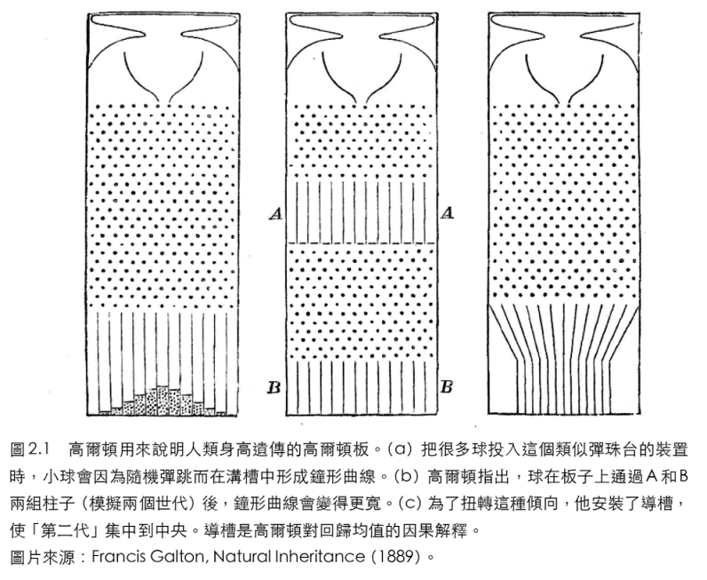
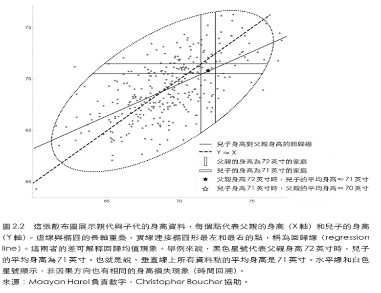
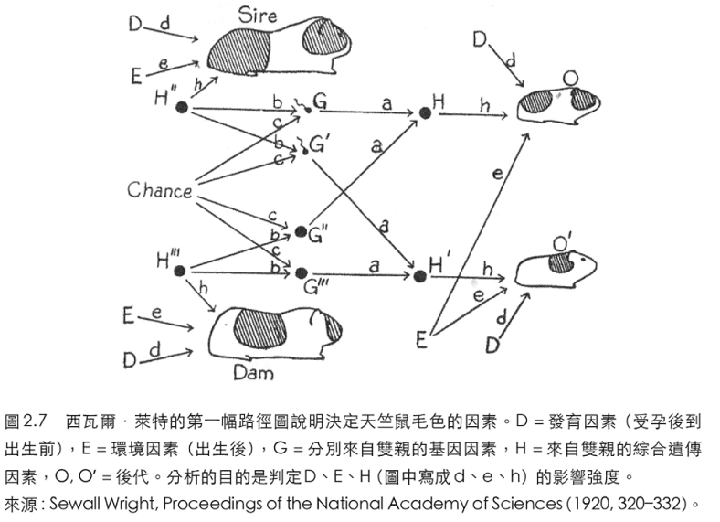

# 因果推斷的起源

## 相關係數

高爾頓以尋求因果關係為起點，最終發現了相關性，一種無視因果的關係。

1877年，Francis Galton在英國皇家學院展示了高爾頓板（Galton board）（像夜市的彈珠檯，珠子從上往下跑，中間有很多釘子，珠子向左或向右為隨機前進，最後會落到底部的某一個插槽）。如果把一堆珠子放進去，則可以得到近似常態分佈的結果。（註：此即二項式分佈在資料量夠多時，會近似常態分佈）。雖然單一個球的路徑是不可預測的，但是1000個球路徑的結果可預測性非常高（區間估計）。

迴歸中庸（regression toward mediocrity）在日常生活中經常可見。

* 如果讓學生複習同樣的資料參加兩次不同的標準化測試，則第一次分數較高的學生，在第二次測試中得分仍高於均值，但沒有第一次那麼高。
* 棒球中的年度新秀（第一賽季表現特別優秀的選手），經常在次年的賽季中表現不佳。

高爾頓後來用「相關」（correlated）來描述這種關係。

另一個解釋向均值迴歸的方法是使用散點圖（scttor plot）。父子身高的散點圖的形狀大致呈橢圓形，與常態分佈近似。預測總是落在一條直線上（迴歸線），它比橢圓的主軸的斜率小，而且有兩條直線，可以用父親的身高預測兒子的身高，也可以用兒子的身高預測父親的身高。**因此向均值迴歸現象中，因和果沒有區別**。

只要知道其中一個變數的值，搭配迴歸線的斜率，就可以預測另一個變數的值。

* 如斜率為0.5表示父親的身高每增加1英吋，兒子的平均身高增加0.5英吋，反之亦然。
* 而斜率等於1表示兩個變數完全相關，可將變化完全傳給另一個變數。
* 斜率不可能大於1，否則身高會高於平均值，會使得身高隨時間變動（從定態變成非定態）。

**只有一個變數可能準確預測另一變數時，斜率才等於1；如果預測結果近似於隨機猜測 則斜率等於0**。無論是由$$Y$$預測$$X$$或是由$$X$$預測$$Y$$，斜率都是相同的。**即斜率不涉及因果訊息**。一個變數可能是另一個變數的因，或是它們都是第三個變數的果，但對於預測目標變數這一目的，這些都不重要。

相關性的概念，首次在不依賴於人的判斷或解釋的前提下，以客觀度量說明了兩個變數是如何關聯的。這兩個變數可以是身高、智力或是收入，可以是因果的，相互獨立的或反因果的關係。

高爾頓的學生Karl Pearson（皮爾森）後來推導出經過正規化的迴歸線斜率公式，稱為「相關係數」（correlation coefficient）。

## 皮爾森將因果掃出統計學

皮爾森對於因果關係的看法為：

* 高爾頓讓我排除偏見，了解除數學不只能應用於屬於因果關係的自然現象。因果關係變成-1與1之間的相關關係。
* 以往一再出現的某種結果是一種經驗，我們以因果關係概念來表達這種經驗。科學無法證明某種結果是必然的，也無法確定它一定會一再出現。
* 因此對皮爾森來說，因果關係只是一種不斷反覆，而且無法證明其確定性。
* 不確定世界的因果論對皮爾森而且就是描述兩個事物之間關係的終極科學描述，一定可概括為列聯表（contingency table）。
* 換言之，資料就是科學的全部。此時只考慮因果之梯的第一階，介入與反事實概念都不存在了。
* 因果關係被解釋為一個發生在人類大腦之外世界中的客觀過程，不具有任何科學意義。有意義的思想只能反映觀察結果中存在的特定模式，而這些模式完全可以通過相關關係描述出來。皮爾森認為相關性是比因果關係更普遍的人類思維描述符號。

皮爾森的無因果觀點還是有漏洞，比如說「偽相關性」（spurious correlation），有時這種觀念一定要用因果關係才能理解。比如：

* 一個國家的人均巧克力消費量和該國諾貝爾獎得主的人數間，呈現強相關性。
* 而因果的解釋為在富裕的西方國家，吃巧克力的人更多，這些國家也比較容易得獎。
* 英國某年的死亡率與英國教堂主持婚禮的婚姻在總體上的比例有0.95的相關性。但只是兩獨立的歷史趨勢在同一時間出現而已，無因果關係。

**有一類的偽相關，是兩個異質總體合併時，會出現偽相關（Simpson悖論）**。如人類頭骨長度和寬度的相關性，在單獨考慮男性或女性的資料時，二者的相關性可忽略不計，但是把男女的資料合併在一起統計時，則相關性高達0.197。而這僅僅是不恰當地將兩個不同總體結合在一起的結果。**但是在因果關係中，正確的分析結果只能來自於合併後的資料，而非來自分組資料**。因為頭骨長度短可能表示來自於女生，因此寬度可能也較窄。

## 路徑圖\(path diagram\)

Sewell Wright（萊特）認為進化不是像達爾文所說的漸進過程，而是一種相對突然的爆發。

萊特發現，天竺鼠的毛色遺傳與孟德爾遺傳定律是相牴觸的。事實證明，純白或純色的豚鼠根本無法培育出來，甚至連多代近親交配的天竺鼠家族的後代在毛色上也存在明顯的變異，毛色從多半為白色到多半為彩色不等。這一事實與孟德爾遺傳定律的預測是相矛盾的，該預測認為，多代近親繁殖能夠「固定」某種特質。

萊特開始懷疑**毛髮白色素的數量是由某個基因獨立控制的**，並據此提出一種假設：是母鼠子宮內存在的某種“發育因子”（developmental factors）導致了天竺鼠某些特徵的變異。我們現在已經知道萊特的這一假設是正確的。**不同的毛色基因會表現在天竺鼠身體的不同部位，毛色的圖案不僅取決於天竺鼠繼承的基因，而且取決於這些基因的遺傳表現出現在天竺鼠的什麼身體部位，以及它們以何種組合得以表達或抑制**。

上圖中，未知的目標量是$$d$$，即發育因子對白色毛髮的影響。而被納入方程式的還有未知的遺傳因子$$h$$。萊特證明，只要知道圖中的因果量，就能以簡單的圖形法則預測資料間的相關（圖中未繪出）。

實際上是一種極具革命性的思路，**因為它首次證明「“相關關係不等於因果關係」這個判定應該讓位於「某些相關關係確實意味著因果關係」**。

萊特的分析結果表明，假設中的發育因子比遺傳因子發揮了更重要的作用。在隨機繁殖的天竺鼠中，42%的毛色變異是由遺傳因子引起的，58%是由發育因子引起的。相比之下，在一個多代近親繁殖的天竺鼠家族中，白色毛髮的變異只有3%是出於遺傳因子的影響，而有92%是出於發育因子的影響。換言之，在經過的20代近親交配後，由遺傳因子引起的變異已被完全消除，但由發育因子引起的變異依然存在。

注這張路徑圖顯示了所有你能想到的可能影響後代天竺鼠毛色的因子。字母$$D$$、$$E$$和$$H$$分別表示發育因子、環境因子和遺傳因子。每個父鼠（Sire）或母鼠（Dam）及其每個子女（後代$$O$$和$$O'$$）都有它自己的$$D$$、$$E$$和$$H$$因子集合。兩代天竺鼠的環境因子相同，但發育過程有所不同。該路徑圖也體現了當時孟德爾遺傳學說的新見解：天竺鼠父母的精子細胞和卵細胞（$$G$$和$$G''$$）決定了其後代的遺傳因子（$$H$$），而精子細胞和卵細胞又是由天竺鼠父母的遺傳因子（$$H'$$'和$$H'''$$）經由某種尚未被理解的混合過程（因為當時學界還未發現基因的存在）決定的。不過，當時的人們已經認識到，這種混合過程包含一定程度的隨機性（在圖中標記為“Chance”，即隨機因子）。

這張路徑圖中沒有明確顯示的是近親繁殖家族和正常家族的區別。在近親繁殖的天竺鼠家族中，天竺鼠父母的遺傳因子存在強相關性，萊特用$$H''$$和$$H'''$$之間的雙向箭頭來表示這種關係（圖2.7中未顯示）。**除此之外，圖中的每個箭頭都是單向的，由因指向果**。例如，從$$G$$到$$H$$的箭頭表示，天竺鼠父親的精子細胞可能對其後代的遺傳因子有直接的因果影響。從$$G$$到$$H'$$沒有箭頭，這表明決定了後代$$O$$遺傳因子的精子細胞對後代$$O'$$的遺傳因子沒有因果影響。

當你以這種方式挨個拆分圖中的箭頭時，你就會發現每個箭頭都有很明確的含義。另外請注意，每個箭頭都附帶一個小寫字母（$$a、b、c$$等）。這些字母被稱為「路徑係數」（path coefficient），代表了萊特想要求解的因果效應的強度。**粗略地說，路徑係數表示源變量（source variable）在多大程度上引起了目標變量中的變異。**例如，一個顯而易見的路徑係數是，每個天竺鼠後代的遺傳性結構都應當有50%來自其父，50%來自其母，所以$$a$$應該是1/2。

就當時而言，這種根據由一個變量引起的另一個變量的變異的多少解釋路徑係數的說法是十分合理的。**不過，現代因果推斷科學的解釋不同於此：路徑係數表示的是對源變量進行一次假設的干預所得到的結果。**幸運的是，在他當時分析的那些較為簡單的路徑圖中，這兩種解釋帶來的結果是一樣的。

**因為計算相關關係的規則（從第二層級到第一層級的橋樑）就是追蹤連接兩個變量的所有路徑，並將沿途所有的路徑係數相乘。**另外還需注意，**箭頭缺失所蘊含的假設實際上比箭頭存在所蘊含的假設更重要**。兩個變量間箭頭缺失這一事實將二者的因果效應限制為零，而箭頭存在這一事實並不能告訴我們因果效應的大小具體為何（除非我們事先對路徑係數賦值）。

當然，有時科學家無法掌握各個變量之間的關係網路的全部。在這種情況下，**萊特認為，我們可以在探索模式下使用路徑圖，假設某些因果關係存在並據此計算出變量之間的相關強度估計值。如果這一估計值與實際數據相矛盾，那麼我們就有證據說明我們假設的因果關係是錯的**。

1953年，赫伯特·西蒙（1978年諾貝爾經濟學獎得主）重新發現了這種使用路徑圖的方法，這為社會科學領域的許多研究工作帶來了很大的啟發。

雖然我們不需要知道各個變量之間的所有因果關係，僅利用部分信息也能夠得出一些結論，**但萊特非常清楚地指出了這一點：沒有因果假設，就不可能得出因果結論**。這與我們第一章的結論相呼應：**只使用從因果關係之梯第一層級的數據，你是不可能回答屬於因果關係之梯第二層級的問題的**。

有人會問，這難道不是循環論證嗎？你所做的不正是假設你想證明的東西？答案是否定的，從顯而易現的事實中，提取非顯而易見的內容不是循環論證。

萊特的貢獻是獨一無二的，**因為他得出結論（42%的遺傳性）所需要的資訊分屬於兩種截然不同的、幾乎不相容的數學語言：一種是圖形語言，另一種是資料語言。這種將定性的“箭頭指向訊息”與定量的“資料資訊”**（完全是兩門外語！）相結合的獨具創新的想法是一個全新的研究領域。

因此萊特和本書研究重點一樣，**是用數學語言呈現表達看似合理的因果知識，將其與經驗資料結合，回答具有實際價值的因果問題**。

路徑分析在使用前，必須先假設變數和因果關係的順序，才能用資料分析因果是否正確。與統計學是研究歸納資料的方法不同。去除統計學中的因果關係後，就只剩下歸納資料。

社會科學將路徑分析改名稱結構方程式建模（structural equation modeling, SEM）納入圖形表示法並廣泛應用。至1970年，路徑係數以電腦軟體LISREL計算，SEM才逐漸退場。接下來發生的事：路徑分析變成了一種生搬硬套的方法，研究者則變成了軟體使用者，對後臺發生的事情全無興趣。

在經濟學領域，路徑分析的代數部分演變為聯立方程模型（simultaneous equation models，沒有簡稱）。經濟學家幾乎完全捨棄了路徑圖，且時至今日依然如此，他們更多地借鑑了數值方程和矩陣代數方面的內容。這樣做的一個可怕後果就是，由於代數方程是沒有方向性的（$$x=y$$與$$y=x$$相同），經濟學家也就無法利用符號表示法來區分因果關係和迴歸方程，因此即使在解出方程之後，他們仍然無法回答與估計策略效果有關的問題。

由於這些對因，在1990年代前，只有少數人了解路徑圖的強大潛力。

Samuel Karlin的路徑分析的批評有兩個主張：

1. 路徑圖隱含假設兩個變數之間的關係為線性，以路徑係數表示之。（現有廣義非線性理論可以處理之）。
2. 可採用無模型（客觀）方法，運用各種展示，標記和對照，以互動方式理解資料。（但只能到因果階梯的第一層）

路徑分析必須依據使用者對因果關係的個人（主觀）理解，並反映在因果圖中。無法簡化為機械程式。

因果分析要求使用者提出主觀意見，繪製因果圖，呈現要探討的的因果過程想法。類似貝式機率加上主觀機率：以往想法-&gt;新證據-&gt;修正想法。

資料量增加，因果關係的主觀成份也不會消失，但只要兩人對假設達成共識，它能提供客觀的方式來解釋新證據。

