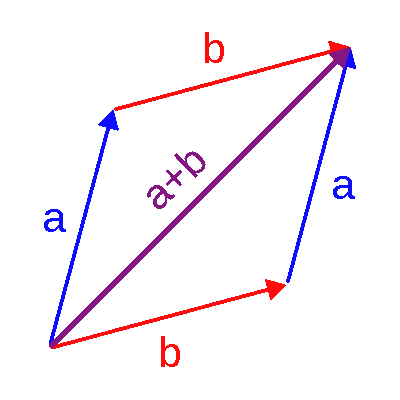
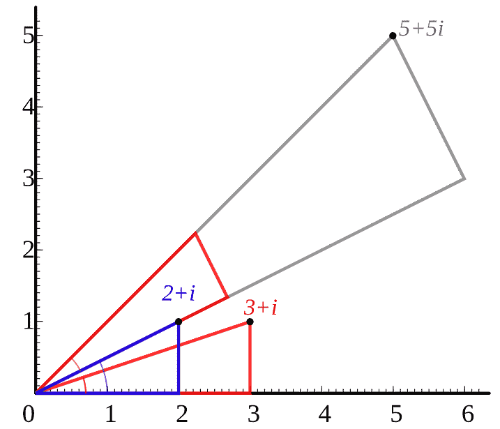
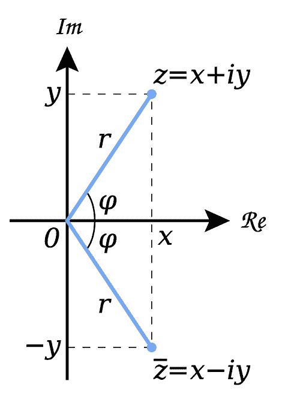

# 複數\(complex number\)

## 複數空間

複數空間$$\mathbb{C}^n$$ 為向量空間, 也稱為線性空間\(linear space\)

* 令$$V$$為非空集合，$$F$$為域\(field\)，定義二個運算$$+$$與$$\cdot$$，其中
  *  $$+:V \times V \rightarrow V$$為一函數，稱為向量加法\(vector addition\)。
  * $$\cdot:F \times V  \rightarrow V$$為一函數，稱為純量積\(scalar multiplication\)。
  * 即滿足 $$\forall u,v \in V$$ 唯一存在$$u+v \in V$$且$$\forall \alpha  \in F, ~ v \in V,$$唯一存在$$\alpha v \in V$$

若上述二個運算滿足以下八個性質，稱V is a vector space over field F

1. 向量加法交換性 $$\forall u,v \in V, u+v=v+u$$
2. 向量加法結合性 $$\forall u,v,w \in V,~ (u+v)+w=u+(v+w)$$
3. 向量加法單位元素 $$\exists 0 \in V \ni \forall v \in V,~ v+0=0=0+v=v$$
4. 向量加法反元素 $$\forall v \in V,~ \exists −v \in V \ni v+(−v)=(−v)+v=0$$
5. 純量積對向量加法分配性 $$\forall \alpha \in F, ~ u,v \in V, ~ \alpha\ \cdot (u+v)=\alpha \cdot u+\alpha \cdot v$$
6. 純量積對純量加法分配性 $$\forall \alpha ,\beta \in F,~ v \in V, ~ (\alpha+\beta)\cdot v=\alpha \cdot v+\beta \cdot v$$
7. 純量乘法對純量積結合性 $$\forall \alpha ,\beta \in F~ v \in V ~ (\alpha \beta)\cdot v=\alpha \cdot (\beta v)$$
8. 單位純量積之單位元素 $$\forall v \in V ~ 1\cdot v=v$$

## 複數

\[虛數, imaginary number\] $$i=\sqrt{-1}, ~ i^2=−1, ~ i^3=−\sqrt{-1}, ~i^4=1$$

複數$$z \in \mathbb{C}$$有以下常用型式

* $$z=x+iy $$
* $$z=(x,y)$$
*  \[極坐標, polar form\] $$z=(r \cos \theta,r \sin\theta),~ r=\sqrt{x^2 + y^2}> 0,~ \theta\equiv \mathrm{arg}(z)=\tan^{−1}⁡\frac{y}{x} \in [−\pi, \pi]$$
* $$z=re^{i\theta}$$
* $$x=\mathrm{Re}(z), y=\mathrm{Im}(z)$$
* $$\mathrm{Re}(z)=\frac{z + \overline{z}}{2}, ~ \mathrm{Im}(z)=\frac{z− \overline{z}}{2i}$$

### 模\(modulus\)

* $$|z| = \sqrt{x^2 + y^2} =\sqrt{\mathrm{Re}(z)^2 + \mathrm{Im}(z)^2}$$
* 複數之間無法比較大小，因此不能比較$$i$$與$$2i$$的大小, 但可以比較兩者的模$$|i|<|2i|$$

| 名稱 | 意義 | 符號 |
| :--- | :--- | :--- |
| modulus of $$z$$ | length $$r$$ of $$z$$ | $$|z|$$ |
| argument of $$z$$ | angle $$\theta$$ of $$z$$ | $$\mathrm{arg}(z)$$ |
| real part of $$z$$ | $$x$$ coordinate of $$z$$ | $$\mathrm{Re}(z)$$ |
| imaginary part of $$z$$ | $$y$$ coordinate of $$z$$ | $$\mathrm{Im}(z)$$ |
| imaginary number | real multiple of $$i$$ |  |
| complex conjugate of $$z$$ | reflection of $$z$$ in the real axis | $$\overline{z}$$ |

### 複數的四則運算

因為複數是實數的擴充，所以運算方式和實數相同 。

令$$z_1=x_1+iy_1,~ z_2=x_2+iy_2$$

* $$z_1=z_2 \Leftrightarrow x_1=x_2  \land y_1=y_2$$
*  \[加法交換性\] $$ z_1 \pm z_2=z_2 \pm z_1=(x_1 \pm x_2 )+i(y_1 \pm y_2 )  $$
*  \[加法單位元素\] $$z+(0+i0)=z$$
* \[加法反元素\] $$z+(−z)=0+i0$$
* \[乘法交換性\] $$z_1 z_2=z_2 z_1=(x_1 x_2−y_1 y_2 )+i(x_1 y_2+x_2 y_1 )$$
* \[乘法單位元素\] $$z_1 z_2=1 \Rightarrow z^{−1}=\frac{1}{x+iy}=\frac{x}{x^2+y^2 }−i\frac{y}{x^2+y^2 }$$

  * $$x_1 x_2−y_1 y_2=1$$ and $$(x_1 y_2+x_2 y_1 )=0$$
  * $$x_2=\frac{x_1}{x_1^2+y_1^2 }, ~ y_2=\frac{−y_1}{x_1^2+y_1^2 }$$

* $$z_1 (z_2+z_3 )=z_1 z_2+z_1 z_3$$
* $$z_1 z_2=0 \Leftrightarrow z_1=0 \lor z_2=0$$
* $$z^{n+1}=z^n z,~ \forall n \in \mathbb{N}$$
* $$z \neq 0, ~ z^0=1, ~(z^{−n} )=(z^n )^{−1}$$
* $$\frac{z_1}{z_2} =z_1 z_2^{−1}$$
* $$z^{\frac{1}{n}} \equiv |z|^{\frac{1}{n}}e^{\frac{\theta +2k \pi)}{n}}=|z|^{\frac{1}{n}} \left( \cos⁡ \left( \frac{\theta+2k\pi)}{n}\right),~\sin\left( \frac{\theta+2k\pi)}{n}\right) \right), ~\forall k \in \mathbb{Z}$$
  *  If $$\theta \ in [−\pi, \pi]$$, $$c \equiv |z|^{\frac{1}{n}} \left( \cos(\frac{\theta}{n}),~sin(\frac{\theta}{n}) \right)$$  is called principal value of $$z^{\frac{1}{n}}$$
* $$z^{−\frac{1}{n}}=(z^{−1})^{\frac{1}{n}}$$

## 共軛複數\(conjugate complex\)

令$$z = x +iy$$，則其共軛複數$$\overline{z}= x -iy$$對稱於實數軸。

* \[Complex Conjugate Root Theorem\] 如果$$z=x+iy$$為一方程式的解，則$$\overline{z}=x−iy$$也為方程式的解。

> $$ \displaystyle \overline{\sum_{i=1}^n z_i} = \sum_{i=1}^n \overline{z_i}, ~ \forall n \in \mathbb{N}, z_i \in \mathbb{C}$$

* $$\overline{z_1 + z_2}=\overline{(x_1 + x_2)+ i (y_1 +y_2)}=(x_1 + x_2) - i(y_1 + y_2) = \overline{z_1} + \overline{z_2}$$
* 其它可用數學歸納法得出 \(QED\)

> $$ \displaystyle \overline{\prod_{i=1}^n z_i} = \prod_{i=1}^n \overline{z_i}, ~ \forall n \in \mathbb{N}, z_i \in \mathbb{C}$$

* $$\overline{z_1 z_2}=\overline{(x_1 x_2 -y_1 y_2) + i(x_1 y_2 + x_2 y_1)}=(x_1 x_2 - y_1 y_2) - i(x_1 y_2 + x_2 y_1)=\overline{z_1} \overline{z_2}$$
* 其它可用數學歸納法得出 \(QED\)

> $$ |z|^2 = z \overline{z}=| \overline{z}|^2  \geq 0, ~ \forall z \in \mathbb{C}$$

* $$z \overline{z} = (x+iy)(x-iy)=(x^2+y^2)=|z|^2$$\(QED\)

> $$\max\{|\mathrm{Re}(z)|, |\mathrm{Im}(z)| \} \leq |z|  \leq | \mathrm{Re}(z)| + |\mathrm{Re}(z)| \leq \sqrt{2} |z|, ~ \forall z \in \mathbb{C}$$

由複平面與三角不等式可得出。

> \[三角不等式\] $$|z_1 + z_2| \leq |z_1| + |z_2|$$

> $$| |z_1| - |z_2|| \leq |z_1 - z_2|$$

> \[Lagrange inequality\] $$\displaystyle  \left| \sum_{i=1}^n z_i \right| \leq \sum_{i=1}^n |z_i|, ~ \forall n \in \mathbb{N}, z_i \in \mathbb{C}$$

> \[Cauchy inequality\] $$\displaystyle  \left| \sum_{i=1}^n  z_i w_i \right| \leq \left( \sum_{i=1}^n |z_i|^2 \right)\left( \sum_{i=1}^n |w_i|^2\right), ~ \forall z_i, w_i \in \mathbb{C}$$

> \[distance\] $$d(z_1, z_2) = |z_1 - z_2|$$

