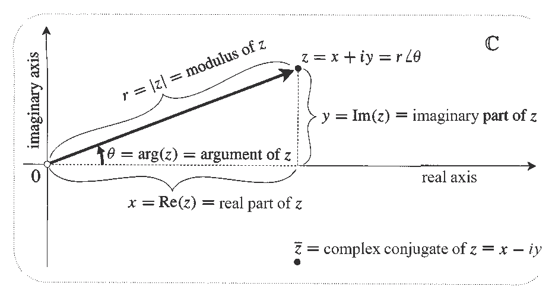
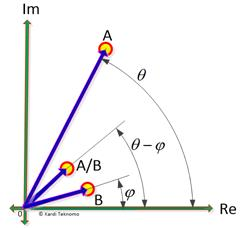
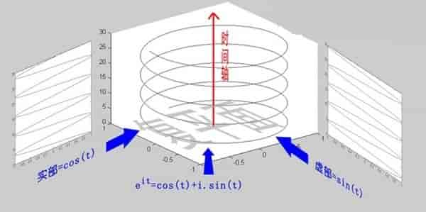

# 複數(complex number)

## 複數空間

複數空間$$\mathbb{C}^n$$ 為向量空間, 也稱為線性空間(linear space)

* 令$$V$$為非空集合，$$F$$為域(field)，定義二個運算$$+$$與$$\cdot$$，其中
  * &#x20;$$+:V \times V \rightarrow V$$為一函數，稱為向量加法(vector addition)。
  * $$\cdot:F \times V  \rightarrow V$$為一函數，稱為純量積(scalar multiplication)。
  * 即滿足 $$\forall u,v \in V$$ 唯一存在$$u+v \in V$$且$$\forall \alpha  \in F, ~ v \in V,$$唯一存在$$\alpha v \in V$$

若上述二個運算滿足以下八個性質，稱V is a vector space over field F

1. 向量加法交換性 $$\forall u,v \in V, u+v=v+u$$
2. 向量加法結合性 $$\forall u,v,w \in V,~ (u+v)+w=u+(v+w)$$
3. 向量加法單位元素 $$\exists 0 \in V \ni \forall v \in V,~ v+0=0=0+v=v$$
4. 向量加法反元素 $$\forall v \in V,~ \exists −v \in V \ni v+(−v)=(−v)+v=0$$
5. 純量積對向量加法分配性 $$\forall \alpha \in F, ~ u,v \in V, ~ \alpha\ \cdot (u+v)=\alpha \cdot u+\alpha \cdot v$$
6. 純量積對純量加法分配性 $$\forall \alpha ,\beta \in F,~ v \in V, ~ (\alpha+\beta)\cdot v=\alpha \cdot v+\beta \cdot v$$
7. 純量乘法對純量積結合性 $$\forall \alpha ,\beta \in F~ v \in V ~ (\alpha \beta)\cdot v=\alpha \cdot (\beta v)$$
8. 單位純量積之單位元素 $$\forall v \in V ~ 1\cdot v=v$$

## 複數

\[虛數, imaginary number] $$i=\sqrt{-1}, ~ i^2=−1, ~ i^3=−\sqrt{-1}, ~i^4=1$$

複數$$z \in \mathbb{C}$$有以下常用型式

* $$z=x+iy$$
* $$z=(x,y)$$
* &#x20;\[極坐標, polar form] $$z=(r \cos \theta,r \sin\theta),~ r=\sqrt{x^2 + y^2}> 0,~ \theta\equiv \mathrm{arg}(z)=\tan^{−1}⁡\frac{y}{x} \in [−\pi, \pi]$$
  * $$z=re^{i\theta}$$
* $$x=\mathrm{Re}(z), y=\mathrm{Im}(z)$$
  * $$z = \mathrm{Re}(z) + i \mathrm{Im}(z)$$
  * $$\mathrm{Re}(z)=\frac{z + \overline{z}}{2}, ~ \mathrm{Im}(z)=\frac{z− \overline{z}}{2i}$$

### &#xD;

| 名稱                         | 意義                                   | 符號                  |
| -------------------------- | ------------------------------------ | ------------------- |
| modulus of $$z$$           | length $$r$$ of $$z$$                | $$|z|$$             |
| argument of $$z$$          | angle $$\theta$$ of $$z$$            | $$\mathrm{arg}(z)$$ |
| real part of $$z$$         | $$x$$ coordinate of $$z$$            | $$\mathrm{Re}(z)$$  |
| imaginary part of $$z$$    | $$y$$ coordinate of $$z$$            | $$\mathrm{Im}(z)$$  |
| imaginary number           | real multiple of $$i$$               |                     |
| complex conjugate of $$z$$ | reflection of $$z$$ in the real axis | $$\overline{z}$$    |

### 虛數的意義

虛數$$i$$是-1 的平方根，可是它真正的意義是什麼呢？

這裡有一條數線，在數線上有一個紅色的線段，它的長度是1。當它乘以3 的時候，它的長度發生了變化，變成了藍色的線段，而當它乘以-1 的時候，就變成了綠色的線段，或者說線段在數軸上圍繞原點旋轉了180 度。

我們知道乘-1 其實就是乘了兩次$$i$$ 使線段旋轉了180 度，那麼乘一次$$i$$ 呢？答案很簡單：旋轉了90 度。

同時，我們獲得了一個垂直的虛數軸。實數軸與虛數軸共同構成了一個複數的平面，也稱複平面。這樣我們就了解到，**乘虛數**$$i$$**的一個功能: 旋轉**。

### 複數的四則運算

因為複數是實數的擴充，所以運算方式和實數相同 。

令$$z_1=x_1+iy_1,~ z_2=x_2+iy_2$$

* $$z_1 \pm z_2 = (x_1 \pm x_2)  + i (y_1 \pm y_2)$$
* $$z_1 z_2 = (x_1+iy_1)(x_2 + iy_2)=(x_1 x_2 - y_1 y_2) + i (x_1y_2+ x_2y_1)$$
* $$\frac{z_1}{z_2}=\frac{x_1+iy_1}{x_2+iy_2}= \frac{(x_1 + iy_1)(x_2-iy_2)}{(x_2+iy_2)(x_2-iy_2)}=\frac{x_1x_2 + y1y_2}{x_2^2+y_2^2} + i \frac{x_2 y_1 - x_1 y_2}{x_2^2+y_2^2}$$

### 複數的性質

* $$z_1=z_2 \Leftrightarrow x_1=x_2  \land y_1=y_2$$
* &#x20;\[加法交換性] $$z_1 \pm z_2=z_2 \pm z_1=(x_1 \pm x_2 )+i(y_1 \pm y_2 )$$
* &#x20;\[加法單位元素] $$z+(0+i0)=z$$
* \[加法反元素] $$z+(−z)=0+i0$$
* \[乘法交換性] $$z_1 z_2=z_2 z_1=(x_1 x_2−y_1 y_2 )+i(x_1 y_2+x_2 y_1 )$$
*   \[乘法單位元素] $$z_1 z_2=1 \Rightarrow z^{−1}=\frac{1}{x+iy}=\frac{x}{x^2+y^2 }−i\frac{y}{x^2+y^2 }$$

    * $$x_1 x_2−y_1 y_2=1$$ and $$(x_1 y_2+x_2 y_1 )=0$$
    * $$x_2=\frac{x_1}{x_1^2+y_1^2 }, ~ y_2=\frac{−y_1}{x_1^2+y_1^2 }$$

* $$z_1 (z_2+z_3 )=z_1 z_2+z_1 z_3$$
* $$z_1 z_2=0 \Leftrightarrow z_1=0 \lor z_2=0$$
* $$z^{n+1}=z^n z,~ \forall n \in \mathbb{N}$$
* $$z \neq 0, ~ z^0=1, ~(z^{−n} )=(z^n )^{−1}$$
* $$\frac{z_1}{z_2} =z_1 z_2^{−1}$$
* $$z^{\frac{1}{n}} \equiv |z|^{\frac{1}{n}}e^{\frac{\theta +2k \pi)}{n}}=|z|^{\frac{1}{n}} \left( \cos⁡ \left( \frac{\theta+2k\pi)}{n}\right),~\sin\left( \frac{\theta+2k\pi)}{n}\right) \right), ~\forall k \in \mathbb{Z}$$
  * &#x20;If $$\theta \ in [−\pi, \pi]$$, $$c \equiv |z|^{\frac{1}{n}} \left( \cos(\frac{\theta}{n}),~sin(\frac{\theta}{n}) \right)$$  is called principal value of $$z^{\frac{1}{n}}$$
* $$z^{−\frac{1}{n}}=(z^{−1})^{\frac{1}{n}}$$

## 共軛複數與模(conjugate complex and modulus)

令$$z = x +iy$$，則其共軛複數$$\overline{z}= x -iy$$對稱於實數軸。

* \[Complex Conjugate Root Theorem] 如果$$z=x+iy$$為一方程式的解，則$$\overline{z}=x−iy$$也為方程式的解。

### 模(modulus)

* $$|z| = \sqrt{x^2 + y^2} =\sqrt{\mathrm{Re}(z)^2 + \mathrm{Im}(z)^2}$$
* 複數之間無法比較大小，因此不能比較$$i$$與$$2i$$的大小, 但可以比較兩者的模$$|i|<|2i|$$
* $$|z| = |\overline{z}|$$

> $$\displaystyle \overline{\sum_{i=1}^n z_i} = \sum_{i=1}^n \overline{z_i}, ~ \forall n \in \mathbb{N}, z_i \in \mathbb{C}$$

* $$\overline{z_1 + z_2}=\overline{(x_1 + x_2)+ i (y_1 +y_2)}=(x_1 + x_2) - i(y_1 + y_2) = \overline{z_1} + \overline{z_2}$$
* 其它可用數學歸納法得出 (QED)

> $$\displaystyle \overline{\prod_{i=1}^n z_i} = \prod_{i=1}^n \overline{z_i}, ~ \forall n \in \mathbb{N}, z_i \in \mathbb{C}$$

* $$\overline{z_1 z_2}=\overline{(x_1 x_2 -y_1 y_2) + i(x_1 y_2 + x_2 y_1)}=(x_1 x_2 - y_1 y_2) - i(x_1 y_2 + x_2 y_1)=\overline{z_1} \overline{z_2}$$
* 其它可用數學歸納法得出 (QED)

> $$|z|^2 = z \overline{z}=| \overline{z}|^2  \geq 0, ~ \forall z \in \mathbb{C}$$

* $$z \overline{z} = (x+iy)(x-iy)=(x^2+y^2)=|z|^2$$(QED)

> $$\max\{|\mathrm{Re}(z)|, |\mathrm{Im}(z)| \} \leq |z|  \leq | \mathrm{Re}(z)| + |\mathrm{Re}(z)| \leq \sqrt{2} |z|, ~ \forall z \in \mathbb{C}$$

由複平面與三角不等式可得出。

> \[三角不等式] $$|z_1 + z_2| \leq |z_1| + |z_2|$$

> $$| |z_1| - |z_2|| \leq |z_1 - z_2|$$

> \[Lagrange inequality] $$\displaystyle  \left| \sum_{i=1}^n z_i \right| \leq \sum_{i=1}^n |z_i|, ~ \forall n \in \mathbb{N}, z_i \in \mathbb{C}$$

> \[Cauchy inequality] $$\displaystyle  \left| \sum_{i=1}^n  z_i w_i \right| \leq \left( \sum_{i=1}^n |z_i|^2 \right)\left( \sum_{i=1}^n |w_i|^2\right), ~ \forall z_i, w_i \in \mathbb{C}$$

> \[distance] $$d(z_1, z_2) = |z_1 - z_2|$$

## 極座標(polar form)

複數$$z=x+iy = r(\cos \theta, \sin \theta)= |z|(\cos \theta, \sin \theta), ~ \theta  = \mathrm{tan}^{-1}{(\frac{y}{x})}$$

共軛複數 $$\overline{z} = x - iy = r(\cos \theta, -\sin \theta) = |\overline{z}| (\cos (-\theta),  \sin(- \theta))$$

令$$z_1 = |z_1|(\cos \theta_1, \sin \theta_1), ~ z_2 = |z_2|(\cos \theta_2, \sin \theta_2)$$，可得

* &#x20;\[相差$$2n\pi$$倍角度會回到相同的角度] $$z_1=z_2 \Leftrightarrow |z_1 |=|z_2 |$$且$$\exists n \in \mathbb{Z} \ni  \theta_1 = \theta_2 + 2n \pi$$
*   &#x20;**\[複數相乘等於極坐標角度相加(旋轉)**] $$z_1 z_2=|z_1 ||z_2 |(\cos⁡(\theta_1+\theta_2 ),~ \sin⁡(\theta_1+\theta_2 ) )$$

    *   $$z_1 z_2=|z_1 ||z_2 |(\cos⁡\theta_1  \cos⁡\theta_2 −\sin⁡\theta_1  \sin⁡\theta_2, \cos \theta_1  \sin⁡\theta_2 +\sin⁡\theta_1  \cos⁡\theta_2 )=|z_1 ||z_2 |(\cos⁡(\theta_1+\theta_2 ),~\sin⁡(\theta_1+\theta_2 ) )$$

    * 註: $$1\cdot (−1+i0)=−1$$(旋轉$$\pi$$)， $$1\cdot (0+i)=i$$(旋轉$$\frac{\pi}{2}$$)
* \[**複數相除等於極坐標角度相減(旋轉)**] $$\frac{z_1}{z_2} =\frac{|z_1 |}{|z_2 | } (\cos⁡(\theta_1−\theta_2 ),~ \sin⁡(\theta_1−\theta_2 ) )$$
* $$\mathrm{arg}(z_1 z_2) = \mathrm{arg}(z_1) + \mathrm{arg}(z_2)$$
* $$\mathrm{arg}(\frac{z_1}{z_2}) = \mathrm{arg}(z_1) - \mathrm{arg}(z_2)$$
* \[**棣美弗定理 de Moivre's formula**], $$z=|z|(\cos⁡\theta,~\sin\theta )\in \mathbb{C}\setminus\{0\} \Rightarrow z^n=|z|^n (\cos (n\theta),~ \sin (n \theta)), ~\forall n \in \mathbb{Z}$$

## 歐拉公式(Euler formula)

> 歐拉公式提出，$$\forall x \in \mathbb{R}$$，均存在 $$e^{ix} = \cos x + i \sin x$$。
>
> 當$$x =\pi$$時，可得 $$e^{i\pi} + 1 =0$$。
>
> &#x20;這個公式表示$$e^{i\theta}$$  為單位圓上，幅角為$$\theta$$的一點，因此可將複數寫為 $$z=|z| e^{i\theta}$$
>

proof (Taylor series)：

* 由Taylor  series 得$$e^x = 1 + x + \frac{x^2}{2!} + \frac{x^3}{3!} +\ldots$$
* 因此 $$e^{ix} = 1 + (ix)+ \frac{(ix)^2}{2!}+\frac{(ix)^3}{3!}+\cdots = 1+ix- \frac{x^2}{2!} +i\frac{x^3}{3!}+\cdots=(1-\frac{x^2}{2!} + \frac{x^4}{4!}+\cdots)+i(x - \frac{x^3}{3!} + \frac{x^5}{5!}+\cdots) = \cos x + i \sin x$$(QED)

proof (函數微分)：

* 令$$f(x) = \frac{\cos x + i \sin x}{e^{ix}}$$，因為$$e^{ix} e^{-ix}=e^0=1$$，分母必不為0，定義成立。
* $$f^{'}(x)=\frac{(-\sin x + i \cos x)e^{ix} - (\cos x + i \sin x)ie^{ix} }{(e^{ix})^2}= \frac{-\sin xe^{ix} + \sin x e^{ix}}{(e^{ix})^2} =0$$
* 由微分結果知$$f$$為常數函數，因此 $$f(0)=\frac{\cos 0 + i \sin 0}{e^{i0}}=1$$
* 可得 $$e^{ix} = \cos x + i \sin x$$ (QED)

### 幾何意義

假想一點在複平面$$\mathbb{C}$$上移動，且在時間$$t$$時的位置為$$z(t)$$，則 $$\displaystyle \frac{dz}{dt}=\lim_{h \rightarrow 0}⁡\frac{z(t+h)−z(t))}{h}=\lim_{h \rightarrow 0}⁡\frac{M}{h}=v(t)$$ 為在複平面上的瞬時速度。

假設 $$z(t)=e^{it}$$，瞬時速度$$v=iz$$ 此位置逆時鐘轉一直角；因為初始位置為$$z(0)=1$$，所以初速度為$$i$$，即垂直向上運動。而每一個時間點的速度均和位置成直角，會形成旋轉軌跡。

因為整個運動過程中$$|z(t)|=1$$，因此每一點的速度均為 $$|v(t)|=1$$，於是在$$t=\theta$$ 後，會在單位圓上旋轉角度$$\theta$$, 此為歐拉公式的幾何意義。

* &#x20;\[Euler identity] $$e^{i \pi}+1=0$$
* \[De Moivre's Theorem] $$z^n=(re^{i \theta} )^n=r^n e^{in\theta+2k\pi}=r^n (\cos⁡(n \theta+2k \pi)+i \sin⁡(n \theta+2k\pi) )$$, $$\forall k \in \mathbb{Z}$$
* $$z=|z|(\cos⁡\theta+i \sin \theta )=|z| e^{i\theta}=|z| e^{i( \theta +2n \pi)}, ~ \forall n \in \mathbb{Z}$$
* $$\ln(z)=\ln⁡(|z|)+i(\theta+2n\pi),~ \forall n \in \mathbb{Z}$$
* \[complex root] $$x^n=1 \Rightarrow x= e^{\frac{2k \pi}{n}}, ~ \forall k \in \mathbb{Z}$$

**歐拉公式所描繪的，是一個隨著時間變化，在複平面上做圓周運動的點，隨著時間的改變，在時間軸上就成了一條螺旋線**。如果只看它的實數部分，也就是螺旋線在左側的投影，就是一個最基礎的餘弦函數。而右側的投影則是一個正弦函數。


