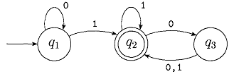

# 自動機\(automata\)

## 簡介

現實的計算機相當複雜，難以定義為簡單的數學模型。因此採用稱為「計算模型」的理想計算機，此模型精確的描繪了幾種情怳，對於不同的特性，使用不同的計算模型。

## 有限自動機、有限狀態機\(finite automata, finite state machine\)

有限自動機是關於儲存量有限\(狀態有限\)的計算模型，也稱有限狀態機\(finite state machine\)。

這台機器的運作過程會有許多狀態，也就是許多步驟、流程。**如果這台機器的步驟及接受的字元種類是有限的，也就是數量是可數的，並面對所有字元都能對應一種狀態，而且具有起始及結束的狀態，那麼我們稱這台機器叫「有限自動機」\(Finite Automaton\)**。能夠被有限狀態機認識的語言，我們稱這語言叫**正規語言 \(Regular Language\)**。

> definition: finite automata
>
> 有限自動機是5元組 $$(Q, \Sigma, \delta, q_0, F)$$ ，
>
> * $$Q$$為有限集合，稱為狀態集\(states \)。
> * $$\Sigma$$為有限集合，稱為字母集\(alphabets\)。
> * $$\delta: Q \times \Sigma \rightarrow Q$$為轉移函數\(transition function\)。
> * $$q_0 \in Q$$為起始狀態 \(start state\)。
> * $$F \subseteq Q$$為接受狀態集\(set of accept states\)。

* 接受狀態集$$F$$可以為空集合，此時自動機沒有接受狀態。
* 轉移函數$$\delta$$在輸入一個字母時，會轉移到下一個狀態，此狀態依函數的定義唯一。轉移函數經常使用列表的方式表示。

有限自動機M1如下：

* $$Q=\{q_1, q_2, q_3 \}$$
* $$\Sigma=\{0,1\}$$
* $$\delta$$為下表
* $$q_1$$為起始狀態
* $$F=\{q_2\}$$
* $$A = \{ \omega \vert \omega \text{ 至少含有一個1，並在最後一個1後有偶數個0}\}$$

| state\input | 0 | 1 |
| :--- | :--- | :--- |
| $$q_1$$ | $$q_1$$ | $$q_2$$ |
| $$q_2$$ | $$q_3$$ | $$q_2$$ |
| $$q_3$$ | $$q_2$$ | $$q_2$$ |

* 因此有限自動機$$M$$，在給定特定的字串\(strings\)時，最後會進入的接受狀態。而這些可被機器接受字串的集合$$A$$，稱為**機器**$$M$$**的語言\(language\)，記為**$$L(M)=A$$。也稱為**機器**$$M$$**識別**$$A$$**\( M recognizes A\)或機器**$$M$$**接受**$$A$$ **\(M accepts A\)**。
* 一台機器可接受多個字串，但只能識別一種語言\(即可接受的字串形成的集合唯一\)。
* 如果機器不接受任何字串，則此機器只識別一種語言，即空語言$$\emptyset$$。

