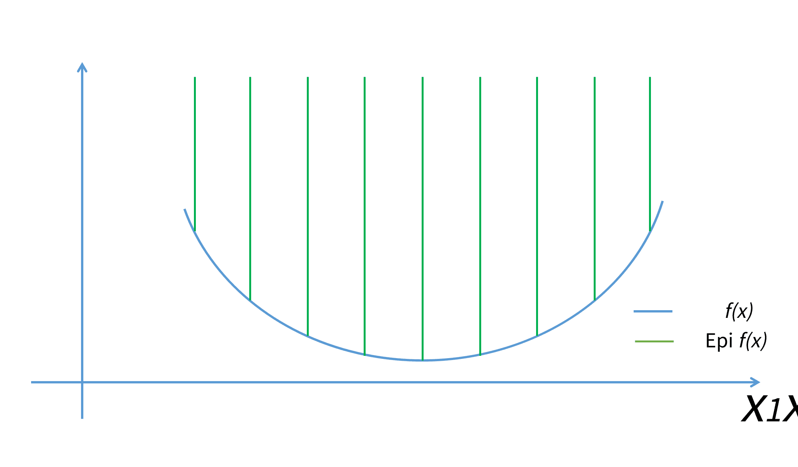

# 上境圖(epigraph)

epigraph將函數轉換成集合。

## 下水平集(sublevel set)

> 函數$$f: \mathbb{R}^n \rightarrow \mathbb{R}$$的$$\alpha$$-下水平集(sublevel set)為 $$C_{\alpha}= \{x \in \mathrm{dom}f ~|~ f(x) \leq \alpha \}$$。
>
> 即函數定義域中，所有函數值小於等於$$\alpha$$的點形成的集合。

### 凸函數的下水平集仍為凸集合(反之不成立)

* 簡單的說，給定$$\alpha$$後，若$$f$$為凸函數，則$$C_\alpha$$必為連通集合，且$$C_\alpha \subseteq \mathrm{dom}f$$，因此$$C_\alpha$$為凸集合。
* 反之，給定一足夠大的$$\alpha$$，一定可取得非凸函數的$$C_\alpha$$為凸集合。

反例：

## 上境圖(epigraph)

> 函數$$f: \mathbb{R}^n \rightarrow \mathbb{R}$$，上境圖 $$\mathrm{epi}f=\{(x,t) \in \mathbb{R}^{n+1} ~| ~ x \in \mathrm{dom} f, f(x) \leq t\}$$

### 函數為凸函數若且唯若上境圖為凸集合
