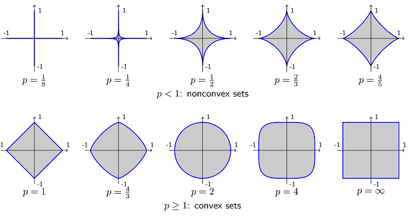

# 凸集合 \(convex set\)

## 凸集合\(convex set\)

> definition: convex set
>
> $$C$$ is convex set if $$\forall x_1, x_2 \in C, \lambda \in [0,1] \Rightarrow \lambda x_1 + (1-\lambda) x_2 \in C$$.

* $$\lambda x_1 + (1-\lambda) x_2,\ \lambda \in [0,1]$$ 為端點 $$x_1, x_2$$形成的線段。
* 由定義可知向量空間必為凸集合，因為向量空間$$V$$必須滿足$$\forall a \in F$$, $$\forall u,v \in V \Rightarrow au+v \in V$$。

有些集合在相異參數時為凸集合或不是凸集合。如 $$C_p = \{ (x,y)\ \vert \ (|x|^p + |y|^p)^{1/p} \leq 1 \}$$。在 $$p < 1$$時為不是凸集合。而在$$p \geq 1$$時為凸集合。

## 仿射集合\(affine set\)

> definition: affine set
>
> C is affine set if

