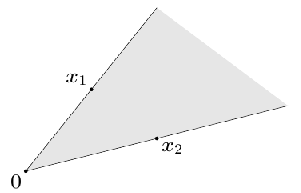

# 凸集合 (convex set)

## 凸集合(convex set)

> $$C$$ is convex set if $$\forall x_1, x_2 \in C, \lambda \in [0,1] \Rightarrow \lambda x_1 + (1-\lambda) x_2 \in C$$.

* $$\lambda x_1 + (1-\lambda) x_2,\ \lambda \in [0,1]$$ 為端點 $$x_1, x_2$$形成的<mark style="color:red;">線段(segment)</mark>。
* 由定義可知向量空間必為凸集合，因為向量空間$$V$$必須滿足$$\forall a \in F$$, $$\forall u,v \in V \Rightarrow au+v \in V$$。
* <mark style="color:red;">註：如果是在平面上的集合，任意兩點間畫一直線均落在集合內時，則為凸集合</mark>。

有些集合在相異參數時為凸集合或非凸集合。如 $$C_p = \{ (x,y)\ \vert \ (|x|^p + |y|^p)^{1/p} \leq 1 \}$$。在 $$p < 1$$時為不是凸集合。而在$$p \geq 1$$時為凸集合。

## 凸組合與凸包(convex combination and convex hull)

> 凸組合(convex combination) of $$x_1, x_2,\dots, x_k \in C$$
>
> * $$x=c_1 x_1 + c_2 x_2 + \dots + c_k x_k = \sum_{i=1}^k c_i x_i$$
> * 且$$\sum_{i=1}^k c_i = 1, ~ c_i \geq 0 ~\forall i$$
>
> 凸包(convex hull)
>
> * $$\mathrm{conv} C = \{c_1 x_1 + \dots c_k x_k ~|~ x_i \in C, ~ \sum_{i=1}^k c_i = 1, ~c_i \geq 0  \}$$
> * 凸包是包含$$x_1,\dots, x_k$$所有點的<mark style="color:red;">最小凸集合</mark>。即若$$\{x_1, \dots, x_k \} \subseteq S$$，則$$\mathrm{conv}C \subseteq S$$。

由凸組合得到的點$$x$$，必定落在$$x_1,x_2, \dots ,x_k$$形成的凸包集合中。

凸組合可擴展到無窮級數、積分、與大部份的機率分佈：

* 令$$\forall i, ~c_i \geq 0, ~ \sum_{i=1}^\infty c_i =1$$
* $$x_1, x_2, \dots  \in C \subseteq \mathbb{R}^n$$且 $$C$$為凸集合。
* 若級數收斂時，可得凸包$$\sum_{i=1}^\infty c_i x_i \in C$$。

更一般化：

* 函數$$p : \mathbb{R}^n \rightarrow \mathbb{R}$$對所有$$x \in C$$滿足$$p(x) \geq 0$$，且$$\int_C p(x) dx = 1$$，$$C\subseteq \mathbb{R}^n$$為凸集。
* 若積分存在，可得凸包$$\int_C p(x)x dx \in C$$。

## 凸錐(convex cone)

> 錐組合(conic combination) of $$x_1, x_2, \dots, x_k$$
>
> * $$x= c_1 x_1 + c_2 x_2+\dots + c_kx_k =\sum_{i=1}^k c_i x_i , ~ c_i \geq 0, ~ i=1,2,\dots, k$$
>
> 錐包(conic hull)
>
> * $$\{c_1 x_1 + \dots c_k x_k ~|~ x_i \in C,  ~c_i \geq 0, ~\forall i  \}$$
> * 錐包是包含$$C$$的最小凸錐。

錐組合的定義和凸組合類似，但沒有限制係數$$c_i$$總合為1，只有限制係數為大於等於0的實數，因此形成的區域為由0至通過兩點間的扇形區域。

因此$$C$$為<mark style="color:red;">凸錐</mark> $$\Leftrightarrow$$ $$\forall x_i, x_j \in C$$, $$c_i x_ i + c_j x_j \in C, ~ c_i, c_j \geq 0$$，即$$C$$中任意兩點形成的錐組合仍在$$C$$中。

## 仿射集合(affine set)

> $$C$$ 為仿射集合(affine set)若 $$C = \{ \lambda x_1 + (1-\lambda) x_2 , \forall \lambda \in \mathbb{R}, \forall x_1, x_2 \in X \}$$.
>
> 通過集合$$C$$中任意不同兩點的直線仍在集合中時，稱$$C$$為仿射集合。

$$\lambda \in \mathbb{R}$$時， $$\lambda x_1 + (1-\lambda) x_2$$為由點 $$x_1, x_2$$形成的<mark style="color:red;">直線(line)</mark>，而非線段。因此 $$C$$ 為集合$$X$$中任意兩點的直線集合。

* 例：線性方程式的解集合 $$\{\mathbf{x}\ \vert \ \mathbf{Ax = b} \}$$。
* 例：歐式空間$$\mathbb{R}^n$$中的<mark style="color:red;">平面</mark>、<mark style="color:red;">空集合</mark>$$\phi$$、以及<mark style="color:red;">單點集合</mark>$$\{x\}$$都是仿射集，因此均為凸集合。

凸集是在仿射集的定義中，對$$\lambda$$的範圍進行了限定，導致的結果是:<mark style="color:red;">仿射集要求的是集合中經過任意兩點的</mark><mark style="color:red;background-color:red;">**直線**</mark><mark style="color:red;">上的任意點都在集合中</mark>；而，<mark style="color:red;">凸集只是要求連接任意集合中兩點的</mark><mark style="color:red;background-color:red;">**線段**</mark><mark style="color:red;">上的點在集合中</mark>；所以對凸集定義比仿射集的定義更加苛刻，但是條件更加的苛刻不等於就是子集，不等於他們就是同一類。

仿射集要求集合當中任意兩點的係數和為1的線性組合（即過任意兩點的直線上的點）仍在集合中，凸集在仿射集的要求上增加了一個“係數非負”的條件，幾何直觀來說是任意兩點連成線段上的點仍在集合中，增加的這個條件反而降低了要求，不需要任意係數和為1的線性組合仍在集合內、而是只有係數非負而係數和為1的線性組合在集合內就可以。

### 仿射集合與向量空間中的生成集合(spanning set)的關係

> definition: spanning set S
>
> * $$span(S) = \{\mathbf{v} \ \vert \ \mathbf{v} \text{ is a linear combination of set } S\}$$.&#x20;
> * i.e. $$\forall \mathbf{v}_1, \mathbf{v}_2, \cdots, \mathbf{v}_n \in V$$, $$\lambda_1, \lambda_2, \cdots, \lambda_n \in F$$, $$\mathbf{v} = \sum_{i=1}^n \lambda_i \mathbf{v}_i$$.

向量空間$$V$$的子空間$$S$$為滿足線性組合封閉性的空間, 即 $$\forall \lambda_1, \lambda_2 \in F, u,v \in S, \lambda_1 u + \lambda_2 v \in S$$. 而$$S$$為子空間的必要條件是：

* $$\mathbf{0} \in S$$ (只要取線性組合的權重均為0即可得出。即 $$\lambda_1=\lambda_2=\cdots=\lambda_n = 0$$)
* 若 $$\mathbf{v} \in S$$，則 $$\mathbf{-v} \in S$$&#x20;

<mark style="color:red;">因此仿射空間為子空間的平移(translation)，而任意子空間必定為仿射空間</mark>。

## 超平面與半空間(hyperplane and halfspace)

> * 超平面(hyperplane) $$\{x\in \mathbb{R}^n ~|~ a^\top x = b, ~ a \in \mathbb{R}^n \neq 0 ,~  b\in \mathbb{R} \}$$或$$\{x ~|~ a^\top (x -x_0) = 0, ~ a \neq 0\}$$，$$b$$為平面相對於原點的偏移量。
>   * 也可解釋為給定向量$$a$$，內積為常數$$b$$的點集合。
> * 半空間(halfspace) $$\{x ~|~ a^\top x \leq b, ~ a \neq 0\}$$或$$\{x ~|~ a^\top (x -x_0) \leq 0, ~ a \neq 0\}$$，由$$x_0$$加上任意與法向量乘鈍角(或直角)的向量形成的集合。
> * 半空間的邊界是超平面。
>
> $$a$$為超平面的法向量(normal vector)。
>
> 超平面為仿射集(凸集)，而半空間為凸集合。

.png>)

.png>)

## 參考資料

* Boyd, Stephen, Stephen P. Boyd, and Lieven Vandenberghe. Convex optimization. Cambridge university press, 2004. \[[website](https://web.stanford.edu/\~boyd/cvxbook/)]
  * [\[Stanford\] EE364a: Convex Optimization I](https://web.stanford.edu/class/ee364a/)
  * [\[Stanford\] EE364b - Convex Optimization II](https://web.stanford.edu/class/ee364b/)
* [\[MIT\] Dimitri Bertsekas](https://www.mit.edu/\~dimitrib/home.html)
* Nesterov, Yurii. Introductory lectures on convex optimization: A basic course. Vol. 87. Springer Science & Business Media, 2003.
