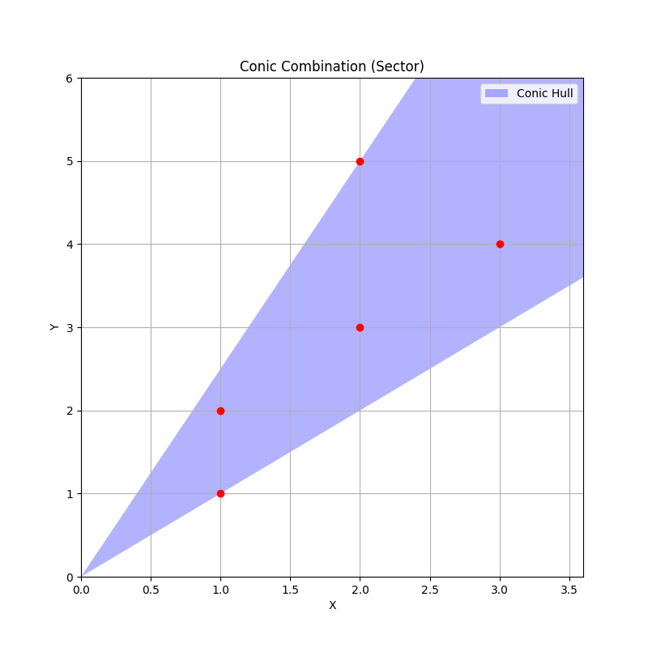

# 凸集合 (convex set)

## 凸集合(convex set)

> $$C$$ 為凸集合若 $$\forall x_1, x_2 \in C, \lambda \in [0,1] \Rightarrow \lambda x_1 + (1-\lambda) x_2 \in C$$.
>
> $$C$$ 為仿射集合(affine set)若 $$C = \{ \lambda x_1 + (1-\lambda) x_2 , \forall \lambda \in \mathbb{R}, \forall x_1, x_2 \in X \}$$.

### 線段與直線(segment and line)

$$\lambda x_1 + (1-\lambda) x_2,\ \lambda \in [0,1]$$ 為端點 $$x_1, x_2$$形成的<mark style="color:red;">線段(segment)，為凸集合，但不是仿射集(除非退化到一點)</mark>。

如果$$\lambda x_1 + (1-\lambda) x_2, \lambda \in \mathbb{R}$$時，則上述定義為包含$$x_1, x_2$$的<mark style="color:red;">直線(line)，為仿射集</mark>。

如果$$x_1 + \lambda x_2, \lambda \geq 0$$，則為由$$x_1$$開始往$$x_2$$方向的<mark style="color:red;">射線(ray)</mark>，為凸集合，但不是仿射集。當$$x_1=0$$為凸錐。

由定義可知向量空間必為凸集合，因為向量空間$$V$$必須滿足$$\forall a \in F$$, $$\forall u,v \in V \Rightarrow au+v \in V$$。

<mark style="color:red;">註：如果是在平面上的集合，任意兩點間畫一直線均落在集合內時，則為凸集合</mark>。




<figure><figcaption><p>線段與直線為凸集合</p></figcaption></figure>



```python
import numpy as np
import matplotlib.pyplot as plt

# 定義兩個點 x1 和 x2
x1 = np.array([1, 2])  # 點 x1
x2 = np.array([4, 6])  # 點 x2

# 定義 lambda 的範圍
lambda_values = np.linspace(-1.5, 1.5, 500)  # 從 -1.5 到 1.5 的連續值
special_lambdas = [-1.5, -0.5, 0, 1, 1.5]    # 特殊標注的 lambda 值

# 計算所有點的坐標
points = np.array([lambda_val * x1 + (1 - lambda_val) * x2 for lambda_val in lambda_values])

# 分離 x 和 y 坐標
x_coords = points[:, 0]
y_coords = points[:, 1]

# 找到 lambda 在 [0, 1] 區間內的索引
lambda_0_to_1_indices = np.where((lambda_values >= 0) & (lambda_values <= 1))[0]
x_coords_bold = x_coords[lambda_0_to_1_indices]
y_coords_bold = y_coords[lambda_0_to_1_indices]

# 繪製圖形
plt.figure(figsize=(8, 6))

# 繪製完整的線段
plt.plot(x_coords, y_coords, label=r"$\lambda x_1 + (1-\lambda)x_2$", color="blue", linewidth=1)

# 加粗 lambda 在 [0, 1] 區間內的線段
plt.plot(x_coords_bold, y_coords_bold, color="red", linewidth=3, label=r"$\lambda \in [0, 1]$")

# 標注特殊 lambda 的點和文字
for lambda_val in special_lambdas:
    point = lambda_val * x1 + (1 - lambda_val) * x2
    plt.scatter(point[0], point[1], color="black", zorder=5)  # 繪製點
    plt.text(
        point[0], point[1], 
        f"  $\lambda={lambda_val}$", 
        verticalalignment='bottom', horizontalalignment='left', fontsize=10
    )  # 添加文字標注

# 添加標題和軸標籤
plt.title(r"Line Segment: $\lambda x_1 + (1-\lambda)x_2$, $\lambda \in [-1.5, 1.5]$")
plt.xlabel("X-axis")
plt.ylabel("Y-axis")
plt.grid(True)
plt.legend()

# 顯示圖形
plt.show()
```




有些集合在相異參數時為凸集合或非凸集合。如 $$C_p = \{ (x,y)\ \vert \ (|x|^p + |y|^p)^{1/p} \leq 1 \}$$。在 $$p < 1$$時為不是凸集合。而在$$p \geq 1$$時為凸集合。




<figure><figcaption><p>p&#x3C;1時為非凸集合，p>=1時為凸集合</p></figcaption></figure>



```python
import numpy as np
import matplotlib.pyplot as plt

# 定義p值和對映的標籤
p_values = [1/8, 1/4, 1/2, 2/3, 4/5, 1, 4/3, 2, 4, np.inf]
p_labels = ['1/8', '1/4', '1/2', '2/3', '4/5', '1', '4/3', '2', '4', '∞']

# 生成網格點
x = np.linspace(-1.5, 1.5, 500)
y = np.linspace(-1.5, 1.5, 500)
X, Y = np.meshgrid(x, y)

# 建立2x5的子圖
fig, axes = plt.subplots(2, 5, figsize=(20, 8))
axes = axes.ravel()  # 展平為1D陣列

# 遍歷每個p值繪製圖形
for i, (p, label) in enumerate(zip(p_values, p_labels)):
    ax = axes[i]
    
    # 計算不同p值下的條件
    if p == np.inf:
        # L∞范數：max(|x|, |y|) ≤ 1
        Z = np.maximum(np.abs(X), np.abs(Y))
    else:
        # Lp范數：(|x|^p + |y|^p)^(1/p) ≤ 1 → |x|^p + |y|^p ≤ 1
        Z = np.abs(X)**p + np.abs(Y)**p
    
    # 繪製滿足條件的區域
    ax.contourf(X, Y, Z <= 1, levels=[0.5, 1.5], colors=['royalblue'], alpha=0.6)
    
    # 美化圖形
    ax.set_title(f'p = {label}', fontsize=12)
    ax.set_xlim(-1.1, 1.1)
    ax.set_ylim(-1.1, 1.1)
    ax.set_aspect('equal')
    ax.grid(True, linestyle='--', alpha=0.5)
    ax.axhline(0, color='black', linewidth=0.5)
    ax.axvline(0, color='black', linewidth=0.5)

# 調整子圖間距並展示
plt.tight_layout()
plt.show()
```





<figure><figcaption><p>凸集合與非凸集合</p></figcaption></figure>



```python
import numpy as np
import matplotlib.pyplot as plt

# 建立畫布和子圖
fig, (ax1, ax2) = plt.subplots(1, 2, figsize=(12, 6))

# ---------- 凸集示例：圓形 ----------
# 生成圓形的坐標
theta = np.linspace(0, 2*np.pi, 100)
x_convex = np.cos(theta)
y_convex = np.sin(theta)

# 繪製凸集
ax1.fill(x_convex, y_convex, 'skyblue', alpha=0.5)
ax1.set_title("Convex Set (Circle)", fontsize=14)
ax1.set_xlim(-1.5, 1.5)
ax1.set_ylim(-1.5, 1.5)
ax1.grid(True, linestyle='--', alpha=0.7)

# 新增凸集的性質說明：兩點連線在集合內
ax1.plot([0.5, -0.5], [0.5, -0.5], 'r--', lw=2, label="Line between two points")
ax1.scatter([0.5, -0.5], [0.5, -0.5], c='red', s=50)
ax1.legend()


# ---------- 非凸集示例：月牙形 ----------
# 生成月牙形坐標（通過疊加兩個圓）
theta = np.linspace(0, 2*np.pi, 100)
r1, r2 = 1.0, 0.7
x_nonconvex = np.cos(theta) * r1
y_nonconvex = np.sin(theta) * r1
x_hole = np.cos(theta) * r2 + 0.3  # 偏移第二個圓的中心
y_hole = np.sin(theta) * r2 + 0.3

# 繪製非凸集（通過填充差異區域）
ax2.fill(x_nonconvex, y_nonconvex, 'lightgreen', alpha=0.5)
ax2.fill(x_hole, y_hole, 'white')  # 挖空中心區域形成非凸
ax2.set_title("Non-Convex Set (Crescent)", fontsize=14)
ax2.set_xlim(-1.5, 1.5)
ax2.set_ylim(-1.5, 1.5)
ax2.grid(True, linestyle='--', alpha=0.7)

# 新增非凸集的性質說明：兩點連線可能超出集合
ax2.plot([-1.0, 0.8], [-0.5, 0.8], 'r--', lw=2, label="Line crossing outside")
ax2.scatter([-1.0, 0.8], [-0.5, 0.8], c='red', s=50)
ax2.legend()

plt.tight_layout()
plt.show()
```



## 凸組合與凸包(convex combination and convex hull)

> 凸組合(convex combination) of $$x_1, x_2,\dots, x_k \in C$$
>
> * $$x=c_1 x_1 + c_2 x_2 + \dots + c_k x_k = \sum_{i=1}^k c_i x_i$$
> * 且$$\sum_{i=1}^k c_i = 1, ~ c_i \geq 0 ~\forall i$$
>
> 凸包(convex hull)
>
> * $$\mathrm{conv} C = \{c_1 x_1 + \dots c_k x_k ~|~ x_i \in C, ~ \sum_{i=1}^k c_i = 1, ~c_i \geq 0  \}$$
> * 凸包是包含$$x_1,\dots, x_k$$所有點的<mark style="color:red;">最小凸集合</mark>。即若$$\{x_1, \dots, x_k \} \subseteq S$$，則$$\mathrm{conv}C \subseteq S$$。

由凸組合得到的點$$x$$，必定落在$$x_1,x_2, \dots ,x_k$$形成的凸包集合中。

凸組合可擴展到無窮級數、積分、與大部份的機率分佈：

* 令$$\forall i, ~c_i \geq 0, ~ \sum_{i=1}^\infty c_i =1$$
* $$x_1, x_2, \dots  \in C \subseteq \mathbb{R}^n$$且 $$C$$為凸集合。
* 若級數收斂時，可得凸包$$\sum_{i=1}^\infty c_i x_i \in C$$。

更一般化：

* 函數$$p : \mathbb{R}^n \rightarrow \mathbb{R}$$對所有$$x \in C$$滿足$$p(x) \geq 0$$，且$$\int_C p(x) dx = 1$$，$$C\subseteq \mathbb{R}^n$$為凸集。
* 若積分存在，可得凸包$$\int_C p(x)x dx \in C$$。



<figure><figcaption><p>convex hull</p></figcaption></figure>



```python
import numpy as np
import matplotlib.pyplot as plt
from scipy.spatial import ConvexHull

# 生成 50 個隨機二維點（範圍在 [0, 10]）
n_point = 50
np.random.seed(42)  # 固定隨機種子以便復現
points = np.random.rand(n_point, 2) * 10

# 計算凸包
hull = ConvexHull(points)

# 繪製所有點
plt.figure(figsize=(8, 6))
plt.scatter(points[:, 0], points[:, 1], color='blue', label='Points', zorder=5)

# 繪製凸包邊界
# hull.vertices 返回凸包頂點按順時針或逆時針排列的索引
hull_points = points[hull.vertices]
hull_points = np.append(hull_points, [hull_points[0]], axis=0)  # 閉合多邊形
plt.plot(hull_points[:, 0], hull_points[:, 1], 'r--', lw=2, label='Convex Hull')

# 填充凸包內部區域（可選）
plt.fill(hull_points[:, 0], hull_points[:, 1], 'orange', alpha=0.3)

# 新增標籤和標題
plt.title(f"Convex Hull of {n_point} Random Points", fontsize=14)
plt.xlabel("X-axis")
plt.ylabel("Y-axis")
plt.grid(True, linestyle='--', alpha=0.7)
plt.legend()
plt.tight_layout()
plt.show()
```




## 凸錐(convex cone)

> 錐組合(conic combination) of $$x_1, x_2, \dots, x_k$$
>
> * $$x= c_1 x_1 + c_2 x_2+\dots + c_kx_k =\sum_{i=1}^k c_i x_i , ~ c_i \geq 0, ~ i=1,2,\dots, k$$
>
> 錐包(conic hull)
>
> * $$\{c_1 x_1 + \dots c_k x_k ~|~ x_i \in C,  ~c_i \geq 0, ~\forall i  \}$$
> * 錐包是包含$$C$$的最小凸錐。

錐組合的定義和凸組合類似，但沒有限制係數$$c_i$$總合為1，只有限制係數為大於等於0的實數，因此形成的區域為由0至通過兩點間的扇形區域。

因此$$C$$為<mark style="color:red;">凸錐</mark> $$\Leftrightarrow$$ $$\forall x_i, x_j \in C$$, $$c_i x_ i + c_j x_j \in C, ~ c_i, c_j \geq 0$$，即$$C$$中任意兩點形成的錐組合仍在$$C$$中。




<figure><figcaption><p>conic combination</p></figcaption></figure>



```python
import numpy as np
import matplotlib.pyplot as plt

# 定義五個第一象限的點（確保 x, y 均非負）
points = np.array([
    [1, 2],
    [3, 4],
    [2, 5],
    [1, 1],
    [2, 3]
])

# 檢查是否存在 x 軸和 y 軸上的點（容差 1e-8）
has_x_axis = np.any(np.isclose(points[:, 1], 0, atol=1e-8))
has_y_axis = np.any(np.isclose(points[:, 0], 0, atol=1e-8))

plt.figure(figsize=(8, 8))
plt.scatter(points[:, 0], points[:, 1], color='red', zorder=5)

# 繪製坐標軸
plt.axhline(0, color='black', linewidth=0.5)
plt.axvline(0, color='black', linewidth=0.5)
plt.grid(True)
plt.xlim(0, np.max(points[:, 0]) * 1.2)
plt.ylim(0, np.max(points[:, 1]) * 1.2)

if has_x_axis and has_y_axis:
    # 覆蓋整個第一象限
    plt.fill_betweenx([0, plt.ylim()[1]], 0, plt.xlim()[1], 
                     color='blue', alpha=0.3, label='Conic Hull')
    plt.title('Conic Combination Covers Entire First Quadrant')
else:
    # 計算極角（直接使用 arctan2，已自動處理第一象限）
    angles = np.arctan2(points[:, 1], points[:, 0])
    theta_min = np.min(angles)
    theta_max = np.max(angles)
    
    # 生成扇形區域
    r = np.max(np.linalg.norm(points, axis=1)) * 2  # 半徑擴充套件
    t = np.linspace(theta_min, theta_max, 100)
    x = r * np.cos(t)
    y = r * np.sin(t)
    vertices = np.vstack([[0, 0], np.column_stack([x, y]), [0, 0]])
    
    plt.fill(vertices[:, 0], vertices[:, 1], 'blue', alpha=0.3, label='Conic Hull')
    plt.title('Conic Combination (Sector)')

plt.legend()
plt.xlabel('X')
plt.ylabel('Y')
plt.show()
```



## 仿射集合(affine set)

> $$C$$ 為仿射集合(affine set)若 $$C = \{ \lambda x_1 + (1-\lambda) x_2 , \forall \lambda \in \mathbb{R}, \forall x_1, x_2 \in X \}$$.
>
> 通過集合$$C$$中任意不同兩點的直線仍在集合中時，稱$$C$$為仿射集合。

$$\lambda \in \mathbb{R}$$時， $$\lambda x_1 + (1-\lambda) x_2$$為由點 $$x_1, x_2$$形成的<mark style="color:red;">直線(line)</mark>，而非線段。因此 $$C$$ 為集合$$X$$中任意兩點的直線集合。

幾何意義：仿射集是平移後的線性子空間。例如：一條不過原點的直線、一個不包含原點的平面。

與線性子空間的區別：線性子空間必須包含原點，而仿射集通過平移（加一個固定向量）得到，不一定包含原點。

仿射集是線性子空間的平移版本，它與凸集的主要區別在於對權重的限制，仿射集覆蓋無限延伸的幾何結構，而凸集僅描述有限區域。

* 例：線性方程式的解集合 $$\{\mathbf{x}\ \vert \ \mathbf{Ax = b} \}$$。
* 例：歐式空間$$\mathbb{R}^n$$中的<mark style="color:red;">平面</mark>、<mark style="color:red;">空集合</mark>$$\phi$$、以及<mark style="color:red;">單點集合</mark>$$\{x\}$$都是仿射集，因此均為凸集合。

凸集是在仿射集的定義中，對$$\lambda$$的範圍進行了限定，導致的結果是:<mark style="color:red;">仿射集要求的是集合中經過任意兩點的</mark><mark style="color:red;background-color:red;">**直線**</mark><mark style="color:red;">上的任意點都在集合中</mark>；而，<mark style="color:red;">凸集只是要求連接任意集合中兩點的</mark><mark style="color:red;background-color:red;">**線段**</mark><mark style="color:red;">上的點在集合中</mark>；所以對凸集定義比仿射集的定義更加苛刻，但是條件更加的苛刻不等於就是子集，不等於他們就是同一類。

仿射集要求集合當中任意兩點的係數和為1的線性組合（即過任意兩點的直線上的點）仍在集合中，凸集在仿射集的要求上增加了一個“係數非負”的條件，幾何直觀來說是任意兩點連成線段上的點仍在集合中，增加的這個條件反而降低了要求，不需要任意係數和為1的線性組合仍在集合內、而是只有係數非負而係數和為1的線性組合在集合內就可以。

### 仿射集合與向量空間中的生成集合(spanning set)的關係

> definition: spanning set S
>
> * $$span(S) = \{\mathbf{v} \ \vert \ \mathbf{v} \text{ is a linear combination of set } S\}$$.&#x20;
> * i.e. $$\forall \mathbf{v}_1, \mathbf{v}_2, \cdots, \mathbf{v}_n \in V$$, $$\lambda_1, \lambda_2, \cdots, \lambda_n \in F$$, $$\mathbf{v} = \sum_{i=1}^n \lambda_i \mathbf{v}_i$$.

向量空間$$V$$的子空間$$S$$為滿足線性組合封閉性的空間, 即 $$\forall \lambda_1, \lambda_2 \in F, u,v \in S, \lambda_1 u + \lambda_2 v \in S$$。

&#x20;而$$S$$為子空間的必要條件是：

* $$\mathbf{0} \in S$$ (只要取線性組合的權重均為0即可得出。即 $$\lambda_1=\lambda_2=\cdots=\lambda_n = 0$$)
* 若 $$\mathbf{v} \in S$$，則 $$\mathbf{-v} \in S$$&#x20;

<mark style="color:red;">因此仿射空間為子空間的平移(translation)，而任意子空間必定為仿射空間，反之不成立</mark>。

## 超平面與半空間(hyperplane and halfspace)

> * 超平面(hyperplane) $$\{x\in \mathbb{R}^n ~|~ a^\top x = b, ~ a \in \mathbb{R}^n \neq 0 ,~  b\in \mathbb{R} \}$$或$$\{x ~|~ a^\top (x -x_0) = 0, ~ a \neq 0\}$$，$$b$$為平面相對於原點的偏移量。
>   * 也可解釋為給定向量$$a$$，內積為常數$$b$$的點集合。
> * 半空間(halfspace) $$\{x ~|~ a^\top x \leq b, ~ a \neq 0\}$$或$$\{x ~|~ a^\top (x -x_0) \leq 0, ~ a \neq 0\}$$，由$$x_0$$加上任意與法向量乘鈍角(或直角)的向量形成的集合。
> * 半空間的邊界是超平面。
>
> $$a$$為超平面的法向量(normal vector)。注意$$a=y-x_0$$是由$$x_0$$出發往$$y$$方向的向量。
>
> 超平面為仿射集(所以為凸集)，而半空間為凸集合，但不是仿射集。
>
> 半空間法向量方向的內積值為正值(非負值)，稱為上半空間(upper halfspace)；法向量反方向的內積值為負值(非正值)，稱為下半空間(lower halfspace)。

.png>)


## 歐式球與橢圓(Euclidean balls and ellipsoids)

> 令歐式球的中心點為$$x_c$$，半徑為$$r$$, 則$$B(x_c,r) = \{ x ~|~ \| x-x_c\|_2 \leq r\} = \{x_c + ru ~|~ \|u\|_2 \leq 1 \}$$
>
> * $$\| u \|_2 = {(u^\top u)}^{1/2}$$為Euclidean norm。
>
> 橢圓 $$\mathcal{E} =\{ x ~|~ (x-x_c)^{\top} P^{-1} (x-x_c) \leq 1\}=\{x_c + Au ~|~ \|u \|_2 \leq 1 \}$$。
>
> * 其中$$P = P^\top \succ 0$$為對稱正定矩陣($$P \in \mathbf{S}^n_{++}$$)。
> * $$A$$為非奇異的方陣，取$$A=P^{1/2}$$。

中心點$$(x_c, y_c)$$與軸長度為$$a,b$$橢圓標準方程式為$$\frac{(x-x_c)^2}{a^2} + \frac{(y-y_c)^2}{b^2} = 1$$，矩陣形式為

$$\begin{bmatrix} x-x_c & y-y_c  \end{bmatrix} \begin{bmatrix} \frac{1}{a^2} & 0\\ 0 & \frac{1}{b^2}  \end{bmatrix}   \begin{bmatrix} x-x_c \\  y-y_c  \end{bmatrix} =1$$



<figure><figcaption><p>橢圓範例</p></figcaption></figure>



```python
import numpy as np
import matplotlib.pyplot as plt

# 橢圓參數設定
h, k = 3, 2         # 中心坐標
a, b = 5, 3         # 長短半軸
theta = np.pi/6     # 旋轉角度 (30度)

# 生成橢圓軌跡的參數
alpha = np.linspace(0, 2*np.pi, 200)
x_ellipse = h + a * np.cos(alpha) * np.cos(theta) - b * np.sin(alpha) * np.sin(theta)
y_ellipse = k + a * np.cos(alpha) * np.sin(theta) + b * np.sin(alpha) * np.cos(theta)

# 計算長軸和短軸端點
major_axis = np.array([
    [h + a * np.cos(theta), k + a * np.sin(theta)],
    [h - a * np.cos(theta), k - a * np.sin(theta)]
])

minor_axis = np.array([
    [h - b * np.sin(theta), k + b * np.cos(theta)],
    [h + b * np.sin(theta), k - b * np.cos(theta)]
])

# 繪圖設定
plt.figure(figsize=(10, 8))
plt.plot(x_ellipse, y_ellipse, 'b-', linewidth=2, label='Ellipse')
plt.scatter(h, k, color='red', s=80, label=f'Center ({h}, {k})')

# 繪製長短軸虛線
plt.plot(major_axis[:,0], major_axis[:,1], 'r--', linewidth=1.5, label=f'Major Axis (Length={2*a})')
plt.plot(minor_axis[:,0], minor_axis[:,1], 'g--', linewidth=1.5, label=f'Minor Axis (Length={2*b})')

# 標註軸長度
plt.text(major_axis[0,0], major_axis[0,1], f'{2*a}', ha='center', va='bottom', color='red')
plt.text(minor_axis[0,0], minor_axis[0,1], f'{2*b}', ha='left', va='center', color='green')

# 坐標軸美化
plt.axhline(0, color='gray', linewidth=0.5)
plt.axvline(0, color='gray', linewidth=0.5)
plt.grid(True, linestyle='--', alpha=0.7)
plt.xlabel('X')
plt.ylabel('Y')
plt.title(f'Ellipse: Center ({h}, {k}), Rotation {np.degrees(theta):.1f}°')
plt.axis('equal')
plt.legend()
plt.show()
```



## 範數球與範數錐(norm ball and norm cone)

> 範數(norm)為距離(長度)的擴充函數，為滿足以下條件的一元函數：
>
> * \[距離非負值，且只有0向量長度為0]$$\| x \| \geq 0; ~ \|x \| = 0 \Leftrightarrow x = 0$$。
> * \[距離等比例伸長]$$\|tx\|=|t| \|x\|~ t \in \mathbb{R}$$
> * \[三角不等式]$$\| x+ y\| \leq \|x \| + \|y\|$$

> 範數球即為長度函數為範數的球 $$B(x_c,r) = \{ x ~|~ \| x-x_c\| \leq r\} = \{x_c + ru ~|~ \|u\| \leq 1 \}$$
>
> 範數錐即為長度函數為範數的錐$$C=\{(x,t) ~|~ \|x\| \leq t \} \subseteq \mathbb{R}^{n+1}$$。

常用的是二階錐(second-order cone)，也常稱為Lorentz錐或是冰淇淋錐：$$\begin{aligned} C & =\{ (x,t)\in \mathbb{R}^{n+1} ~|~ \|x\|_2 \leq t\}\\   & = \left\{  	\begin{bmatrix} x \\ t \end{bmatrix} ~\bigg|~  	\begin{bmatrix} x & t\end{bmatrix}     \begin{bmatrix} I & 0 \\ 0 & -1\end{bmatrix}   \begin{bmatrix} x \\ t\end{bmatrix}  \leq 0, ~ t \geq 0   \right\} \end{aligned}$$




<figure><figcaption><p>二階錐、Lorentz錐、冰淇淋錐</p></figcaption></figure>



```python
import numpy as np
import matplotlib.pyplot as plt
from mpl_toolkits.mplot3d import Axes3D

# 定義繪製圓錐體的函數
def plot_cone():
    # 定義網格範圍
    x1 = np.linspace(-1, 1, 100)  # x1 軸範圍
    x2 = np.linspace(-1, 1, 100)  # x2 軸範圍
    X1, X2 = np.meshgrid(x1, x2)  # 創建網格
    T = np.sqrt(X1**2 + X2**2)    # 計算 t = sqrt(x1^2 + x2^2)

    # 創建三維圖形
    fig = plt.figure(figsize=(10, 8))
    ax = fig.add_subplot(111, projection='3d')

    # 繪製圓錐體表面
    ax.plot_surface(X1, X2, T, cmap='viridis', alpha=0.7, edgecolor='none')

    # 添加標題和軸標籤
    ax.set_title(r"3D Plot of $(x_1^2 + x_2^2)^{0.5} \leq t$")
    ax.set_xlabel("$x_1$")
    ax.set_ylabel("$x_2$")
    ax.set_zlabel("$t$")

    # 設置視角
    ax.view_init(elev=30, azim=45)

    # 顯示圖形
    plt.show()

# 調用函數繪製圖形
plot_cone()
```



## 多面體(polyhedra)

> 多面體被定義為有限個線性等式和不等式的解集合
>
> $$\begin{aligned} \mathcal{P} & = \left\{ x \in \mathbb{R}^n ~| ~ a_i^\top x \leq b_i, i =1,2,\dots, m, c_j^\top x = d_j, j=1,2,\dots, p  \right\} \\ & =\left\{ x \in \mathbb{R}^n ~| ~ Ax \succeq b, ~Cx = d, ~  A \in \mathbb{R}^{m \times n}, B \in \mathbb{R}^{p \times n}  \right\}  \end{aligned}$$

因此多面體是有限個半空間和超平面的交集，<mark style="color:red;">常見於線性規劃的限制式</mark>。

仿射集合(子空間、超平面、直線)、射線，線段和半空間也是多面體。

<mark style="color:blue;">有界的多面體有時也稱為多胞型(polytope)</mark>。

#### 例如：<mark style="color:red;">非負象限(nonnegative orthant)</mark>是多面體也是錐，因此稱為多面體錐(polyhedral cone)。

$$\begin{aligned} \mathbb{R}^n_{+}  	&= \{ x \in \mathbb{R}^n ~|~ x_i \geq 0, ~ i=1,2,\dots, n \} \\ 	& = \{ x\in \mathbb{R}^n ~|~ x \succeq 0\}   \end{aligned}$$




<figure><figcaption><p>線性規劃限制式形成的多面體</p></figcaption></figure>



```python
import numpy as np
import matplotlib.pyplot as plt

# 定義繪製函數
def plot_region():
    # 定義 x 和 y 的範圍
    x = np.linspace(0, 36, 400)  # x 從 0 到 36
    y = np.linspace(0, 44, 400)  # y 從 0 到 44
    X, Y = np.meshgrid(x, y)     # 創建網格

    # 計算滿足條件的區域
    condition_1 = (X >= 0) & (X <= 36)  # 0 <= x <= 36
    condition_2 = (Y >= 0) & (Y <= 44)  # 0 <= y <= 44
    condition_3 = (X + Y <= 48)         # x + y <= 48
    condition_4 = (X + Y >= 20)         # x + y >= 20

    # 合併所有條件
    region = condition_1 & condition_2 & condition_3 & condition_4

    # 繪製圖形
    plt.figure(figsize=(8, 6))
    plt.imshow(
        region, 
        extent=(0, 36, 0, 44),  # 定義 x 和 y 的範圍
        origin='lower',         # 圖像的原點在左下角
        cmap='Greens',          # 使用綠色填充
        alpha=0.7               # 設置透明度
    )

    # 添加邊界線
    plt.plot([0, 36], [48 - 0, 48 - 36], color='black', label='$x + y = 48$')  # x + y = 48
    plt.plot([0, 36], [20 - 0, 20 - 36], color='blue', label='$x + y = 20$')   # x + y = 20
    plt.axvline(x=0, color='gray', linestyle='--', label='$x = 0$')            # x = 0
    plt.axvline(x=36, color='gray', linestyle='--', label='$x = 36$')          # x = 36
    plt.axhline(y=0, color='gray', linestyle='--', label='$y = 0$')            # y = 0
    plt.axhline(y=44, color='gray', linestyle='--', label='$y = 44$')          # y = 44

    # 添加標題和軸標籤
    plt.title("Region defined by inequalities")
    plt.xlabel("$x$")
    plt.ylabel("$y$")
    plt.grid(True)

    # 添加圖例
    plt.legend()

    # 顯示圖形
    plt.show()

# 調用函數繪製圖形
plot_region()
```



### 單純形(simplexes)

> 令$$k+1$$個點$$x_0, x_1, \dots, x_k \in \mathbb{R}^n$$仿射獨立，即$$x_1 - x_0, x_2- x_0, \dots, x_k - x_0$$線性獨立，則這些點決定一單純形 $$\begin{aligned} C & = \mathrm{conv}\{x_0, x_1, \dots, x_k\}  \\ & = \{c_0 x_0 + c_1 x_1 + \dots + c_k x_k ~|~ c_i \geq 0~ \forall i,~  \sum_{i=0}^k c_i = 1  \}  \end{aligned}$$

應用時，經常把$$c_i \geq 0 , \sum_{i=0}^k c_i=1$$這個限制式視為<mark style="color:red;">機率分佈，且假設為符從</mark>[<mark style="color:red;">Dirichlet分佈</mark>](https://en.wikipedia.org/wiki/Dirichlet_distribution)。

* 一維單純形為一條線段。
* 二維單純形為三角形(含內部)。
* 三維單純形為四面體。



<figure><figcaption><p>一、二、三維單純形，均假設為均勻分佈</p></figcaption></figure>



```python
import matplotlib.pyplot as plt
from mpl_toolkits.mplot3d.art3d import Poly3DCollection
import numpy as np

# 定義繪製一維 simplex 的函數
def plot_1d_simplex(ax):
    # 定義一維 simplex 的端點
    vertices = [0, 1]
    x_coords = vertices
    y_coords = [0, 0]

    # 繪製線段
    ax.plot(x_coords + [x_coords[0]], y_coords + [y_coords[0]], marker='o', label="1D Simplex", color='blue')

    # 標記端點
    for point in vertices:
        ax.text(point, 0.01, f'  {point}', verticalalignment='bottom', horizontalalignment='center')

    # 設置標題和軸範圍
    ax.set_title("1D Simplex")
    ax.set_xlabel("Value")
    ax.set_ylabel("Position (1D)")
    ax.set_ylim(-0.1, 0.1)
    ax.grid(True)

# 定義繪製二維 simplex 的函數（內部填滿顏色）
def plot_2d_simplex(ax):
    # 定義二維 simplex 的頂點
    vertices = [(1, 0), (0, 1), (0, 0)]

    # 提取 x 和 y 坐標
    x_coords = [vertex[0] for vertex in vertices]
    y_coords = [vertex[1] for vertex in vertices]

    # 繪製三角形並填滿顏色
    triangle = plt.Polygon(vertices, closed=True, edgecolor='blue', facecolor='lightblue', alpha=0.7)
    ax.add_patch(triangle)

    # 標記頂點
    for i, (x, y) in enumerate(vertices):
        ax.text(x, y, f'  ({x}, {y})', verticalalignment='bottom', horizontalalignment='center')

    # 設置標題和比例
    ax.set_title("2D Simplex (Filled)")
    ax.set_xlabel("X-axis")
    ax.set_ylabel("Y-axis")
    ax.set_aspect('equal', adjustable='box')
    ax.grid(True)

# 定義繪製三維 simplex 的函數
def plot_3d_simplex(ax):
    # 定義三維 simplex 的頂點
    vertices = [
        [1, 0, 0],  # 頂點 A
        [0, 1, 0],  # 頂點 B
        [0, 0, 1],  # 頂點 C
        [0, 0, 0]   # 頂點 D
    ]

    # 定義四面體的面（每個面由三個頂點組成）
    faces = [
        [vertices[0], vertices[1], vertices[2]],  # 面 ABC
        [vertices[0], vertices[1], vertices[3]],  # 面 ABD
        [vertices[0], vertices[2], vertices[3]],  # 面 ACD
        [vertices[1], vertices[2], vertices[3]]   # 面 BCD
    ]

    # 繪製四面體的面
    for face in faces:
        face_coords = list(zip(*face))  # 提取 x, y, z 坐標
        ax.add_collection3d(Poly3DCollection([face], alpha=0.5, edgecolor='k'))

    # 繪製頂點
    x_coords, y_coords, z_coords = zip(*vertices)
    ax.scatter(x_coords, y_coords, z_coords, color='red', s=100)

    # 標記頂點
    for i, (x, y, z) in enumerate(vertices):
        ax.text(x, y, z, f'  ({x}, {y}, {z})', color='black')

    # 設置標題和軸範圍
    ax.set_title("3D Simplex (Tetrahedron)")
    ax.set_xlabel("X-axis")
    ax.set_ylabel("Y-axis")
    ax.set_zlabel("Z-axis")
    ax.set_xlim([0, 1])
    ax.set_ylim([0, 1])
    ax.set_zlim([0, 1])

# 創建 subplots
fig = plt.figure(figsize=(12, 8))

# 第一行：一維和二維 simplex
ax1 = fig.add_subplot(2, 2, 1)  # 一維 simplex
plot_1d_simplex(ax1)

ax2 = fig.add_subplot(2, 2, 2)  # 二維 simplex（填滿顏色）
plot_2d_simplex(ax2)

# 第二行：三維 simplex（跨兩欄）
ax3 = fig.add_subplot(2, 1, 2, projection='3d')  # 三維 simplex
plot_3d_simplex(ax3)

# 調整佈局
plt.tight_layout()

# 顯示圖形
plt.show()
```



## 半正定錐(positive semidefinite cone)

> * 定義$$n$$階對稱方陣符號為$$\mathbf{S}^n = \{  X \in \mathbb{R}^n ~| ~ X= X^{\top} \}$$。
> * 對稱正半定矩陣$$\mathbf{S}^n_{+} = \{  X \in \mathbb{S}^n ~| ~ X \succeq 0 \}$$，$$\forall z \in \mathbb{R}^n ~ z^\top X z \geq 0$$。
> * 對稱正定矩陣$$\mathbf{S}^n_{++} = \{  X \in \mathbb{S}^n ~| ~ X \succ 0 \}$$，$$\forall z \in \mathbb{R}^n ~ z^\top X z > 0$$。

* 由定義可得$$\mathbf{S}^n_{+}$$為凸錐，因為$$\forall x,y\in \mathbf{S}^n_{+}, ~c_1, c_2 \geq 0, ~ c_1x + c_2 y \in \mathbf{S}^n_{+}$$。
* 且$$\forall z \in \mathbb{R}^n$$, $$\forall x,y \succeq 0 , ~c_1, c_2 \geq 0$$，可得$$z^\top (c_1 x + c_2 y)z = c_1 z^\top x z + c_2 z^\top y z \geq 0$$。

#### 範例：平面上的正半定錐

$$X=\begin{bmatrix} x & y \\ y & z \end{bmatrix} \in \mathbf{S}_{+}^2 \Leftrightarrow x \geq 0, ~ z \geq 0, ~xz \geq y^2$$




<figure><figcaption><p>S2正半定錐</p></figcaption></figure>



```python
import numpy as np
import matplotlib.pyplot as plt
from mpl_toolkits.mplot3d import Axes3D

# 定義繪製函數
def plot_region():
    # 定義 x, y, z 的範圍
    x = np.linspace(0.01, 1, 10)  # x 從 0 到 1
    y = np.linspace(-1, 1, 10) # y 從 -1 到 1
    z = np.linspace(0.01, 1, 10)  # z 從 0 到 1
    X, Y, Z = np.meshgrid(x, y, z, indexing='ij')  # 創建三維網格

    # 計算滿足條件的區域
    condition = (X * Z >= Y**2) & (X >= 0) & (Z >= 0)

    # 過濾出滿足條件的點
    X_valid = X[condition]
    Y_valid = Y[condition]
    Z_valid = Z[condition]

    # 創建三維圖形
    fig = plt.figure(figsize=(10, 8))
    ax = fig.add_subplot(111, projection='3d')

    # 繪製滿足條件的點
    #ax.scatter(X_valid, Y_valid, Z_valid, c='green', alpha=0.5, s=1, label="Region: $xz \geq y^2$")

    # 添加邊界線（可選）
    # 繪製 xz = y^2 的曲面
    y_surface = np.linspace(-1, 1, 50)
    x_surface = np.linspace(0.01, 1, 50)
    Y_surface, X_surface = np.meshgrid(y_surface, x_surface)
    Z_surface = Y_surface**2 / X_surface
    Z_surface[X_surface == 0] = 0  # 避免除以零
    ax.plot_surface(X_surface, Y_surface, Z_surface, color='blue', alpha=0.3, edgecolor='none')

    # 添加標題和軸標籤
    ax.set_title("3D Region defined by $x \geq 0$, $z \geq 0$, and $xz \geq y^2$")
    ax.set_xlabel("$x$")
    ax.set_ylabel("$y$")
    ax.set_zlabel("$z$")
    ax.set_xlim(0, 1)
    ax.set_ylim(-1, 1)
    ax.set_zlim(0, 1)

    # 添加圖例
    ax.legend()

    # 顯示圖形
    plt.show()

# 調用函數繪製圖形
plot_region()
```




## 參考資料

* Boyd, Stephen, Stephen P. Boyd, and Lieven Vandenberghe. Convex optimization. Cambridge university press, 2004. \[[website](https://web.stanford.edu/~boyd/cvxbook/)]
  * [\[Stanford\] EE364a: Convex Optimization I](https://web.stanford.edu/class/ee364a/)
  * [\[Stanford\] EE364b - Convex Optimization II](https://web.stanford.edu/class/ee364b/)
* [\[MIT\] Dimitri Bertsekas](https://www.mit.edu/~dimitrib/home.html)
* Nesterov, Yurii. Introductory lectures on convex optimization: A basic course. Vol. 87. Springer Science & Business Media, 2003.
* [fmin.xyz](https://fmin.xyz/)
