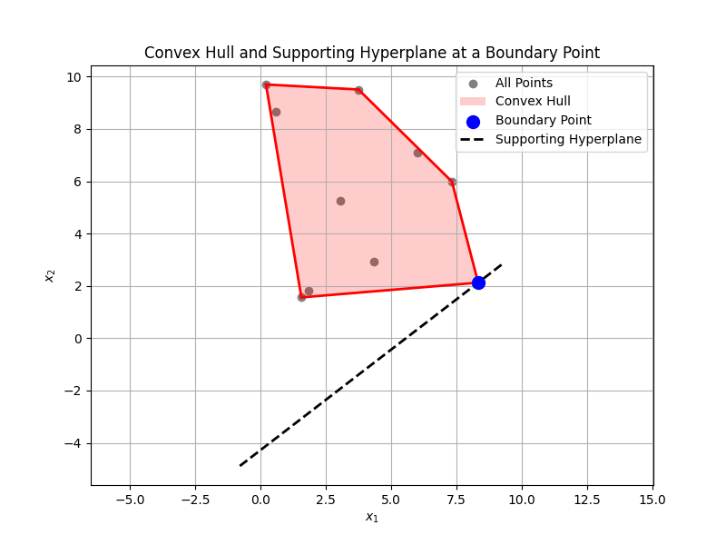

# 分離/支撐超平面定理

## 分離超平面定理(separating hyperplane theorem)

> 令$$C, D \in X$$為不相交的相異凸集合，即$$C \cap D = \emptyset$$。則存在超平面$$H=\{x~| ~a^\top x =b, a \neq 0,b \in X\}$$使得$$\forall x \in C, a^\top x \leq b$$且$$\forall x \in D, a^\top x \geq b$$。
>
> 稱$$H$$為集合$$C,D$$的分離超平面。

反之不成立，即若存在超平面可將兩凸集合分開，不能保證兩凸集合不相交。

範例： $$C=D=\{0\} \subseteq \mathbb{R}$$均為單點的凸集合，兩者交集不為空，但是存在超平面$$x=0$$可將兩集合分開。

範例：兩凸集合交於一點，但是存在通過交點的超平面可將兩凸集合分開。

<details>

<summary>proof(嚴格分割): 假設兩集合的距離>0，則可取直線為法向量，切過中點形成超平面</summary>

因為兩集合不相交，令兩集合間的距離$$d(C,D)=\inf\{ \|u-v\|_2, ~|~ u \in C, ~ v \in D\}>0$$。

令兩集合上最短距離線段的點分別為$$c \in C, d \in D$$且$$\|c-d\|_2 = d(C,D)$$。

定義法向量$$a=d-c$$，常數$$b=\frac{\|d\|_2^2 - \|c\|2^2}{2}$$，可得仿射函數$$f(x)=a^\top x -b = (d-c)^\top (x-\frac{1}{2}(d+c))$$。

且$$\forall u \in C, f(u) < 0$$, $$\forall v \in D, f(v) > 0$$。

因此超平面$$H=\{x~|~ a^\top x = b\}$$分割了$$C, D$$，正交於線段$$cd$$且經過其中點。

.png>)

(QED)

</details>



<figure><figcaption><p>不相交凸集合必存在分離超平面</p></figcaption></figure>



```python
import numpy as np
import matplotlib.pyplot as plt
from scipy.spatial import ConvexHull
from sklearn.svm import SVC  # 使用 SVM 找到分離超平面

# 定義兩個不相交的點集
np.random.seed(42)  # 固定隨機種子以確保結果可重現
points1 = np.random.randn(10, 2) + [3, 3]  # 第一個點集，中心在 (3, 3)
points2 = np.random.randn(10, 2) + [-3, -3]  # 第二個點集，中心在 (-3, -3)

# 計算兩個凸包
hull1 = ConvexHull(points1)
hull2 = ConvexHull(points2)

# 使用 SVM 找到分離超平面
X = np.vstack((points1, points2))  # 合併兩個點集
y = np.hstack((np.ones(len(points1)), -np.ones(len(points2))))  # 標記類別
svm = SVC(kernel='linear')  # 使用線性核的 SVM
svm.fit(X, y)

# 提取分離超平面的參數
w = svm.coef_[0]  # 法向量 w
b = svm.intercept_[0]  # 截距 b

# 計算超平面的斜率和截距
slope = -w[0] / w[1]  # 斜率
intercept = -b / w[1]  # 截距

# 繪製圖形
plt.figure(figsize=(8, 6))

# 繪製第一個凸包
for simplex in hull1.simplices:
    plt.plot(points1[simplex, 0], points1[simplex, 1], 'r-', lw=2)
plt.fill(points1[hull1.vertices, 0], points1[hull1.vertices, 1], 'r', alpha=0.2, label="Convex Hull 1")

# 繪製第二個凸包
for simplex in hull2.simplices:
    plt.plot(points2[simplex, 0], points2[simplex, 1], 'b-', lw=2)
plt.fill(points2[hull2.vertices, 0], points2[hull2.vertices, 1], 'b', alpha=0.2, label="Convex Hull 2")

# 繪製分離超平面
x_vals = np.array([X[:, 0].min() - 1, X[:, 0].max() + 1])  # x 的範圍
y_vals = slope * x_vals + intercept  # 對應的 y 值
plt.plot(x_vals, y_vals, 'k--', lw=2, label="Separating Hyperplane")

# 添加標題和軸標籤
plt.title("Separating Hyperplane between Two Convex Hulls")
plt.xlabel("$x_1$")
plt.ylabel("$x_2$")
plt.legend()
plt.grid(True)

# 顯示圖形
plt.show()
```




## 支撐超平面定理(supporting hyperplane theorem)

> $$C$$為非空凸集合，且$$x_0 \in \mathrm{bd}(C)$$為其邊界點，則存在經過點$$x_0$$的支撐超平面$$H=\{x~|~ a^\top x = a^\top x_0\}$$。
>
> 或者說點$$x_0$$與集合$$C$$可被超平面$$H$$分開。



<figure><figcaption><p>支撐超平面</p></figcaption></figure>



```python
import numpy as np
import matplotlib.pyplot as plt
from scipy.spatial import ConvexHull

# 定義隨機生成的點集
np.random.seed(42)  # 固定隨機種子以確保結果可重現
points = np.random.rand(10, 2) * 10  # 隨機生成 10 個點，範圍在 [0, 10] × [0, 10]

# 計算凸包
hull = ConvexHull(points)

# 選擇一個邊界點作為目標點
target_vertex_index = 2  # 假設選擇第 3 個邊界點（索引從 0 開始）
target_vertex = points[hull.vertices[target_vertex_index]]

# 找到該邊界點的前後鄰居點（用於計算支撐超平面的方向）
prev_vertex = points[hull.vertices[target_vertex_index - 1]]  # 前一個點
next_vertex = points[hull.vertices[(target_vertex_index + 1) % len(hull.vertices)]]  # 下一個點

# 計算支撐超平面的法向量
edge_vector = next_vertex - prev_vertex  # 邊的方向向量
normal_vector = np.array([-edge_vector[1], edge_vector[0]])  # 法向量（垂直於邊）

# 支撐超平面的斜率和截距
slope = -normal_vector[0] / normal_vector[1]  # 斜率
intercept = target_vertex[1] - slope * target_vertex[0]  # 截距

# 繪製圖形
plt.figure(figsize=(8, 6))

# 繪製原始點集
plt.scatter(points[:, 0], points[:, 1], color='gray', label="All Points")

# 繪製凸包的邊界
for simplex in hull.simplices:
    plt.plot(points[simplex, 0], points[simplex, 1], 'r-', lw=2)
plt.fill(points[hull.vertices, 0], points[hull.vertices, 1], 'r', alpha=0.2, label="Convex Hull")

# 繪製目標邊界點
plt.scatter(target_vertex[0], target_vertex[1], color='blue', s=100, zorder=5, label="Boundary Point")

# 繪製支撐超平面
x_vals = np.array([points[:, 0].min() - 1, points[:, 0].max() + 1])  # x 的範圍
y_vals = slope * x_vals + intercept  # 對應的 y 值
plt.plot(x_vals, y_vals, 'k--', lw=2, label="Supporting Hyperplane")

# 添加標題和軸標籤
plt.title("Convex Hull and Supporting Hyperplane at a Boundary Point")
plt.xlabel("$x_1$")
plt.ylabel("$x_2$")
plt.legend()
plt.grid(True)
plt.axis('equal')  # 確保 x 和 y 軸比例相同

# 顯示圖形
plt.show()
```


