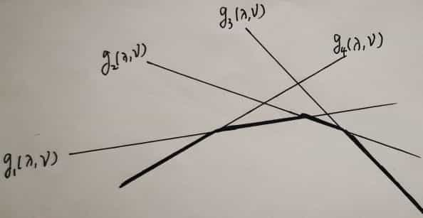

# Lagrange對偶(duality)

## 簡介

在約束最最佳化問題中，常常利用拉格朗日對偶性(Lagrange duality)將原始問題轉為對偶問題，通過解決對偶問題而得到原始問題的解。

對偶問題有非常良好的性質，以下列舉幾個：

* 對偶問題的對偶是原問題；&#x20;
* <mark style="color:red;">無論原始問題是否是凸的，對偶問題都是</mark><mark style="color:red;">**凸最佳化問題**</mark>；&#x20;
* 對偶問題可以給出原始問題一個下界；&#x20;
* 當滿足一定條件時，原始問題與對偶問題的解是完全等價的；

實數域上的所有最佳化問題都有對偶問題，<mark style="color:red;">只不過當原問題為非凸問題時，由對偶問題得到的解只是原問題解的一個下界</mark>。KKT條件都可以用，當對偶間隙不為0時，所確定的是可行解，為0時是最優解。

如果原問題不是凸最佳化問題，那麼KKT只是必要條件，不是充分條件，最優解一定滿足KKT，但滿足KKT的不一定是最優解，不能由KKT說明原問題和對偶問題一致。

兩個等價的最佳化問題對應的對偶問題可能不相同，反之亦然。

令主問題和對偶問題的最佳值分別為$$p^{*}, ~d^{*}$$，則弱對偶性(weak dual) $$p^{*} \geq ~d^{*}$$必定成立。$$p^{*} -d^{*} \geq 0$$稱為對偶間隙(dual gap)。

### **對偶性的重要性**

* **簡化計算**：對偶問題通常比原始問題更容易求解，特別是在原始問題的約束條件複雜時。
* **提供下界**：對偶問題的解可以為原始問題提供一個下界，這在評估原始問題的可行性和最優性時非常有用。
* **強對偶性**：在某些條件下（如原始問題為凸優化問題且滿足Slater條件），原始問題和對偶問題的最優解是相等的，這稱為強對偶性。

## 問題標準型式(standard form, 不必為凸最佳化問題)

$$\displaystyle \begin{aligned} \min_{\mathbf{x} \in \mathbb{R}^n } ~& ~ f(\color{red}{\mathbf{x}}) &  \\ s.t. ~&~ g_i(\mathbf{x}) \leq 0, & i=1,2,\dots, m \\ 	 ~&~ h_i(\mathbf{x}) =0, & i=1,2,\dots, p \end{aligned}$$

問題的可行域為$$\mathcal{D} = \mathrm{dom}f \cap_{i=1}^m \mathrm{dom}g_i \cap_{j=1}^p \mathrm{dom}h_i$$為非空集合，最佳值為$$p^{*}$$，而<mark style="color:red;">問題不必為凸最佳化問題</mark>。

## 拉格朗日函數

標準型的拉格朗日函數$$L: \mathbb{R}^n \times \mathbb{R}^m \times \mathbb{R}^p \rightarrow \mathbb{R}$$如下：

$$\displaystyle L(x, \lambda, \nu) = f_o(x) + \sum_{i=1}^m \lambda_i g_i(x) + \sum_{j=1}^p \nu_j h_j(x)$$

對偶函數$$g(\lambda, \nu)=\inf_x L(x, \lambda, \nu)$$

* 定義域為$$\mathrm{dom} L = \mathcal{D} \times \mathbb{R}^m \times \mathbb{R}^p$$
* $$\lambda_i \in \mathbb{R}$$為第$$i$$個不等式約束$$g_i (x) \leq 0$$對應的<mark style="color:red;">拉格朗日乘數(multiplier)，此處不限制</mark>$$\lambda_i$$<mark style="color:red;">為正數</mark>。
* $$\nu_j \in \mathbb{R}$$為第$$j$$個等式約束$$h_j(x) =0$$對應<mark style="color:red;">的拉格朗日乘數</mark>。

拉格朗日函數$$L$$如果看成是關於$$x$$ 的函數，那它其實就是對原始問題中目標函數與約束條件進行線性加權，目標函數的權重係數是1，約束條件的權系數是$$\lambda_i$$或 $$\nu_i$$ ；&#x20;

如果 $$L$$看成是關於$$\lambda$$或$$\nu$$的函數，則其餘部分可看成常數， $$L$$ 就可看作是一個關於$$\lambda$$或 $$\nu$$的仿射函數（即最高次冪為1的多項式函數）。

### 幾何意義：梯度的方向與等高線切線方向垂直

在多變量函數$$f(x,y)$$中，梯度向量$$\nabla f=\left(  \frac{\partial f}{\partial x}, \frac{\partial f}{\partial y} \right)$$指向函數增長最快的方向，且其梯度$$|\nabla f|$$大小表示函數在這個方向上的變化率。

函數等高線上的點具有相同的函數值$$f(x,y)=c$$，沿著等高線的方向函數值不變，在函數等高線$$f(x,y)=c$$上任一點$$(x,y)$$處的切線的斜率滿足全微分為0即$$\frac{\partial f}{\partial x} + \frac{\partial f}{\partial y} \times \frac{dy}{dx}=0$$。

所以點$$(x,y)$$切線斜率為$$\frac{dy}{dx} = - \frac{\partial f}{\partial x}/\frac{\partial f}{\partial y}$$。

由於法線與切線垂直，所以法線斜率是切線斜率的負倒數(因為內積為0)為$$\frac{\partial f}{\partial y}/\frac{\partial f}{\partial x}$$，寫為向量形式為$$\left(  \frac{\partial f}{\partial x}, \frac{\partial f}{\partial y} \right)$$。<mark style="color:red;">因此梯度向量為函數等高線的法向量，所以等高線的切線方向與梯度方向垂直。</mark>

### Lagrange乘子法的幾何意義

在多變量函數中，梯度向量$$\nabla f(x)$$表示函數$$f(x)$$在點$$x$$的變化最快的方向。當我們在尋找函數的極值時，最優解通常位於梯度為零的點，即$$\nabla f(x) = 0$$。然而，在有約束的情況下，我們不能隨意改變$$x$$，而是必須遵循約束條件$$g(x)=0$$。

約束函數$$g(x)$$定義了一個可行域，這是我們可以在其中尋找最優解的區域。這個可行域通常是多維空間中的一個曲面或邊界。當我們在這個可行域內尋找最優解時，<mark style="color:red;">最優解通常出現在目標函數的等值曲線與約束條件的交點上</mark>。當這兩條曲線相切時，意味著在該點附近，目標函數的變化不會導致約束條件的違反。這種相切關係確保了在保持約束不變的情況下，目標函數達到了區域性極值。

當我們在約束條件下尋找最優解時，最優解通常出現在目標函數的等值曲線與約束條件的交點上。當這兩條曲線相切時，<mark style="color:red;">最優解出現在目標函數的梯度與約束函數的梯度平行的點</mark>，即：$$\nabla f(x,y)=\lambda \nabla g(x,y)$$，$$\lambda$$為拉格朗日乘子，$$g(x,y)=0$$是約束條件。

* **梯度平行**：當 $$\nabla f(x)$$和$$\nabla g(x)$$相等時，這意味著目標函數的變化方向與約束函數的變化方向是平行的。換句話說，當我們在可行域的邊界上移動時，目標函數的增長率與約束的增長率是成比例的。
* 相切：如果目標函數的等高線與約束曲面相切，則在切點處，它們的切線方向相同。由於梯度方向與等高線垂直，因此在切點處，目標函數的梯度方向與約束曲面的法線方向共線。
* 最優解的存在：如果在某一點上，目標函數的梯度與約束函數的梯度不平行，那麼我們可以在可行域內沿著某個方向移動，從而使目標函數的值進一步增大或減小，這意味著該點不是最優解。

在平面上，等高線是函數值相同的點的集合。當我們在一個約束條件下尋找最小值或最大值時，Lagrange函數的幾何意義可以通過觀察等高線的交互來理解：

* **最小值**：當等高線的形狀與約束的形狀相切時，這個切點即為最小值。
* **最大值**：同理，當等高線的形狀與約束的形狀相切時，這個切點即為最大值。

在Lagrange乘子法中，互補鬆弛條件提供了進一步的幾何意義。這些條件表明，在最優解處，若某個約束不緊束（即不等式約束未達到邊界），則對應的Lagrange乘子必須為零。這意味著在最優解的幾何圖形中，某些約束可能不會影響最優解的形成，從而形成一種“鬆弛”的狀態。

### 範例: 線性方程式的最小二乘解

> 原問題：$$\min x^\top x$$ s.t. $$Ax=b$$ $$x \in \mathbb{R}^n ~, b \in \mathbb{R}^p ~ A \in \mathbb{R}^{p \times n}$$

Langrage函數 $$L(x, \nu)= x^\top x + \nu^\top (Ax - b)$$

對偶函數$$\displaystyle  \begin{aligned} g(\nu) &= \inf_{x} \{  x^\top x + \nu^\top (Ax - b) \} \\ 	& = \inf_{x} \{x^\top x + \nu^\top A x - \nu^\top b \} \\ 	& = -\frac{1}{4} \nu^\top A A^\top \nu - b^\top \nu  \end{aligned}$$為凹函數。

因為$$g^{(2)}(\nu)=-\frac{1}{2} A A^\top < 0 ~\forall \nu$$為負定矩陣，所以為凹函數。

### 範例:線性規劃

> 原問題： $$\min c^\top x$$ s.t. $$Ax=b, ~ x \succeq 0$$

Lagrange函數$$L(x, \lambda ,\nu) = c^\top X - \lambda^\top x + \nu (Ax-b)$$。

對偶函數：$$\displaystyle \begin{aligned} g(\lambda, \nu) & = \inf_{x} \{ c^\top -\lambda^\top x + \nu^\top (Ax-b)\} \\ 	& = \inf_{x} \{  (c^\top-\lambda^\top + \nu^\top A)x - \nu^\top b \} \\ 	& = \left\{  		\begin{aligned} 		& -b^\top v	& \text{ if } A^\top +c - \lambda = 0 \\ 		& -\infty	& \text { otherwise} 		\end{aligned} 	 	\right.  \end{aligned}$$

## 拉格朗日對偶函數（ Lagrange dual function）

拉格朗日對偶函數（簡稱對偶函數）通過對拉格朗日函數關於$$x$$取下確界(最小值)得到，即

$$\displaystyle g(\lambda, \nu) = \inf_x L(x, \lambda, \nu)$$

$$\inf$$符號表示取下確界。求解析式可先將$$L$$看成是關於$$x$$的函數，而將拉格朗日乘子看作常數，求出$$L$$的極小值點，再將該點代入$$L$$ ，得到的關於$$\lambda$$和$$\nu$$的表達式就是對偶函數。

## 對偶函數的兩條重要性質

### 對偶函數一定是凹函數，其凹性與原目標函數和約束函數凹凸與否無關

凹函數(開口向下)定義：$$\forall x,y \in D, \lambda \in [0,1]$$，$$g(\lambda x + (1-\lambda)y) \geq \lambda g(x) + (1-\lambda)g(y)$$。

因為$$g(\lambda, \nu)$$為凹函數，因此取$$\max$$可取到最大值。

給定$$(\lambda_1, \nu_1), (\lambda_2, \nu_2)$$，可得對偶函數$$g(t(\lambda_1, \nu_1)+(1-t)(\lambda_2, \nu_2))=\inf_x (L(x, t(\lambda_1, \nu_1)+(1-t)(\lambda_2, \nu_2))$$。

由於拉格朗日函數$$L( x ,\lambda, \nu )$$ 是關於($$\lambda, \nu)$$的線性組合，因此對於任意固定的$$x$$，$$L ( x , \dot )$$ 是一個關於$$( \lambda, \nu )$$的仿射函數。

因此$$L(x, t(\lambda_1, \nu_1)+(1-t)(\lambda_2, \nu_2))= L(x, t(\lambda_1, \nu_1))+ L(x, +(1-t)(\lambda_2, \nu_2))$$

### 弱對偶性：對偶函數值必小於等於原問題最優解對應的目標函數值

> * $$\forall \lambda \succeq 0, \forall \nu$$，若原問題的最佳值為$$p^{*}$$，則$$g(\lambda, \nu) \leq p^{*}$$。&#x20;
> * 令$$d^{*} = \min g(\lambda, \nu)$$為對偶問題的最佳值，則可得$$d^{*} \leq p^{*}$$，稱為弱對偶性(weak dual)。其中$$p^{*} - d^{*} \geq 0$$稱為對偶間隙。
> * 對偶函數沒有限制$$\lambda \succeq 0$$，<mark style="color:red;">而此處必須限制</mark>$$\lambda$$<mark style="color:red;">為非負值才有此性質</mark>。
> * 對偶函式為原問題的最佳值定義了一個下界。。

proof:

* 若$$\tilde{x}$$為可行性(feasible solution)，則原問題的限制式$$g_i (\tilde{x}) \leq 0$$且$$h_j(\tilde{x})=0$$。
* 因為Lagrange函數$$\displaystyle L(x, \lambda, \nu) = f(x) + \sum_{i=1}^m \lambda_i g_i(x) + \sum_{j=1}^p \nu_j h_j(x)$$
* 若令$$\lambda \succeq 0$$，可得$$\sum_{i=1}^m \lambda_i g_i(\tilde{x}) + \sum_{j=1}^p \nu_j h_j(\tilde{x}) \leq 0$$。
* 因此可得$$f(\tilde{x}) \geq L(\tilde{x}, \lambda, \nu )$$--(1)
* 根據對偶函數定義得$$L(\tilde{x}, \lambda, \nu ) \geq \inf_{x \in \mathcal{D}} L(x, \lambda, \nu) = g(\lambda, \nu)$$--(2)
* 因此$$g(\lambda, \nu) \leq L(\tilde{x}, \lambda, \nu), ~ \forall x \in \mathcal{D}$$
* 若$$x^{*} = \tilde{x}$$，$$L(\tilde{x}, \lambda, \nu) = p^{*}$$
* 因此 $$g(\lambda, \nu) \leq p^{*}$$ (QED)

## Slater條件

> 當凸問題滿足Slater條件時，則強對偶性成立，反之不成立。

令凸問題為：$$\displaystyle \begin{aligned} \min_{\mathbf{x} \in \mathbb{R}^n } ~& ~ f(\color{red}{\mathbf{x}}) &  \\ s.t. ~&~ g_i(\mathbf{x}) \leq 0, & i=1,2,\dots, m \\ 	 ~&~ h_i(\mathbf{x}) =0, & i=1,2,\dots, p \end{aligned}$$

若存在$$x \in \mathrm{relint} D$$使得$$g_i(x) < 0 ~～\forall i$$，則$$p^{*} = d^{*}$$

## Lagrange對偶問題

> $$\begin{aligned} & \max_{\lambda \in \mathbb{R}^m, \nu\in \mathbb{R}^p} & g(\lambda, \nu) \\ & s.t. & \lambda \succeq 0 \end{aligned}$$

* 對偶問題最佳值$$d^{*}$$的上界為原問題的最佳值$$p^{*}$$。
* 對偶問題的定義域$$\mathrm{dom }g = \{(\lambda, \nu) ~|~ g(\lambda, \nu) > -\infty \}$$。
* 若$$\lambda \succeq 0~,  (\lambda, \nu) \in \mathrm{dom }g$$，稱$$(\lambda, \nu)$$為對偶可行解(dual feasible)。

### 範例：線性規劃的對偶問題

原問題：

$$\begin{aligned} & \min_{x} &  c^\top x \\ & s.t.	& Ax = b \\ &	& x \succeq 0  \end{aligned}$$

Lagrange函數 $$g(\lambda, \nu)=  \left \{ \begin{aligned} -b^\top \nu  & A^\top \nu -\lambda +c =0 \\ -\infty	& \text{ otherwise } \end{aligned} \right .$$

而標準型式線性規劃的對偶問題是滿足約束$$\lambda \succeq 0$$條件下極大化對偶函數，即$$\begin{aligned} & \max & g(\lambda, \nu)=  \left \{ \begin{aligned} -b^\top \nu  & A^\top \nu -\lambda +c =0 \\ -\infty	& \text{ otherwise } \end{aligned} \right . \\  & s.t.	& \lambda \succeq 0 & \end{aligned}$$

而在$$A^\top \nu -\lambda +c =0$$時對偶函數$$g$$有界。

因此可得等價的問題 $$\begin{aligned}   \max~ & -b^\top \nu  \\  s.t.~ & A^\top \nu -\lambda +c =0 \\   ~	& \lambda \succeq 0  \end{aligned}$$或再簡化為$$\begin{aligned}   \max~ & -b^\top \nu  \\  s.t.~ & A^\top \nu  +c  \succeq 0  \end{aligned}$$

## 參考資料

* [\[知乎\]如何通俗地講解對偶問題，尤其是拉格朗日對偶 lagrangian duality？](https://www.zhihu.com/question/58584814)
* [\[知乎\]為什麼梯度的方向與等高線切線方向垂直](https://zhuanlan.zhihu.com/p/27731819)？
