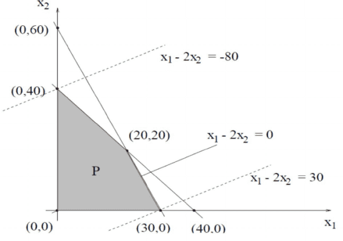

# 線性規劃

## 什麼是線性規劃?

目標函數(ojective function)為線性函數，且限制式由線性函數組成的規劃問題。

由凸最佳化問題可得多個線性限制式的可行解區域(feasible domain)會形成單純形(simplex)，為一凸集合或是無解。

由於可行解空間為單純形(凸集合)，且是由線性限制式形成，而目標函數為線性函數，因此最佳值必落在單純形的某一個交點上或是無上界(unbounded)。

### 歷史

G.B. Danzig(1947)年提出線性規劃的概念，用於美國空軍的後勤規劃。

由T.C. Koopmans與G.B. Danzig(1948)將此概念命名為線性規劃。

G.B. Danzig(1948)提出單純形法(simplex method)求解。最糟情形下求解為指數時間的算法，但在大多數問題上可快速求解。

LH：Khachian(1979)年提出橢圓形法(ellipsiod method)求解，為線性規劃的第一個多項式時間求解決演算法，但實作複雜度仍高。

N. Karmarkar(1984)提出內點法(interior-point method)求解，是容易實作且為多項式時間的求解演算法。

### 範例

$$\displaystyle  \begin{aligned} \min_{x_1, x_2}~ &~ x_1 - 2 x_2 \\ \text{s.t.} ~&~ x_1 + x_2 \leq 40 \\     & 2 x_1 + x_2 \leq 60 \\     & x_1, ~ x_2 \geq 0 \end{aligned}$$

<figure><figcaption>
線性規劃可行域為單純形，且最佳解落在某一個交點
</figcaption></figure>

## 線性規劃標準型

### 目標函數

#### 多項式型

$$\displaystyle \min_{x_1, x_2, \dots, x_n} c_1 x_1 + c_2 x_2 + \dots + c_n x_n$$

#### 矩陣型

$$\displaystyle \min_{\mathbf{x}} \mathbf{c^\top x}$$

### 限制式

#### 多項式型

$$\displaystyle  \begin{aligned} & a_{11}x_1 + a_{12}x_2 + \dots + a_{1n} x_n  &= b_1 \\ & a_{21}x_1 + a_{22}x_2 + \dots + a_{1n} x_n  &= b_2 \\ & \vdots  & \vdots \\ & a_{m1}x_1 + a_{m2}x_2 + \dots + a_{mn} x_n  &= b_m \\ & x_1, x_2, \dots, x_n & \geq 0 \end{aligned}$$

如果決策變數$$y_j \leq 0$$，只要令$$x_j = -y_j \geq 0$$或者改變限制式中與$$y_j$$有限的系數正負號即可。

如果限制式$$\leq 0$$或$$\geq 0$$時，可增加鬆弛變數(slack variables)使得限制式$$=0$$，同時也要將鬆弛變數加入目標函數中。

因為線性規劃的最佳解必定落在可行域的頂點上，因此$$\leq$$可直接改成$$=$$。

#### 矩陣式

$$\displaystyle  \begin{aligned} & \mathbf{Ax = b} \\ & \mathbf{x \succeq 0} \end{aligned}$$

### 應用問題的隱含假設

等比例假設(porportionality assumption)

* 限制式量大時無折扣。
* 無經濟規模。

可加性假設(additivity assumption)

總結果等於個體結果的總和。

## 求解的方法

最佳解必定落在可行域的某一個頂點上，因此暴力法為走訪所有的頂點，找有最小函數值的解即為所求。

現有$$n$$個變數且有$$m$$個限制式，假設$$m > n$$，則最多有$$\displaystyle \binom{m}{n}=\frac{m!}{n!(m-n)!}$$個頂點，複雜度為$$O(m!)$$。

## 單純形法(simplex method)

想法：沿著可行域的頂點前進即可。

1. 先找到可行域的一個頂點$$\mathbf{x}_t$$。
2. 如果$$\mathbf{c^\top x_t}$$為最佳值則停止；否則進行下一步。
3. 查看$$\mathbf{x}_t$$鄰近的頂點們是否有更的函數值，取有更好函數值的頂點為$$\mathbf{x}_{t+1}$$，再回到第2步。

雖然頂點個數最糟情形下為指數複雜度，但一般應用中，單純形法大約只要走訪$$0.7159n^{0.9522}m^{0.3109}$$個節點即可。

Klee and Minty(1971)給出範例在最糟情形下，單純形法須走訪$$2^m-1$$個頂點，因此為指數複雜度的演算法。

## 橢圓形法(ellipsoid method)

多項式時間的求解演算法，基本想法是求解$$\mathbf{Mx < d}$$，其中$$\mathbf{M} \in \mathbb{R}^{m \times n}$$。但時間複雜度為$$O(n^4L^2)$$，還是相當高。

線性規劃的解可由以下最佳條件決定：

$$\displaystyle (OPT) \left\{ \begin{aligned} & \mathbf{c^\top x - b^\top w =0} \\ & \mathbf{Ax \leq b}, ~ \mathbf{x \geq 0} \\ & \mathbf{A^\top w \geq c}, ~ \mathbf{w \geq 0} \end{aligned} \right.$$

1. 在$$(\mathbf{x,w})$$空間中，展開一個大的橢圓$$E_0=S(0, 2^{2L})$$。
2. 如果目前的橢圓$$E_k$$可求解(OPT)，則停止。否則用更小的$$E_{k+1}$$更新。
3. 如果$$Vol(E_{k+1})$$即橢圓，則停止，(OPT)無解。

## 內點法(interior point)

由可行域形成的單純形任一頂點開始，走單純形的內部往最佳解方向前進，直到收斂。時間複雜度為$$O(n^3L)$$，在大型問題求解時優於單純形法。

1. 可行域形成的單純形任一頂點開始。
2. 如果目前的解已經夠好，則停止；否則進行步驟3。
3. 找出可改善目前解的所有方向，且往有更優解的內點方向前進，再回到步驟2。

## 參考資料

* \[陽明交通大學] 方述誠-線性規劃。
