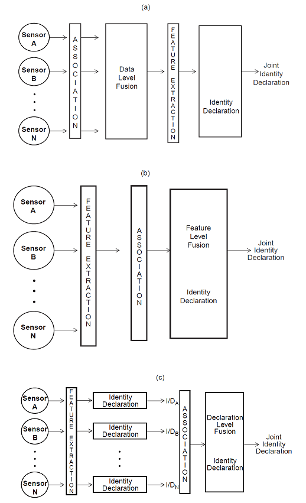

# 多感測器資料融合

## 簡介

來自多個感測器的資料的整合或融合提高了從目標追蹤、戰場監視、工業生產過程監測和醫療診斷等非國防應用的精準性。

資料融合技術結合了來自多個感測器的資料和相關資訊，以實現比使用單個獨立感測器所能實現的更具體的推斷。

多感測器資料融合的概念並不新鮮。隨著人類和動物的進化，他們已經發展出利用多種感官來幫助他們生存的能力。<mark style="color:blue;">例如，評估一種可食用物質的質量可能不可能只使用視覺；視覺、觸覺、嗅覺和味覺的結合要有效得多</mark>。同樣，當視覺受到結構和植被的限制時，聽覺可以為即將發生的危險提供預先警告。因此，動物和人類自然會進行多感官資料融合，以更準確地評估周圍的環境和識別威脅，從而提高他們的生存機會。

雖然資料融合的概念並不新鮮，但新的感測器、先進的處理技術和改進的處理硬體的出現，使得資料的即時融合越來越可行。計算和感測方面的最新進展已經提供了在硬體和軟體方面模仿人類和動物的自然資料融合能力的能力。目前，資料融合系統被廣泛用於目標跟蹤、目標的自動識別和有限的自動推理應用。

多感測器資料融合的應用非常廣泛。軍事應用包括自動目標識別（如智慧武器）、自主車輛的引導、遙感、戰場監視和自動威脅識別系統，如識別-友情-中立（IFFN）系統。非軍事應用包括監測製造過程、基於條件的複雜機械維護、機器人技術和醫療應用。

結合或融合資料的技術來自不同的傳統學科，包括數字訊號處理、統計估計、控制理論、人工智慧和經典數字方法。歷史上，資料融合方法主要為軍事應用而開發。然而，近年來，這些方法已被應用於民用領域，技術的雙向轉移已經開始。

## 多感測器的優點

<mark style="color:blue;">首先，如果使用幾個相同的感測器（例如，相同的雷達跟蹤一個移動物體），合併觀測資料將導致對目標位置和 速度的改進估計</mark>。通過增加$$N$$個獨立的觀測值，可以獲得統計學上的優勢（例如，目標位置或速度的估計值被 改進了一個與$$\sqrt{N}$$成正比的係數），假設資料是以最佳方式組合的。 同樣的結果也可以通過合併單個感測器的$$N$$個觀測值來獲得。

<mark style="color:blue;">第二個優點涉及利用多個感測器的相對位置或運動來改善觀察過程。</mark> 例如，兩個測量物體角度方向的感測器可以進行協調，通過三角測量確定物體的位置。 這種技術被用於測量和商業導航。同樣，使用兩個感測器，一個以已知的方式相對於另一個移動， 可以用來即時測量一個物體相對於觀測感測器的位置和速度。

通過使用多個感測器獲得的<mark style="color:blue;">第三個優勢是改進了可觀測性。</mark>擴大物理觀測的基線可以帶來顯著的改善。 與一個簡單的例子，一個移動的物體，如飛機，被脈衝雷達和前視紅外成像感測器所觀測。 雷達可以精準地確定飛機的範圍，但在確定飛機的角度方向方面能力有限。 相比之下，紅外成像感測器可以精準地確定飛機的角度方向，但不能測量範圍。 如果這兩個觀測值被正確地聯絡起來，兩個感測器的組合提供了比兩個獨立感測器中的任何一個所能獲得 的更好的位置確定。這導致了誤差區域的減少，如融合或合併的位置估計所示。

在根據對物體屬性的觀察來確定物體的身份時，也可以獲得類似的效果。 例如，有證據表明，蝙蝠通過各種因素的組合來識別它們的獵物，包括尺寸、紋理（基於聲音特徵）和運動行為。

## 軍事應用

國防部(DoD)社區關注的問題涉及發射器、平台、武器和軍事單位等動態實體的定位、定性和識別。 這些動態資料通常被稱為戰備資料庫或戰備顯示（如果疊加在地圖顯示上）。除了實現戰況資料庫外， 國防部使用者還尋求關於敵情的更高層次的推斷（例如，實體之間的關係以及它們與環境和更高層次的 敵人組織的關係）。與國防部有關的應用實例包括海洋監視、空對空防禦、戰場情報、監視和目標獲取， 以及戰略預警和防禦。<mark style="color:blue;">這些軍事應用中的每一個都涉及到一個特定的重點、一個感測器套件、 一套理想的推斷和一套獨特的挑戰</mark>。

海洋監視系統被設計用來探測、跟蹤和識別基於海洋的目標和事件。這方面的例子包括支援海軍戰術艦隊行動的反潛戰系統和引導自主車輛的自動化系統。感測器套件可以包括雷達、聲納、電子情報（ELINT）、通訊流量觀察、紅外和合成孔徑雷達（SAR）觀察。海洋監視的監視範圍可能包括數百海里，並關注空中、表面和地下的目標。多個監視平台可以參與，許多目標可以被跟蹤。<mark style="color:blue;">海洋監視的挑戰涉及到大的監視量、目標和感測器的組合以及複雜的訊號傳播環境</mark>--特別是水下聲納感測。

軍方已經開發了空對空和地對空防禦系統，以探測、跟蹤和識別飛機和防空武器及感測器。這些防禦系統使用的感測器包括雷達、被動電子支援措施（ESM）、紅外識別-敵我（IFF）感測器、光電圖像感測器和視覺（人）觀察。這些系統支援反空、戰鬥序列彙總、分配飛機突襲、目標優先順序、路線規劃和其他活動。<mark style="color:blue;">這些資料融合系統面臨的挑戰包括敵人的反制措施、快速決策的需要以及目標-感測器配對的潛在大組合</mark>。IFF系統的一個特殊挑戰是需要自信地和非合作地識別敵機。武器系統在全世界的擴散導致武器的國家來源和使用該武器的戰鬥人員之間幾乎沒有關聯。

戰場情報、監視和目標獲取系統試圖探測和識別潛在的地面目標。這方面的例子包括定位地雷和自動目標識別。感測器包括通過合成孔徑雷達的空中監視、被動電子支援措施、照片偵察、地面聲學感測器、遙控飛行器、光電感測器和紅外感測器。<mark style="color:red;">尋求的關鍵推論是支援戰場形勢評估和威脅評估的資訊</mark>。

## 非軍用應用

解決資料融合問題的第二大類是學術界、商界和工業界。它們解決了諸如機器人的實施、工業製造系統的自動化控制、智慧建築的開發和醫療應用等問題。與軍事應用程式一樣，每個應用程式都有特定的挑戰和感測器套件，以及特定的實現環境。

<mark style="color:blue;">遙感系統已經被開發出來，用於識別和定位實體和物體</mark>。這方面的例子包括監測農業資源（如監測農作物的生產力和健康狀況）、定位自然資源、監測天氣和自然災害的系統。這些系統主要依靠使用多光譜感測器的圖像系統。這種處理系統以自動圖像處理為主。多光譜圖像，如Landsat衛星系統和SPOT系統被使用。一種經常用於多感測器圖像融合的技術涉及到自適應神經網路。多圖像資料在逐個畫素的基礎上進行處理，並輸入到神經網路中，對圖像的內容進行自動分類。假顏色通常與農作物、植被或物體的類型相關。人類分析人員可以很容易地解釋所產生的假彩色合成圖像。

<mark style="color:red;">多圖像資料融合的一個關鍵挑戰是配准(coregistration)</mark>。這個問題需要對兩張或更多的照片進行對齊，以使每張照片上對應的圖片元素(畫素)代表地球上相同的位置(即，從觀察者的角度來看，每個畫素代表相同的方向)，從而使圖像以這樣一種方式疊加。圖像感測器是非線性的，在觀察到的三維空間和二維圖像之間執行複雜的轉換，這加劇了配准問題。

第二個應用領域橫跨軍事和非軍事使用者，<mark style="color:blue;">是監測複雜的機械裝置，如渦輪機、直升機齒輪傳動系統或工業製造裝置</mark>。例如，對於傳動系統的應用，感測器資料可以從加速計、溫度計、油污監測器、聲學感測器和紅外測量中獲得。線上狀態監測系統將尋求結合這些觀察結果，以確定故障的前兆，如齒輪異常磨損、軸錯位或軸承故障。使用這種基於狀態的監測預計將減少維護成本，提高安全性和可靠性。這種系統已經開始為直升機和其他平台開發。

## 三種處理架構

對於多感測器資料，有三種基本的選擇：

1. <mark style="background-color:red;">感測器資料的直接融合</mark>
2. <mark style="background-color:red;">通過特徵向量表示感測器資料，隨後對特徵向量進行融合，或者</mark>
3. <mark style="background-color:red;">對每個感測器進行處理以實現高層次的推斷或決策，隨後進行融合</mark>。

這些方法中的每一種都利用了不同的融合技術。

<figure><figcaption>
資料融合三種架構
</figcaption></figure>

<mark style="color:blue;">如果多感測器資料是相稱(commensurate)的(即，如果感測器測量相同的物理現象，如兩個視覺圖像感測器或兩個聲學感測器)，那麼原始感測器資料可以直接組合</mark>。原始資料融合技術通常涉及經典的估計方法，如卡爾曼濾波。相反，如果感測器資料不相稱，則必須在特徵/狀態向量等級或決策等級進行資料融合。

特徵級融合涉及從感測器資料中提取具有代表性的特徵。特徵提取的一個例子是漫畫家使用關鍵的面部特徵來表示人臉。這種技術——在政治諷刺作家中很流行——利用關鍵特徵喚起人們對著名人物的認知。有證據證實，人類利用基於特徵的認知功能來識別物體。在多感測器特徵級融合的情況下，從多個感測器觀測中提取特徵，並將其組合成一個單獨的連接特徵向量，輸入到模式識別技術，如神經網路、聚類演算法或範本方法。

決策級融合在每個感測器初步確定了實體的位置、屬性和身份之後，將感測器資訊結合起來。決策級融合方法的例子包括加權決策方法(投票技術)、經典推理、貝葉斯推理和Dempster-Shafer方法。

## 資料融合過程模型

<mark style="color:red;">資料融合技術轉移的歷史障礙之一是缺乏跨越特定應用程式領域的統一術語</mark>。即使在軍事應用中，相關但不同的應用——如敵我識別、戰場監視和自動目標識別——對基本術語使用不同的定義，如相關性和資料融合。為了改善軍事研究人員和系統開發人員之間的溝通，1986年成立的實驗室聯合主任(JDL)資料融合工作組開始努力編纂與資料融合相關的術語。該工作的結果是建立了用於資料融合的流程模型和資料融合詞彙。

JDL流程模型旨在跨多個應用程式領域非常通用和有用，它確定了流程、功能、技術類別和適用於資料融合的特定技術。資料融合過程由感測器輸入、人機互動、資料庫管理、源預處理和六個關鍵子過程概念化：

* 0級處理(子對象資料關聯和估計)旨在結合畫素級或訊號級資料，獲取觀測目標特徵的初始資訊。
* 第1級處理(對象細化)旨在結合感測器資料，獲得實體的位置、速度、屬性和身份的最可靠和精準的估計(以支援對未來位置、速度和屬性的預測估計)。
* 第2級處理(情況細化)動態地嘗試對環境上下文中實體和事件之間的當前關係進行描述。這需要對象聚類和關係分析，如力量結構和跨力量關係、通訊、物理環境等。
* 第3級處理(顯著性評估)將當前形勢投射到未來，以推斷敵人的威脅、友軍和敵人的脆弱性以及行動的機會(以及後果預測、易感性和脆弱性評估)。
* 第4級處理(過程細化)是一個元過程，它監視整個資料融合過程，以評估和提高即時系統效能。這是資源管理的一個元素。
* 第5級處理(認知細化)尋求改善融合系統與一個或多個使用者/分析人員之間的互動。所執行的功能包括可視化輔助、認知輔助、偏見糾正、協作、基於團隊的決策制定、行動過程分析等。

<figure><figcaption>
JDL資料融合處理模型
</figcaption></figure>

## 對技術現狀的評估

<mark style="color:blue;">資料融合過程中最成熟的領域是第1級處理——使用多感測器資料來確定單個對象或實體的位置、速度、屬性和身份</mark>。基於多感測器觀測確定物體的位置和速度是一個相對古老的問題。高斯和勒讓德發明了確定小行星軌道的最小二乘方法有許多數學技術用於執行坐標轉換，將觀測資料與觀測資料或軌跡相關聯，以及估計目標的位置和速度。<mark style="color:red;">多感測器目標跟蹤主要採用卡爾曼濾波等序列估計技術。這一領域的挑戰涉及到密集目標環境、快速機動目標或複雜訊號傳播環境(例如，涉及多徑傳播、共通道干擾或雜波)的情況</mark>。然而，在優秀的信噪環境中，單目標跟蹤動態行為良好(即，動態可預測)的目標是一個直接的，容易解決的問題。

<mark style="color:blue;">目前的研究主要集中在解決機動目標的分配問題</mark>。多假設跟蹤(multiple-hypothesis tracking, MHT)、機率資料關聯方法、隨機集理論和多準則最佳化理論等技術正在被用於解決這些問題。一些研究人員在基於知識的系統的指導下，同時使用多種技術，該系統能夠根據演算法效能選擇適當的解決方案。

第1級處理中的一個特殊問題涉及到基於<mark style="color:blue;">觀測到的特徵或屬性的目標自動識別</mark>。迄今為止，目標識別一直被基於特徵的方法所主導，這種方法將特徵向量(即感測器資料的表示)對映到特徵空間，希望基於特徵向量相對於先驗確定的決策邊界的位置來識別目標。流行的模式識別技術包括神經網路和統計分類器。儘管有許多技術可用，<mark style="color:red;">但這些方法的最終成功依賴於對好的特徵的選擇</mark>。(好的特徵在特徵空間中提供優秀的類可分離性;糟糕的特徵會導致多類目標的特徵空間區域嚴重重疊。在這一領域需要更多的研究來指導特徵的選擇，並結合目標類的明確知識。例如，語法方法提供關於目標組成的附加資訊。此外，目前正在進行一些有限的研究，以便納入有關情況的資料- -例如目標相對於地形的移動- -以協助確定目標。

第2級和第3級融合(情境細化和威脅細化)目前被基於知識的方法所主導，例如基於規則的黑板系統。這些領域相對不成熟，有許多原型，但很少有健壯的作業系統。<mark style="color:red;">這一領域的主要挑戰是建立一個可行的規則、框架、指令碼或其他方法的知識庫，以表示有關態勢評估或威脅評估的知識</mark>。不幸的是，只有非常原始的認知模型能夠複製人類對這些功能的表現。在為自動態勢評估和威脅評估開發可靠和大規模的基於知識的系統之前，還需要進行大量的研究。有希望的新方法是使用模糊邏輯和混合架構，它們將黑板系統的概念擴展到分層和多時間尺度的方向。

第4級處理評估並改進正在進行的資料融合過程的效能和操作，具有混合成熟度。對於單感測器的操作，運籌學和控制理論的技術已經被應用於開發有效的系統，甚至是複雜的單感測器，如相控陣雷達。相比之下，涉及多個感測器、外部任務約束、動態觀測環境和多個目標的情況更具挑戰性。<mark style="color:blue;">到目前為止，在試圖模擬和合併任務目標和限制條件以平衡最佳化效能與有限資源，例如計算能力和通訊頻寬(例如感測器和處理器之間)和其他影響方面遇到了相當大的困難</mark>。來自效用理論的方法正被應用於系統效能和有效性的測量。基於知識的系統正在開發基於上下文的近似推理。智慧、自校準感測器的出現將帶來顯著的改進，這些感測器可以精準、動態地評估自身的效能。

## 資料融合中的骯髒秘密

資料融合有以下七個挑戰或問題：

1. 一個好的感測器是無可替代的。
2. 下游處理不能免除上游處理的罪過。
3. 融合後的答案可能比最好的感測器更差。
4. 沒有神奇的演算法。
5. 永遠不會有足夠的訓練資料。
6. 量化資料融合的價值是很困難的。
7. 融合不是一個靜態的過程。

<mark style="color:blue;">好的感測器（和一個解釋結果的好的人）：這意味著，如果不能實際觀察或從效果中推斷出某些東西，那麼來自多個感測器的資料融合再多也無法克服這個問題</mark>。隨著威脅的變化，這個問題變得更加具有挑戰性。從搜尋眾所周知的物理目標（如武器系統、發射器等）過渡到基於人類網路的目標，在確定什麼可以和應該被觀察方面造成了明顯的問題。特別是，試圖確定意圖等同於讀心術，是一個難以捉摸的問題。

下游處理仍然不能免除上游的錯誤(或缺乏對資料的關注)：很明顯，我們必須在融合/推斷過程的每一步都儘可能地進行最好的處理。例如，需要在資料階段進行適當的圖像和訊號處理，然後進行適當的變換以提取特徵向量等，進行基於特徵的身份處理。選擇複雜的模式識別技術無法克服執行適當的資料處理或未能選擇和改進有效的特徵向量的問題。我們必須關注資訊鏈的每一個環節，從能量檢測到知識創造。

不僅融合後的結果可能比最好的感測器更差，而且如果不解決資訊純度、資訊過載和不確定性問題，可能真的會弄巧成拙--在網路營運中，新感測器的快速引入和人類作為 "軟感測器（報告者）"的使用，對確定如何權衡傳入資料提出了特殊挑戰。如果不能精準評估感測器/輸入資料的精準性，將導致融合後的結果出現偏差和錯誤。網路化營運和面向服務的架構（SOA）的出現會加劇這一問題，因為它快速傳播資料和資訊而不瞭解其來源或純度（誰對資料做了什麼）。

仍然沒有神奇的演算法。儘管演算法越來越複雜，但要使演算法與資料、系統和要做的推論的實際知識狀態相匹配始終是一個挑戰。沒有一種演算法在所有情況下都是理想的。

永遠不會有足夠的訓練資料——然而，將隱式和顯式資訊結合起來的混合方法會有所幫助。眾所周知，模式識別方法，如神經網路，需要訓練資料來建立關鍵權值。因此，一般來說，永遠不會有足夠的訓練資料來滿足模式識別技術的數學條件。然而，使用樣本資料、基於模型的資料和人類主體顯式資訊的組合的新的混合方法可以在這個領域提供幫助。

從本質上講，我們已經 "從資料端或感測器輸入開始"，向人類方面發展。我們需要進行更多的研究，從人類方面開始（即形成假設或對事件的語義解釋），然後向融合的感測方面發展。事實上，第5級程式的引入就是對這種需求的認可。

## 參考資料

* Liggins II, Martin, David Hall, and James Llinas, eds. Handbook of multisensor data fusion: theory and practice. CRC press, 2017.
