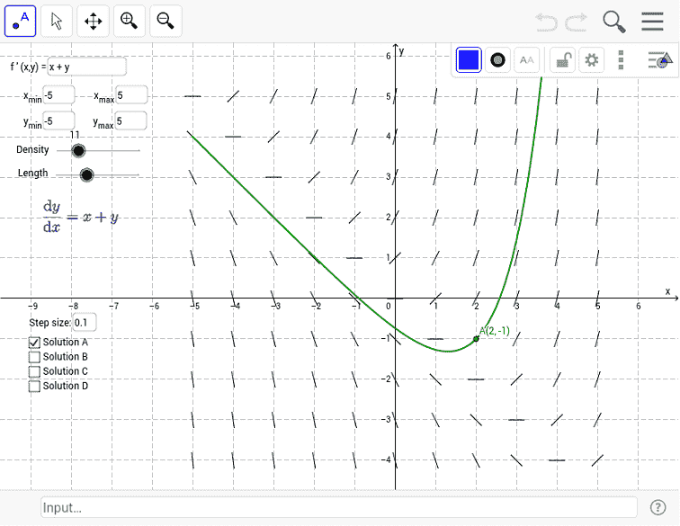

# 微分方程簡介

微分方程，就是變數為未知函數，以及未知函數的導數的方程式。物理學、化學、生物學、工程技術以及社會科學中的大量問題一但數學建模後，往往會出現微分方程。一個實際的問題只要轉化為微分方程，那麼問題的解決就有賴於對微分方程式的研究。

## 常微分方程(ordinary differential equation, ODE)

> 函數方程式$$F(x,y, y^{'},\ldots, y^{(n)})=0$$ 與自變量$$x$$，自變量的未知函數$$y=y(x)$$，以及其$$n$$階(order)的導數$$y^{(n)}$$有關，稱為常微分方程。
>
> 因為未知變數只有$$x$$，其它變數均為$$x$$的函數，因此稱為**常微分方程 (ODE)**。如果有多個變數，且未知函數也是多變數的函數，則稱為**偏微分方程(PDE)**。
>
> 線性-要滿足3個條件1.所有未知變數（函數$$y$$與其所有導函數，不含$$x$$）的冪次數為一次 2.變數間無互乘項(沒有y\*y'這種的) 3.沒有非線性函數。註：有時也可用變數替代法將方程式轉換為線性式。

### 階次(order)

* (1st ODE) $$y^′+xy=y^2$$
* (1st ODE) $$xe^(x^2 ) dx+(y^5−1)dy=0$$
* (2nd ODE) $$y^′′+2y^′+6y=\cos⁡x$$
* (2nd ODE) $$(\frac{d^3 x}{dt^3 })^2+(\frac{d^2 x}{dt^2} )^5+\frac{x}{(t^2+1)}=e^t$$

### 線性和非線性(linear and non-linear)

* &#x20;$$y'(x) + y(x) = 0$$ ，其中 $$y'(x)$$ 、$$y(x)$$ 為未知數函數，且冪次為 1 ，所以此為線性微分方程式。( $$x$$ 是自變數，非未知函數 )。
* $$\{ y'(t) + x(t) = 0 , ~x'(t) - y(t) = 0 \}$$， $$t$$ 為自變數，$$x(t)$$ 、 $$x'(t)$$ 、 $$y(t)$$ 、 $$y'(t)$$ 為未知數函數，冪次為 1 ，故此為"線性"聯立微分方程式。
* 方程式$$y''(x) - x．y'(x) + y(x) = 0$$，未知函數有 $$y''(x)$$、$$y'(x)$$、$$y(x)$$ ，所有的未知函數項冪次都為 1 ，故此為線性微分方程式。注意$$x$$ 為係數，且為變係數，所以稱此為「二階線性變係數微分方程式」。
* $$\sin(x(t)) + x''(t) = 4$$ ，未知函數 $$x(t)$$ ，出現在三角函數內，所以此為非線性微分方程式。

### ODE的解

> 若函數$$y=\psi(x)$$在區間$$J$$連續，且$$n$$階導數均存在。若將$$y=\psi(x)$$代入$$F(x,y,y^{'}, \ldots, y^{(n)})$$後可得$$F(x,\psi(x), \psi^{'}(x),\ldots, \psi^{(n)}(x))=0$$，則$$y=\psi(x)$$為此ODE的特解（particular solution, explicit solution）。
>
> 而解$$y=\psi(x, c_1, c_2,\ldots, c_n)$$包含了$$n$$個獨立的任意常數$$c_1, c_2,\ldots, c_n$$（自由度$$n$$）稱為通解（general solution）。
>
> 由解方程式的觀點，從通解得到特解必須有$$n$$個額外的初值條件（initial condition）或邊值條件（boundary condition）求常數值。

例如：

* \[線性一階ODE] $$\frac{dy}{dx}+ \frac{y}{x} =x^3, ~ x \neq 0$$。通解為$$y=\frac{c}{x}+\frac{x^4}{5}, ~ x \in (-\infty, 0) \lor (0, \infty)$$
* \[非線性一階ODE]$$\frac{dy}{dx} = 1+y^2$$。因為$$y^2$$所以為非線性。
* \[非線性二階ODE] $$y^{''}+yy^{''}=x$$。因為$$yy^{''}$$所以為非線性。
* \[線性一階 PDE] $$x \frac{\partial f}{\partial x} + y \frac{\partial f}{\partial y}+z \frac{\partial f}{\partial z}+f=0$$

就幾何意義而言，微分方程式特解的圖形稱為積分曲線(integral curve)，或解曲線(solution of curve)，其為解空間中的一條路徑。

而通解的圖形為積分曲線族(family of integral curves)，或解曲線族(family of solution curves)，為解空間由無限多個函數(路徑)形成的集合。

考慮微分方程式$$dy/dx=f(x,y)$$, 兩邊對$$x$$積分得$$y(x)=\int f(x,y)+c$$，但是我們無法用此積分求數值解，但可利用作圖方法來對$$y(x)$$做猜想。

因為$$y^′=f(x,y)$$，則在x-y平面上，通過其積分曲線上每一點$$(x,y)$$之切線斜率為$$f(x,y)$$，因此先對每一點$$(x,y)$$計算$$f(x,y)$$的值，並在該點畫出一短切線段，且切線斜率為$$f(x,y)$$，則可得許多切線段，再利用這些短切線畫出$$y^′=f(x,y)$$的方向場(direction field)或斜率場(slope field)。

