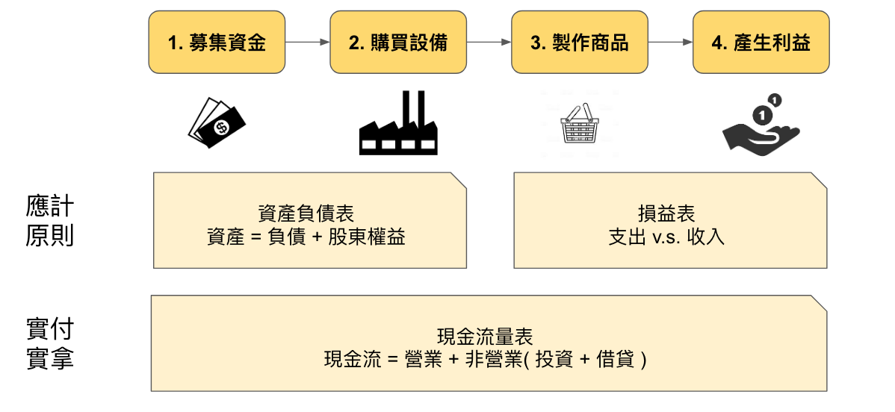
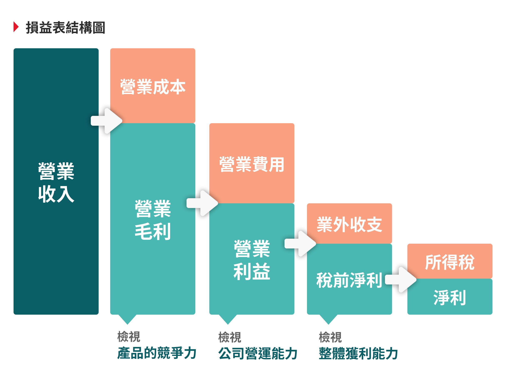

# 財務報表

## 簡介

* **資產負債表：公司的價值。**
* **綜合損益表：公司的賺錢的能力。**
* **現金流量表：公司的錢去哪。**
* **權益變動表： 公司的股東權利、獲利分配在哪。**

**損益表**告訴你公司在一段時間內賺了多少錢（經營成果）。

賺到的錢（淨利潤）會影響**股東權益變動表**中的保留盈餘，進而影響**資產負債表**中的股東權益，改變公司的「淨資產」。

**現金流量表**則解釋了公司在賺錢和進行其他活動的過程中，實際的現金是如何流動的，並最終反映在**資產負債表**的「現金」科目上。

**股東權益變動表**則詳細記錄了股東權益(股本(Share Capital)與資本公積 (Additional Paid In Capital，APIC）及保留盈餘(Retained Earnings))在期末餘額的變化來源，補足了資產負債表中股東權益部分僅呈現總額的資訊。藉由這三個項目之間的組成及變化過程，可以推估企業的營運資金來源、資源配置及資金分配、股東投資效益、歷年盈餘狀態。

<figure><figcaption>
營收與現金流量
</figcaption></figure>

## 四大報表

企業常用的財務報表如下：

**資產負債表 (Balance Sheet / Statement of Financial Position)**：

* **定義**：它反映了企業在**某個特定時間點**的財務狀況。
* **內容**：主要包含**資產 (Assets)**、**負債 (Liabilities)** 和**股東權益 (Equity)** 三大要素。
  * **資產**：企業所擁有的資源，如現金、應收帳款、存貨、廠房、設備等。
  * **負債**：企業對外所承擔的債務，如應付帳款、銀行貸款、應付費用等。
  * **股東權益**：企業所有者對企業的剩餘權利，也就是資產減去負債後的淨值。
* <mark style="color:red;">**平衡原理**</mark><mark style="color:red;">：資產 = 負債 + 股東權益</mark>。

<figure><figcaption>
資訊負債表
</figcaption></figure>

**綜合損益表 (Income Statement / Profit and Loss Statement / Statement of Comprehensive Income)**：

* **定義**：它反映了企業在**某一特定期間**（例如一個季度或一個會計年度）的經營成果和獲利能力。
* **內容**：主要包含**收入 (Revenue)** 和**費用 (Expenses)**。
  * **收入**：企業銷售商品或提供服務所獲得的總額。
  * **費用**：企業在經營過程中為獲得收入所發生的成本，如銷售成本、管理費用、研發費用等。
* **結果**：最終計算出企業的**淨利潤 (Net Income)** 或**淨虧損 (Net Loss)**。

<figure><figcaption>
綜合損益表結構
</figcaption></figure>

**現金流量表 (Statement of Cash Flows)**：

* **定義**：它反映了企業在**某一特定期間**內現金的流入和流出情況，解釋了企業現金變動的原因。
* **分類**：現金流量通常分為三類活動：
  * **營業活動現金流量 (Operating Activities)**：來自企業日常經營活動的現金流入和流出，如銷售商品收款、支付員工薪資、支付供應商貨款等。
  * **投資活動現金流量 (Investing Activities)**：來自企業投資活動的現金流入和流出，如購買或出售固定資產、投資其他公司股票等。
  * **籌資活動現金流量 (Financing Activities)**：來自企業籌集資金或償還債務活動的現金流入和流出，如發行股票、借入或償還貸款、支付股利等。
* **意義**：現金流量表是評估企業短期償債能力和財務彈性的重要依據，因為它顯示了企業實際有多少現金可以用來支付開銷和進行投資。

**股東權益變動表 (Statement of Changes in Equity / Statement of Retained Earnings)**：

* **定義**：它說明了在**某一特定期間**內股東權益各組成部分（如股本、資本公積、保留盈餘等）的變動情況。
* **意義**：這張報表有助於了解企業如何分配利潤（例如派發股利）以及股東權益的其他變化。

## 分析順序

### 1.綜合損益表 (Income Statement)

**為什麼先看？** <mark style="color:red;">綜合損益表是了解企業在一段時間內</mark><mark style="color:red;">**經營表現**</mark><mark style="color:red;">的起點。它告訴你公司是賺錢還是虧損，以及收入和費用的構成。這是最直接反映公司</mark><mark style="color:red;">**盈利能力**</mark><mark style="color:red;">的報表</mark>。

**主要關注點：**

* **營收成長：** 銷售額是否有增長？增長速度如何？
* **毛利率：** 產品或服務的獲利能力如何？
* **營業費用：** 企業在銷售、管理和研發上的開銷是否有效控制？
* **淨利潤：** 公司最終賺了多少錢？利潤率如何？
* **獲利趨勢：** 隨著時間推移，公司的盈利能力是改善還是惡化？

***

### 2. 現金流量表 (Statement of Cash Flows)

**為什麼接著看？** <mark style="color:red;">損益表雖然顯示了利潤，但「利潤不等於現金」。一個公司可能在帳面上盈利，但實際現金流卻非常緊張。現金流量表揭示了公司實際的</mark><mark style="color:red;">**現金流入和流出**</mark>，彌補了損益表權責發生制的不足，是評估公司**償債能力**和**營運健康度**的關鍵。

**主要關注點：**

* **營業活動現金流量：** 核心業務是否能產生足夠的現金？這是最重要的部分。穩定的正向營業現金流是企業健康的標誌。
* **投資活動現金流量：** 公司是投入資金擴張還是出售資產？這反映了公司的投資策略。
* **籌資活動現金流量：** 公司如何取得資金（發行股票、借款）和如何償還資金（還債、發放股利）？
* **淨現金變動：** 公司整體的現金是增加還是減少？

***

### 3. 資產負債表 (Balance Sheet)

**為什麼接著看？** 在了解了公司的盈利能力和現金流量之後，<mark style="color:red;">資產負債表提供了在</mark><mark style="color:red;">**特定時間點**</mark><mark style="color:red;">公司的</mark><mark style="color:red;">**財務狀況快照**</mark><mark style="color:red;">。它綜合了公司經營活動的累積結果，揭示了公司擁有什麼（資產）、欠了什麼（負債）以及股東擁有的權益</mark>。

**主要關注點：**

* **資產結構：** 流動資產和非流動資產的比例如何？現金、應收帳款、存貨等科目是否合理？
* **負債結構：** 短期負債和長期負債的比例如何？公司是否有過度依賴借款？
* **償債能力：** 流動比率、速動比率等指標來評估短期償債能力；負債權益比等指標來評估長期償債能力。
* **股東權益：** 股東權益的規模和組成，反映了公司的淨資產和所有者的權益。

***

### 4. 股東權益變動表 (Statement of Changes in Equity)

**為什麼最後看？** 這張報表雖然不如前三張核心，但它提供了資產負債表中**股東權益科目**的詳細變動過程。它解釋了在分析期間內，股東權益總額是如何從期初變動到期末的，包括淨利潤的轉入、股利的發放、新股發行或庫藏股買回等。

**主要關注點：**

* **利潤分配政策：** 公司是否將大部分利潤保留用於再投資，還是大部分作為股利發放？
* **資本結構變化：** 是否有增資或減資行為？
* **股東權益總額的細項變動：** 更詳細地了解各個權益科目的變化。

***

### 總結分析流程

1. **「經營成果」：** 先看**損益表**，了解公司賺錢能力如何。
2. **「現金流動」：** 接著看**現金流量表**，確認公司的現金是否充裕，以及現金是如何流動的。
3. **「財務體質」：** 再看**資產負債表**，綜合前兩者資訊，評估公司的財務結構和健康狀況。
4. **「股東權益細節」：** 最後看**股東權益變動表**，補充了解股東權益的詳細變化。

## 報表間的關聯

### **損益表與資產負債表 (Income Statement & Balance Sheet)**

**連接點：淨利潤/淨虧損**

損益表計算出來的**淨利潤 (Net Income)** 或**淨虧損 (Net Loss)**，會直接影響資產負債表中的**股東權益**部分。

具體來說，淨利潤會增加股東權益下的「保留盈餘 (Retained Earnings)」，而淨虧損則會減少保留盈餘。

保留盈餘是公司歷年累積的利潤中，未分配給股東（例如作為股利）的部分，它最終會成為資產負債表上股東權益的一部分。

簡而言之，<mark style="color:red;">損益表告訴你公司在一段時間內賺了多少錢，而這些錢（或虧損）最終會累積到資產負債表的股東權益中，影響公司的淨資產</mark>。

### **資產負債表與現金流量表 (Balance Sheet & Statement of Cash Flows)**

**連接點：現金及約當現金餘額**

現金流量表的期末**現金及約當現金餘額**，會與資產負債表上**現金及約當現金**這個科目保持一致。

<mark style="color:red;">現金流量表詳細解釋了資產負債表上「現金」這個科目是如何從期初餘額變動到期末餘額的</mark>。它分解了這些現金變動是來自於經營活動、投資活動還是籌資活動。

此外，資產負債表上許多非現金科目的變動（如應收帳款、應付帳款、存貨、固定資產、長期負債等），都會在現金流量表中的「營業活動」和「投資活動」中反映，以調整淨利潤為實際現金流量。例如，應收帳款增加表示雖然有收入，但現金還沒收到，這會減少營業活動的現金流量；購買固定資產會減少投資活動的現金流量。

### **損益表與現金流量表 (Income Statement & Statement of Cash Flows)**

**連接點：淨利潤/淨虧損 (非現金項目調整)**

現金流量表的「營業活動現金流量」通常以損益表的**淨利潤**為起點，然後對其進行調整，以剔除那些不涉及現金收付的會計處理（如折舊、攤銷、應收帳款和應付帳款的變動等）。

這是因為損益表是基於**權責發生制 (Accrual Basis Accounting)** 編製的，記錄收入和費用發生時，而不論現金是否收付；而現金流量表則是基於**現金收付制 (Cash Basis Accounting)**，只記錄實際的現金流動。

因此，現金流量表補充了損益表的不足，避免了公司雖然有盈利卻沒有足夠現金流動的「紙面富貴」或「倒閉風險」。

### **股東權益變動表與資產負債表 (Statement of Changes in Equity & Balance Sheet)**

**連接點：股東權益總額**

股東權益變動表的期末**股東權益總額**，會與資產負債表上的**股東權益**總額保持一致。

股東權益變動表詳細解釋了資產負債表上股東權益各組成部分（如股本、資本公積、保留盈餘等）在一段時間內的具體變動原因，包括淨利潤的轉入、股利的發放、新股發行、庫藏股交易等。

## 參考資料

* [https://stichtofree.com/%E3%80%90%E7%90%86%E8%B2%A1%E7%9F%A5%E8%AD%98%E3%80%91%E7%B6%9C%E5%90%88%E6%90%8D%E7%9B%8A%E8%A1%A8statement-of-comprehensive-income/](https://stichtofree.com/%E3%80%90%E7%90%86%E8%B2%A1%E7%9F%A5%E8%AD%98%E3%80%91%E7%B6%9C%E5%90%88%E6%90%8D%E7%9B%8A%E8%A1%A8statement-of-comprehensive-income/)
* [https://stichtofree.com/%e3%80%90%e7%90%86%e8%b2%a1%e7%9f%a5%e8%ad%98%e3%80%91%e6%ac%8a%e7%9b%8a%e8%ae%8a%e5%8b%95%e8%a1%a8statement-of-changes-in-equity/](https://stichtofree.com/%E3%80%90%E7%90%86%E8%B2%A1%E7%9F%A5%E8%AD%98%E3%80%91%E6%AC%8A%E7%9B%8A%E8%AE%8A%E5%8B%95%E8%A1%A8statement-of-changes-in-equity/)
