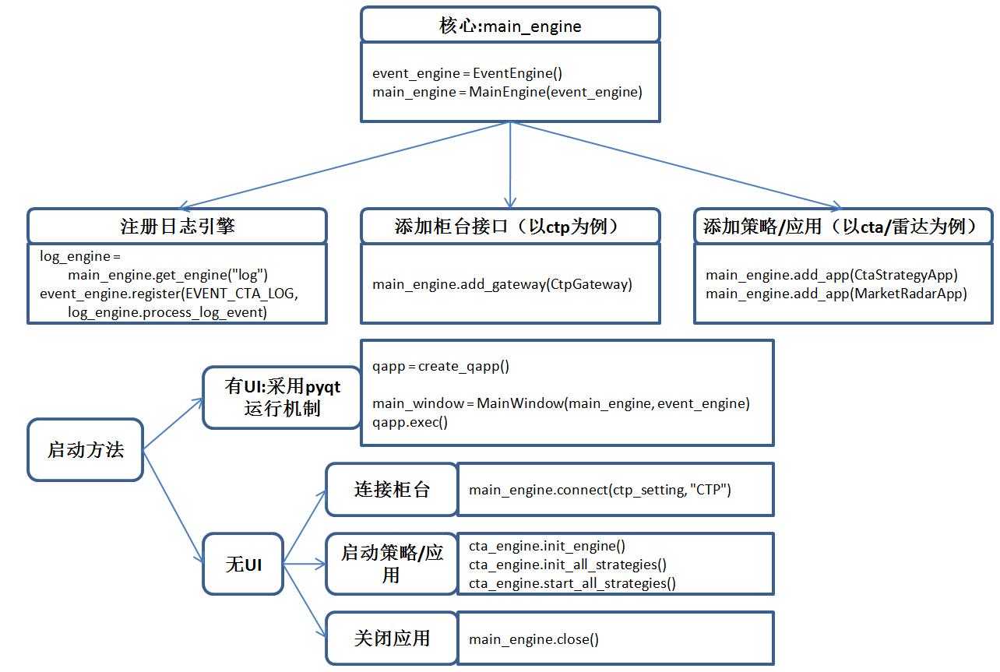

# vnpy

* [2025年VeighNa項目計畫](https://mp.weixin.qq.com/s?__biz=MzI1MTQ2Njc5OQ==\&mid=2247490070\&idx=1\&sn=bcb543cc5b4818ca69cf4f06478ede76\&scene=21\&poc_token=HJwXUWij06gy_Pbat-qJzjA7gcD_xq1EHAW20a7G)。
* [2024年VeighNa項目計畫](https://mp.weixin.qq.com/s?__biz=MzI1MTQ2Njc5OQ==\&mid=2247489708\&idx=1\&sn=9df80340e4b593d0afde37d07193fa2b\&scene=21#wechat_redirect)。
* [VeighNa量化社區](https://www.vnpy.com/portal/)。
* [\[官網\] vnpy教學](http://www.vnpy.org/pages/tutorial.html)。

<figure><figcaption>
vnpy啟動流程[from VeighNa量化社區, 2021]
</figcaption></figure>

vn.py所有的交易應用中：

* 最核心的就是main\_engine。
* 外掛部分包括交易介面的gateway和策略應用的app
* 無論UI模式，還是NO UI中的指令碼啟用，本質都是通過不同方法在呼叫main\_engine提供的各種函數方法去執行對映的功能。
