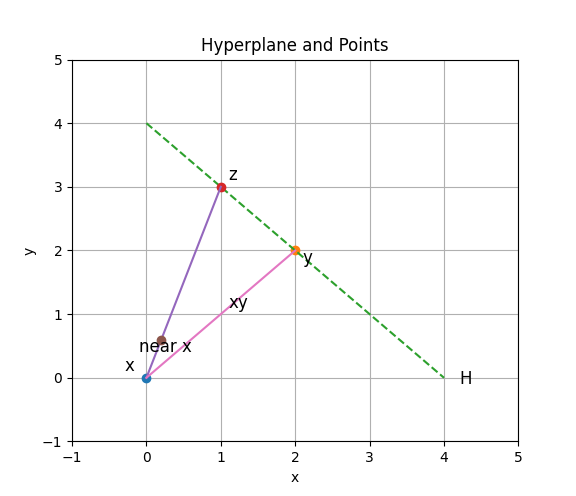

# Blackwell's Approachability Theorem

## 簡介

對抗性預測的歷史始於數學家David Blackwell和James Hannan的開創性工作。接近性理論起源於Blackwell的工作，並與Hannan的工作同時被發現。 幾十年來，人們對一般凸賽局中的遺憾最小化和Blackwell可接近性之間的關係並不完全瞭解。事實上Blackwell可接近性是一個更強的概念。<mark style="color:red;">我們表明可接近性和線上凸最佳化在強烈的意義上是等價的：兩者的演算法是等價的，而且沒有計算效率的損失</mark>。

賽局的回報函數採取向量的形式，其元素代表不同的目標值，如報酬、風險等。具有不相同標準的賽局被稱為多標準賽局或具有向量回報函數的賽局。單一目標最佳化問題的最優解，即最大解或最小解，是在實數上，因此很容易找出來。這一重要特徵對於確定向量最佳化問題的最優解是無效的，主要是因為向量空間中的次序一般是部分次序(partial order)而不是全序(total order)。因此Von-Neumann的最大最小化定理不能直接適用於向量回報賽局。

<mark style="background-color:red;">Blackwell首次研究了具有向量回報函數的零和賽局，他提供了雙人零和重覆賽局的可接近性定理</mark>。Shapley和Rigby介紹了向量賽局的均衡點的概念，他們提到賽局的報酬函數大多是向量值函數的形式。

<mark style="color:red;">內部或外部遺憾最小化問題的一個共同特點是，它們可以被寫成某些向量回報賽局中精心選擇的目標集的可接近性的一個具體案例</mark>。

## 最小最大理論(Minmax theorem)

> 給定<mark style="color:blue;">單期</mark>雙人零和賽局，玩家1,2的行動集合分別有$$r,s$$個(有限個)行動，記行動集$$\mathcal{A}_1=\{1,2,\dots, r\}$$，$$\mathcal{A}_2={1,2,\dots, s}$$。
>
> * 玩家1(玩家)的混合策略為$$\displaystyle \mathbf{p}=(p_1, p_2, \dots, p_r) \in \Delta(\mathcal{A}_1), \Delta(\mathcal{A}_1)=\left\{ \mathbf{p} \in \mathbb{R}_{+}^r~|~ \sum_{i=1}^r p_i = 1\right\}$$。
> * 玩家2(對手或環境)的混合策略為$$\displaystyle \mathbf{q}=(p_1, p_2, \dots, p_r) \in \Delta(\mathcal{A}_2), \Delta(\mathcal{A}_2)=\left\{ \mathbf{q} \in \mathbb{R}_{+}^r~|~ \sum_{i=1}^s q_i = 1\right\}$$。
> * $$m(i,j) \in \mathbb{R}$$為玩家1,2分別採取實際行動$$i,j$$時，玩家1的回報\[越高越好]\(payoff)(零和遊戲，所以玩家2的回報為$$-m(i,j)$$)。
>
> 則存在$$\mathbf{p} \in \Delta(\mathcal{A}_1), ~ \mathbf{q} \in \Delta(\mathcal{A}_2), ~ v \in \mathbb{R}$$ 滿足$$\displaystyle \sum_{i=1}^r p_i m(i, j) \geq v \geq \sum_{j=1}^s q_j m(i,j), ~ \forall i, j$$。
>
> * 玩家1存在混合策略$$\mathbf{p}$$可保證回報大於等於$$v$$，不論對手使用任意策略。($$v$$表示玩家在面對對手的最優反應時，能保證的最小回報。所以玩家目標是最大化最小回報。)
> * 玩家2也存在混合策略$$\mathbf{q}$$可保證損失不會超過$$v$$，不論對手使用任意策略。($$v$$表示對手在面對玩家的最優反應時，能保證的最大損失。所以對手目標是最小化最大損失。)
> * 因此$$v$$稱為此<mark style="background-color:red;">賽局的回報</mark>。

$$\forall \epsilon > 0$$，在多期雙人零和賽局(報酬矩陣為$$M$$), 當$$t \rightarrow \infty$$，玩家的報酬會以機率1大於$$v-\epsilon$$，而對手的損失會以機率1小於$$v+\epsilon$$。

### 範例

玩家1有三個行動$$\mathcal{A}_1=(r_1, r_2, r_3)$$個別行動採用的機率為$$\mathbf{p}=(p_1, p_2, p_3)$$；玩家2有兩個行動$$\mathcal{A}_2=(s_1, s_2)$$個別行動採用的機率為$$\mathbf{q}=(q_1, q_2)$$。

<mark style="color:red;">雙人零和賽局並不一定有</mark><mark style="color:red;">**鞍點（saddle point）**</mark><mark style="color:red;">，但一定有</mark><mark style="color:red;">**混合策略的均衡解**</mark><mark style="color:red;">，這是由</mark> <mark style="color:red;"></mark><mark style="color:red;">**Minimax 定理**</mark> <mark style="color:red;"></mark><mark style="color:red;">保證的</mark>。

### 有鞍點範例(使用單純策略即可)

<table><thead><tr><th>R\S</th><th>s1</th><th>s2</th><th width="100">min M</th></tr></thead><tbody><tr><td><span class="math">r_1</span></td><td><span class="math">m(1,1)=-1</span></td><td><span class="math">m(1,2)=9</span></td><td>-1</td></tr><tr><td><span class="math">r_2</span></td><td><span class="math">m(2,1)=-3</span></td><td><span class="math">m(2,2)=5</span></td><td>-3</td></tr><tr><td><span class="math">r_3</span></td><td><span class="math">m(3,1)=-5</span></td><td><span class="math">m(3,2)=8</span></td><td>-5</td></tr><tr><td>max M</td><td>-1</td><td>9</td><td>minmax: -1</td></tr></tbody></table>

玩家採取行動$$r_1$$時，不論對手採取任何行動，可得到的最小回報為-1。同樣採取行動$$r_2, r_3$$時，分別可得到最高回報為$$-3,-5$$。玩家希望在這些「最差情況」中選擇最好的策略。這就是 maximin 策略，因此會選行動$$r_1$$報酬$$\max(-1,-3,-5)=-1$$。

對手採取行動$$s_1,s_2$$時，不論玩家採取任何行動，最大損失分別為$$-1, 9$$。因此對手希望在這些「最差情況」中選擇最好的策略，最大損失為$$\min(-1,9)=-1$$。

<mark style="color:blue;">多期(重複)賽局時，玩家存在策略可保證平均報酬不會低於-1；同理而對手存在策略可保證平均損失不會大於-1</mark>。

賽局價值為-1，可得對於玩家而且，集合$$S=\{x \geq t\}, ~ t \leq -1$$都是可接近集合，集合$$T=\{x \geq t\}, ~ t > -1$$都是可排除集合。

使用線性規劃求解：

$$\begin{aligned} \max \quad & v \\ \text{s.t.}  \\   & - p_1 -3 p_2 -5 p3 \geq v, \\   & 9 p_1 + 5 p_2 + 8 p_3 \geq v, \\   & p_1 + p_2 +p_3 = 1, \\   & p_1, p_2, p_3 \geq 0 \end{aligned}$$

<details>

<summary>python</summary>

```python
from ortools.linear_solver import pywraplp

# 創建求解器
solver = pywraplp.Solver.CreateSolver('GLOP')  
# 使用 GLOP 求解器（Google 的線性規劃求解器）

if not solver:
    print("求解器不可用")
    exit()

# 定義變數
p1 = solver.NumVar(0, 1, 'p1')  # p1 >= 0
p2 = solver.NumVar(0, 1, 'p2')  # p2 >= 0
p3 = solver.NumVar(0, 1, 'p3')  # p3 >= 0
v = solver.NumVar(-solver.infinity(), solver.infinity(), 'v')  
# v 是自由變數

# 添加約束條件
solver.Add(-1 * p1 - 3 * p2 - 5 * p3 >= v)  # 第一個約束
solver.Add(9 * p1 + 5 * p2 + 8 * p3 >= v)   # 第二個約束
solver.Add(p1 + p2 + p3 == 1)               # 概率總和為 1

# 設定目標函數：最大化 v
solver.Maximize(v)

# 求解
status = solver.Solve()

# 輸出結果
if status == pywraplp.Solver.OPTIMAL:
    print("找到最佳解:")
    print(f"p1 = {p1.solution_value():.6f}")
    print(f"p2 = {p2.solution_value():.6f}")
    print(f"p3 = {p3.solution_value():.6f}")
    print(f"v (博弈值) = {v.solution_value():.6f}")
else:
    print("未找到最佳解")
    
/*
找到最佳解:
p1 = 1.000000
p2 = 0.000000
p3 = 0.000000
v (博弈值) = -1.000000
*/
```

</details>

### 無鞍點範例(改為混合策略即可)

<table><thead><tr><th>R\S</th><th>s1</th><th>s2</th><th width="100">min M</th></tr></thead><tbody><tr><td><span class="math">r_1</span></td><td><span class="math">m(1,1)=3</span></td><td><span class="math">m(1,2)=-1</span></td><td>-1</td></tr><tr><td><span class="math">r_2</span></td><td><span class="math">m(2,1)=2</span></td><td><span class="math">m(2,2)=1</span></td><td>1</td></tr><tr><td><span class="math">r_3</span></td><td><span class="math">m(3,1)=0</span></td><td><span class="math">m(3,2)=4</span></td><td>0</td></tr><tr><td>max M</td><td>3</td><td>4</td><td></td></tr></tbody></table>

玩家最佳解：$$\mathbf{p}=(0, 0.8, 0.2)$$，對手最佳解：$$\mathbf{q}=(0.6, 0.4)$$。

使用線性規劃求解：

| 玩家                                                                                                                                                                                         | 對手                                                                                                                                                                                                |
| ------------------------------------------------------------------------------------------------------------------------------------------------------------------------------------------ | ------------------------------------------------------------------------------------------------------------------------------------------------------------------------------------------------- |
| $$\begin{aligned} \max \quad & v \\ \text{s.t.}  \\ & \sum_{i=1}^r p_i m(i,j) \geq v,~\forall j \\ & \sum_{i=1}^r p_i = 1, \\ & p_i \geq 0, ~ \forall i \end{aligned}$$                    | $$\begin{aligned} \min \quad & v \\ \text{s.t.}  \\ & \sum_{j=1}^s q_i m(i,j) \leq v,~\forall i \\ & \sum_{j=1}^s q_j = 1, \\ & q_j \geq 0, ~ \forall j \end{aligned}$$                           |
| $$\begin{aligned} \max \quad & v \\ \text{s.t.}  \\  & 3 p_1 + 2 p_2 + 0 p3 \geq v, \\  & -p1 + 1 p_2 + 4 p_3 \geq v, \\  & p_1 + p_2 +p_3 = 1, \\  & p_1, p_2, p_3 \geq 0 \end{aligned}$$ | $$\begin{aligned} \min \quad & v \\  \text{s.t.}  \\   & 3 q_1 - q_2  \leq v, \\   & 2 q_1 + q_2 \leq v \\   & 0 q_1 + 4 q_2 \leq v \\   & q_1 + q_2 = 1, \\   & q_1, q_2 \geq 0  \end{aligned}$$ |

<details>

<summary>python</summary>

```python
# 玩家
from ortools.linear_solver import pywraplp

# 創建求解器
solver = pywraplp.Solver.CreateSolver('GLOP')  
# 使用 GLOP 求解器（Google 的線性規劃求解器）

if not solver:
    print("求解器不可用")
    exit()

# 定義變數
p1 = solver.NumVar(0, 1, 'p1')  # p1 >= 0
p2 = solver.NumVar(0, 1, 'p2')  # p2 >= 0
p3 = solver.NumVar(0, 1, 'p3')  # p3 >= 0
v = solver.NumVar(-solver.infinity(), solver.infinity(), 'v')  
# v 是自由變數

# 添加約束條件
solver.Add(3 * p1 + 2 * p2 + 0 * p3 >= v)  # 第一個約束
solver.Add(-1 * p1 + 1 * p2 + 4 * p3 >= v)  # 第二個約束
solver.Add(p1 + p2 + p3 == 1)  # 機率總和為 1

# 設定目標函數：最大化 v
solver.Maximize(v)

# 求解
status = solver.Solve()

# 輸出結果
if status == pywraplp.Solver.OPTIMAL:
    print("找到最佳解:")
    print(f"p1 = {p1.solution_value():.6f}")
    print(f"p2 = {p2.solution_value():.6f}")
    print(f"p3 = {p3.solution_value():.6f}")
    print(f"v (博弈值) = {v.solution_value():.6f}")
else:
    print("未找到最佳解")
    
/*    
找到最佳解:
p1 = 0.000000
p2 = 0.800000
p3 = 0.200000
v (博弈值) = 1.600000
*/
```

```python
# 對手
from ortools.linear_solver import pywraplp

# 創建求解器
solver = pywraplp.Solver.CreateSolver('GLOP')  
# 使用 GLOP 求解器（Google 的線性規劃求解器）

if not solver:
    print("求解器不可用")
    exit()

# 定義變數
q1 = solver.NumVar(0, 1, 'q1')  # q1 >= 0
q2 = solver.NumVar(0, 1, 'q2')  # q2 >= 0
v = solver.NumVar(-solver.infinity(), solver.infinity(), 'v')  
# v 是自由變數

# 添加約束條件
solver.Add(3 * q1 - q2 <= v)  # 第一個約束
solver.Add(2 * q1 + q2 <= v)  # 第二個約束
solver.Add(0 * q1 + 4 * q2 <= v)  # 第三個約束
solver.Add(q1 + q2 == 1)  # 機率總和為 1

# 設定目標函數：最小化 v
solver.Minimize(v)

# 求解
status = solver.Solve()

# 輸出結果
if status == pywraplp.Solver.OPTIMAL:
    print("找到最佳解:")
    print(f"q1 = {q1.solution_value():.6f}")
    print(f"q2 = {q2.solution_value():.6f}")
    print(f"v (博弈值) = {v.solution_value():.6f}")
else:
    print("未找到最佳解")
/*
找到最佳解:
q1 = 0.600000
q2 = 0.400000
v (博弈值) = 1.600000
*/
```

</details>

## 向量報酬的賽局(Blackwell, 1956)

<mark style="color:blue;">單期的混合策略不能確保向量回報</mark>$$m(i,j) \in \mathbb{R}^N$$<mark style="color:blue;">位於某個給定的集合中。然而，如果我們允許無限期的賽局時，並詢問是否存在一種策略來確保平均回報向量位於某個集合中，或者至少在歐氏距離上接近它。這正是Blackwell提出的解決方案概念</mark>。

在實數回報中的雙人零和賽局，玩家與對手可依最小最大定理逼近賽局的回報$$v$$。<mark style="color:red;">而在向量回報中，問題變成玩家與對手是否可逼近一個特定集合</mark>$$S$$(分一般集合與凸集合兩種情形討論。因為平均回報位於集合的邊界時距離為0，因此只考慮閉集合即可)。

### 向量回報矩陣

現在考慮雙人向量(不一定為零和)賽局有限個行動中，$$m(i,j) \in \mathbb{R}^N$$為向量回報的情形。報酬矩陣$$\mathbf{M}=[m(i,j)], ~ i \in \mathcal{A}_1 \equiv \{1,2,\dots, r\}, ~ j \in \mathcal{A}_2 \equiv \{1,2,\dots, s\}$$為$$r\times s$$的矩陣，矩陣中每個元素為$$N$$維的向量(<mark style="color:blue;">Blackwell論文中定義的是更一般化的形式，即每個元素</mark>$$m(i,j)$$<mark style="color:blue;">是(離散或連續)機率分佈，其定義域為一個封閉有界凸集</mark>$$X \in \mathbb{R}^N$$，值域為實數區間$$[0,1]$$<mark style="color:blue;">，因此當玩家與對手在時間</mark>$$t$$<mark style="color:blue;">採取行動</mark>$$i,j$$<mark style="color:blue;">時得到的報酬</mark>$$m(i,j)$$<mark style="color:blue;">是由分佈</mark>$$m(i,j)$$<mark style="color:blue;">所決定的隨機向量</mark>$$x_t \in \mathbb{R}^N$$。所有的行動對$$(i,j)$$得到的回報都是在$$X$$中的某一點，只是相異行動對的機率分佈$$m(i,j)$$不相同)。

論文中考慮的是每一個機率分佈$$m(i,j)$$的期望值$$\overline{m}(i,j)$$，表示多次決策後，行動對$$(i,j)$$的回報會趨近於$$\overline{m}(i,j)$$，則回報矩陣$$\overline{M}$$含$$r\times s$$個向量點。

### 混合策略序列

玩家使用混合策略序列$$f_{0:n} \equiv \{f_0, f_1(x_1), \dots, f_n(x_1, \dots, x_n)\}, ~f_n: (x_1, x_2, \dots, x_n) \rightarrow \Delta(\mathcal{A_1}), ~x_i \in X$$，其中$$(x_1,x_2,\dots, x_n)$$為到第$$n$$期時已觀察到的回報(根據$$m(i,j)$$機率分佈選擇行動的實現值)(history)。

* 註：此處在第$$n$$期決策時，參考的是過去的所有資料(包含當期)，而不是Markov性質只參考前一期的資料。
* 混合策略是機率分佈，在實際決定行動時時，是依機率隨機取一行動，經過一段時間後所採取的行動經驗分佈會接近於混合策略的機率分佈。

而$$f_0$$因為沒有參考資料，所以為$$\Delta(\mathcal{A}_1)$$中的任意分佈$$\mathbf{p}=(p_1,\dots,p_r) \in \mathbb{R}_{+}^r, ~\sum_{i=1}^r p_i=1$$，玩家的混合策略序列為$$f_{0:n} \equiv \{f_0, f_1(\mathbf{x}_1), f_2(\mathbf{x}_1, \mathbf{x}_2),f_3(\mathbf{x}_1, \mathbf{x}_2, \mathbf{x}_3) , \dots \}$$。

同理對手的的混合策略序列為$$g_{0:n} \equiv \{g_0, g_1(\mathbf{x}_1), g_2(\mathbf{x}_1, \mathbf{x}_2),g_3(\mathbf{x}_1, \mathbf{x}_2, \mathbf{x}_3) , \dots \}$$

* 在初始$$n=0$$時，玩家與對手分別依混合策略$$f_0,g_0$$採取行動$$i_0,j_0$$，依回報機率分佈$$m(i_0,j_0)$$得到回報實現值$$x_1$$。
* 之後玩家與對手分別依混合策略$$f_1(x_1), g_1(x_1)$$採取行動$$i_1, j_1$$，依回報機率分佈$$m(i_1, j_1)$$得到回報實現值$$x_2$$。
* 之後玩家與對手分別依混合策略$$f_2(x_1,x_2), g_2(x_1,x_2)$$採取行動$$i_2, j_2$$，依回報機率分佈$$m(i_2, j_2)$$得到回報實現值$$x_3$$，以此類推。

<mark style="background-color:red;">因此玩家與對手的混合策略</mark>$$(f,g)$$<mark style="background-color:red;">對序列以及回報的機率分佈矩陣</mark>$$M$$<mark style="background-color:red;">​可決定向量回報隨機變數序列</mark>$$x_1, x_2, \dots$$。

令$$S \subseteq \mathbb{R}^N$$為任意集合，$$\delta_n = d(\overline{x}_n, S)$$是平均向量回報$$\overline{x}_n = \sum_{i=1}^n x_i/n$$至集合$$S$$​的距離。依定義$$S \subseteq X$$才有意義(因為$$X$$中任意向量的均值必定還是在$$X$$中，所以討論$$X^c$$集合沒有意義)。

### 可接近集合(approachable)

定義$$S$$​為使用在回報矩陣$$M$$中以玩家策略$$f^{*} \equiv f^{*}_{0:n}$$的<mark style="color:red;">可接近集合(approachable)</mark>若：

$$\forall \epsilon > 0~ \exists n_0 \in \mathbb{N} \ni$$$$\forall g ~ ,\mathrm{P}(\delta_n \geq \epsilon  \text{ for some } n \geq n_0 ) < \epsilon$$

* $$x_1,x_2, \dots, x_n$$​是由特定的玩家策略$$f^{*}$$與任意對手策略$$g \equiv g_{0:n}$$​所得到。
* 即只要輪數$$n$$夠多，不論對手使用任意策略$$g$$​，平均回報向量與集合的距離機率收斂至0。
* 在$$n \geq n_0$$後，雖然有些時候$$\delta_n \geq \epsilon$$，但發生機率小於$$\epsilon$$趨近於0。

### 可排除集合(excludable)

稱$$S$$​為使用在回報矩陣$$M$$​中以對手特定策略$$g^{*}$$的<mark style="color:red;">可排除集合(excludable)</mark>若：

$$\exists d >0 \ni \forall \epsilon > 0, ~ n_0 \in \mathbb{N} \ni \forall f, ~\mathrm{P}(\delta_n \geq d ~ \forall n \geq n_0) > 1- \epsilon$$

* $$x_1, x_2,\dots, x_n$$​是玩家任意策略$$f_{0:n}$$​與對手特定策略$$g^{*}\equiv g^{*}_{0:n}$$所得到。
* 只要輪數$$n$$​夠多，不論玩家使用任意策略$$f$$​，對手可用特定策略$$g^{*}$$使得平均回報至集合的距離無法機率收斂。
* 在$$n \geq n_0$$後，偶爾會出現$$\delta_n <d$$，但幾乎都是$$\delta_n \geq d$$。

### 實數賽局的可接近/可排除集合

Minimax定理($$N=1$$)以上述形式可改寫為：賽局價值$$v \in \mathbb{R}$$​，玩家與對手的混合策略$$p \in \Delta(\mathcal{A}_1),~ q \in \Delta(\mathcal{A}_2)$$，則

* 集合$$S=\{ x \geq t \}$$為可接近集合 $$\forall t \leq v$$且$$f:f_n\equiv p$$​ (固定混合策略$$p$$)。
* 當$$t > v$$且$$g: g_n \equiv q$$​時，$$S$$​為可排除集合。
* $$v$$ 的意義： 表示玩家在面對對手的最優反應時，能保證的最小回報。&#x20;
* $$v^{'}$$ 的意義： 表示對手在面對玩家的最優反應時，能迫使回報(損失)不超過的最
* 值。
* 可逼近：表示玩家可以通過選擇適當的策略，使遊戲的平均回報無限接近集合$$𝑆$$中的點。
* 可排除： 表示對手可以通過策略，使平均回報保持遠離集合$$𝑆$$。

### 直觀引理

由定義知<mark style="color:red;">可接近集合的超集合必為可接近集合(</mark><mark style="background-color:red;">若</mark>$$S$$<mark style="background-color:red;">為可接近，且</mark>$$S \subseteq Q$$<mark style="background-color:red;">，則</mark>$$Q$$<mark style="background-color:red;">為可接近集。</mark><mark style="color:red;">因為當</mark>$$\delta_n = d(\overline{x}_n, S)=0$$，可得$$d(\overline{x}_n, Q)=0$$)<mark style="color:red;">，且可排除集合的子集合仍為可排除集合(若</mark>$$S$$為可排除集合，且$$T \subseteq S$$，則$$T$$為可排除集合。因為$$\delta_n = d(\overline{x}_n, S) > d)$$，可得$$d(\overline{x}_, T)>d$$<mark style="color:red;">)</mark>。

不存在同時為可接近且為可排除的集合(因為$$\delta_n$$只能等於0或大於0)。所以任意可接近集合$$S$$與可排除集合$$T$$的交集必為空集合，但是兩者並不是宇集合的分割(只有實數上可分割為可接近或可排除集合)。

由定義可知可接近(可排除)集合$$S$$的閉包$$\overline{S}$$也是可接近(可排除)集合(因為$$d(\overline{x}_n, S)=d(\overline{x}_n, \overline{S})$$)，反之亦然，<mark style="color:red;">因此令</mark>$$S$$<mark style="color:red;">為閉集合</mark>。

若閉集合$$S$$​是回報矩陣$$M^\top$$的可接近集合(表示對手存在策略$$q^{*}$$，不論玩家使用任意策略$$f$$均可使回報接近$$S$$)，則任何閉集合$$T$$​且與$$S$$​之交集為空時(假設$$T$$為在對手使用策略$$q_0$$時，玩家使用任意策略形成的回報閉包，且$$T \cap S=\emptyset$$，此時只要對手一直使用$$q_0$$，則玩家永遠無法把平均回報往$$S$$前進，因此$$S$$對玩家是可排除集)，在報酬矩陣$$M$$​中為可排除集合，並且可以使用使$$S$$ 在$$M^\top$$ 中可接近的任意策略來實現這一點。

idea: $$M$$為玩家的回報矩陣，因為是零和賽局，所以對手的回報矩陣是$$-M$$而不是$$M^\top$$。因此$$M^{\top}$$應解釋為在決策時從對手的角度來看的玩家回報；

### 可接近性的充份條件(sufficient condition)

#### 主要性質

$$x,y \in \mathbb{R}^N$$為相異兩點，而$$H$$為通過$$y$$且正交於線段$$xy$$的超平面，$$z \in \mathbb{R}^N$$為$$H$$上的任意點或者為$$x$$相對於$$H$$在另一側的任意點，那麼所有位於線段$$xz$$ 內部且充分接近 $$x$$ 的點都比 $$x$$ 更接近 $$y$$(由三角不等式得出)。此為<mark style="color:red;">可接近集的充分條件</mark>。

註：$$x$$為平均回報，$$H$$為目標集合上任意點的切平面，如果玩家選定行為的下一期回報$$z$$滿足上述性質，則可保證新的平均回報往可接近集前進。



<figure><figcaption><p>可接近性的充分條件</p></figcaption></figure>



```python
import matplotlib.pyplot as plt
import numpy as np

# 定義點 x 和 y
x = np.array([0, 0])
y = np.array([2, 2])

# 定義超平面 H
a = y[0] - x[0]
b = y[1] - x[1]
c = a * y[0] + b * y[1]

# 繪製點 x 和 y，並標記在旁邊，避免重疊
plt.plot(x[0], x[1], 'o')
plt.text(x[0] - 0.3, x[1] + 0.1, 'x', fontsize=12)  # 調整位置
plt.plot(y[0], y[1], 'o')
plt.text(y[0] + 0.1, y[1] - 0.2, 'y', fontsize=12)  # 調整位置

# 繪製超平面 H
x_h = np.array([y[0] - b, y[0] + b])
y_h = np.array([y[1] + a, y[1] - a])
plt.plot(x_h, y_h, '--')


# 繪製點 z，並標記在旁邊，避免重疊
z = np.array([y[0] - b / 2, y[1] + a / 2])
plt.plot(z[0], z[1], 'o')
plt.text(z[0] + 0.1, z[1] + 0.1, 'z', fontsize=12)  # 調整位置

# 繪製線段 xz
plt.plot([x[0], z[0]], [x[1], z[1]], '-')

# 繪製 "充分接近 x 的點"，並標記在旁邊，避免重疊
t = 0.2
x_near = x + t * (z - x)
plt.plot(x_near[0], x_near[1], 'o')
plt.text(x_near[0] - 0.3, x_near[1] - 0.2, 'near x', fontsize=12)  # 調整位置

# 繪製線段 xy
plt.plot([x[0], y[0]], [x[1], y[1]], '-')
plt.text((x[0] + y[0]) / 2 + 0.1, (x[1] + y[1]) / 2 + 0.1, 'xy', fontsize=12)  # 調整位置

# 繪製超平面 H 的標記，避免重疊
plt.text(x_h[1] + 0.2, y_h[1] - 0.1, 'H', fontsize=12)  # 調整位置


# 設定圖形標題和坐標軸標籤
plt.title('Hyperplane and Points')
plt.xlabel('x')
plt.ylabel('y')

# 調整坐標軸範圍，使得圖形更美觀
plt.xlim(-1, 5)
plt.ylim(-1, 5)

# 顯示圖形
plt.grid()
plt.show()
```



## 可接近性集合定理(存在性與充分條件)

> 定義平均回報矩陣$$\overline{M} \in \mathbb{R}^{r \times s \times N}$$，其第$$i,j$$個元素$$\overline{m}(i,j) \in \mathbb{R}^N$$為機率分佈$$m(i,j)$$的平均值。
>
> 對於$$\Delta(\mathcal{A}_1)$$中的任意分佈$$\mathbf{p}=(p_1,\dots,p_r), ~\sum_{i=1}^r p_i=1$$，定義$$\mathcal{R}(p)$$為$$s$$個點$$\sum_{i} p_{i=1}^r p_i \overline{m}(i,j), ~j=1,2,\dots,s$$形成的玩家回報凸包(convex hull)，則可接近集合的充分條件如下：
>
> 令$$S$$為任意閉集合(不必為凸集合)，若對於任意向量(點)$$x \notin S$$存在混合策略$$p(x) \in \Delta(\mathcal{A}_1)$$滿足$$\displaystyle y = \argmin_{x \in \mathbb{R}^N} d(x,S)$$為集合$$S$$中距離$$x$$最近點，存在超平面$$H$$經過$$y$$，$$H$$正交於線段$$xy$$且$$H$$將$$x$$與閉包$$\mathcal{R}(\mathbf{p})$$分為相異兩側，則$$S$$為策略$$f:f_n$$的可接近集合，其中：
>
> $$f_n = \begin{cases} p(\overline{x}_n),& \text{ if } n > 0 \text { and } \overline{x}_n =(\frac{1}{n} \sum_{i=1}^n x_i) \notin S, \\ \text{ arbitrary,} & \text{ if } n = 0 \text{ or } \overline{x}_n \in S.  \end{cases}$$

<mark style="color:red;">註：因為只有假設</mark>$$S$$<mark style="color:red;">為閉集合，因此</mark>$$S$$<mark style="color:red;">中距離</mark>$$x$$<mark style="color:red;">最近的點</mark>$$y$$<mark style="color:red;">不唯一</mark>。

在決策時，每次你離目標的距離（ $$\delta_n$$ ​ ）都有機會變小一點點（因為期望值減小），而且你不能跳太遠（變化有限）。雖然有時可能因為隨機性稍微偏離，但整體趨勢是越來越靠近目標。證明就像在說：只要你玩夠多次，距離幾乎一定會變得很小，偏離的機會微乎其微。

<details>

<summary>proof: 目標是證明平均報酬至集合的距離收斂至0，此處只證明到距離依賴於常數a(距離的上限值), b(兩次距離差值的上限),c(報酬集合X的大小)，還需要lemma</summary>

假設玩家使用滿足以上條件的策略，對手使用任意策略$$g$$，且$$x_1,x_2,\dots$$為已觀測到的報酬，令$$\overline{x}_n=(\frac{1}{n} \sum_{i=1}^n x_i) \notin S$$。

令$$y_n$$為集合$$S$$中距離$$\overline{x}_n$$最近的點(不唯一)，且$$u_n = y_n - \overline{x}_n$$(由$$\overline{x}_n$$為起點，往$$y_n$$方向的向量)，則$$\forall \overline{x}_n \notin S$$，可得$$\mathrm{E}(\langle u_n, x_{n+1} \rangle ~|~ x_1, \dots, x_n) \geq \langle u_n, y_n \rangle$$--(1)

因為$$u_n = y_n - \overline{x}_n$$表示由$$\overline{x}_n$$出發，往$$y_n$$方向的向量，垂直於超平面$$H$$，而通過$$y_n$$的超平面$$H=\{z \in \mathbb{R}^N ~|~ \langle z-y_n, u_n \rangle  =0 \}$$。

因為假設$$\mathrm{E}(x_{n+1} |x_1, \dots, x_n) \in R(p)$$且$$R(p)$$必落在以$$H$$為界與$$x$$相異的兩側，即$$R(p) \in H^{(H)} =\{z \in \mathbb{R}^N ~|~ \langle z-y_n, u_n \rangle   \geq 0 \}$$

代入期望值得下式，注意只有$$x_{n+1}$$為隨機變數，$$y_n, u_n$$為定值，取期望值等於原值：

$$\begin{aligned} &\mathrm{E}(\langle x_{n+1}-y_n, u_n \rangle |x_1, \dots, x_n )   \geq 0 \\ &\mathrm{E}(\langle x_{n+1}, u_n \rangle |x_1, \dots, x_n ) - \mathrm{E}(\langle y_n, u_n \rangle |x_1, \dots, x_n )  \geq 0 \\ &\mathrm{E}(\langle x_{n+1}, u_n \rangle |x_1, \dots, x_n ) - \langle y_n, u_n \rangle  \geq 0 \\  & \mathrm{E}(\langle x_{n+1}, u_n \rangle |x_1, \dots, x_n )  \geq  \langle y_n, u_n \rangle  \end{aligned}$$

移項得$$\mathrm{E}(\langle x_{n+1} - y_n, u_n \rangle |x_1, \dots, x_n ) = \mathrm{E}(\langle u_n, x_{n+1} - y_n  \rangle |x_1, \dots, x_n )  \geq  0$$--(1)

也可解釋為$$\mathrm{E}(x_{n+1} |x_1, \dots, x_n) \in R(p$$)在向量$$u_n$$上的正交投影長度大於等於$$y_n$$在$$u_n$$上的正交投影。

***

令$$\delta_n=|\overline{x}_n-y_n|^2$$為點$$\overline{x}_n$$至集合$$S$$的距離平方，若$$\delta_n > 0$$，則

$$\delta_{n+1} =|\overline{x}_{n+1}-y_{n+1}|^2 \leq |\overline{x}_{n+1}-y_{n}|^2$$ ---(2.1) \
(因為$$\delta_{n+1}$$是點$$\overline{x}_{n+1}$$至集合$$S$$的最短距離，集合上其它點到$$\overline{x}_{n+1}$$長度均大於等於$$\delta_{n+1}$$)。

$$\begin{aligned} |\overline{x}_{n+1}- y_n|^2 &=  |(\overline{x}_{n+1}- \overline{x}_{n}) +(\overline{x}_{n}- y_n)|^2 \\ &= |\overline{x}_{n+1}- \overline{x}_{n}|^2 + 2 \langle \overline{x}_{n+1}- \overline{x}_{n},  \overline{x}_{n}- y_n \rangle + |\overline{x}_{n}- y_n|^2 \\ & = |\overline{x}_{n+1}- \overline{x}_{n}|^2 + 2 \langle \overline{x}_{n+1}- \overline{x}_{n},  \overline{x}_{n}- y_n \rangle + \delta_n  \end{aligned}$$--(2.2)

因為$$u_n = y_n - \overline{x}_n$$

所以$$\delta_{n+1} \leq  |\overline{x}_{n+1}- \overline{x}_{n}|^2 - 2 \langle \overline{x}_{n+1}- \overline{x}_{n},  u_n \rangle + \delta_n$$--(2)

***

因為$$\overline{x}_{n+1}- \overline{x}_{n} = (x_{n+1} - \overline{x}_{n})/(n+1)$$$$\begin{aligned}  & \overline{x}_{n+1} = \frac{n}{n+1} \overline{x}_{n} + \frac{1}{n+1} x_{n+1}  \\ &\overline{x}_{n+1} - \overline{x}_{n} = -\frac{1}{n+1}  \overline{x}_{n} + \frac{1}{n+1} x_{n+1}    \\ &\overline{x}_{n+1} - \overline{x}_{n} = \frac{1}{n+1} (x_{n+1}  - \overline{x}_{n})  \end{aligned}$$--(3.1)

(3.1)代回(2)的內積部分得：$$\begin{aligned} \langle \overline{x}_{n}-y_n, \overline{x}_{n+1} - \overline{x}_{n} \rangle &=   \langle -u_n, \frac{1}{n+1}(x_{n+1} - \overline{x}_{n})\rangle \\ &= -\frac{1}{n+1} \langle x_{n+1} - \overline{x}_{n}, u_n \rangle \\ &= -\frac{1}{n+1} \langle x_{n+1} -y_n + y_n - \overline{x}_{n}, u_n \rangle \\  &= -\frac{1}{n+1} \left( \langle x_{n+1}-y_n, u_n \rangle +  \langle y_n -\overline{x}_{n}, u_n \rangle \right)  \end{aligned}$$--(3.2)

，可得$$\langle \overline{x}_{n}-y_n, \overline{x}_{n+1} - \overline{x}_{n} \rangle =  \frac{\langle \overline{x}_{n}-y_n, {x}_{n+1} - y_n \rangle }{n+1} +   \frac{\langle \overline{x}_{n}-y_n, y_n - \overline{x}_{n} \rangle}{n+1}$$--(3)

***

因為假設$$X$$為有界集，由(3.1)得 $$|\overline{x}_{n+1}- \overline{x}_{n}|^2 \leq c/(n+1)^2$$，其中$$c$$是只依賴於集合$$X$$的大小的常數--(4)

***

由(2)與(1,3,4)，且將n改為n-1得

$$\mathrm{E}(\delta_n ~|~ \delta_1, \dots, \delta_{n-1})  \leq (1-\frac{2}{n})\delta_{n-1} + \frac{c}{n^2}, \text{ if } \delta_{n-1} >0$$ --(5)

$$\mathrm{E}(\delta_{n+1} ~|~ \delta_1, \dots, \delta_n)  \leq (1-\frac{2}{n+1})\delta_{n} + \frac{c}{(n+1)^2}, \text{ if } \delta_{n} >0$$ --(5')

方程式 (5) 的條件期望是基於$$\delta_1 ​ ,\delta_2 ​ ,\dots, \delta_{n-1}$$ ​ 而不是$$x_1 ​ ,x_2 ​ ,\dots,x_{n-1}$$ ​ ，是因為 ​ $$\delta_n=|\overline{x}_n-y_n|^2$$本身是 $$x_1 ​ ,x_2 ​ ,…,x_n$$ ​ 的函數，提供的資訊不變，所以條件期望可以簡化。

(5)的推導過程：

$$\delta_{n+1} \leq  |\overline{x}_{n+1}- \overline{x}_{n}|^2 - 2 \langle \overline{x}_{n+1}- \overline{x}_{n},  u_n \rangle + \delta_n$$--(2)

$$u_n = y_n - \overline{x}_n$$

$$\delta_n=|\overline{x}_n-y_n|^2= \langle u_n, u_n \rangle$$

$$|\overline{x}_{n+1}- \overline{x}_{n}|^2 \leq c/(n+1)^2$$--(4)

$$\langle  \overline{x}_{n+1} - \overline{x}_{n}, u_n \rangle =       \frac{1}{n+1} \left( \langle x_{n+1}-y_n, u_n \rangle +  \langle y_n -\overline{x}_{n}, u_n \rangle \right)$$

* $$\mathrm{E}(\langle x_{n+1} - y_n, u_n \rangle |\delta_1, \dots, \delta_n ) \geq 0$$

- 而$$\langle y_n - \overline{x}_n, u_n \rangle =  \langle u_n, u_n \rangle =\delta_n \geq  0$$

所以$$\begin{aligned}  & \mathrm{E}(\langle  \overline{x}_{n+1} - \overline{x}_{n}, u_n \rangle ~|~ \delta_1, \dots, \delta_n)  \\  &=         \frac{1}{n+1}  \mathrm{E}   \left(    \langle x_{n+1}-y_n, u_n \rangle + \delta_n    ~|~ \delta_1, \dots, \delta_n  \right)    \\  &=         \frac{1}{n+1}  \mathrm{E}   \left(    \langle x_{n+1}-y_n, u_n \rangle    ~|~ \delta_1, \dots, \delta_n  \right)  + \delta_n  \\  & \geq   \frac{1}{n+1}    \delta_n  \\    \end{aligned}$$--(5.1)

(5.1, 4)代回(2)後，取期望值得：

$$\begin{aligned} &\mathrm{E} \left( \delta_{n+1} ~|~ \delta_{1:n} \right) \\ & \leq   \mathrm{E} \left( \frac{c}{(n+1)^2}  ~|~ \delta_{1:n} \right)   - \mathrm{E} \left( 2 \langle \overline{x}_{n+1}- \overline{x}_{n},  u_n \rangle  ~|~ \delta_{1:n} \right)  + \mathrm{E} \left( \delta_n ~|~ \delta_{1:n}\right) \\ & \leq   \frac{c}{(n+1)^2} - \frac{2}{n+1}\delta_n + \delta_n \\ & =  \frac{c}{(n+1)^2} +(1-  \frac{2}{n+1} )\delta_n     \end{aligned}$$--(5)

***

且$$0 \leq \delta_n \leq a$$--(6)

方程式 (6) 是基於集合 X 的有界性和距離的非負性得出的結論。

這個不等式說明了$$\delta_n​=|\overline{x}_n - y_n|^2$$（即點$$\overline{x}_n​$$到集合$$S$$的距離的平方）是有界的。由於$$\delta_n​$$是距離的平方，它自然是非負的。上界$$a$$的存在是因為在賽局過程中，所有可能的點$$x_n$$都位於一個有界閉集$$X$$內，因此從任意點$$x_n$$到集合$$S$$的距離都是有限的，其平方同樣也是有限的。這表明無論賽局進行多少輪，$$x_n$$到$$S$$的距離都不會無限增大。

***

與$$|\delta_n - \delta_{n-1}| \leq \frac{b}{n}$$--(7)

此不等式則提供了相鄰兩次賽局之間$$\delta_n$$變化量的一個界限。

從方程式 (2) 和 (4) 的推導中可以看出，$$\delta_n$$ 的變化受到$$x_n$$ ​ 和$$x_{n+1}$$ ​的影響，而$$x_n$$ ​ 的變化是有界的（因為 $$X$$ 是有界的）。因此，$$\delta_n$$ ​ 的變化也必然受到限制。

考慮到每次決策後，新點$$x_{n+1}$$的選擇基於分佈$$m(i,j)$$，且該分佈定義在一個有界閉集$$X$$上，這意味著從$$x_n$$到$$x_{n+1}$$的變化不會過於劇烈。

更具體地說，隨著遊戲輪次$$n$$的增加，每次更新帶來的距離變化會逐漸減小。這是因為每一步移動的影響被分攤到了越來越大的$$n$$上，導致了$$∣\delta_n-\delta_{n-1}​∣$$與$$n$$成反比的關係。

只要再證明(5,6,7)中，給定a,b,c時，$$\delta_n$$可機率收斂至0(如以下lemma)。

</details>

### Lemma

> 隨機序列$$\delta_1, \delta_2, \dots,$$若滿足：
>
> * $$\mathrm{E}(\delta_n | \delta_1, \dots, \delta_{n-1}) \leq (1-\frac{2}{n})\delta_{n-1} + \frac{c}{n^2}, \text{ if } \delta_{n-1} >0$$，這表示每一步的「平均距離」會比前一步稍微減小一點，但會加上一個很小的正數$$c/n^2$$。
> * $$0 \leq \delta_n \leq a$$：距離不會是負的，也不會無限大，有一個上限a，避免劇烈跳動。。
> * $$|\delta_n - \delta_{n-1}| \leq \frac{b}{n}$$：這表示每一步的變化不會太大，隨著$$n$$增加，變化越來越小，避免劇烈跳動。
>
> 則只依賴於a,b,c的速率，以機率1收斂至0。
>
> 即$$\forall \epsilon >0, \exists n_0(a,b,c,\epsilon ) \in \mathbb{N} \ni$$ $$\forall \{\delta_n \}$$滿足以上三個條件時，可得機率收斂：$$\mathrm{P}(\delta_n \geq \epsilon \text{ for some } n \geq n_0 ) <\epsilon$$。
>
> 引理的目標是證明：隨機序列$$\delta_n$$ ​（例如平均點到集合$$S$$的距離平方）的收斂性。
>
> 對於任何小的正數$$\epsilon>0$$ ，我們可以找到一個足夠大的步數$$n_0$$ ​ （只取決於 𝜀 , 𝑎 , 𝑏 , 𝑐），使得在$$n \geq n_0$$​ 之後， $$\delta_n$$ ​ 超過$$\epsilon$$的機率非常小（小於 $$\epsilon$$）。這意味著 $$\delta_n$$ ​ 會穩定地變得很小(會以某種速度趨近於 0，而且這種趨近是「幾乎確定」的（機率為 1）)。

<details>

<summary>proof：主要分析<span class="math">\delta_n</span> 逼近於0後，如果有<span class="math">x_{n+1}</span>突然變大造成<span class="math">\delta_n</span>遠離0時的波動行為</summary>

令 $$n_0$$任意整數。要證明存在$$n_1 > n_0$$只依賴資$$n_0, \epsilon, a,c$$滿足$$\mathrm{P}(\delta_n \geq \epsilon/2 \text{ for } n_0 \leq n \leq n_1 ) < \epsilon/2$$。

#### <mark style="color:red;">構造輔助序列an分析逐漸收斂的行為</mark>

為了分析方便，定義了一個新序列 $$a_n$$ ​：將$$\delta_n$$ 從$$n_0$$開始(之前設為0)截斷為非負序列，並在$$\delta_n$$ 首次降為 0 後保持為 0。

$$a_n=\begin{cases}  &\delta_n,  ~\forall n \geq n_0 \text{ if } \delta_i > 0, ~\forall n_0 \leq i \leq n, \\  &0, \text{ otherwise }  \end{cases}$$

&#x20;因此$$a_n < \epsilon/2$$可得$$\delta_i < \epsilon /2$$，for some $$i, ~ n_0 \leq i \leq n$$。

這是在模擬「距離一直保持正的情況」，如果$$a_n$$變小，$$\delta_n$$也會變小。

由條件$$0 \leq \delta_n \leq a$$知$$a_{ n_0} \leq a$$且 $$\forall >n_0$$由條件1得

$$\mathrm{E}(a_n|a_{n_0}, \dots, a_{n-1}) \leq (1-\frac{2}{n})a_{n-1}+\frac{c}{n^2}$$。

使用重複期望值定理(Law of Total Expectation)

* 左側：$$\mathrm{E}(\mathrm{E}(a_n|a_{n_0}, \dots, a_{n-1}))=\mathrm{E}(a_n)$$
* 右側：$$\mathrm{E}((1-\frac{2}{n})a_{n-1}+\frac{c}{n^2})=(1-\frac{2}{n})\mathrm{E}(a_{n-1})+\frac{c}{n^2}$$
* 整理得$$\mathrm{E}(a_n) \leq (1-\frac{2}{n})\mathrm{E}(a_{n-1})+\frac{c}{n^2}$$

因為$$(1-\frac{2}{n})<1$$，每次期望值都會縮減一點，雖然有$$\frac{c}{n^2}$$的小增量，但隨著$$n$$ 變大，這個增量平方衰退變得微不足道。

這表示$$\mathrm{E}(a_n ​ )$$ 會隨著$$𝑛$$增加而趨近於 0（速度取決於$$n_0,𝑎 , 𝑐$$）。

#### 找到一個範圍 $$𝑛_0$$ ​ 到 $$𝑛_1$$ ​

選一個起始點$$n_0$$，然後再找一個$$n_1 > n_0$$使得在$$n_0, n_1$$之間，$$a_n \geq \epsilon /2$$的機率小於$$\epsilon/2$$。

這是因為$$\mathrm{𝐸} (a_n ​)$$ 會逐漸變小，當期望值夠小時， $$a_n \geq \epsilon/2$$ ​ 大於的機率也會很小。

即$$\mathrm{P}(a_{n_1}<\epsilon/2) > 1- \epsilon/2$$。

#### <mark style="color:red;">構造輔助序列z\_nk分析「突然變大」的可能性</mark>

現在考慮一種情況：如果$$\delta_n$$在某個點突然從小於$$\epsilon/2$$跳到大於$$\epsilon$$。

$$\forall n,k, ~n \leq k$$定義了另一個變數$$𝑧_{𝑛 𝑘}$$ ​ ，來追蹤這種「跳躍」的行為，並計算它變大的機率。

</details>

通過計算差值$$b_k=z_{nk}-z_{nk-1}$$，並利用條件（公式5 和 7），發現這種跳躍的期望值是負的（傾向於減小），而且變化有限。

#### 應用強大數定律（Theorem 2）

作者引用了自己之前證明的一個定律（Theorem 2），說的是：如果一個隨機變數序列的期望值每次都稍微減小一點，它最終不太可能累積到很大的值。

用這個定律，證明$$𝑧_{𝑛 𝑘}$$ ​ 超過$$\epsilon$$的機率會隨著$$n$$增加而變得非常小（呈指數衰減）。

把所有可能的情況加起來（例如$$\delta_n$$ ​ 一直大於 $$\epsilon/2$$ 或突然跳到$$\epsilon$$），總機率還是可以控制在小於$$\epsilon$$。

選一個夠大的$$n_0$$ ​ ，就能保證 $$\delta_n \geq \epsilon$$ 的機率小於$$\epsilon$$ 。

(QED)

## Theorem 2: 滿足條件的隨機變數序列機率收斂

> 假設有一個隨機變數序列 $$z_1 ​ ,z_2 ​ ,\dots$$滿足以下條件：
>
> 1. 範圍限制：每個$$|z_k| \leq 1$$，（變數的大小被限制在 $$[ − 1 , 1 ]$$內）。
> 2. 期望條件：對於每個$$k$$，條件期望滿足：$$\mathrm{E}(z_k ~|~ z_1, \dots, z_{k-1}) \leq -u \max(|z_k|~|~z_1, \dots, z_{k-1})$$，其中$$u>0$$為固定的正數。\
>    註：在給定歷史$$z_1 , … , z_{k − 1}$$下，$$z_k$$的條件期望不僅為負，且與歷史最大值成比例（比例為 $$−u$$）.&#x20;
>
> 則：
>
> $$\forall t \in \mathbb{R}$$，這個序列的累積和$$z_1+ \dots+z_k$$超過$$t$$的機率有上限：
>
> $$\mathrm{P}(z_1+\dots+z_k \geq t \text{ for some }k) \leq \left( \frac{1-u}{1+u} \right)^t$$\
> 註：部分和超過$$t$$ 的機率隨$$t$$指數衰減，速率由$$\frac{1-u}{1+u}$$控制。

這個定理說的是：如果一個隨機變數序列的每一步期望值都傾向於「往下拉」（負的方向），而且這種拉力與之前最大的變數大小成正比，那麼這個序列的累積和不太可能變得很大。

具體來說，累積和超過某個值$$𝑡$$的機率會隨著$$𝑡$$增加而快速減小（呈指數衰減）。這裡的$$\frac{1 - 𝑢}{1+u}$$ ​ 是一個小於 1 的數，所以當$$𝑡$$很大時，機率變得非常小。

<details>

<summary>proof</summary>

為了利用條件期望的負偏倚，定義一個指數形式的隨機變數$$M_k= \prod_{i=1}^k (1+\lambda z_i)$$

</details>

## Theorem 3: 凸集合可接近的充要條件

> 閉凸集合$$S$$為可接近集合 ⟺ $$S$$與任意的凸包$$T(q), \forall q \in \Delta(Q)$$都有交集。
>
> 若是存在凸包$$T(q_0) \cap S = \emptyset$$，則對手可使用策略$$q_0$$使得$$S$$為可排除集合。

定理 3 引入幾何概念。對於對手的任何策略 $$𝑞$$（一個機率向量，表示他們在可用行動上的分佈），定義$$T ( q )=\sum_{j=1}^s q_j\overline{m}(i,j), i=1,2,\dots, r$$為玩家使用任意策略回報的凸包。

簡單來說， $$T(q)$$是對手選擇混合策略$$q$$時，玩家的所有可能回報的「範圍」，必會落在此凸形區域。

凸集合$$𝑆$$和$$T(q)$$（凸包）的交集性質可以用超平面分離定理來分析。如果$$𝑆$$與$$T(q)$$不相交，則存在超平面將它們分開，這為證明提供了清晰的方向。 如果$$𝑆$$不是凸集合，其形狀可能更複雜（例如，有凹陷或斷裂），即使與某些$$T(q)$$ 不相交，也無法簡單地通過分離性質得出可排除性結論。因此，凸性使得交集條件成為可逼近性的充分必要條件。

#### 直觀解釋

想像$$S$$ 是一個固定的凸集合，而$$T(q)$$ 是對手能控制的一個移動的凸形區域（形狀和位置取決於混合策略$$q$$）。如果$$S$$ 足夠大或位置合適，能與所有可能的$$T(q)$$ 至少有一點重疊，那麼玩家總能調整策略，讓平均回報$$\overline{x}_n$$ 慢慢滑向$$S$$。但要是有一個 $$T(q_0 )$$ 完全不與$$S$$ 相交，那麼對手只要一直用$$q_0$$ ​，就能把$$\overline{x}_n$$限制在$$𝑇 ( q_0 )$$附近，永遠遠離$$S$$。

如果$$𝑆$$與每個$$𝑇(q)$$ 相交，玩家可以針對任何偏離$$S$$的點$$𝑥_0$$ 設計策略。具體來說，選取$$𝑆$$中離$$𝑥_0$$最近的點$$y$$，然後考慮回報在$$y−x_0$$ ​方向上的投影（類似於測量向$$y$$ 移動的距離）。因為$$𝑆$$是凸的且與每個$$T(q)$$相交，玩家能找到一個策略，讓預期回報朝$$𝑦$$移動，逐步將$$\overline{x}_n$$拉向$$S$$。


### corollary 1: 玩家固定策略報酬的凸包是可接近集

> 玩家每一輪都使用固定的策略$$p$$，則$$\mathcal{R}(p)=\sum_{i} p_{i=1}^r p_i \overline{m}(i,j), ~j=1,2,\dots,s$$為可接近集。
>
> 推論 1 告訴我們玩家I 不需要複雜的策略（比如根據對手之前的行動來調整），只需要簡單地堅持用同一個$$p$$，就能控制遊戲的長期結果。

簡單來說， $$\mathcal{𝑅}(p)$$ 就像是一個「範圍」，涵蓋了玩家用策略$$p$$ 時，對手無論怎麼選，平均回報可能落入的所有點。

因此當玩家「鎖定」一個固定策略$$p$$，然後在每一輪遊戲中都堅持使用這個策略。這樣，不管對手怎麼應對，長期的平均回報$$\overline{x}_n$$最終都會趨近於$$\mathcal{R}(p)$$ 這個集合。

corollary 1 是定理 3 的一個特殊情況。令$$S=\mathcal{R}(p)$$，則對手的任意策略$$q \in \Delta(Q)$$，都可以找到一個點$$a=\sum_{i=1}^{r} \sum_{j=1}^{s} p_i q_j \overline{m}(i,j)$$滿足$$a \in \mathcal{R}(p)$$且$$a \in \mathcal{T}(q)$$。因此$$\mathcal{R}(p)$$與所有的$$\mathcal{T}(q)$$都有交集，所以為可接近集合。

### corollary 2: 玩家必須有能力在每個方向上讓回報的投影至少和S在此方向上的下限一樣好

> 一個閉凸集$$𝑆$$是可接近的⟺對於每一個向量$$u$$，賽局的價值 $$v(u)$$滿足以下不等式：
>
> $$\displaystyle v(u) \geq \min_{s \in S}\langle u, s \rangle$$。
>
> * $$v(u)$$是以矩陣$$\| \langle u, \overline{m}(i,j) \rangle \| \in \mathbb{R}^{r \times s}$$為報酬的賽局值。
> * $$u, \overline{m}(i,j) \in \mathbb{R}^N$$，上述矩陣是將原始矩陣$$\overline{M}$$(每一個元素為$$N$$維，共$$r \times s$$個元素)，內的每一個元素$$\overline{m}(i,j)$$與向量$$u$$內積得新矩陣(每一個元素為$$1$$維，共$$r \times s$$個元素)。

假設我們選定一個方向向量$$𝑢 \in \mathbb{R}^N$$。

corollary 2 其實是theorem 3 的另一種表達方式。定理 3 說$$𝑆$$可接近的充要條件是它與每個$$\mathcal{T}(q)$$（對手策略$$𝑞$$對應的回報凸包）有交集。corollary 2 則把這個幾何條件轉化成了一個數學不等式：

* 如果$$𝑆$$與某個$$T(q)$$ 不相交，就存在一個方向$$u$$，使得$$v(u) < \min_{s \in S}\langle u, s \rangle$$。
* 如果$$𝑆$$ 與每個$$\mathcal{T}(q), ~\forall q \in \Delta(Q)$$ 相交，那麼對於任何$$𝑢$$， $$v(u)$$ 都會滿足條件。

### theorem 4: 一維空間中閉集可逼近或排除的條件

> 在 $$N=1$$ 的情況下($$S$$是實數軸上的一個閉集)，令$$v$$和$$v^{′}$$ 分別表示矩陣$$M$$及其轉置$$M^\top$$ 對應的遊戲的值，即$$\displaystyle v=\max_{p \in \Delta(\mathcal{A}_1} \min_{q \in \Delta(\mathcal{A}_2)} \sum_{i=1}^r \sum_{j=1}^s p_i q_j \overline{m}(i,j) = \max_{p \in \Delta(\mathcal{A}_1} \min_{q \in \Delta(\mathcal{A}_2)} \mathbf{p}^\top M \mathbf{q}$$，$$\displaystyle v^{'}=\max_{q \in \Delta(\mathcal{A}_2)} \min_{p \in \Delta(\mathcal{A}_1)}\sum_{j=1}^s \sum_{i=1}^r p_i q_j \overline{m}(i,j) = \max_{q \in \Delta(\mathcal{A}_2)} \min_{p \in \Delta(\mathcal{A}_1)} \mathbf{q}^\top M^\top \mathbf{p}$$。
>
> $$v$$ 的意義： 表示玩家在面對對手的最優反應時，能保證的最小回報。&#x20;
>
> $$v^{'}$$ 的意義： 表示對手在面對玩家的最優反應時，能迫使回報(損失)不超過的最大值。
>
> 可逼近：表示玩家可以通過選擇適當的策略，使遊戲的平均回報無限接近集合$$𝑆$$中的點。
>
> 可排除： 表示對手可以通過策略，使平均回報保持遠離集合$$𝑆$$。
>
> 若$$v^{'} \leq v$$：
>
> * 閉集$$S$$是可逼近的⟺ $$S$$與閉區間$$[v^{'}, v]$$有交集，即$$S \cap [v^{'}, v] \neq \emptyset$$。
> * 否則$$S$$是可排除的，即$$S \cap [v^{'}, v]=\emptyset$$。
> * 直觀理解： $$[v^{'}, v]$$可以看作玩家能控制回報的範圍。只要$$𝑆$$與這個範圍有一點重疊，玩家就有辦法接近$$S$$；否則，對手可以將回報限制在$$𝑆$$之外。
>
> 若$$v^{'} \geq v$$：
>
> * 閉集$$S$$是可逼近的⟺ 閉區間$$[v,v^{'}]$$包含在集合$$S$$中，即$$[v,v^{'}] \subseteq S$$。
> * 否則$$S$$是可排除的，即$$\exists x \in [v, v^{'}] \ni x \notin S$$。
> * 直觀理解：$$\exists x \in [v, v^{'}] \ni x \notin S$$是玩家能達到的回報範圍，但對手也能影響回報在此範圍內波動。因此，只有當$$S$$包含整個$$[v,v^{'}]$$時，玩家才能確保接近$$S$$；否則，對手有機會使回報偏離$$𝑆$$。

### 範例：一維空間的集合為可逼近或可排除，但高維空間存在不可逼近與排除的集合

在一維空間中，每個閉集要麼是可逼近的，要麼是可排除的，不存在中間狀態。

二維空間(或更高維度)（ $$N=2$$）中，存在集合$$𝑆$$，它既不可逼近（not approachable）也非可排除（not excludable）。

行動集：玩家和對手各有兩個行動，即$$r=s=2$$。

報酬矩陣$$M=\begin{bmatrix} (0,0) & (0,0) \\ (1,0) & (1,1) \end{bmatrix}$$，

* 玩家選擇行動 1 時，無論對手怎麼選，回報都是$$( 0, 0 )$$。
* 玩家選擇行動 2 時，回報取決於對手的選擇：若對手選行動 1，回報為$$(1,0)$$；若選行動 2，回報為$$(1,1)$$。

集合$$𝑆$$是由兩個豎直線段的聯集組成：

* 集合$$I_1$$：由點$$(1/2, y), ~ 0 \leq y \leq 1$$組成，這是$$x=1/2$$上的一條垂直線。
* 集合$$I_2$$：由點$$(1,y), ~ 1/2 \leq y \leq 1$$組成，這是$$x=1$$上的一條垂直線。
* $$S=I_1 \cup I_2$$。
* 則$$S$$既不可逼近也非可排除。

#### 為何S不可逼近？

對手可以根據當前的報酬$$\overline{x}_n=(a_n, b_n)$$調整行動：

* 若$$a_n \geq 3/4$$，則對手選行動1，即$$g_n=(1,0)$$。
* 若$$a_n < 3/4$$，則對手選行動2，即$$g_n=(0,1)$$。

玩家：

* 當$$a_n \geq 3/4$$，若玩家選行動2，報酬為$$(1,0)$$，使$$a_n$$趨向於1，停留在$$I_2$$附近；若玩家選行動1，回報為$$(0,0)$$會拉低$$a_n$$。
* 若$$a_n < 3/4$$, ，若玩家選行動2，報酬為$$(1,1)$$，使$$a_n$$增加；若選行動1，回報為$$(0,0)$$，使$$a_n$$趨向1/2或更低。

因此對手的策略使$$\overline{x}_n$$在$$I_1$$（靠近$$x=1/2$$）和$$I_2$$​（靠近$$x=1$$）之間跳動，無法穩定接近$$S$$的某個部分。因此，玩家無法保證$$\overline{x}_n$$無限接近$$S$$的任意鄰域，即$$S$$不可逼近。

#### 為何S非可排除？

玩家可以設計以下策略：

* 前$$𝑛$$輪，選擇行動 2（即$$𝑓_𝑗=( 0 , 1 )$$），根據對手的選擇，回報為$$( 1 , 0 )$$或$$(1,1)$$。
* 第$$n$$輪後，計算$$\overline{x}_n=(u,v)$$：
  * 若$$u \geq 1/2$$，後續輪次繼續選行動 2，使$$\overline{x}_{2n}$$接近$$I_2$$ ​如 $$(1,y)$$）。
  *   若$$u < 1/2$$，後續輪次選行動 1（即 $$𝑓_𝑗=(1,0)$$），回報為$$( 0 , 0 )$$，使$$\overline{x}_{2n}$$

      接近$$I_1$$ ​ （如$$( 1/2 ​ ,y)$$）。

這種策略確保$$\overline{x}_{2n}$$落在$$S$$ 中（要麼在$$I_1$$ ​ ，要麼在$$I_2$$ ​ ）。

對手無法保證$$\overline{x}_{n}$$遠離$$𝑆$$，因為$$S=I_1 \cup I_2$$ ​ ，而玩家總能讓$$\overline{x}_{n}$$回到$$S$$的某一部分。因此， $$𝑆$$非可排除。

### 弱可接近集合(Weakly Approachable set)

> 一個集合$$𝑆$$稱為弱可接近集(weakly approachable)，如果滿足以下條件：
>
> 對於任意給定的 $$\epsilon>0$$，存在一個足夠大的整數$$N_0 \in \mathbb{N}$$ ​ ，使得當遊戲輪數$$𝑛 \geq N_0$$ ​ 時，玩家可以選擇一個策略$$f$$，無論對手使用什麼策略$$g$$，都能保證：
>
> $$\mathrm{P}(\delta_n > \epsilon) < \epsilon$$，$$\delta_n$$是平均報酬$$\overline{x}_n$$到集合$$S$$的距離。
>
> 簡單來說，這意味著玩家能夠通過策略$$f$$控制平均回報$$\overline{x}_n$$​，使得它與集合$$S$$的距離大於$$\epsilon$$的機率小於$$\epsilon$$，也就是說，$$\overline{x}_n$$有很高的機率（至少$$1−\epsilon$$）落在$$𝑆$$的ϵ-鄰域內。

「Weakly approachable」的意思是，玩家可以通過適當的策略，讓遊戲進行到某個足夠大的輪數$$n$$時，平均回報$$\overline{x}_n$$ 大機率接近集合$$𝑆$$。關鍵在於，這種「接近」並不需要一個固定的策略來保證所有情況，而是允許玩家根據每一個特定的$$𝑛$$來調整策略。

* **Approachable**：玩家有一個固定的策略 $$f^{*}$$能保證隨著$$n$$增加，$$\overline{x}_n$$長期越來越接近$$S$$，這種接近是持久的。
  * 是一種「全域性」或「持久」的控制能力。
  * 類似外部遺憾最小化算法。
* **Weakly approachable**：玩家不需要一個固定的策略，而是對於每個$$n \geq N_0$$，可以根據$$n$$ 選擇一個合適的策略$$f$$，讓$$\overline{x}_n$$在那個特定的$$n$$下有高機率接近$$S$$。
  * 是一種「區域性」或「階段性」的控制能力。
  * 類似內部或交換遺憾最小化算法。

為什麼需要這個概念？因為高維度空間中，存在集合既不是 approachable（可接近的），也不是 excludable（可排除的）。在這種情況下，弱可接近(weakly approachable)提供了一個中間的概念。雖然$$𝑆$$不是可接近，但它是弱可接近的，意味著玩家仍然有一定的控制能力：通過根據$$n$$調整策略，確保在每個足夠大的$$n$$下，$$\overline{x}_n$$ 大機率接近$$𝑆$$。

## 參考資料

* \[原始論文] David Blackwell, "[An analog of the minimax-theorem for vector payoffs](https://projecteuclid.org/journals/pacific-journal-of-mathematics/volume-6/issue-1/An-analog-of-the-minimax-theorem-for-vector-payoffs/pjm/1103044235.pdf), " Pacific Journal of Mathematics, Vol. 6.1 pp. 1-8, 1956.
* Tien-Fang Hou, "[Weak approachability in a two-person gam](https://www.jstor.org/stable/2239629)e," The Annals of Mathematical Statistics, Vol.  40, No. 3, pp. 789-813, 1969.
* Tien-Fang Hou, ["Approachability in a two-person game](https://www.jstor.org/stable/2239818)," The Annals of Mathematical Statistics Vol. 42, No. 2, pp. 735-744, 1971.
* Harold Sackrowitz, "[A note on approachability in a two-person game](https://projecteuclid.org/journals/annals-of-mathematical-statistics/volume-43/issue-3/A-Note-on-Approachability-in-a-Two-person-Game/10.1214/aoms/1177692567.full)," The Annals of Mathematical Statistics, Vol. 43, No.3, pp. 1017-1019, 1972.
* Nicolas Vieille, "[Weak approachability](https://pubsonline.informs.org/doi/abs/10.1287/moor.17.4.781)," Mathematics of operations research, Vol. 17, No.4,pp. 781-791, 1992.
* Barak Shani and Eilon Solan, "[Strong approachability](https://www.aimsciences.org/article/doi/10.3934/jdg.2014.1.507)," Journal of Dynamics and Games, Vol. 1, No.3 ,pp. 507-535, 2014.
* <mark style="background-color:red;">Hannan, James. "Approximation to Bayes risk in repeated play." Contributions to the Theory of Games 3.2 (1957): 97-139</mark>.
* Jacob Abernethy, Peter L. Bartlett, and Elad Hazan, "Blackwell approachability and no-regret learning are equivalent," Proceedings of the 24th Annual Conference on Learning Theory. JMLR Workshop and Conference Proceedings, 2011.
* \[可[接近定理幾何性質\] Xavier Spinat, "A necessary and sufficient condition for approachability." Mathematics of operations research, Vol. 27, No. 1, pp. 31-44, 2002.](approachability-iff-condition.md)
* \[wiki][https://en.wikipedia.org/wiki/Minimax\_theorem](https://en.wikipedia.org/wiki/Minimax_theorem)[\[wiki\] Minimax theorem](https://en.wikipedia.org/wiki/Minimax_theorem)
