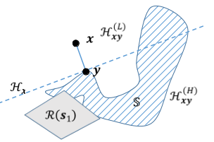
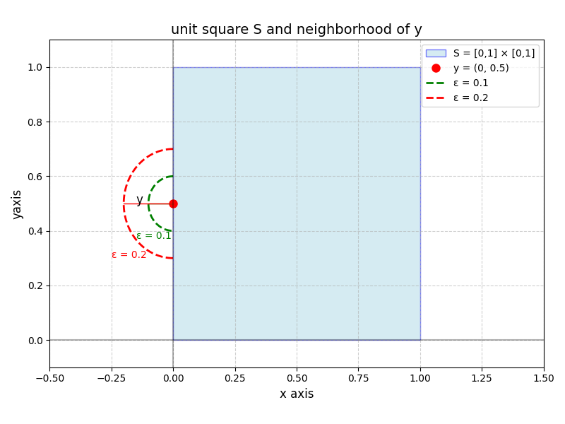

# 可接近集的充要條件

摘要

在具有向量收益的賽局中，Blackwell(1956）提出的「可接近性」（approachability）理論在賽局論中已有廣泛應用，例如用於研究單邊資訊不完全的重複賽局（Aumann and Maschler, 1995），或校準與學習過程問題（Foster and Vohra, 1997; Hart and Mas-Colell, 1997）。

在雙人重複賽局中，若某集合$$S$$對某玩家是可接近的，則該玩家能確保從某一階段開始，平均回報以任意高的機率永遠保持接近$$S$$。可接近性的證明因定義涉及策略的均勻良好漸近分佈而困難。Blackwell通過引入一個基於幾何考量的充分條件，大幅簡化了這一問題。我們將利用此條件的兩個特徵：

* 充分且必要性 ：在凸集情況下，Blackwell條件既是充分也是必要條件，且易於驗證。&#x20;
* 策略構造性 ：該條件明確提供構建可接近性策略的方法，這些策略對離散化或隨機擾動具有魯棒性。

## 向量報酬策略賽局(Spinat, 2002)

### 雙人賽局向量空間的操作與集合

* $$\| x\|^2 = \langle x, x \rangle = x^{\top} x$$為歐式空間的標準範數(standard norm)。
* $$X=\mathbb{R}^v$$為回報向量的宇集合。
* $$\displaystyle d(x,S)=\inf_{y \in \mathbb{S}}d(x,y)$$為點$$x$$到集合$$S$$的距離，$$S \subset X$$。
  * 如果$$S$$為凸集合時，則點$$y$$唯一，即$$S$$中其它的點到點$$x$$的距離均大於點$$y$$至$$x$$的距離。
* 給定集合$$S$$，令其閉包為$$\overline{S}$$，邊界集為$$\partial S$$，補集為$$S^c$$，$$S_\epsilon = \{x \in X ~|~ d(x,S) < \epsilon\}$$為距離集合$$S$$小於$$\epsilon$$所有點的集合。
* 玩家與對手均為有限動作集$$\mathcal{A}_1=\{1,2,\dots, r\},  \mathcal{A}_2=\{1,2,\dots, s\}$$。$$|\mathcal{A}_1|=r, |\mathcal{A}_2|=s$$。
  * $$\displaystyle \Delta(\mathcal{A}_1) =\left\{p \in \mathbb{R}_+^{r} ~\bigg| ~\sum_{i=1}^{r} p_i=1 \right\}$$為玩家的混合策略集合。
  * $$\displaystyle \Delta(\mathcal{A}_2) =\left\{q \in \mathbb{R}_+^{s} ~\bigg| ~ \sum_{j=1}^{s} q_j=1 \right\}$$為對手的混合策略集合。
* 令$$\mathcal{M}$$為所有向量報酬$$M(i, j) \in X, ~\forall i \in \mathcal{A}_1, ~ j \in \mathcal{A}_2$$形成的凸包(convex hull)。令$$\|M\|=\max_{x,y \in \mathcal{M}} d(x,y)$$為其直徑。
* 令$$M \in \mathbb{R}^{(r \times s) \times v}$$為向量報酬矩陣，$$M(i,j) \in X$$為矩陣$$M$$中第$$i$$列第$$j$$行的元素。
* $$\mathcal{R}(p) = \left\{   \mathrm{conv}(p^\top M q) ~ |~ \forall q \in \Delta(\mathcal{A}_2) \right\}$$為給定玩家的混合策略$$p$$​後，對手所有可能的混合策略回報形成的凸包。
* 同理$$\mathcal{T}(q) = \left\{   \mathrm{conv}(p^\top \mathbf{M}  q) ~ |~ \forall p \in \Delta(\mathcal{A}_1) \right\}$$為給定對手的混合策略$$q$$​，玩家所有的混合策略回報形成的凸包。

### 賽局流程

$$G_n$$為一個$$n$$輪雙人賽局，且向量回報矩陣為$$M$$如下：

* 在第$$n$$輪，給定歷史$$h_{n-1}=(i_1, j_1, \dots, i_{n-1}, j_{n-1})$$ 後，玩家從$$\mathcal{A}_1$$中選行動$$i_n$$且對手從$$\mathcal{A}_2$$中選行動$$j_n$$。
* 玩家與對手先選行動$$(i_n, j_n)$$之後，才得到該輪的向量回報$$x_n =M_{i_n, j_n} \in X$$。
* 令$$\overline{x}_n=\frac{1}{n} \sum_{t=1}^n x_t$$為第$$n$$輪的平均回報。
* 令$$H_n= (\mathcal{A}_1 \times \mathcal{A}_2)^n$$為長度$$n$$的歷史宇集合，具體來說，$$H_n$$ ​ 是所有可能的、長度為$$n$$ 的動作對序列的集合。每個序列記錄了賽局從第1階段到第$$𝑛$$階段，兩個玩家所選擇的動作對。例如$$h_n \in H_n$$可寫為：$$h_n=(i_1, j_1, \dots, i_n, j_n)$$。
  * 假設$$\mathcal{A}_1=\{a,b\}, ~\mathcal{A}_2=\{c,d\}$$，則$$H_1=\{(a,c), (a,d), (b,c), (b,d)\}$$共4個元素。
  * $$H_2=\{((a,c), (a,c)), ((a,c), (a,d)), ((a,c), (b,c)), \dots, ((b,d), (b,d))\}$$，表示前2輪的所有可能動作序列，共有16個元素。
  * $$H = \bigcup_{n<\infty } H_n$$為有限的歷史集合，也就是將所有可能長度（$$n$$ 階段）的歷史記錄$$H_n$$合併起來，形成一個包含任何有限局數下所有可能動作序列的集合。寫成聯集的形式是因為相異長度的集合$$H_{m}, H_{n}$$大小不同，因此使用聯集才能精確表示不同長度的歷史記錄。
  * $$H_\infty$$為賽局的集合，代表無限長的遊戲程序，即整個賽局中可能出現的無限序列（每一局的動作都被依序記錄），這反映了遊戲的「完整進行過程」。
  * 令$$\mathscr{H}_\infty$$為$$H_\infty$$的σ域，由$$B_h^n$$集合$$B_h^n$$生成。$$B_h^n=\{ (i_k, j_k)_{k \in \mathbb{N}} \in H_\infty \text{ such that }   (i_k, j_k)_{1 \leq k \leq n} = h, ~ n \in \mathbb{N}, h \in H_n \}$$，即由長度$$n$$的所有歷史生成。
* 定義$$\Sigma, \mathscr{T}$$為玩家與對手的策略集合，其中策略為由有限歷史集$$H$$對應到混合策略$$\Delta \mathcal{A}_1$$或$$\Delta \mathcal{A}_2$$的函數。(註：Blackwell只有定義$$f,g$$為策略，沒有定義其集合。)

## 可接近集合(approachable set)

> 定義雙人重複賽局$$G_n$$​中，集合$$S$$​滿足以下條件時，稱為可接近集合。
>
> * $$\begin{aligned} & \exists \sigma \in \Sigma,~ \forall \epsilon > 0,~ \forall \eta >0 ~ \exists n_0 \in   \mathbb{N} \ni \\   & \forall \tau \in \mathscr{T},  \mathrm{P}_{\sigma \tau}(\sup_{n \geq n_0} d(\overline{x}_n, S) \geq \epsilon) \leq \eta \end{aligned}$$
> * 註：此處定義和Blackwell概念一致，只有符號不相同而已。

此定義即玩家存在策略$$\sigma$$使得不論對手使用任意策略$$\tau$$，玩家的平均報酬$$\overline{x}_n$$與集合$$S$$的距離在$$t \rightarrow \infty$$時以機率$$P_{\sigma \tau}$$收斂為０，而且此處的收斂是對於對手的所有策略均成立(uniformly)。

<mark style="color:red;">由於玩家存在有上述性質的策略，因此當玩家長期使用此種策略時，最後與平均報酬距離為0的集合稱為可接近集合</mark>。

由定義可知，任何可接近集合的超集合也是可接近集合。因為所有的回報的平均值必定落在凸包$$\mathcal{M}$$​內，因此$$\mathcal{M}$$​為可接近集合。

因此$$S$$為可接近集合⟺其閉包與回報凸包$$\overline{S} \cap \mathcal{M}$$為可接近集合。所以<mark style="color:red;">以下均假設</mark>$$S \subseteq \mathcal{M}$$<mark style="color:red;">且為緊致集(compact set，註：在歐式空間中，</mark>[<mark style="color:red;">緊緻集合與有界閉集合等價</mark>](../../math-analysis/real-number/compact-set.md)<mark style="color:red;">)</mark>。

### Lemma: 遞減緊致可接近集合的交集仍為可接近集

> 令$$\{S_n \subseteq X\}$$為遞減緊致可接近集合序列，則$$\bigcap_n S_n \subseteq X$$為可接近集合。
>
> 註：[緊緻集合的任意交集仍為緊緻集](../../math-analysis/real-number/compact-set.md#jin-zhi-ji-he-de-ren-yi-jiao-ji-reng-wei-jin-zhi-ji)。
>
> 註：[由歐式空間區間套定理得遞減緊致集合序列(遞減有界閉集合序列)的交集為非空集合](../../math-analysis/real-number/nested-interval-theorem.md#cantor-intersection-theorem)。

<details>

<summary>proof: 比所有可交集集合交集<span class="math">A</span>大一點的集合<span class="math">A_\epsilon</span>為可接近集，且對所有<span class="math">\epsilon</span>均成立</summary>

由緊緻集合的任意交集仍為緊緻集和區間套定義得$$A = \bigcap_n S_n$$為非空緊致集合。

因此比$$A$$大一點的集合$$A_\epsilon = \{x \in X | d(x,A) < \epsilon\}$$為某些緊致可接近集合的超集合，即

$$\forall \epsilon >0, \exists n_0 \in \mathbb{N} \ni A_\epsilon \supset S_{n_0}$$。

因為可接近集合的超集仍為可接近集合，所以$$A_\epsilon, ~\forall \epsilon > 0$$為可接近集合。

因此$$A$$為可接近集合。

(QED)

</details>

## (全局)Blackwell條件

> 以幾何方式說明。令$$x,y \in \mathbb{R}^v$$為相異的兩點：
>
> 通過點$$y$$的超平面(hyperplane)為$$H_{xy} =\{z \in \mathbb{R}^v ~|~ \langle w, z \rangle = w^\top z =0 , ~ w=x-y \}$$。$$w=x-y$$為其法向量(由$$x$$為起點，往$$y$$方向的向量)。
>
> 令$$S \subseteq \mathcal{M}$$為緊緻子集(有界閉集合)。
>
> 定義<mark style="color:red;">投影集合</mark>$$\prod_S(x)=\{ y \in S ~|~ d(x,y)=d(x,S) \}, ~ x \notin S$$。投影點在$$S$$為凸集合時唯一，否則可能存在多個投影點。因為$$S$$為閉集合，所以投影集合不為空集合。

### 定義：B集合(B-set)

> 緊致集合$$S$$​滿足以下Blackwell條件時，稱為B-set。
>
> $$\forall x \in S^c$$, $$\exists p \in \Delta(\mathcal{A}_1)$$, $$\exists y \in \prod_S(x)$$ $$\ni$$$$H_{xy}$$ 可分隔點$$x$$與玩家回報凸包$$\mathcal{R}(p)$$。
>
> 註：此即Blackwell論文中的[可接近性集合定理(存在性與充分條件)](./#ke-jie-jin-xing-ji-he-ding-li-cun-zai-xing-yu-chong-fen-tiao-jian)條件。
>
> 註：<mark style="color:red;">此處不要求</mark>$$S$$<mark style="color:red;">為凸集合</mark>。

超平面$$H_{xy}$$可定義兩個半空間(half-spaces) $$H_{xy}^{(H)} =\{z \in \mathbb{R}^v ~|~ w^\top z \geq c  \}$$與$$H_{xy}^{(L)} =\{z \in \mathbb{R}^v ~|~ w^\top z \leq c  \}$$。

由於法向量$$w=x-y$$且$$H_{xy}$$可分隔點$$x$$與玩家回報凸包$$\mathcal{R}(s)$$。因此$$x \in H_{xy}^{(L)}$$且$$\mathcal{R}(s) \in H_{xy}^{(H)}$$。

### 定義：適應於B集合的函數/適應性策略(adaptive strategy)

> 給定B集合$$S$$，函數$$\phi: S^c \rightarrow \Delta(\mathcal{A}_1)$$滿足以下條件時，稱為適應於集合$$S$$的函數：
>
> $$\forall x \in S^c, \exists y \in \prod_{S}(x) \ni H_{xy}$$可分隔點$$x$$與玩家回報凸包$$\mathcal{R}(\phi(x))$$。

<figure><figcaption><p>非凸集合為B集合的範例</p></figcaption></figure>

## Theorem 1: Blackwell條件是可接近集的充分條件

> 若緊致集合$$S$$​為B集合時⟹則$$S$$為可接近集。
>
> $$\forall x \in S^c$$, $$\exists s \in \Delta(\mathcal{A}_1)$$, $$\exists y \in \prod_S(x)$$ $$\ni$$$$H_{xy}$$ 可分隔點$$x$$與玩家回報凸包$$\mathcal{R}(s)$$。
>
> 給定玩家策略$$\sigma$$為$$\sigma_n=  \begin{cases} \phi(\overline{x}_{n-1}), \text{ if } \overline{x}_{n-1} \notin S, \\ \text{ arbitrary } \text{ if } n=1 \text{ or } \overline{x}_n \in S \end{cases}$$為適應於集合$$S$$的函數，即$$\forall x \in S^c, \exists y \in \prod_{S}(x) \ni H_{xy}$$可分隔點$$x$$與玩家回報凸包$$\mathcal{R}(\phi(x))$$。
>
> 使用此可接近策略$$\sigma$$對於任意的對手策略$$\tau$$，輪數$$N$$，與$$\epsilon$$可得$$\mathrm{E}_{\sigma \tau} (d(\overline{x}_N, S)^2) \leq \frac{\|M\|^2}{N}$$且$$\displaystyle \mathrm{P}_{\sigma \tau}(\sup_{n \geq N}((d(\overline{x}_N, S) \geq \epsilon)) \leq \frac{2 \| M\|^2}{\epsilon^2 N}$$

註：此定理已在[Blackwell可接近性集合定理(存在性與充分條件](./#ke-jie-jin-xing-ji-he-ding-li-cun-zai-xing-yu-chong-fen-tiao-jian))證明。

### Lemma: 更一般化的可接近條件(Mertens et al. 1994)

> 令$$\Omega, \mathscr{H}, \mathrm{P})$$為機率空間且$$\{\mathcal{F}_n\}_{n \geq 1}$$為filtration。
>
> $$\{x_n\}_{n \geq 1}$$為隨機變數序列，$$x_n : \Omega \rightarrow X$$且$$\forall n \geq 1$$，$$x_n$$為$$\mathcal{F}_n$$可測，且$$\mathrm{E}(\|x_n\|^2) \leq A$$.&#x20;
>
> 若$$\forall n \geq 1, \exists y_n \in \prod_S(\overline{x}_n), ~ \langle  \overline{x}_n - y_n, \mathrm{E}(x_{n+1}| \mathcal{F}_n) - y_n   \rangle \leq n$$，則$$\forall N$$, $$\mathrm{E}(\| \overline{x}_n - y_n\|^2) \leq 4 \frac{A}{N}$$且$$\displaystyle \mathrm{P}(\sup_{n \geq N} \|\overline{x}_n - y_n \| \geq \epsilon) \leq 8 \frac{A}{\epsilon N}$$。

### Proposition 1: 一般可接近集的必要條件(凸可接近集的充要條件)

> 若$$S$$為可接近集⟹則對手的任意策略形成的回報凸包與$$S$$的交集不為空，即$$\forall q \in \Delta (\mathcal{A}_2)$$，$$\mathcal{T}(q) \cap S \notin \emptyset$$。
>
> 若$$S$$為凸集合且為可接近集⟺則對手的任意策略形成的回報凸包與$$S$$的交集不為空，
>
> 註：Blackwell在[theorem 3](./#theorem-3-tu-ji-he-ke-jie-jin-de-chong-yao-tiao-jian)已證明了凸集合充要條件而不只是必要條件。

## theorem 2: 閉凸可接近集的充要條件為B集合

> 令$$S$$為閉凸集。則$$S$$為可接近集⟺$$S$$為B集合。
>
> 註：此性質用到了凸集合中，$$x \in S^c$$投影至$$S$$的點$$\prod_S(x)$$唯一且存在超平面$$H$$可將$$x$$與$$S$$完全分開。
>
> 非凸集投影點的行為更複雜，導致超平面的分隔性質不再穩定，Blackwell條件可能失效。

這個結果無法直接推廣到非凸集的情況。

Ｉ由以下反列知可接近集只要加上一些不可接近的點，就會違反B集合的定義變成不可接近集。

### 反例

令$$S=\mathcal{R}(p) \cup \{z\}$$，$$\mathcal{R}(p)$$為玩家使用混合策略$$p \in \Delta(\mathcal{A}_1)$$時，所有可能的回報凸包，而$$z \in \mathcal{R}(p)^c$$，因此$$S$$為凸包與單點的聯集，並非凸集合。

$$S$$包含了一個可接近的子集$$\mathcal{R}(p)$$，因為可接近集的超集仍為可接近集。所以$$S$$為可接近集。

但是$$S$$通常不滿足Blackwell條件。考慮靠近$$z$$的點$$y \in S^c$$，且滿足$$\prod_S(y)=\{z\}$$。

根據Blackwell條件，對於$$y \in S^c$$，需要存在$$p_y \in \Delta(\mathcal{A}_1)$$和$$z \in \prod_S(y)$$使用超平面$$H_{zy}$$將$$y$$和$$\mathcal{R}(p_y)$$分開。

* 當$$y$$在$$z$$附近移動時， $$zy$$的方向會隨$$y$$的位置任意改變。
* 而$$\mathcal{R}(p_y)$$是由某個玩家混合策略生成的回報凸包，因為$$z \notin \mathcal{R}(p)$$，無法保證對於所有$$y$$總是存在$$\mathcal{R}(p_y)$$在$$H_{zy}$$的另一側，因此Blackwell條件不總是成立。

## Blackwell條件的觀察

> Blackwell條件的原始定義是對所有$$x \in S^c$$ ，都存在一個策略$$\exists p \in \Delta(\mathcal{A}_1)$$且$$\exists y \in \prod_S(x)$$使得$$x$$被超平面 $$H_{xy}$$​（通過 $$y$$ 並垂直於 $$x$$ 到 $$y$$ 的向量）與 $$\mathcal{R}(p)$$ 分隔開來。
>
> 但實際上，我們可以將這個條件視為 **僅適用於**$$S$$**的邊界集**$$\partial S$$**上的某些點**，而不需要在所有$$x \in S^c$$上都驗證它。
>
> <mark style="color:red;">如果Blackwell條件在</mark>$$S$$<mark style="color:red;">的某個鄰域</mark>$$S_\epsilon \setminus S$$<mark style="color:red;">(即在</mark>$$S$$<mark style="color:red;">的邊界附近(距離</mark>$$S$$<mark style="color:red;">長度小於</mark>$$\epsilon$$<mark style="color:red;">的所有點集)，但不含</mark>$$S$$<mark style="color:red;">的點)，則整個</mark>$$S^c$$<mark style="color:red;">也會滿足Blackwell條件，即</mark>$$S$$<mark style="color:red;">為B集合</mark>。

註：邊界點的每個鄰域都同時包含集合的點和補集的點，即$$x \in \partial S \Leftrightarrow \forall \epsilon >0, ~x \cap S_\epsilon \neq \emptyset$$且$$x \cap S_\epsilon^c \neq \emptyset$$。

### Lemma 3: 緊緻集的鄰域中存在單點有唯&#x4E00;_&#x6295;_&#x5F71;點

> 令$$S$$為緊致集(有界閉集合)且$$x \in S^c$$，則$$\forall y \in \prod_S(x)$$($$x$$在$$S$$上的投影集的所有點)與$$\forall \epsilon >0 \exists z \in S_\epsilon \setminus S \ni \prod_S(z)=\{y\}$$。
>
> 對於緊緻集合$$S$$外的任意點$$x \in S^c$$與其投影點$$y \in S$$，可以在$$S$$的$$\epsilon$$鄰域內(但不含$$S$$)找到一點$$z$$使得$$y$$是$$z$$在$$S$$的唯一投影點。
>
> <mark style="color:red;">此處S不需為凸集合</mark>。

<details>

<summary>proof: 線段(x,y)為實數上的開區間且長度>0，依實數稠密性必存在<span class="math">z \in (x,y)</span>且<span class="math">z \in S^c</span>。</summary>

存在性：

因為$$d(x, S) >0$$，且$$y$$為其投影點，取$$0< \epsilon < d(x,S)$$。

因此可在直線開區間$$(x,y)$$中取一點$$z \in S_{\epsilon}$$。

唯一性：

因為$$z \in (x,y)$$，且$$y \in S$$是集合上離$$x$$最近的點，若$$z$$有另一個投影$$y^{'} \in S$$，則$$d(x,y^{'}) < d(x,y)$$，與$$y \in \prod_S(x)$$矛盾，因此$$\prod_S(z)=\{y\}$$。

(QED)

</details>

### 外露點(exposed points)

> 邊界點$$y \in \partial S$$稱為集合$$S$$的外露點，若存在$$x \in S^c$$滿足$$\prod_S(x)=\{y\}$$。即$$y$$是$$x$$ 在$$S$$上的唯一最近點。
>
> 定義所有<mark style="color:red;">外露點的集合為</mark>$$\mathrm{Exp}(S)$$，即$$y \in \mathrm{Exp}(S) \Leftrightarrow y \in \partial(S) \text{ and } \exists x \in S^c \ni \prod_S(x)={y}$$。
>
> <mark style="color:red;">由定義得外露點集為邊界點的子集合</mark>，即$$\mathrm{Exp}(S) \subseteq \partial S$$。
>
> 由凸集合的外部投影點有唯一性得若$$S$$為<mark style="color:red;">閉嚴格凸集合</mark>，則$$\mathrm{Exp}(S) = \partial S$$。
>
> <mark style="color:red;">註：外露點為只考慮(可能有多個)外點在集合上有唯一投影點的邊界點。</mark>

如果$$S$$的外露點的鄰域滿足Blackwell條件，那麼整個$$S$$也會滿足Blackwell條件，進而是個 B集合（可被逼近的集合）。

<mark style="color:red;">邊界點但非外露點的條件</mark>：$$\forall x \in S^c, \prod_S(x) \neq \{y\}$$，即邊點界$$y$$不是所有外點的單獨投影點。

### 範例：非嚴格凸集合中存在邊界點但非外露點

考慮二維空間中的單位正方形$$S=[0,1] \times [0,1]$$為凸集合，但不是嚴格凸集合。

$$y=(0,0.5)$$為邊界點但不是暴露點。

因為不存在$$x \in S^c \ni \prod_S(x)=\{(0, 0.5)\}$$，因為$$y$$的任意$$\epsilon$$鄰域中，都存在多點的投影點為$$y$$。

而正方形中的四個點(0,0), (0,1), (1,0), (1,1)為外露點，因為(0,0)存在(-1,-1)其投影點只有(0,0)。





<figure><figcaption><p>凸集合中存在邊界點但不是外露點</p></figcaption></figure>



```python
import numpy as np
import matplotlib.pyplot as plt
from matplotlib.patches import Rectangle, Arc

# 創建一個新的圖形
plt.figure(figsize=(8, 6))

# 設置坐標軸範圍
plt.xlim(-0.5, 1.5)
plt.ylim(-0.1, 1.1)

# 繪製單位正方形 S = [0,1] × [0,1]
square = Rectangle((0, 0), 1, 1, facecolor='lightblue', 
                   edgecolor='blue', alpha=0.5, label='S = [0,1] × [0,1]')
plt.gca().add_patch(square)

# 定義點 y = (0, 0.5)
y_x, y_y = 0, 0.5
plt.plot(y_x, y_y, 'ro', markersize=8, label='y = (0, 0.5)')

# 繪製虛線半圓: ε = 0.1
theta = np.linspace(-np.pi/2, np.pi/2, 100)
radius1 = 0.1
x1 = y_x - radius1 * np.cos(theta)
y1 = y_y - radius1 * np.sin(theta)
plt.plot(x1, y1, 'g--', linewidth=2, label='ε = 0.1')

# 繪製虛線半圓: ε = 0.2
radius2 = 0.2
x2 = y_x - radius2 * np.cos(theta)
y2 = y_y - radius2 * np.sin(theta)
plt.plot(x2, y2, 'r--', linewidth=2, label='ε = 0.2')

# 添加半徑標籤
plt.text(-0.15, 0.5, 'y', fontsize=12)
plt.text(-0.15, 0.37, 'ε = 0.1', fontsize=10, color='green')
plt.text(-0.25, 0.3, 'ε = 0.2', fontsize=10, color='red')

# 添加輔助線以標示半徑
plt.plot([0, -0.1], [0.5, 0.5], 'g-', linewidth=1)
plt.plot([0, -0.2], [0.5, 0.5], 'r-', linewidth=1)

# 網格、座標軸和標籤
plt.grid(True, linestyle='--', alpha=0.6)
plt.axhline(y=0, color='k', linestyle='-', alpha=0.3)
plt.axvline(x=0, color='k', linestyle='-', alpha=0.3)
plt.title('unit square S and neighborhood of y', fontsize=14)
plt.xlabel('x axis', fontsize=12)
plt.ylabel('yaxis', fontsize=12)


# 添加圖例
plt.legend(loc='upper right')

plt.tight_layout(rect=[0, 0.03, 1, 0.97])
plt.show()
```



### Blackwell條件的等價寫法

> 定義(本地)Blackwell條件：$$\forall y \in \mathrm{Exp}(S)$$且$$\forall x \in S_\epsilon \setminus S$$與$$\prod_S(x)=\{y\}$$，$$\exists p \in \Delta(\mathcal{A}_1)$$使得$$x$$被超平面 $$H_{xy}$$​（通過 $$y$$ 並垂直於 $$x$$ 到 $$y$$ 的向量）與 $$\mathcal{R}(p)$$ 分隔開來。
>
> (全局)Blackwell條件定義是對所有$$x \in S^c$$ ，都存在一個策略$$\exists p \in \Delta(\mathcal{A}_1)$$且$$\exists y \in \prod_S(x)$$使得$$x$$被超平面 $$H_{xy}$$​（通過 $$y$$ 並垂直於 $$x$$ 到 $$y$$ 的向量）與 $$\mathcal{R}(p)$$ 分隔開來。

### 本地Blackwell條件等價於全局Blackwell條件

<details>

<summary>proof：全局->本地很直覺，因為<span class="math">x</span>為外點。<br>而本地->全局取<span class="math">\epsilon \rightarrow 0</span>時，<span class="math">z \rightarrow x</span>且超平面<span class="math">H_{zy} \rightarrow H_{xy}</span>。</summary>

全局⇒ 本地 (可在鄰域中找到點x投影到外露點，且x滿足全局條件)

假設全局條件成立，要證明所有$$y \in \mathrm{Exp}(S)$$和所有$$x \in S_{\epsilon} \setminus S$$滿足$$\prod_S(x)=\{y\}$$存在$$p \in \Delta(\mathcal{A}_1)$$使得$$H_{xy}$$分隔$$x$$與$$\mathcal{R}(p)$$。

取$$y \in \mathrm{Exp}(S)$$ ，由外露點定義得存在$$x_0 \in S^c \ni \prod_S(x_0)=\{y\}$$。

考慮任意$$x \in S_{\epsilon} \setminus S$$滿足$$\prod_S(x)=\{y\}$$。

由於$$S_\epsilon \setminus S \subseteq S^c$$，由全局條件得存在$$p \in \Delta(\mathcal{A}_1)$$與$$y^{'} \in \prod_S(x)$$使得$$H_{xy^{'}}$$分隔$$x$$與$$\mathcal{R}(p)$$。

因為已知$$\prod_S(x)=\{y\}$$，所以$$y{'}=y$$，即存在$$p \in \Delta(\mathcal{A}_1)$$使得$$H_{xy}$$分隔$$x$$與$$\mathcal{R}(p)$$。

(QED)


本地=>全局(當$$\epsilon$$趨近於0時，z趨近x)

假設本地條件成立，要證明$$\forall x \in S^c, \exists p \in \Delta(\mathcal{A}_1), y \in \prod_S(x) \ni H_{xy}$$分隔$$x$$與$$\mathcal{R}(p)$$。

取任意$$x \in S^c$$，因為$$S$$為緊致集，所以$$\prod_S(x) \neq \emptyset$$，取$$y\in \prod_S(x)$$。

由Lemma 3得對於任意$$y\in \prod_S(x)$$與任意$$\epsilon >0$$存在$$z \in S_{\epsilon} \setminus S$$使得$$\prod_S(z)=\{y\}$$，即$$y$$是$$z$$的唯一投影點，且依定義$$y \in \mathrm{Exp}(S)$$。

由本地條件得$$y \in \mathrm{Exp}(S)$$和$$z \in S_{\epsilon} \setminus S$$滿足$$\prod_S(z)=\{y\}$$存在$$p \in \Delta(\mathcal{A}_1)$$使得$$H_{zy}$$分隔$$z$$和$$\mathcal{R}(p)$$。

由lemma3得$$z$$可選在$$(x,y)$$的開線段上，當$$\epsilon \rightarrow 0$$時，$$z \rightarrow x$$。由於$$H_{zy}$$分隔$$z$$和$$\mathcal{R}(p)$$，且$$H_{zy}$$是通過$$y$$且法向量為$$z-y$$的超平面，因此當$$z \rightarrow x$$時，$$H_{zy} \rightarrow H_{xy}$$，在極限下，存在$$p \in \Delta(\mathcal{A}_1)$$使得$$H_{xy}$$分隔$$x$$與$$\mathcal{R}(p)$$。

(QED)

</details>

### lemma 4: 若不相交集合的聯集為可接近集則每個單獨集合也為可接近集

> 令$$S_1, S_2$$為兩個不相交的緊緻集，若$$S_1 \cup S_2$$為B集合，則$$S_1, S_2$$均為$$B$$集合。
>
> 由theorem 1得緊致集合$$S$$​為B集合時⟹則$$S$$為可接近集。
>
> <mark style="color:red;">註：當一個集合由兩個不相交的部分組成時，若整體可被玩家接近（即滿足 Blackwell 條件），則每個部分單獨也可被接近。</mark>
>
> <mark style="color:red;">註：由於凸集合必為連通集，因此非連通集不是凸集合。</mark>

<details>

<summary>proof</summary>

**定義距離和鄰域**

令$$S= S_1 \cup S_2$$，因為$$S_1 \cap S_2 = \emptyset$$，可得$$d(S_1, S_2) >0$$。

取$$\epsilon = ½ d(S_1, S_2)$$則：

* $$S_\epsilon = S_{\epsilon}^1 \cup S_{\epsilon}^2$$
* 且$$S_{\epsilon}^1 \cap S_{\epsilon}^2=\emptyset$$，因為$$d(S_{\epsilon}^1 , S_{\epsilon}^2)=d(S_1, S_2) - 2\epsilon=\epsilon >0$$。

**分割**$$S_{\epsilon} \setminus S$$

$$S_{\epsilon} \setminus S = (S_{\epsilon}^1 \cap S_{\epsilon}^2 ) \setminus (S_1 \cup S_2)=(S_{\epsilon}^1 \setminus S_1) \cup (S_{\epsilon}^2 \setminus S_2)$$

由於$$S_{\epsilon}^1 \cap S_{\epsilon}^2=\emptyset$$且$$S_1 \cap S_2 = \emptyset$$，因此$$S_{\epsilon}^1 \setminus S_1$$ 與$$S_{\epsilon}^2 \setminus S_2$$形成$$S_{\epsilon} \setminus S$$的分割。

應用B集合

已知$$S= S_1 \cup S_2$$為B集合，則$$\forall x \in S^c$$ (即$$x \notin S_1 \cup S_2$$)存在策略$$p \in \Delta(\mathcal{A}_1)$$且存在$$y \in \prod_S(x)$$使得$$x$$被超平面 $$H_{xy}$$​與 $$\mathcal{R}(p)$$ 分隔開來。

若$$x \in S_{\epsilon}^1 \setminus S_1$$，則$$x \notin S_2$$且$$d(x, S_2) \geq \epsilon$$。

因為$$y \in \prod_S(x)$$且$$x \in S_{\epsilon}^1 \setminus S_1$$得$$d(x, S_1)<\epsilon$$，所以$$y \in S_1$$。

對於$$x \in S_{\epsilon}^1 \setminus S_1$$，$$\prod_S(x) \subseteq S_1$$且存在策略$$p \in \Delta(\mathcal{A}_1)$$使得$$x$$被超平面 $$H_{xy}$$​與 $$\mathcal{R}(p)$$ 分隔開來。

因此本地Blackwell條件在$$S_{\epsilon}^1 \setminus S_1$$成立，因此$$S_1$$為B集合。

同理$$S_2$$為B集合。

(QED)

</details>

## 次要點(secondary point)

以下均討論在回報凸包內，緊緻子集$$S \subseteq \mathcal{M}$$的次要點。

給定回報$$x \in X$$與對手的混合策略$$q \in \Delta(\mathcal{A}_2)$$，定義$$C(x,q)\equiv \mathrm{conv}(x, \mathcal{T}(q))=\{\lambda x +(1-\lambda)y ~|~ \lambda \in [0,1], y \in \mathcal{T}(q)\}$$為回報$$x$$與給定對手的混合策略$$q$$​回報形成的凸包$$\mathcal{T}(q)$$的凸包。此處是解釋為由平均回報$$x$$為起點，當對手使用混合策略$$q$$時，形成的平均回報軌跡(路徑)形成的集合。

* 這是由單點$$x$$與凸集合$$\mathcal{T}(q)$$形成的凸包，等於將單點與凸集合內的每一點形成的線段形成的集合。
* <mark style="color:blue;">在重複賽局，平均回報</mark>$$\overline{x}_n$$ <mark style="color:blue;">可以看作從初始點</mark>$$x$$<mark style="color:blue;">向</mark>$$\mathcal{T}(q)$$<mark style="color:blue;">移動的結果。</mark>$$\lambda(y)$$ <mark style="color:blue;">表示這種移動過程中，平均回報軌跡上的某個位置。而回報軌跡不會是一條直線，因為在對手使用混合策略</mark>$$q$$<mark style="color:blue;">時，玩家除非總是採取固定行動</mark>$$i$$<mark style="color:blue;">才會得到固定的回報</mark>$$y_i \in \mathcal{T}(q)$$，此時的軌跡才是一直線；<mark style="color:blue;">若是玩家採用混合策略</mark>$$p$$<mark style="color:blue;">時，則會得到報酬</mark>$$y_{t_1}, y_{t_2}, \dots$$<mark style="color:blue;">，而每一點</mark>$$y_{t_k} \in \mathcal{T}(q)$$<mark style="color:blue;">，因此從</mark>$$x$$<mark style="color:blue;">為起點得到的回報軌跡會落在</mark>$$C(x,q)$$<mark style="color:blue;">內但通常不是直線，而是曲折的線段，當無限多輪時，可視為連續路徑。</mark>
* <mark style="color:red;">如果從點</mark>$$x$$<mark style="color:red;">往</mark>$$\mathcal{T}(q)$$<mark style="color:red;">的所有移動軌跡中，都會離開</mark>$$S$$<mark style="color:red;">(即軌跡</mark>$$C(x,q)$$<mark style="color:red;">與</mark>$$S^c$$<mark style="color:red;">的交集不為空，或者說為</mark>$$C(x,q)$$<mark style="color:red;">與</mark>$$S$$<mark style="color:red;">的交集不是路徑連通集)，則</mark>$$x$$<mark style="color:red;">為次要點；反之如果存在軌跡可以一直保持在集合</mark>$$S$$<mark style="color:red;">內時(即</mark>$$C(x,q)$$<mark style="color:red;">與</mark>$$S$$<mark style="color:red;">的交集是路徑連通集)，則</mark>$$x$$<mark style="color:red;">不是次要點</mark>。

> <mark style="background-color:red;">定義</mark>：回報向量$$x \in X$$是(緊緻)集合$$S$$的<mark style="color:red;">δ次要點</mark>，若存在對手混合策略$$q \in \Delta (\mathcal{A}_2)$$與連續函數$$\lambda: \mathcal{T}(q) \rightarrow (0,1]$$滿足$$\displaystyle \min_{y \in \mathcal{T}(q)} d_S(\lambda(y)x +(1-\lambda(y))y) \geq \delta$$。
>
> <mark style="color:red;">此處不必關心</mark>$$\lambda(y)$$<mark style="color:red;">的實際形式，重點在於</mark>$$\lambda(y)x + (1-\lambda(y))y$$<mark style="color:red;">形成了</mark>$$x,y$$<mark style="color:red;">之間的某個點</mark>。
>
> 註：這邊不是定義$$x$$至$$y$$的連續路徑，而是先從$$x$$會被$$y$$的選擇而影響其位置開始推論(?)。
>
> 如果$$x$$ 是次要點，對手通過固定策略$$q$$和適當的$$\lambda(y)$$，可以確保平均回報的軌跡永遠不會太靠近$$S$$，無論玩家如何調整。
>
> $$\lambda(y)$$的連續性確保從$$x$$到$$\mathcal{T}(q)$$ 的「路徑」是平滑的，避免跳躍或不一致的情況。如果$$\lambda(y)$$ 不連續，可能存在某些$$y$$使得線段突然靠近$$S$$，破壞次要點的「遠離」特性。
>
> 換句話說，無論玩家如何選擇策略，得到的回報$$y$$與$$x$$形成的連續路徑(落在$$C(x,q)$$中)，這些路徑中的任意點都無法靠近$$S$$（距離至少保持$$\delta$$）。
>
> $$x$$是定義在宇集合中的點，因為可能為$$S$$中的元素或者不在集合中；而$$S$$只有定義為緊緻集，沒有定義是否為可接近集或者凸集等。此處是討論點$$x$$是否可接近集合$$S$$。
>
> 其中$$\mathcal{T}(q)$$為對手選擇混合策略$$q$$時，玩家的所有可能回報集合。
>
> 此處$$\lambda(y) \neq 0$$是因為$$x$$可能位在集合$$S$$的內部，即$$x \in S$$。
>
> 此處$$\lambda(y)$$是針對每一個$$y \in \mathcal{T}(q)$$相對於$$x$$而變動，形成$$x,y$$之間的連續路徑(不一定是線段)。
>
> <mark style="background-color:red;">定義</mark>：<mark style="color:red;">次要點</mark>，回報向量$$x$$對於集合$$S$$是次要點若存在$$\delta >0$$使得$$x$$是集合$$S$$的δ次要點。
>
> <mark style="color:red;">次要點是用來區分集合</mark>$$S$$<mark style="color:red;">中在可接近性（approachability）方面「無用」的點。為如果平均回報接近這些點，對手可以通過策略</mark>$$q$$<mark style="color:red;">迫使平均回報遠離</mark>$$S$$。
>
> 註：由定義可知，如果存在$$q \in \Delta(\mathcal{A}_2) \ni \mathcal{T}(q) \cap S = \emptyset$$$$\mathcal{T}(q) \cap S = \emptyset$$時，則$$x$$為次要點，因為任意$$y \in \mathcal{T}(q)$$都無法使得$$x$$更接近$$S$$。

### <mark style="color:red;">非次要點</mark>

點$$x$$對於集合$$S$$不是次要點，若：$$\forall q \in \Delta(\mathcal{A}_2)$$與$$\lambda: \mathcal{T}(q) \rightarrow (0,1]$$，總是滿足：$$\displaystyle \min_{y \in \mathcal{T}(q)} d_S(\lambda(y)x +(1-\lambda(y))y) =0$$

* 換句話說，對於所有$$q$$和$$\lambda(y)$$，從$$x$$到$$\mathcal{T}(q)$$的凸組合中，總能找到一些點無限靠近$$S$$（距離可以任意小）。即無論對手選擇什麼混合策略$$q$$，從$$x$$到$$\mathcal{T}(q)$$的凸包$$C(x,t)$$ 中，總存在一些路徑或點可以非常靠近$$S$$。而不會被對手的策略$$q$$ 完全阻斷。
* 因此則對於任意$$q$$，存在從$$x$$到$$\mathcal{T}(q)$$的連續路徑，完全留在$$S$$的某個鄰域內（例如$$S_\epsilon$$ ​ ），而不必進入$$(S_\epsilon)^c$$ 。

註：次要點的性質應該與Blackwell中的[theorem 3](./#theorem-3-tu-ji-he-ke-jie-jin-de-chong-yao-tiao-jian)接近的充要條件有關。即閉凸集合$$S$$為可接近集合 ⟺ $$S$$與任意的凸包$$\mathcal{T}(q),  ~\forall q \in \Delta(\mathcal{A}_2)$$都有交集。而且可接近集的超集合也是可接近集，因此除了最小的可接近集之外，

假設$$𝑥$$是次要點，對手可以選擇一個固定的策略$$q$$，使得從$$x$$出發，沿著到$$\mathcal{T}(q)$$的任何「連續路徑」（由凸組合表示），總會偏離$$S$$一段距離（至少$$\delta$$）。 <mark style="color:red;">這意味著</mark>$$x$$<mark style="color:red;">無法作為接近</mark>$$S$$<mark style="color:red;">的穩定起點，因為對手可以迫使平均回報遠離</mark> $$S$$。

在重複賽局中，如果平均報酬$$\overline{x}_n$$ 接近次要點$$x$$，對手通過策略$$q$$可以讓未來的平均報酬偏離$$S$$，從而破壞玩家的可接近性策略。

### 性質1：次要點至給定對手策略回報凸包的連續路徑都會經過距離集合至少長度δ的區域

> 若$$x$$為集合$$S$$的δ次要點，則存在對手策略$$q \in \Delta(\mathcal{A}_2)$$使得所有在集合$$C(x,q)$$中從$$x$$到回報集合$$\mathcal{T}(q)$$的連續路徑都無法避免進入$$(S_\delta)^c$$。
>
> 即δ次要點$$x$$到$$\mathcal{T}(q)$$的所有連續路徑與集合$$S$$的最近距離至少 δ ，因此所有連續路徑都會必定與$$(S_\delta)^c$$有交集。

<details>

<summary>proof</summary>

因為$$x$$為集合$$S$$的δ次要點，依定義存在對手混合策略$$q \in \Delta (\mathcal{A}_2)$$與連續函數$$\lambda: \mathcal{T}(q) \rightarrow (0,1]$$滿足$$\displaystyle \min_{y \in \mathcal{T}(q)} d_S(\lambda(y)x +(1-\lambda(y))y) \geq \delta$$。

定義集合$$A=\{\lambda(y)x+(1-\lambda(y)y~|~ y \in \mathcal{T}(q)\}$$為所有$$x$$與所有可能得到的回報$$y$$形成的線段路徑集合，則$$A \subseteq (S_\delta)^c$$，<mark style="color:red;">即</mark>$$A$$<mark style="color:red;">位為集合</mark>$$S$$<mark style="color:red;">長度至少</mark>$$\delta$$<mark style="color:red;">的區域中</mark>。

<mark style="color:blue;">要證明因為</mark>$$x$$<mark style="color:blue;">與</mark>$$\mathcal{T}(q)$$<mark style="color:blue;">可被</mark>$$A$$<mark style="color:blue;">分開，任何從</mark>$$x$$<mark style="color:blue;">至</mark>$$\mathcal{T}(q)$$<mark style="color:blue;">的連續路徑必定經過</mark>$$A$$。


</details>

### 性質2：所有在補集合的點均為次要點

> 若$$x \in S^c$$，則$$x$$為$$S$$的次要點。

### 性質3：緊緻集母集合的次要點也是子集合的次要點

> 令$$S_1, S_2$$為緊致集且$$S_1 \subset S_2$$，則$$S_2$$的次要點也是$$S_1$$的次要點。


### 定義：次要點集合(開集合)

> 開集合$$Q \subset X$$是集合$$S$$的δ次要點集合(次要集)若$$\forall x \in Q$$均為$$S$$的δ次要點。
>
> 開集合$$Q \subset X$$是集合$$S$$的次要集若存在$$\delta > 0$$使得$$Q$$為$$S$$的δ次要集。

### 性質4：每個次要點的為鄰域為次要集

### 性質5：若集合Q的閉包與集合S交集為空時，則Q為S的次要集

> 若$$\overline{Q} \cap S = \emptyset$$，則$$Q$$為$$S$$的次要集。

### 性質6：次要集的有限聯集仍為次要集

> 令$$Q_1, Q_2$$是集合$$S$$的次要集，且$$Q = Q_1 \cup Q_2$$。
>
> 若$$Q_1$$為$$S$$的$$\delta_1$$次要集，若$$Q_2$$為$$S$$的$$\delta_2$$次要集，則$$Q$$為$$S$$的$$\delta=\min(\delta_1, \delta_2)$$次要集。
>
> 註：有限個$$\delta_1, \dots, \delta_n$$可以保證$$\delta < \infty$$，但無限個元素時無法保證。


### Blackwell可接近定理(approachability theorem, BAT)

> 1. 令$$S$$為閉集合。若$$S$$為​B-set，則$$S$$​為可接近集合。
> 2. 令$$S$$為閉凸集合。$$S$$為B-set，若且唯若$$S$$為可接近集合。
> 3. 令$$S$$為閉凸集合。若對於對手的任意策略$$s_2 \in \Delta(\mathcal{A}_2)$$​，玩家均存在對應的混合策略$$s_1(s_2) \in \Delta(\mathcal{A}_2)$$使得報酬$$u(s_1(s_2), s_2) \in S$$，則$$S$$為可接近集合。

proof (1,2的充分條件)：

Blackwell在論文中直接建立了適應性策略可接近B-set。

* 因為$$S$$為閉集合，且為B-set，下面演算法中，因為點$$\overline{u}_t$$和集合$$S$$的距離大於$$\epsilon$$，因此$$\overline{u}_t \in S^c$$。
* 因為$$S$$為B-set，$$\overline{u}_t \in S^c$$由定義得存在$$s_1^* \in \Delta(\mathcal{A}_1)$$且存在$$y_t \in \mathrm{proj}_S(\overline{u}_t)$$使得超平面$$H_{\overline{u}_t y_t}$$可分隔點$$\overline{u}_t$$與凸包$$\mathcal{R}(s_1^*)$$。
* 令$$s_{1,t+1} \equiv s_1^*$$必可使$$\overline{u}_{t+1}$$越來越接近$$S$$，即$$d(\overline{u}_t, S) \geq d(\overline{u}_{t+1}, S)$$。 (QED)


proof 2的必要條件：

因為$$S$$​為凸集合，因此任意點$$\overline{u}_t \in S^c$$投影至集合$$S$$​必為唯一一點，令$$y_t = \mathrm{proj}_S(\overline{u}_t)$$。

令方向向量$$w_t=\overline{u}_t-y_t$$，則通過點$$y_t$$且以$$w_t$$為法向量的超平面為$$H_{\overline{u}_t y_t} = \{ z \in \mathbb{R}^v ~|~ w_t^\top z = c \}$$。

因為$$S$$​為閉凸集合，根據supporting hyperplane theorem，集合$$S$$​必定為$$H_{\overline{u}_t y_t}$$形成的半空間的子集合，且$$\overline{u}_t$$必定落在與$$S$$相異的另一半空間。即$$S \subseteq  H_{\overline{u}_t y_t}^{(L)}$$且$$\overline{u}_t \in H_{\overline{u}_t y_t}^{(H)}$$。

對於可接近集合$$S$$​, 由定義得存在混合策略 $$s_{1,t}^{*} \in \Delta(\mathcal{A}_1)$$使得$$\displaystyle \forall s_{t,2} \in \Delta(\mathcal{A}_2), ~ \lim_{t\rightarrow \infty} d(\overline{u}_t, S) = 0$$ a.s.。

若凸包$$\mathcal{R}(s_{1,t}^{*}) \cap H_{\overline{u}_t y_t }^{(H)} \neq \empty$$，表示對手存在特定的混合策略$$s_{t,2}^{*}$$使得獎勵$$u(s_{1,t}^{*}, s_{2,t}^{*}) \in \mathcal{R}(s_{1,t}^{*}) \cap H_{\overline{u}_t y_t }^{(H)}$$，此時若對手持續使用此特定策略時，則$$\overline{u}_t$$無法接近集合$$S$$，與$$S$$為可接近的集合假設矛盾，因此可得$$\mathcal{R}(s_{1,t}^{*}) \in  H_{\overline{u}_t y_t }^{(L)}$$。

由於$$\overline{u}_t \in H_{\overline{u}_t y_t }^{(H)}$$，可得$$S$$為B-set (QED).&#x20;

proof 3:

令閉凸集合$$S$$位於半空間$$H^{(L)} = \{ x \in \mathbb{R}^v ~|~ w^\top x \leq c\}$$。

由給定的條件知 $$\forall s_2 \in \Delta(\mathcal{A}_2) \exists s_1(s_2) \in \Delta(\mathcal(A)_1) \ni u(s_1(s_2), s_2) \in S \subseteq H^{(L)}$$，即$$w^\top u(s_1(s_2), s_2) \leq c$$。

由純量版本的最大最小定理，可得$$\exists s_1^* \in \Delta(\mathcal{A}_1) \ni \forall s_2 \in \Delta(\mathcal{A}_2) , ~ w^\top u(s_1^{*}, u_2) \leq c$$，即凸包 $$\mathcal{R}(s_1^{*}) \subseteq H^{(L)}$$，此結論在任包含$$S$$的半空間$$H^{(L)}$$均成立。

令$$\overline{u}_t \in S^c$$，且$$S$$為凸集合，因此可得唯一投影點$$y_t = \mathrm{proj}_{S}(\overline{u}_t)$$。

使用Blackwell adaptive strategy，可得超平面$$H_{\overline{u}_t y_t} =\{   x \in \mathbb{R}^v ~|~ w_t^\top x = c \}$$，得對應的半空間$$S \subseteq H_{\overline{u}_t y_t}^{(L)}$$且$$\mathcal{R}(s_1^{*}) \subseteq H_{\overline{u}_t y_t}^{(L)}$$。

由上性質可得若玩家總是選擇混合策略$$s_{1,t+1}=s_1^{*}$$，則$$\mathcal{R}(s_{1,t+1)}) \subseteq H_{\overline{u}_t y_t}^{(L)}$$，因為$$\overline{u}_t \subseteq H_{\overline{u}_t y_t}^{(H)}$$，所以$$S$$為B-set。(QED)


## Blackwell adaptive strategy收斂性分析

> Blackwell adaptive strategy(BAS)的收斂速率為$$O(\sqrt{\frac{1}{T}})$$

令$$y_t = \mathrm{proj}_S(\overline{u}_t)$$，使用BAS可得：

$$\displaystyle \begin{aligned} d(\overline{u}_{t+1}, S)^2 & \leq d(\overline{u}_{t+1}, y_t)^2 \\     & = \| \frac{t}{t+1}\overline{u}_t + \frac{1}{t+1}u(s_{1,t+1}, s_{2, t+1}) - y_t  \|^2 \\     & = \left(\frac{t}{t+1} \right)^2 \| \overline{u}_t - y_t\|^2 + \\     & \left(\frac{t}{t+1}\right)^2 \| u(s_{1,t+1}, s_{2, t+1}) - y_t \|^2 + \\     & \left(\frac{2t}{(t+1)^2} \right) (u_t - y_t)^\top (u(s_{1,t+1}, s_{2, t+1}) - y_t)  \end{aligned}$$

上式不等式成立是因為三角不等式；因為$$\overline{u}_t$$投影到集合$$S$$的距離，不大於其它在$$S$$上點$$y_t$$的距離。

因為$$\overline{u}_t$$與$$u(s_{1,t+1}, s_{2, t+1})$$位於超平面$$H_{\overline{u}_t y_t}$$的相異半空間，則方向向量$$\overline{u}_t -y_t$$與$$u(s_{1,t+1}, s_{2, t+1}) - y_t$$的夾角不小於$$\pi/2$$。

由歐式空間的標準內積$$x^\top y =\|x\| \|y\| \cos \theta$$且$$\theta > \pi/2$$可知上述不等式最後一行為負值。

因為$$d(\overline{u}_{t}, S) = d(\overline{u}_{t}, y_t)$$，不等式可改寫為：$$(t+1)^2 d(\overline{u}_{t}, S)^2 \leq t^2 d(\overline{u}_{t}, S)^2 + \|u(s_{1,t+1}, s_{2, t+1})- y_t\|^2$$

不失一般性，令$$S$$為單位圓的子集合，則$$\|u(s_{1,t+1}, s_{2, t+1})- y_t\|^2 = O(1)$$。

重複處理上式可得$$\begin{aligned} & T^2 d(\overline{u}_{T}, S)^2 \leq d(\overline{u}_{1}, S)^2 + O(T) \\ & \Rightarrow d(\overline{u}_{T}, S)^2 \leq O(\sqrt{\frac{1}{T}}) \end{aligned}$$(QED)

