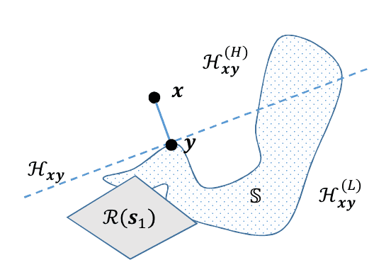
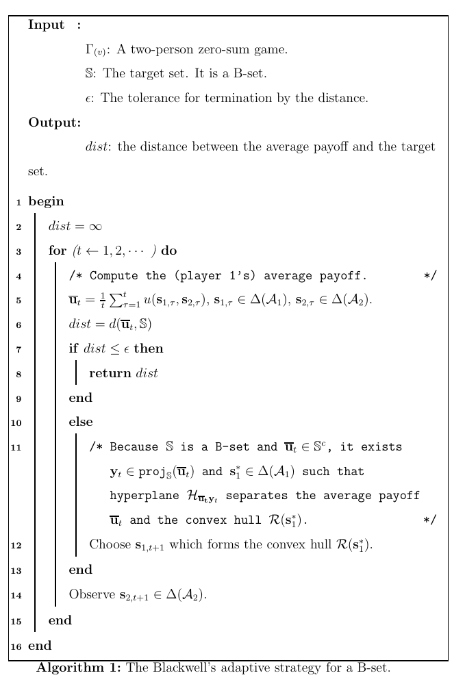
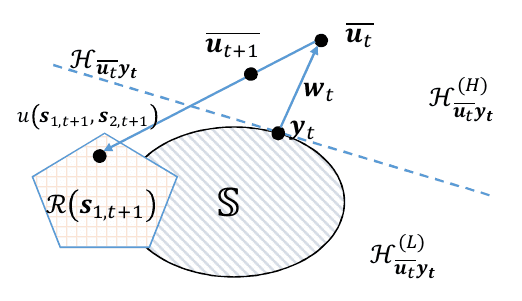

# 可接近集的充要條件

## 向量報酬策略賽局(Spinat, 2002)

> $$N$$人向量報酬賽局$$\Gamma_{v}=(\mathcal{N}, (\mathcal{A}_i)_{ i \in \mathcal{N} }, (u_i)_{i \in \mathcal{N}})$$
>
> * $$\mathcal{N}$$為編號1到$$N$$的玩家集合。
> * $$\mathcal{A}_i$$為編號$$i$$​玩家的有限行動集合。
> * $$u_i: \prod_{i \in \mathcal{N}} \mathcal{A}_i \rightarrow \mathbb{R}^v$$為$$v$$​為的向量報酬函數。
>
> $$v=1$$時為傳統的賽局，以下考慮$$2 \leq v < \infty$$的賽局。

以下定義向量空間的操作與集合：

* $$\| x\|^2 = x^{\top} x$$為歐式空間的標準範數(standard norm)。
* $$d(x, \mathbb{S})=\inf_{y \in \mathbb{S}}d(x,y)$$為點$$x$$到集合$$\mathbb{S}$$的距離。
  * 如果$$\mathbb{S}$$為凸集合時，則點$$y$$唯一，即$$\mathbb{S}$$中其它的點到點$$x$$的距離均大於點$$y$$至$$x$$的距離。
* 令$$\mathcal{U}$$為所有向量報酬$$u(a_1, a_2) \in \mathbb{R}^v, ~\forall a_1 \in \mathcal{A}_1, ~ a_2 \in \mathcal{A}_2$$形成的凸包(convex hull)。
* 令$$\mathbf{U}$$$$\in \mathbb{R}^{|\mathcal{A}_1| \times |\mathcal{A}_2| \times v}$$為向量報酬矩陣。
* $$\displaystyle \Delta(\mathcal{A}_i) =\left\{ \mathbf{s}_i \in \mathbb{R}_+^{|\mathcal{A_i}|} ~\bigg| ~\sum_{p=1}^{|\mathcal{A_i}|} \mathbf{s}_i[a_p]=1 \right\}$$為第$$i$$個玩家的混合策略集合。其中$$s_i[a_p]$$為玩家$$i$$採取行動$$a_p$$的機率。
* $$\mathcal{R}(s_1) = \left\{   \mathrm{conv}(s_1^\top \mathbf{U}  s_2) ~ |~ \forall s_2 \in \Delta(\mathcal{A}_2) \right\}$$為給定玩家的混合策略$$s_1$$​後，對手所有可能的混合策略報酬形成的凸包。
* 同理$$\mathcal{S}(s_2) = \left\{   \mathrm{conv}(s_1^\top \mathbf{U}  s_2) ~ |~ \forall s_1 \in \Delta(\mathcal{A}_1) \right\}$$為給定對手的混合策略$$s_2$$​，玩家所有的混合策略報酬形成的凸包。

### 可接近集合(approachable set)

> 雙人零和重複賽局$$\Gamma_v$$​中，集合$$S$$​滿足以下條件時，稱為可接近集合。
>
> * $$\begin{aligned} & \exists s_{1,t} \in \Delta(\mathcal{A}_1)~ \forall \epsilon > 0~ \forall \delta >0 ~ \exists t_0 \in   \mathbb{N} \ni \\  & \forall s_{2,t} \in \Delta(\mathcal{A}_2), \mathrm{P}(\sup_{t \geq t_0} d(\overline{u}_t, S) \geq \epsilon) \leq \delta  \end{aligned}$$
> * $$\overline{u}_t\equiv \overline{u_1(a_t)} = \frac{1}{t} \sum_{\tau=1}^t u_1(a_\tau)$$為玩家到時間$$t$$​的平均報酬。

此定義即玩家存在混合策略$$s_{1,t} \in \Delta(\mathcal{A}_1)$$使得不論對手使用任意策略$$s_{2,t} \in \Delta(\mathcal{A}_2)$$，玩家的平均報酬$$\overline{u}_t$$與集合$$S$$的距離在$$t \rightarrow \infty$$時幾乎確定為０，即$$\displaystyle \lim_{t \rightarrow \infty } d (\overline{u}_t, S) =0 ~ \text{ a.s. }$$。

<mark style="color:red;">由於玩家存在有上述性質的策略，因此當玩家使用此種策略時，最後與平均報酬距離為0的集合稱為可接近集合</mark>。

* 由定義可知，任何可接近集合的超集合也是可接近集合。
* 因為所有的報酬的平均值必定落在凸包$$\mathcal{U}$$​內，因此$$\mathcal{U}$$​為可接近集合。
* 由上述定義可定義可接近閉集合$$S \subseteq \mathcal{U}$$。

可接近定理可用幾何方式說明。令$$x,y \in \mathbb{R}^v$$為相異的兩點：

通過點$$y$$的超平面(hyperplane)為$$H_{xy} =\{z \in \mathbb{R}^v ~|~ w^\top z =c , ~ w=x-y \}$$。$$w=x-y$$為其法向量

可定義兩個半空間(half-spaces)

* &#x20;$$H_{xy}^{(H)} =\{z \in \mathbb{R}^v ~|~ w^\top z \geq c  \}$$
* $$H_{xy}^{(L)} =\{z \in \mathbb{R}^v ~|~ w^\top z \leq c  \}$$

定義$$x \in S^c$$，而點$$x$$投影到集合$$S$$的點為最近的點，即$$\mathrm{proj}_S(x) = \{y \in S ~|~ d(x,y) = d(x,S) \}$$。因為$$S$$​為閉集合，因此$$\mathrm{proj}_S(x)\neq \empty$$。

當$$S$$​為凸集合時，$$\mathrm{proj}_S(x)$$為唯一的點，令$$\mathrm{proj}_S(x)=y \in S, ~ \forall x \in S^c$$。

#### 定義：B-set

> 閉集合$$S$$​滿足以下Blackwell條件時，稱為B-set。
>
> $$\forall x \in S^c$$, $$\exists s_1 \in \Delta(\mathcal{A}_1)$$, $$\exists y \in \mathrm{proj}_S(x)$$ $$\ni$$$$H_{xy}$$ 可分隔點$$x$$與凸包$$\mathcal{R}(s_1)$$。
>
> 不失一般性，令$$x \in H_{xy}^{(H)}$$且$$\mathcal{R}(s_1) \subseteq H_{xy}^{(L)}$$.&#x20;
>
> 注意：$$S$$不必為凸集合。

#### 定義：適應性策略(adaptive strategy)

> 給定B-set $$S$$，稱函數$$\phi: S^c \rightarrow \Delta(\mathcal{A}_1)$$為集合$$S$$的適應性策略若滿足 $$\forall x \in S^c$$, $$\exists y \in \mathrm{proj}_S(x) \ni  H_{xy}$$分離點$$x$$與凸包$$\mathcal{R}(\phi(x))$$。

### Blackwell可接近定理(approachability theorem, BAT)

> 1. 令$$S$$為閉集合。若$$S$$為​B-set，則$$S$$​為可接近集合。
> 2. 令$$S$$為閉凸集合。$$S$$為B-set，若且唯若$$S$$為可接近集合。
> 3. 令$$S$$為閉凸集合。若對於對手的任意策略$$s_2 \in \Delta(\mathcal{A}_2)$$​，玩家均存在對應的混合策略$$s_1(s_2) \in \Delta(\mathcal{A}_2)$$使得報酬$$u(s_1(s_2), s_2) \in S$$，則$$S$$為可接近集合。

proof (1,2的充分條件)：

Blackwell在論文中直接建立了適應性策略可接近B-set。

* 因為$$S$$為閉集合，且為B-set，下面演算法中，因為點$$\overline{u}_t$$和集合$$S$$的距離大於$$\epsilon$$，因此$$\overline{u}_t \in S^c$$。
* 因為$$S$$為B-set，$$\overline{u}_t \in S^c$$由定義得存在$$s_1^* \in \Delta(\mathcal{A}_1)$$且存在$$y_t \in \mathrm{proj}_S(\overline{u}_t)$$使得超平面$$H_{\overline{u}_t y_t}$$可分隔點$$\overline{u}_t$$與凸包$$\mathcal{R}(s_1^*)$$。
* 令$$s_{1,t+1} \equiv s_1^*$$必可使$$\overline{u}_{t+1}$$越來越接近$$S$$，即$$d(\overline{u}_t, S) \geq d(\overline{u}_{t+1}, S)$$。 (QED)

proof 2的必要條件：

因為$$S$$​為凸集合，因此任意點$$\overline{u}_t \in S^c$$投影至集合$$S$$​必為唯一一點，令$$y_t = \mathrm{proj}_S(\overline{u}_t)$$。

令方向向量$$w_t=\overline{u}_t-y_t$$，則通過點$$y_t$$且以$$w_t$$為法向量的超平面為$$H_{\overline{u}_t y_t} = \{ z \in \mathbb{R}^v ~|~ w_t^\top z = c \}$$。

因為$$S$$​為閉凸集合，根據supporting hyperplane theorem，集合$$S$$​必定為$$H_{\overline{u}_t y_t}$$形成的半空間的子集合，且$$\overline{u}_t$$必定落在與$$S$$相異的另一半空間。即$$S \subseteq  H_{\overline{u}_t y_t}^{(L)}$$且$$\overline{u}_t \in H_{\overline{u}_t y_t}^{(H)}$$。

對於可接近集合$$S$$​, 由定義得存在混合策略 $$s_{1,t}^{*} \in \Delta(\mathcal{A}_1)$$使得$$\displaystyle \forall s_{t,2} \in \Delta(\mathcal{A}_2), ~ \lim_{t\rightarrow \infty} d(\overline{u}_t, S) = 0$$ a.s.。

若凸包$$\mathcal{R}(s_{1,t}^{*}) \cap H_{\overline{u}_t y_t }^{(H)} \neq \empty$$，表示對手存在特定的混合策略$$s_{t,2}^{*}$$使得獎勵$$u(s_{1,t}^{*}, s_{2,t}^{*}) \in \mathcal{R}(s_{1,t}^{*}) \cap H_{\overline{u}_t y_t }^{(H)}$$，此時若對手持續使用此特定策略時，則$$\overline{u}_t$$無法接近集合$$S$$，與$$S$$為可接近的集合假設矛盾，因此可得$$\mathcal{R}(s_{1,t}^{*}) \in  H_{\overline{u}_t y_t }^{(L)}$$。

由於$$\overline{u}_t \in H_{\overline{u}_t y_t }^{(H)}$$，可得$$S$$為B-set (QED).&#x20;

proof 3:

令閉凸集合$$S$$位於半空間$$H^{(L)} = \{ x \in \mathbb{R}^v ~|~ w^\top x \leq c\}$$。

由給定的條件知 $$\forall s_2 \in \Delta(\mathcal{A}_2) \exists s_1(s_2) \in \Delta(\mathcal(A)_1) \ni u(s_1(s_2), s_2) \in S \subseteq H^{(L)}$$，即$$w^\top u(s_1(s_2), s_2) \leq c$$。

由純量版本的最大最小定理，可得$$\exists s_1^* \in \Delta(\mathcal{A}_1) \ni \forall s_2 \in \Delta(\mathcal{A}_2) , ~ w^\top u(s_1^{*}, u_2) \leq c$$，即凸包 $$\mathcal{R}(s_1^{*}) \subseteq H^{(L)}$$，此結論在任包含$$S$$的半空間$$H^{(L)}$$均成立。

令$$\overline{u}_t \in S^c$$，且$$S$$為凸集合，因此可得唯一投影點$$y_t = \mathrm{proj}_{S}(\overline{u}_t)$$。

使用Blackwell adaptive strategy，可得超平面$$H_{\overline{u}_t y_t} =\{   x \in \mathbb{R}^v ~|~ w_t^\top x = c \}$$，得對應的半空間$$S \subseteq H_{\overline{u}_t y_t}^{(L)}$$且$$\mathcal{R}(s_1^{*}) \subseteq H_{\overline{u}_t y_t}^{(L)}$$。

由上性質可得若玩家總是選擇混合策略$$s_{1,t+1}=s_1^{*}$$，則$$\mathcal{R}(s_{1,t+1)}) \subseteq H_{\overline{u}_t y_t}^{(L)}$$，因為$$\overline{u}_t \subseteq H_{\overline{u}_t y_t}^{(H)}$$，所以$$S$$為B-set。(QED)

## Blackwell adaptive strategy收斂性分析

> Blackwell adaptive strategy(BAS)的收斂速率為$$O(\sqrt{\frac{1}{T}})$$

令$$y_t = \mathrm{proj}_S(\overline{u}_t)$$，使用BAS可得：

$$\displaystyle \begin{aligned} d(\overline{u}_{t+1}, S)^2 & \leq d(\overline{u}_{t+1}, y_t)^2 \\     & = \| \frac{t}{t+1}\overline{u}_t + \frac{1}{t+1}u(s_{1,t+1}, s_{2, t+1}) - y_t  \|^2 \\     & = \left(\frac{t}{t+1} \right)^2 \| \overline{u}_t - y_t\|^2 + \\     & \left(\frac{t}{t+1}\right)^2 \| u(s_{1,t+1}, s_{2, t+1}) - y_t \|^2 + \\     & \left(\frac{2t}{(t+1)^2} \right) (u_t - y_t)^\top (u(s_{1,t+1}, s_{2, t+1}) - y_t)  \end{aligned}$$

上式不等式成立是因為三角不等式；因為$$\overline{u}_t$$投影到集合$$S$$的距離，不大於其它在$$S$$上點$$y_t$$的距離。

因為$$\overline{u}_t$$與$$u(s_{1,t+1}, s_{2, t+1})$$位於超平面$$H_{\overline{u}_t y_t}$$的相異半空間，則方向向量$$\overline{u}_t -y_t$$與$$u(s_{1,t+1}, s_{2, t+1}) - y_t$$的夾角不小於$$\pi/2$$。

由歐式空間的標準內積$$x^\top y =\|x\| \|y\| \cos \theta$$且$$\theta > \pi/2$$可知上述不等式最後一行為負值。

因為$$d(\overline{u}_{t}, S) = d(\overline{u}_{t}, y_t)$$，不等式可改寫為：$$(t+1)^2 d(\overline{u}_{t}, S)^2 \leq t^2 d(\overline{u}_{t}, S)^2 + \|u(s_{1,t+1}, s_{2, t+1})- y_t\|^2$$

不失一般性，令$$S$$為單位圓的子集合，則$$\|u(s_{1,t+1}, s_{2, t+1})- y_t\|^2 = O(1)$$。

重複處理上式可得$$\begin{aligned} & T^2 d(\overline{u}_{T}, S)^2 \leq d(\overline{u}_{1}, S)^2 + O(T) \\ & \Rightarrow d(\overline{u}_{T}, S)^2 \leq O(\sqrt{\frac{1}{T}}) \end{aligned}$$(QED)
