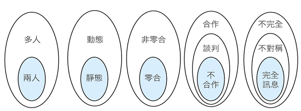

# 賽局理論基礎

## 簡介

賽局理論是研究<mark style="background-color:red;">**理性者互動的策略選擇**</mark>。新古典經濟學也是假設人在做經濟決策時絕對理性，因此會極大化個人的報酬 (註：此假設和強化學習中最大的不同點在於雙人賽局中，<mark style="color:red;">賽局理論假設雙人會最大化自已的報酬，因此需要考慮最壞情境</mark>；而強化學習只要考慮過去歷史中，環境最有可能的反應即可，兩者的目標函數不同)。

關鍵步驟：發現在給定其它參賽者策略下，找出參賽者的最佳反應(即給定或預期其它參賽者將選擇的策略中，能帶來最大報酬(不一定會考慮風險)的策略)。

賽局的源起

1928年數學家von Neumann，首先證明基本min-max定理，才被確立，此定理適用於設定敵我兩方對峙競爭的零和(zero sum)賽局。在此情形下所增加的報酬值，恰為對方所增加之虧損值，而對峙雙方所各增加之報酬值相加，則等於零。

1944年von Neumann 與 Morgenstern的 Theory  of Games and Economic Behavior問世，進一步將賽局理論應用於經濟行為的分析上。
賽局理論的成型與闡揚仍應歸功Theory of Games and Economic Behavior，所謂「零和」是指一方的所得與另一方所失相等的經濟行為。
該書提供了一套系統化分析方法，尋求利害衝突下的最適因應策略，標誌著系統化賽局理論的成形。然而現代賽局理論的內容與該書關係並不大。

John Nash提出「Nash equilibrium」的概念並在1994年得到諾貝爾經濟學的殊榮。Nash均衡是非合作賽局(Non-cooperative Game) 的求解觀念。
Albert Tucker也於1950年定義了「囚犯困境」(prisoners’ dilemma)。

賽局論為對決策者間互動的分析。與傳統的代表性決策者 分析方式之最大不同之處，<mark style="background-color:red;">在於將每位決策者對其他決策者行為的知識（knowledge）與預期（expectation）納入分析架構</mark>。

賽局理論 (game theory) 正是研究這類各方在利害相衝突之下的最適因應謀略，透過謀略推估，追求尋求自己最大的勝算或利益，從而在競爭中求生存的<mark style="color:red;">**理性抉擇**</mark>。

在每個賽局中，玩家的決定和行為是相互影響的，每個玩家在做決定時必須考慮其他玩家的反應。做出決定。順序決策問題通常被表示為玩家與環境（或自然）之間的重復賽局。投<mark style="color:red;">資可以簡化為投資者和目標公司之間的雙人零和重復賽局</mark>。

賽局論使用嚴格的數學模型來研究衝突和對抗條件下的最優決策問題。為了建立衝突條件下的決策數學模型，有必要對衝突中的參與者的所有可能的行為模式和行為結果進行數學描述。

## 囚犯困境(the prisoner's dilemma)

有兩個罪犯Alice與Bob，他們兩個人需各自決定認罪或不認罪，支付表(payoff table)中為判刑年數。

如果兩人均認罪，則各判10/10年，如果均不認罪，則各判1/1年，以此類推。

| Bob/Alice  | 認罪    | 不認罪  | Alice最佳解(最小) |
| ---------- | ----- | ---- | ------------ |
| 認罪         | 10/10 | 0/20 | 10           |
| 不認罪        | 20/0  | 1/1  | 0            |
| Bob最佳解(最小) | 10    | 0    | min max=10   |

假設兩人無法溝通，而且只能決定一次(單期賽局)，則Alice可能推理如下：

* Bob只有認罪與不認罪兩種行為。
* 如果Bob認罪，而我不認罪，則Bob不用被關，而我要被關20年 。同樣條件下我認罪要被關10年。因此Bob認罪時，我的最佳選擇為認罪。
* 如果Bob不認罪，我也不認罪，則Bob與我都會被關1年，但我如果認罪就不用被關。
* 因此Alice推論出最佳選擇為認罪。

<mark style="color:red;">同樣Bob使用以上推論也會得出認罪的結論，因此兩人均會被關10年，但此問題中兩人最佳解為均不認罪</mark>。

## 賽局的標準式與擴展式

| **特性**   | **標準式（Normal Form）** | **擴展式（Extensive Form）** |
| -------- | -------------------- | ----------------------- |
| **表示形式** | 支付矩陣                 | 樹狀圖                     |
| **行動順序** | 不考慮                  | 明確表示                    |
| **資訊結構** | 不考慮                  | 可表示資訊集與資訊不對稱            |
| **適用賽局** | 靜態賽局（如囚徒困境）          | 動態賽局（如序貫賽局）             |
| **分析重點** | 策略組合與收益              | 行動順序、策略路徑與收益            |
| **均衡概念** | 納許均衡                 | 子賽局完美均衡                 |

### 標準式（Normal Form）

* **定義**: 標準式是一種靜態的賽局表示方法，通常用於描述賽局中所有玩家的策略選擇及其對應的收益。
* **特點**:
  * 強調策略組合與收益，不考慮行動的順序。
  * 通常以矩陣形式表示（尤其是兩人賽局）。
  * 適合分析同時行動或策略選擇不明顯依賴時間順序的賽局。
* **表示方法**:
  * **玩家**: 列出所有參與賽局的玩家。
  * **策略**: 每個玩家的策略集合。
  * **收益**: 每個策略組合對應的收益（通常以矩陣形式呈現）。
* **優點**:
  * 簡單直觀，適合分析靜態賽局。
  * 易於計算納什均衡（Nash Equilibrium）。
* **缺點**:
  * 無法表示行動的順序與動態性。
  * 對於複雜賽局，矩陣可能過於龐大。

### **擴展式（Extensive Form）**

* **定義**: 擴充套件式是一種動態的賽局表示方法，通常用於描述賽局中玩家的行動順序、資訊結構與策略選擇。
* **特點**:
  * 強調行動的順序與賽局的動態性。
  * 通常以樹狀圖表示，節點代表決策點，邊代表行動。
  * 適合分析順序行動或資訊不對稱的賽局。
* **表示方法**:
  * **節點**: 每個節點代表一個決策點，標明是哪個玩家的回合。
  * **邊**: 每條邊代表一個可能的行動。
  * **資訊集**: 表示玩家在決策時是否知道之前的行動（用虛線連線節點）。
  * **收益**: 在終端節點標明每個玩家的收益。
* **優點**:
  * 能清晰表示行動順序與資訊結構。
  * 適合分析動態賽局與子賽局完美均衡（Subgame Perfect Equilibrium）。
* **缺點**:
  * 對於複雜賽局，樹狀圖可能過於龐大。
  * 分析過程較為複雜。

### 資訊集(information set)

* **資訊集**是擴充套件式賽局中，玩家在某一決策點所知道的資訊集合。
* 它由一組決策節點（Nodes）組成，這些節點對玩家來說是**不可區分**的，即玩家無法確定自己具體處於哪一個節點。
* 資訊集反映了玩家在決策時的**資訊不對稱**或**不完全資訊**。

#### **資訊集的表示**

* 在擴充套件式的樹狀圖中，資訊集通常用**虛線**或**橢圓**將相關的決策節點連線起來。
* 如果一個資訊集中只有一個節點，表示玩家在該決策點擁有**完全資訊**。
* 如果一個資訊集中包含多個節點，表示玩家在該決策點擁有**不完全資訊**。

&#x20;**資訊集的作用**

* **表示資訊不對稱**: 資訊集可以描述玩家在決策時是否知道其他玩家的行動或賽局的歷史。
  * 例如，在撲克遊戲中，玩家不知道對手的牌，這可以用資訊集表示。
* **區分賽局型別**:
  * **完美資訊賽局**: 每個資訊集只包含一個節點，玩家知道所有之前的行動。
  * **不完美資訊賽局**: 至少有一個資訊集包含多個節點，玩家無法區分這些節點。
* **影響策略選擇**: 玩家在資訊集中的決策基於對可能狀態的判斷，這會影響均衡分析。

**資訊集的例子**

**例子1: 完美資訊賽局**

* **賽局描述**: 玩家A先選擇「上」或「下」，玩家B觀察到A的選擇後再選擇「左」或「右」。
* **資訊集**:
  * 玩家A的資訊集只有一個節點（完全資訊）。
  * 玩家B的資訊集有兩個節點，分別對應A選擇「上」或「下」，但B知道A的選擇，因此每個資訊集只有一個節點。

**例子2: 不完美資訊賽局**

* **賽局描述**: 玩家A先選擇「上」或「下」，但玩家B不知道A的選擇，只能根據自己的判斷選擇「左」或「右」。
* **資訊集**:
  * 玩家A的資訊集只有一個節點（完全資訊）。
  * 玩家B的資訊集包含兩個節點（對應A選擇「上」或「下」），因為B無法區分A的選擇。

### 賽局分類

* 依賽局的參與人數（玩家數），最少是兩人賽局，大於兩人均稱多人賽局。
* 按照參賽者的先後順序進行分類。可以劃分為靜態賽局 (static game) 和動態賽局 (dynamic game)。
  * 「靜態賽局」或單回合賽局 (one-shot game)，是指在賽局中，參賽者同時出招 simultaneous game)，互動一次即終止賽局，例如兒時所玩的「剪刀、石頭、布」。
  * 「動態賽局」或多回合 (重複) 賽局 (repeated game) 是指在賽局中，參賽者的行動有先後順序，且後行動者能觀察到先行動者所選擇的行動。&#x20;
    * 換句話說，在動態競爭下，參與者出招有先後之別，往往在觀察到對手的動作之後，才決定自己的動作，競爭者之間形成動態的互動現象。
      * 例如下象棋或圍棋，以及井字遊戲 (隨機決定一人先畫○或×，先成一線者勝)。
        事實上，參賽的各方都是一種「不合作賽局」，也就是只要對手的謀略確定，參賽者就可以有利己的最適反應。這時各自的一組謀略其實就是一種策略思考。
* 如果賽局中，所有玩家的報酬總和為0時，稱為零和賽局。否則為非零和賽局。
* 按照參賽者對其他參與者的瞭解程度進行分類。從這個角度，賽局可以劃分為完全資訊賽局和不完全資訊賽局。
  * 完全資訊賽局（訊息完整）是指在賽局過程中，每一位參賽者對其他參賽者的特徵、策略空間及收益函數有準確的資訊
  * 如果參賽者對其他參賽者的特徵、謀略空間及收益函數資訊瞭解得不夠準確，或者不是對所有參與者的特徵、策略空間及收益函數都有準確資訊，在這種情況下進行的賽局就是不完全資訊賽局（訊息不完整）。
* 按照參賽者之間是否合作進行分類。從這個角度，賽局可以劃分為合作賽局和非合作賽局。
  其中「合作賽局」是指參賽者之間存有一個對各方具有約束力的協定，參賽者在協定範圍內進行的賽局。反之，就是「非合作賽局」。

策略互動 (Strategic Interaction)

由於我們生活在多決策者的世界，**某一決策者的決策會改變其他決策者決策所能達到的結果**。倘若決策者的決策過程不考慮其他決策者的反應，他所預期的實現結果未必會發生；如此，此決策將是非最佳的。例如：候選人的競選策略可能因忽略競爭對手的反應，而成效不佳。不要忘記：當我們極大化己方的報酬時，對手也正努力極大化他自己的報酬。

給定決策者知悉他的決策結果會影響其他人的行為，他可能選擇改變目前 的決策內容。同理，當此決策者的決策改變後，其他決策者的最佳反應（best response）可能是改變原先的決策。如此週而復始，直到給定其他所有人的決策， 每一個決策者都無誘因改變其決策為止，此時策略均衡(equilibrium)便達成了。

## 賽局的定義

什麼叫做賽局（game）？一個賽局有以下組成要素：

* 參賽者(玩家)集合（set of players）
* 策略(行動)集合（set of strategies, actions）
* 報酬集合（set of payoffs）
* 遊戲規則 （rule of the game）
* 資訊結構 （information  structure）
* 移動順序 （sequence of moves）

參賽者：有兩個或兩個以上的決策者，稱為參賽者 (player)。
參賽者指賽局中選擇以自身利益最大化的決策主體 (可以是個人，也可以是團體，如廠商或國家)。

策略(行動)：指參賽者每個人有兩個或以上行動方案的選擇決定其行為的規則，也就是指參賽者應該在何種條件下選擇何種行動，以保證自身最大利益。參賽者的策略集合可能相同或相異。

報酬(payoff)：每一個參賽者對於各種可能的出象 (outcome) 都有明確的偏好順序，因此對每一個出象的償付給定一個數字，以表示這些偏好順序。

賽局規則：參賽者在賽局中應遵守的規則，例如，同時決定謀略或先後決定謀略。
不同的賽局有不同的規則，例如，象棋為以最先擒得對方主帥者為贏家；
&#x20;高爾夫球賽為以最少桿數完成所有洞數者為勝；
花式滑冰的競賽規則是由數位評審對於其技巧以及藝術的主觀評分之平均值高低決定贏家。

## 賽局表達形式

可分為標準型（表格結構）與擴展型（樹狀結構）。

## 單純與混合策略（pure and mixed strategy）

