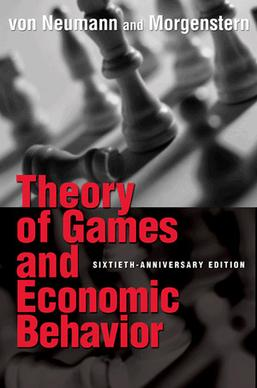

# 賽局理論文獻

## 書本

<figure><figcaption>
TGEB, 賽局理論的原創經典之作
</figcaption></figure>

John Von Neumann and Oskar Morgenstern,  "Theory of games and economic behavior (60th Anniversary Commemorative Edition)," Princeton university press, 2007. \[[jstor](https://www.jstor.org/stable/j.ctt1r2gkx)]\[[Wikipedia](https://en.wikipedia.org/wiki/Theory\_of\_Games\_and\_Economic\_Behavior)]\(原版1947年出版，為賽局理論的原創經典之作，內容偏數學不適合當第一本書，但進階必讀。本書主題探討的雙人->多人的非合作零和賽局)。

<figure><figcaption>
賽局理論
</figcaption></figure>

Martin J. Osborne and Ariel Rubinstein, "A course in game theory," MIT press, 1994. \[[作者提供電子書](https://arielrubinstein.tau.ac.il/books/GT.pdf)] 以公理化的方式定義賽局，此書的深度，廣度，視角，表述，例題等極優秀，也非常適合自學，需要有數學基礎且很精簡的書。

## 論文

* David Blackwell, "An analog of the minimax-theorem for vector payoffs, " Pacific Journal of Mathematics, Vol. 6.1 pp. 1-8, 1956. \[[筆記](blackwells-approachability-theorem.md)]\(一般賽局為實數值報酬函數，而此論文討論的是向量值報酬函數且值域非固定值可以隨機變數的性質。此類型報酬函數在多期的最小化遺憾問題中為核心問題，相當重要)。
