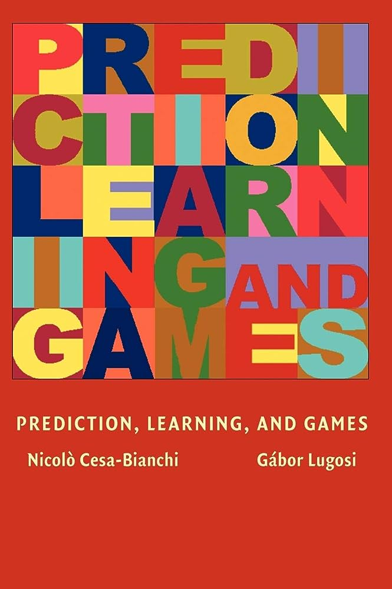

# 賽局理論文獻

## 書本

<figure><figcaption>
TGEB, 賽局理論的原創經典之作
</figcaption></figure>

John Von Neumann and Oskar Morgenstern,  "Theory of games and economic behavior (60th Anniversary Commemorative Edition)," Princeton university press, 2007. \[[jstor](https://www.jstor.org/stable/j.ctt1r2gkx)]\[[Wikipedia](https://en.wikipedia.org/wiki/Theory\_of\_Games\_and\_Economic\_Behavior)]\(原版1947年出版，為賽局理論的原創經典之作，內容偏數學不適合當第一本書，但進階必讀。本書主題探討的雙人->多人的非合作零和賽局)。

<figure><figcaption>
賽局理論
</figcaption></figure>

Martin J. Osborne and Ariel Rubinstein, "A course in game theory," MIT press, 1994. \[[作者提供電子書](https://arielrubinstein.tau.ac.il/books/GT.pdf)] 以公理化的方式定義賽局，此書的深度，廣度，視角，表述，例題等極優秀，也非常適合自學，需要有數學基礎且很精簡的書。

<figure><figcaption>
prediction, learning, and games
</figcaption></figure>

Nicolo Cesa-Bianchi and Gábor Lugosi,  "Prediction, learning, and games," Cambridge university press, 2006. \[[電子書](https://ii.uni.wroc.pl/\~lukstafi/pmwiki/uploads/AGT/Prediction\_Learning\_and\_Games.pdf)] 此書將預測，多期賽局的遺憾整合分析與討論，可應用至在線學習(online learning)與強化學習。

## 論文

### 向量報酬(vector payoff)

雙人重覆賽局中，向量報酬存在可接近的集合，也可用於在線學習的收斂分析中。

* David Blackwell, "An analog of the minimax-theorem for vector payoffs, " Pacific Journal of Mathematics, Vol. 6.1 pp. 1-8, 1956. \[[筆記](blackwells-approachability-theorem.md)]\(一般賽局為實數值報酬函數，而此論文討論的是向量值報酬函數且值域非固定值可以隨機變數的性質。此類型報酬函數在多期的最小化遺憾問題中為核心問題，相當重要)。
* Xavier Spinat, "A necessary and sufficient condition for approachability, " Mathematics of operations research, Vol. 27, No. 1, pp 31-44, 2002. (在雙人重覆賽局中，Blackwell定義了集合的可接近性與充分條件，而此論文討論了此集合的充分和必要條件。)
* Ehud Lehrer, "Approachability in infinite dimensional spaces," International Journal of Game Theory,  Vol. 31, pp. 253-268,  2003.
* Emanuel Milman, "Approachable sets of vector payoffs in stochastic games," Games and Economic Behavior,  Vol. 56, pp. 135-147, 2006.
* Shie Mannor and Vianney Perchet, "Approachability, fast and slow," Journal of Machine Learning Research: Workshop and Conference Proceedings,  Vol. 30, pp. 1-016,  2013. (一般的最小化遺憾算法以$$\frac{1}{\sqrt{N}}$$的速度收斂，而在特定問題中，可以$$\frac{1}{N}$$的速度收斂。)
* Nahum Shimkin, "An online convex optimization approach to Blackwell's approachability, " The Journal of Machine Learning Research,  Vol.  17, No .1, pp. 4434-4456, 2016.

### 相關均衡(correlated equilibrium)

* Sergiu Hart and Andreu Mas‐Colell, "A simple adaptive procedure leading to correlated equilibrium," ecometrica,  Vol. 68, No. 5, pp. 1127-1150, 2000.
* Sergiu Hart and Andreu Mas-Colell,  "A general class of adaptive strategies." Journal of Economic Theory, Vol. 98, No. 1, pp. 26-54,  2001.&#x20;

### 校準(calibration)

* Dean P. Foster and Rakesh V. Vohra,  "Calibrated learning and correlated equilibrium," Games and Economic Behavior, Vol. 21, pp. 40-55,  1997.
* Dean P. Foster and Rakesh V. Vohra, "Asymptotic calibration," Biometrika,  Vol. 85, No. 2, pp. 379-390, 1998.
* Alvaro Sandroni, Rann Smorodinsky, and Rakesh V. Vohra, "Calibration with many checking rules, " Mathematics of operations Research,  Vol. 28, No. 1, pp. 141-153, 2003.

### 預測與遺憾(prediction and regret)

在T期實驗中，事先已知N個專家中，某一個(編號為i)專家的報酬(績效)最高，而我們的方法相對於專家i績效的差值稱為外部遺憾，已經有許多算法可在在不知道那一個專家表現最好時，可以o(T)的速度最小化外部遺憾；而內部遺憾中，一樣有N個專家，在經過T期時，如果原先選擇的是專家i，相對於專家j的績效差異，共有N(N-1)組，而內部遺憾最小化是最小化此N(N-1)組遺憾之值。

* Nick Littlestone  and Manfred K. Warmuth, "The weighted majority algorithm," Information and computation, Vol. 108, pp. 212-261,  1994.
* Yoav Freund  and Robert E. Schapire, "Adaptive game playing using multiplicative weights, " Games and Economic Behavior,  No. 29, pp. 79-103, 1999 .
* Nicolo Cesa-Bianchi and Gábor Lugosi, "Potential-based algorithms in on-line prediction and game theory, " Machine Learning,  Vol. 51, pp. 239-161, 2003.
* Dean P. Foster  and Rakesh Vohra, "Regret in the on-line decision problem. " Games and Economic Behavior, Vol. 29, pp. 7-35, 1999. (提出了內部遺憾最小化的演算法，且將許多問題(universal portfolios, bayes risk in repeated plays, pesudo-games...)歸類為此類問題，可用相同算法求解)
* Gilles Stoltz  and Gábor Lugosi, "Internal regret in on-line portfolio selection," Machine Learning, Vol. 25, pp. 125-159, 2005. (將內部遺憾最小化問題應用到投資組合，且分析了遺憾上限)
* Avrim Blum and Yishay Mansour, "From external to internal regret," Journal of Machine Learning Research, Vol. 8, pp. 1307-1324 , 2007. (提出了將外部遺憾最小化演算法，轉換後可用於求解內部遺憾最小化問題，且於完整知識或部份知識問題均可使用。若所有玩家均最小化內部遺憾，則會收斂至相關均衡(correlated equilibrium)。)
* Ehud Lehrer and Eilon Solan, "A general internal regret-free strategy," Dynamic Games and Applications, Vol. 6, pp. 112-138, 2016.

## 學者

* Robert J. Aumann, \[[website](http://www.ma.huji.ac.il/\~raumann/)]\[[wikipedia](https://en.wikipedia.org/wiki/Robert\_Aumann)]
