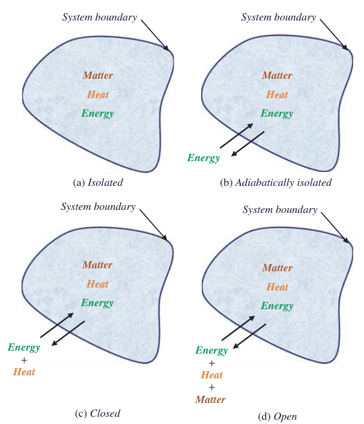
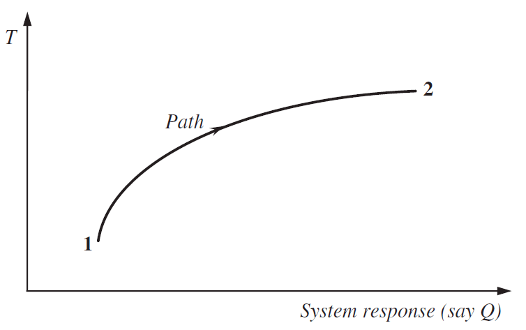
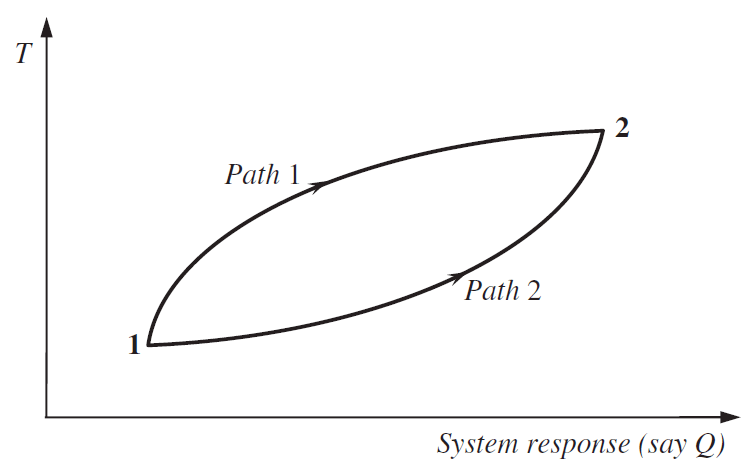

# 熱力學熵(thermodynamics entropy)

## 簡介

熱力學的熵、統計力學的熵、資訊熵包含了Shannon熵，指數熵(exponential entopry)、Tsalli熵、Renyi熵。

## 熱力學系統(system of thermodynamics)

<mark style="color:blue;">在熱力學中，一個系統被定義為宇宙中由大量粒子組成的任何部分</mark>。宇宙的其餘部分則被稱為周圍環境。熱力學將系統分為四類，取決於對它們的約束。系統的分類是基於（i）物質、（ii）熱量和/或（iii）能量跨越系統邊界的轉移。

這四類系統包括&#x20;

1. 孤立的系統(Isolated systems)：這些系統不允許物質或能量跨越其邊界的交換。
2. 絕熱隔離的系統(Adiabatically isolated systems)：這些系統不允許熱的傳遞（也是物質的傳遞），但允許能量的跨邊界傳遞。
3. 封閉系統(closed systems)：這些系統不允許物質的轉移，但允許能量作為功或熱的轉移。&#x20;
4. 開放系統(open systems)：這些系統由其幾何邊界定義，允許與一些化學物質的分子一起交換能量和熱量。

<figure><figcaption>
熱力學系統分類
</figcaption></figure>

<mark style="color:red;">熱力學第二定律指出，一個系統的熵只能增加或保持不變；這一定律只適用於孤立的或絕熱的系統。絕大多數系統都屬於第4類開放系統</mark>。隔離和封閉在自然界中並不常見。

### 系統狀態

一個系統有兩種狀態：<mark style="color:red;">微觀狀態(microstate)和宏觀狀態(macrostate)</mark>。

一個系統和它周圍的環境可以相互隔離，對這樣的系統來說，沒有熱量或物質與它周圍的環境相互交換。這樣的系統最終達到熱力學意義上的平衡狀態，意味著系統的狀態不會發生重大變化。

這裡的系統狀態指的是宏觀狀態，而不是原子尺度的微觀狀態，因為這樣一個系統的微觀狀態將不斷變化。宏觀狀態是一種熱力學狀態，可以通過觀察熱力學變數，如壓力、體積、溫度等來完全描述。因此，在經典熱力學中，一個系統是由它的宏觀狀態描述的，包含了實驗上可觀察到的特性以及熱和功對系統和周圍環境之間的相互作用的影響。

熱力學不區分系統可能存在的各種微觀狀態，因此不處理原子尺度上的運行機制（Fast, 1968）。對於一個特定的熱力學狀態，可以有許多微觀狀態。當熱力學變數出現可測量的變化時，熱力學狀態就被區分開來。

### 狀態變化

每當一個系統由於引入熱量或提取熱量或任何其他原因而發生變化時，<mark style="color:red;">系統的狀態變化可以有兩種類型：可逆和不可逆</mark>。

* <mark style="color:red;">可逆</mark>的意思是，在可逆過程中發生在系統及其周圍的任何種類的變化都可以通過逆轉過程而恢復過來。指系統的某些屬效能夠在無能量損失或耗散的情形下通過無窮小的變化實現反轉的熱力學過程。<mark style="color:blue;">可逆過程的另一種定義是，過程發生後能夠被復原並對系統本身或外界不產生任何影響的過程稱作可逆過程</mark>。例如，由加熱引起的系統狀態的變化可以通過抽熱來恢復。
* 相反，在不可逆的狀態改變的情況下，這是不成立的，在這種情況下，如果不改變周圍環境，系統的原始狀態就無法恢復。雖然系統在相同的點上都處於相同的狀態，但每經一次迴圈都對外界環境產生了永久性的改變，這種改變是無法通過過程反轉手段來恢復的。

<mark style="color:red;">自然過程是不可逆的過程。對於可逆過程，它們必須無限緩慢地發生</mark>。

<mark style="color:red;">熱力學第一定律，也叫能量守恆定律</mark>。能量守恆定律，它是基於功和熱的相互轉化上。考慮一個不與周圍環境隔絕的系統，讓一定量的熱量$$dQ$$被引入該系統。這個熱量所做的功(work)表示為$$dW$$。如果 如果系統的內能用$$U$$表示，那麼$$dQ$$和$$dW$$將導致$$U$$的增加：$$dU = dQ + dW$$。

熱量所做的功可能是機械的、電的、化學的、或磁性的，而內能是系統中所有粒子的動能和位能的總和。組成的所有粒子的動能和勢能之和。

若系統由初始狀態1到終止狀態2，則$$\displaystyle \int_1^2 dU = \int_1^2 dQ +\int_1^2 dW$$。其中$$\int_1^2 dU$$之值依賴於狀態1與狀態2，而$$\int_1^2 dQ$$與$$\int_1^2 dW$$除了依賴初始與終止狀態外，還必須考慮狀態變化的路徑(path)。

由於該系統不是孤立而是相互作用的，因此會與周圍環境進行熱和功的交換。如果系統最終恢復到原來的狀態，那麼熱量積分和功積分之和將為零。這意味著內能的積分也將為零。即$$\displaystyle \int_1^2 dU + \int_2^1 dU =0$$。

如果不是這樣的話，能量要麼被創造，要麼被破壞。一個系統的內部能量取決於壓力、溫度、體積、化學成分和結構，這些因素決定了系統的狀態，而不取決於之前的歷史。

## 熱力熵(thermodynamics entropy)

<mark style="color:red;">**熱力學第二定律描寫的是由熵增表徵的不可逆過程**</mark>。

令$$Q$$為熱量的數量。對於系統從狀態1變化到狀態2，總熱量$$\int_1^2 dQ$$並非唯一決定，而是依賴於狀態轉移的路徑。可以有兩條路徑：

1. 可逆路徑：從狀態1過渡到狀態2，然後按照相同的路徑返回到狀態1；
2. 不可逆路徑：從狀態1過渡到狀態2，然後按照不同的路徑返回到狀態1。

第二條路徑導致了工程中所謂的滯後性。在給定的條件下，系統中包含的熱量在這裡是沒有意義的。

<figure><figcaption>
總熱量變化依賴於路徑(可逆)
</figcaption></figure>

<figure><figcaption>
總熱量變化依賴於路徑(不可逆)
</figcaption></figure>

如果$$T$$是絕對溫度(凱式溫度，$$T=273.15+\text{Celsius degree}$$)，則有一個密切相關的量$$\int_1^2 \frac{dQ}{T}$$是可唯一決定的，只要狀態1至2為可逆時，此值與系統的(狀態)路徑無關。

注意在積分時，每個元素的熱量都要除以它被引入的溫度。系統必須消耗這些熱量以完成轉變，這種熱量消耗被稱為熱損失。當從絕對溫度的零點開始計算時。

積分$$\displaystyle S=\int_0^T \frac{dQ_{rev}}{T}$$--(1.1)稱為系統的熵(entropy)，定義為$$S$$。分子$$Q_{rev}$$指可逆路徑的熱量。$$S$$之值為熵從狀態1(對應到絕對溫度0)至狀態2的改變量$$\Delta S= S-S_0$$。

$$S$$定義了Clausius所說的熱力學熵；<mark style="color:red;">它將熱力學第二定律定義為熵增定律，並表明系統的熵的測量取決於熱量的測量，即量熱法</mark>。

公式（1.1）定義了Clausius在1850年給出的實驗性熵。在這種方式下，它被表示為宏觀變數的函數，如溫度和壓力，其數值可以測量到一定的常數，這是從第三定律中得出的。熵$$S$$在溫度的絕對零度上消失了。1865年，Clausius在研究熱機時發現，儘管一個孤立系統的總能量是守恆的，但其中一些能量正在不斷轉化為某種形式，如熱、摩擦等，而且這種轉化是不可恢復的，不能用於任何有用的目的；這部分能量可以理解為能量損失，並可以用熵來解釋。Clausius說，世界的能量是恆定的，而世界的熵在增加。

<mark style="color:red;">第二定律指出，一個封閉系統的熵總是要麼增加要麼保持不變</mark>。一個系統可以小到汽車的活塞、氣缸（如果人們試圖設計一輛更好的汽車），也可以大到一個地區的整個天空（如果人們試圖預測天氣）。一個封閉的系統是與環境的其他部分進行熱隔離的，因此是一種特殊的系統。作為封閉系統的一個例子，考慮一個完全絕緣的水杯，其中溶解了一個方糖。當糖塊融化在水中時，合乎邏輯的說法是，水-糖系統變得更加無序，這意味著其熵增加了。糖塊將永遠不會恢復到它在杯底的原始形態。

然而，這並不意味著水-糖的熵將永遠不會減少。事實上，如果這個系統是開放的，如果加入足夠的熱量使水沸騰，糖會重新結晶，熵會減少。<mark style="color:red;">開放系統的熵一直在減少</mark>，例如，在冰箱中製冰的情況下。當無序的水蒸氣轉變為更有序的液體時，下雨也會自然發生。下雪時也是如此，人們可以看到冰晶或雪花的美麗秩序圖片。事實上，太陽通過將簡單的原子（氫）轉化為更複雜的原子（氦、碳、氧等）而發光。

### 熵的演變內涵

在解釋宏觀世界的熵時，Prigogine（1989）強調了熵的進化內涵，並提出了進化世界必須滿足的三個條件：<mark style="color:red;">**不可逆轉性(Irreversibility)、機率(probability)和一致性(coherence)**</mark>。

<mark style="color:red;">**不可逆轉性**</mark>：在進化過程中，過去和現在不可能是一樣的。不可逆性與熵有關。<mark style="color:red;">對於任何具有不可逆過程的系統，熵可以被認為是兩個組成部分的總和：一個是處理與外部環境的熵交換，另一個是處理內部熵的產生，</mark>它總是正的。對於一個孤立的系統，第一部分是零，因為沒有熵交換，而第二項可能只會增加，達到最大值。自然界有許多過程只向一個方向發生，例如，房子著火後向灰燼方向發展，一個人從嬰兒狀態變成老人，氣體從油箱中洩漏或空氣從汽車輪胎中洩漏，食物被吃掉後被轉化為不同的元素，等等。這類事件與熵有關，熵有增加的趨勢，而且是不可逆轉的。

熵的產生與工程中無處不在的不可逆過程有關。<mark style="color:red;">根據Prigogine（1989）的觀點，熵產生起著雙重作用。它不一定導致無序，但往往可能是產生秩序的機制</mark>。例如，在熱擴散的情況下，熵的產生與產生無序的熱流有關，但它也與導致秩序的反擴散有關。熵的增加規律和結構的產生並不一定是相互對立的。不可逆性導致結構的產生，正如在城鎮發展或作物生長的案例中所看到的那樣。

<mark style="color:red;">**機率(probability)**</mark>：遠離平衡，系統是非線性的，因此對描述其演變的方程有多種解。從不穩定到機率的過渡也導致了不可逆轉性。<mark style="color:red;">熵指出，世界的特徵是不穩定的動態系統</mark>。根據Prigogine（1989），對熵的研究必鬚髮生在三個層面。第一個是熱力學中的現象學層面，其中不可逆過程具有建設性的作用。第二個是不可逆性在經典動力學中的嵌入，其中不穩定性包含了不可逆性。第三個層次是量子理論和廣義相對論及其修改，以包括熱力學的第二定律。

<mark style="color:red;">**一致性(coherence)**</mark>：存在一些一致性的機制，允許對進化的宇宙進行說明，其中有新的有組織的現象發生。演化的宇宙，其中有新的、有組織的現象發生。

## 參考資料

* Vijay P. Singh,  "_Entropy theory and its application in environmental and water engineering," ch1,_ John Wiley & Sons, 2013.
