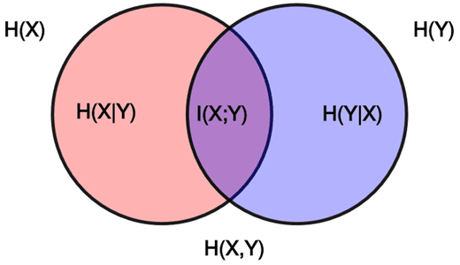

# 資訊測度

## 訊息量

當我們觀測到或聽到一個事件發生時，就得到了一些「訊息」。「訊息量」指的是：該訊息的內涵多寡，也可以這麼說：「訊息」的內涵是用來表達某事件之各種可能結果可能性大小。

**當事件越明確時，關於此事件所能訊息量越小。**而當事件越模糊\(機率接近0.5或1/n，均勻分配\)時，提供一件可供判斷的參考就含有較多的訊息。
 當機率越平均時，也就是個事件發生機率越均勻\(即越無法預測，也越模糊\)，「不確定性」\(uncertainty\)最高，此時訊息熵最大。

故「訊息」可以視為「不確定性」或「訊息選擇的自由度」之度量。\(Information is a measure of one's freedom of choice when one selects a message\)一條資訊的信息量大小和它的不確定性有直接的關係。

比如說，我們要了解一件非常非常不確定的事，或是我們一無所知的事情，就需要瞭解大量的資訊。相反，如果我們對某件事已經有了較多的瞭解，我們不需要太多的資訊就能把它搞清楚。所以，從這個角度來說，我們可以將不確定性\(自由度\)的多寡做為信息量的度量。
簡單的說，**變數的不確定性越大，熵也就越大**。

## 資訊熵

> definition: information entropy
>
> $$H(X) = -\sum_{x \in X} P(x) \log P(x)$$, $$X$$為離散隨機變數$$x$$的樣本空間。
>
> 令 $$0 \log 0 \equiv 0$$\($$\because x \log x \rightarrow 0 \text{ as } x \rightarrow 0$$\)

由於隨機變數$$X$$為函數，因此$$H(\cdot)$$為泛函\(functional\)，且熵的計算與隨機變數$$X$$的實現值$$x$$無關，而與其機率$$P(X=x)$$有關。

* 熵是隨機變數的不確定性的平均度量值，隨機變數變異數越大，即隨機變數越「亂」，則熵之值越大。
* 熵最大值發生在隨機變數為平均分佈\(uniform distribution\)時 \(參考 maxinum entropy principle\)。
* 公式中，$$\log$$以2為底時，$$H(X)$$之值的單位為bit；而以自然數$$e$$為底時，$$H(X)$$之值的單位為nats.
* 熵的值可解釋為使用二進位編碼隨機變數時，其值等於變數的平均編碼長度。

### 熵必為正實數

> $$H(X) \geq 0$$

### 熵可改寫為期望值型式

> $$H(X) = - \sum_{x \in X}P(x) \log P(x) =E(\log \frac{1}{P(x)}) = -E(\log P(x))$$

### 不同對數基底的熵的差異為常數備

> $$H_b(X) = (\log_b(a))H_a(X)$$

### 熵值為0若且唯若隨機變數退化為確定值

> $$H(X) = 0 \Leftrightarrow$$$$X$$的實現值為確定值。

### 熵為凹函數\(開口向下\)

> $$H(\lambda X_1 + (1-\lambda)X_2) \geq \lambda H(X_1) + (1-\lambda)H(X_2)$$

### 熵與聯合熵的關係\(鏈法則\)

> * $$H(X,Y) = H(X) + H(Y|X) = H(Y) + H(X|Y)$$

> $$H(X_1, H_2, \ldots, H_N) = \sum_{i=1}^N H(X_i |X_{i-1}, \ldots, X_2, X_1)$$

* $$H(X_1, H_2)= H(X_1)+H(X_2| X_1)$$
* $$\begin{align} H(X_1, X_2, X_3) & =H(X_1)+H(X_2,X_3|X_1)\\ & =H(X_1)+H(X_2|X_1)+H(X_3|X_1, X_2) \\ \end{align}$$

### 熵的上界受限於隨機變數實現值集合的大小

> 隨機變數$$X$$熵$$H(X)$$的上界，受限於該隨機變數的實現值集合 $$\mathcal{X}$$的機率分佈。

> 對於任意的隨機變數$$X$$, $$H(X)≤log⁡(|\mathcal{X}|)$$，$$|\cdot|$$為集合的基數。
>
> 等號成立於$$X$$在$$\mathcal{X}$$中發生的機率均等時。

## 聯合熵\(joint entropy\)

> 兩個隨機變數$$X,Y$$的熵，可解釋為兩個隨機變數包含的資訊總量。
>
> 令$$P(X,Y)$$為聯合機率密度函數，$$H(X,Y) = - \sum_{x \in X} \sum_{y \in Y} P(x,y) \log P(x,y) = - E(\log P(x,y))$$

### 獨立隨機變數熵的總和為其聯合熵的上界

> $$H(X_1, H_2, \ldots, H_N ) \leq \sum_{i=1}^{N} H(X_i)$$
>
> 等號成立於$$X_i$$與$$X_j$$為兩兩獨立的隨機變數。
>
> 以資訊總量的觀點解釋為當隨機變數兩兩獨立時，資訊總量為可直接加總

## 條件熵 \(conditional entropy\)

> 條件熵$$H(X|Y)$$可解釋為給定隨機變數$$Y$$的資訊後，$$X$$殘餘的資訊量。
>
> $$\begin{align} H(X|Y) &= -\sum_{x \in X} P(x)H(Y|X=x) \\  &= -\sum_{x \in X} P(x) \sum_{y \in Y}P(y|x)\log P(y|x) \\ & = -\sum_{x \in X} \sum_{y \in Y} P(x,y) \log P(y|x) \\ &= -E(\log P(Y|X)) \end{align}$$


$$H(X)−H(X|Y)$$為隨機變數$$X$$的資訊量減去給定隨機變數$$Y$$後$$X$$的資訊量，此時剩下的為$$X$$與$$Y$$共同含有的資訊量$$I(X;Y)$$。

### 條件熵不具有交換性

> $$H(X|Y) \neq H(Y|X)$$，因相異隨機變數的資訊量不相等。

### 兩隨機變數的聯合熵等於單個隨機變數的熵加上條件熵

> $$H(X,Y)=H(X) +H(Y|X) = H(Y) +H(X|Y)$$

推廣可得 $$H(X,Y|Z)=H(X|Z) +H(Y|X,Z)$$

### 條件熵為0若且若且隨機變數為給定隨機變數的函數

> $$H(Y|X) = 0 \Leftrightarrow  \exists f \ni f(X)=Y$$
>
> 若隨機變數$$Y$$為給定隨機變數$$X$$的函數時，即$$Y=f(X)$$，則$$X=x$$的實現值已知時，$$Y$$的實現值$$y=f(x)$$也可得出，不再具有隨機性，因此條件熵為0。

### 給定條件資訊不會增加熵的量\(給定資訊可減少不確定性\)

> $$H(Y|X) \leq H(Y)$$

* 等號成立在$$X$$與$$Y$$為獨立時，即$$I(X;Y)=0$$。
* $$H(Y|X) \leq H(Y)$$ 是考慮所有實現值的平均值，而非特定實現值$$Y=y$$時的不等式。

## 互資訊\(mutual information\)

> 互資訊為兩個隨機變數中相同的資訊量，可想成集合論中的交集部份。
>
> $$\begin{align} I(X;Y) &=\sum_{x \in X}  \sum_{y \in Y}P(x,y) \log{\frac{P(x,y)}{P(x)P(y)}} \\ &=D(P(x,y)\| P(x)P(y)) \\ & =\operatorname {E}_{P(x,y)}\big( \frac{P(x,y)}{P(x)P(y)}\big) \end{align}$$

* $$D(P(x,y) \| P(x)P(y))$$: 可解釋為聯合分佈相對於兩變數為獨立分佈的分散程度。

### 互資訊為兩隨機變數中相同的資訊量

> * $$H(X,Y)= H(X)+H(Y|X)=H(Y) + H(X|Y)$$
> * $$I(X;Y)=H(Y) - H(X|Y)=H(X) - H(Y|X)=H(X)+H(Y)-H(X,Y)$$

### 互資訊有對稱性

> $$I(X;Y) = I(Y;X)$$
>
> 因為互資訊為兩個隨機變數共同的資訊量，因此有對稱性。
>
> $$IX;Y) = \sum_x \sum_yP(x,y) \log{\frac{P(x,y)} {P(x)P(y)}} = \sum_y \sum_x P(x,y) \log{\frac{P(x,y)} {P(x)P(y)}} = I(Y;X)$$\(QED\)

### 互資訊為0若且唯若兩隨機變數獨立

> $$I(X;Y) = 0 \Leftrightarrow \log{\frac{P(x,y)}{P(x)P(y)}}=0$$

$$P(x,y)=P(x)P(y)$$, 即兩隨機變數獨立\(indepedent\)，因為彼此之間沒有任何相關的訊息。

### 資訊本體\(self information\)

> * $$I(X;X)=H(X)-H(X|X)=H(X)-0=H(X)$$
> * $$I(X;X)=\operatorname{E}\big( \log{\frac{P(X)}{P(X)^2}}\big) = -\operatorname{E}(\log P(X))=H(X)$$

$$H(X|X)$$解釋為給定隨機變數$$X$$的訊息後，因為已經有$$X$$的所有資訊，所以$$H(X|X)$$不含任何資訊量，因此值為0。

### 互資訊鏈法則

> $$I(X_1, X_2,\ldots, X_N; Y)=\sum_{i=1}^N I(X_i;Y|X_{i-1}, \ldots, X_2, X_1)$$

* $$I(X_1,X_2;Y)=I(X_1;Y)+I(X_2;Y|X_1)$$
* $$I(X_1,X_2,X_3;Y)=I(X_1;Y)+I(X_2;Y|X_1)+I(X_3;Y|X_1,X_2)$$

## 條件互資訊\(conditional mutual information\)

> $$\begin{align} I(X;Y|Z) & =H(X|Z)-H(X|Y,Z) \\& =H(Y|Z) - H(Y|X,Z) \\ &=H(X|Z)+H(Y|Z)-H(X,Y|Z) \\& =\operatorname{E}_{P(X,Y,Z)}\big( \log{\frac{P(X,Y|Z)}{P(X|Z) P(Y|Z)}} \big) \end{align}$$

