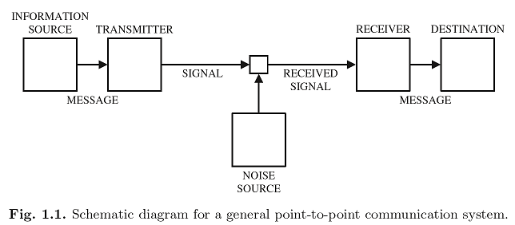

# 資訊理論簡介

## 通訊系統

在通訊系統中，我們試圖把資訊在嘈雜的環境中從一個點傳遞到另一個點。 考慮下面的情境，一個秘書需要定期發送傳真，而她想要在每個頁面傳達盡可能多的資訊。她可選擇使用較小的字體，使得每個頁面有更多的字元。
然而，系統中有兩個因素可能導致錯誤。

* 首先，傳真機的解析度是有限的。
* 第二，發送的字元可能由於接收到的雜訊而被錯誤地接收。

因此，如果字體大小太小，字元可能在傳真機上不易識別。另一方面，雖然有些字元傳真機可能無法識別，收件人仍能由上下文中的單詞辨認字元。換句話說，沒有必要選擇這樣的字體大小使得傳真機上所有的字元都可以識別。由此問題可得出：什麼是最有意義的信息量可以在一頁傳真上傳送?


在點對點通信模型中，訊息是由資訊源生成的。資訊由發射機轉換成適合傳輸的信號。在傳輸過程中，訊號可能受到噪音源的污染，因此接收的訊號可能與發送訊號不同。根據接收到的訊號，接收機對消息作出估計並將其發送到目的地。

在這種點對點通信系統的抽象模型中，人們只關心訊息源生成的消息是否能正確地發送到接收方，而不必擔心接收方如何實際使用消息。在某種程度上，Shannon的模型並不能涵蓋通信系統的所有可能方面。然而，為了建立一個精確而有用的資訊理論，理論的範圍必須加以限制。

Shannon從通訊的角度介紹了“資訊”的兩個基本概念。

* 首先，**資訊是不確定的**。更具體地說，如果我們感興趣的資訊是確定性的，那麼它根本就沒有價值，因為它已經是已知的，沒有不確定性。
  * 從這個角度來看，例如，電視廣播頻道上靜止圖像的連續傳輸是多餘的。
  * 因此，資訊源自然地被建模為隨機變數或隨機過程，和機率論用來發展資訊理論。
* 第二，**被傳輸的資訊是數位編碼的**。這意味著資訊源應該首先被轉換成一個0/1的位元\(bit\)，和剩下的任務是將接收器正確的接收這些資訊，且這些位元沒有實際意義。

