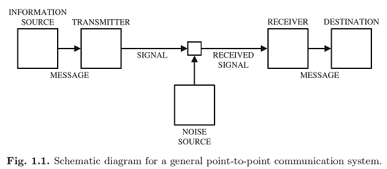

# 點對點模型與資訊熵

## 通訊系統

在通訊系統中，我們試圖把資訊在嘈雜的環境中從一個點傳遞到另一個點。 考慮下面的情境，一個秘書需要定期發送傳真，而她想要在每個頁面傳達盡可能多的資訊。她可選擇使用較小的字體，使得每個頁面有更多的字元。
然而，系統中有兩個因素可能導致錯誤。

* 首先，傳真機的解析度是有限的。
* 第二，發送的字元可能由於接收到的雜訊而被錯誤地接收。

因此，如果字體大小太小，字元可能在傳真機上不易識別。另一方面，雖然有些字元傳真機可能無法識別，收件人仍能由上下文中的單詞辨認字元。換句話說，沒有必要選擇這樣的字體大小使得傳真機上所有的字元都可以識別。由此問題可得出：什麼是最有意義的信息量可以在一頁傳真上傳送?


在點對點通信模型中，訊息是由資訊源生成的。資訊由發射機轉換成適合傳輸的信號。在傳輸過程中，訊號可能受到噪音源的污染，因此接收的訊號可能與發送訊號不同。根據接收到的訊號，接收機對消息作出估計並將其發送到目的地。

在這種點對點通信系統的抽象模型中，人們只關心訊息源生成的消息是否能正確地發送到接收方，而不必擔心接收方如何實際使用消息。在某種程度上，Shannon的模型並不能涵蓋通信系統的所有可能方面。然而，為了建立一個精確而有用的資訊理論，理論的範圍必須加以限制。

資訊交流應該由以下元素組成：

* 發送端\(信源, source\)
  * 信源是生訊息和訊息序列的源頭，可以是任意的事物。
     信源是事件各揰運動狀態或存在狀態的集合。
  * 信息的內容是具體的，但是信源輸出何種信息是隨機不確定的，但有一定的規律性，因此可用隨機變數或隨機向量來表示信源。
* 傳輸器\(編碼器, transmitter  encoder\)，可以把資訊編碼為訊號。
  * 編碼是把信息變換成訊號\(signal\)的措施，其輸出的是隨合頻道傳輸的訊息。編碼器可再分為二類: 信**源編碼器與頻道編碼**。
  * 信源編碼是對信源輸出的訊息進行適合的變換和處理，壓縮信源的冗餘度以提高訊息傳輸的效率，這是為了提高通信訊息的有效性。可再分為無失真編碼和有限失真編碼。
  * 頻道編碼是為了提高信息傳輸的可靠性而有目的地對信源編碼輸出的代碼添加監督碼元，使其具有糾錯和檢錯的能力。
  * **實際通訊時，可靠性和有效性互相矛盾**；提高有效性必須去掉信源符號的冗餘部份，但會造成可靠性的下降；而提高可靠性就需要增加監督碼元，這會降低有效性；有時為了兼顧有效性，可允許在接受端還原訊息時，可容許部分失真。
* 頻道\(channel\)：指通訊系統把載荷訊息從發送端傳送到接收端的媒介或通道。
  除了傳送信號外，還有存儲信號的功能，如磁帶，光碟等通信方式。
  * 信號的傳輸不可避免地會引入噪音和干擾，為了分析方便，把系統所有其它部分的干擾和噪音都等效的結合成頻道干擾，看成是同一噪音源所產生，並疊加在所傳輸的信號上。
* 接收器\(解碼器, receiver decoder\)，可以把訊號decode為資訊
  。同編碼器，也可分為信源解碼器與頻道解碼器。
  而在保密通信上，還包含了解密的功能。
* 接收者\(信宿, destination\)
  信宿是信息傳輸的對象，而信源和信宿可以處於不同的地方或時間。

## 資訊熵\(information entropy\)

Shannon從通訊的角度介紹了“資訊”的兩個基本概念。

* 首先，**資訊是不確定的**。更具體地說，如果我們感興趣的資訊是確定性的，那麼它根本就沒有價值，因為它已經是已知的，沒有不確定性。
  * 從這個角度來看，例如，電視廣播頻道上靜止圖像的連續傳輸是多餘的。
  * 因此，資訊源自然地被建模為隨機變數或隨機過程，和機率論用來發展資訊理論。
* 第二，**被傳輸的資訊是數位編碼的**。這意味著資訊源應該首先被轉換成一個0/1的位元\(bit\)，和剩下的任務是將接收器正確的接收這些資訊，且這些位元沒有實際意義。

**位元是測量資訊量的單位**。在Shannon的理論中，資訊是和長度，重量這些物理屬性一樣，是種可以測量和規範的東西。由於對於通信系統而言，其傳遞的資訊具有隨機性，所以定量描述資訊應基於隨機事件。任何資訊都存在冗余，冗餘大小與資訊中每個符號（數字、字母或單詞）的出現機率或者說不確定性有關。

通常一個訊號源發送出什麼符號是不確定的，衡量它可以根據其出現的機率來度量。機率大，出現機會多，不確定性小；反之就大。例如，當極限條件下，一個訊號源只發送一種符號，即發送內容是確定的，即機率為100%，此時接收方無法從接收訊號中獲得任何資訊，即資訊的量為零。而反之發送方和接收方約定，符號1代表二進位數字0，符號2代表二進位數字1，則接收端可以通過接收到的訊號，獲取一定資訊。

同時Shannon提出了用資訊熵\(information entropy\)來定量衡量資訊的大小。我們先設隨機事件發生的不確定性為發生機率π的函數f\(π\)，該函數具有如下三條性質：

* 單調性：機率 $$\pi$$ 越大的事件，資訊熵 $$f(\pi)$$ 越小，反之亦然。
* 非負性： $$f(\pi ) \geq 0$$ 。
* 可加性：多隨機事件同時發生存在的總不確定性的度量，可以表示為各時間不確定性度量的和。
  * 隨機事件 $$X = x_1$$ 與 $$Y = y_1$$同時發生的機率為 $$P(X=x_1, Y=y_1)=P(X=x_1)P(Y=y_1)$$ 
  * 而 $$f(\pi)$$ 應滿足 $$f(P(X=x_1, Y=y_1))=f(P(X=x_1))+f(P(Y=y_1))$$ 

從數學上證明滿足上述性質的資訊熵函數 $$H(X)$$ ，具有唯一的如下的形式。

$$
H(X)=-k\sum_{i=1}^N(P(x_i) \log(P(x_i))
$$

資訊熵不僅定量衡量了資訊的大小，同時為資訊編碼提供了理論上的最佳值：**實用的編碼平均碼長的理論下界就是資訊熵。即信息熵為資料壓縮的極限**。
**更準確的說法是資訊熵是用來度量資訊所要消除的不確定性的量**。

## 參考資料

* Shannon, Claude E. "A mathematical theory of communication." The Bell system technical journal 27.3 \(1948\): 379-423.

