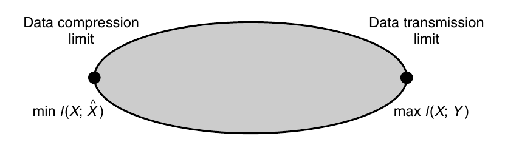

# 資訊理論簡介

## 簡介

訊息是很抽象的概念，難以定義。訊息有很強的主觀性和實用現，同樣的訊息對不同的人常常有不同的主觀價值和意義。例如天氣預報，對於在室用和戶外工作的人的意義不同。

訊息有以下的基本性質：

1. 訊息有可度量性。
2. 訊息有普遍性。
3. 訊息有可創造性。
4. 訊息有無限性。
5. 訊息有可傳遞性。
6. 訊息有相對性，對於同一事物，不同觀察者所得到的訊息量不同。
7. 訊息有可加工性，可被壓縮、增加抗干擾能力、加密等。
8. 訊息有可轉能性，在一定條件下可轉成物質、能量與時間。
9. 訊息有有序性，可用於消除系統的不確定性。
10. 訊息有共享性，同一訊息可被無限的人所獲得，不會使交流者失去原有的訊息。

## 資訊理論的建立與發展

Shannon在1948年發表的A Mathematical Theory of Communication是資訊理論的公認起源。

資訊理論或通訊系統的抽象模型如下圖：

.png>)

在所有的資訊交流系統中，通有一個發出訊息的發送端(信源)，至少有一個接收端(信宿)，以及訊息流通的通道(信道)。在訊息傳送過程中，一定會有噪音源發出噪音干擾訊息。為了把訊息放入信道中傳輸，所以需要先將訊息編碼，在傳送到信宿後，進行解碼還原訊息。

1948年到1970年之間，為資訊理論的確立期，主要是對Shannon理論的研究與說明，包括對通信系統的數學模型，資訊量，Shannon熵的意義與作用的說明與討論，信源與信道編碼問題的模型，本質問題與意義的討論，信源與信道編碼的編碼定理及其證明，信源與信道編碼的實現與應用問題等。

這一階段的工作完成的是對以上問題實現了嚴格的數學描述與論證。當時的重要文獻有McMillan(1953)、Feinstein(1954)、Gallager(1968)等。

在1970\~1990年，資訊理論位於理論發展期，由於Shannon理論的闡述與通信技術的發展，研究的範圍變大，此時期發展的主要內容是資訊率失真理論(information rate-distortion theory)與和多用戶資訊理論方面。

## 資訊理論

資訊理論回答了通信理論中的兩個基本問題：

* 什麼是<mark style="color:red;">最終的數據壓縮(答案：熵 H)</mark>,以及
* 什麼是<mark style="color:red;">通信的最終傳輸速率(答案：信道容量 C)</mark>。

因此一些人認為資訊理論是通訊理論的一個子集。事實上,它在統計物理學(熱力學)、計算機科學(Kolmogorov 複雜性或算法複雜度)、統計推斷(奧卡姆剃刀：最簡單的解釋是最好的) 以及機率和統計(誤差指數最優假設檢驗和估計)都有貢獻。

在 1940 年代初期，人們認為不可能以可忽略的錯誤概率以正值速率發送信息。 Shannon 證明了對於低於信道容量的所有通信速率之錯誤機率幾乎為零，這讓通信理論界感到驚訝。

信道容量可以簡單地從信道的噪聲特性中計算出來。Shannon進一步認為，諸如音樂和語音之類的隨機過程具有不可簡化的複雜性，低於該複雜性信號就無法被壓縮。他將此命名為熵(entropy)，以尊重該詞在熱力學中的平行使用，並認為如果熵源小於信道容量時，可以實現漸近無差錯(asymptotically error-free)通信。

今天的資訊理論代表了所有可能的通信方案集合的極端點。資料壓縮最小值$$I(X: \hat{X})$$ 位於通信方案集合的一個極端。所有資料壓縮方案，都需要說明壓縮率至少等于这個最小值(註：互資訊的最小值為兩變數共有的資訊，無法再被壓縮)。另一个極端是資料傳輸最大值$$I(X;Y)$$，被稱為信道容量。因此,所有的調變方案和資料壓縮方案都位於這些極限之間。

資訊理論論還提出了實現這些通信極限的方法。然而,這些理論上最優的通信方案，儘管它們很漂亮，但在計算上可能會變得不切實際。Turbo碼的出現最終實現了計算的實用性。應用資訊理論根怷的一個很好的例子是在CD和DVD上使用糾錯碼。

### Kolmogorov 複雜性

Kolmogorov、Chaitin 和 Solomonoff 提出了 這樣的想法，<mark style="color:red;">即資料字串的複雜性可以通過計算字串的最短二進制軟體程式(通常用圖靈機)的長度來定義</mark>。因此，複雜度是最小描述長度(minimum description length)。這種複雜性的定義是獨立於計算機，並且具有根本的重要性。因此Kolmogorov 複雜性為描述性複雜性理論奠定了基礎。&#x20;

如果序列是從具有熵$$H$$ 的分佈中隨機抽取時，則Kolmogorov複雜度$$K$$大約等於Shannen熵$$H$$。因此，資訊理論和 Kolmogorov 複雜度之間的聯繫是完美的。Kolmogorov複雜性比Shannon熵更基本。

可以將計算複雜度(時間複雜度) 和 Kolmogorov 複雜度(程式長度或描述複雜度) 視為座標上的兩個軸，對應於程式執行時間和程式長度。 Kolmogorov 複雜度側重於沿第二軸最小化，而計算複雜度側重於第一軸最小化。

### 奥卡姆剃刀

「最簡單的解釋是最好的」。 Solomonoff 和 Chaitin 令人信服地論證說，<mark style="color:red;">如果對所有解釋資料的程序進行加權組合，並觀察它們接下來印出的內容,那麼可得到一個普遍良好的預測程式</mark>。

### 經濟學(投資)

<mark style="color:red;">對固定股票市場的重複投資會導致財富呈指數級增長</mark>。財富的增長速度是股市熵率的對偶。股票市場最優投資理論與信息論之間的相似之處是驚人的。

## 熵(entropy)

$$\mathrm{H}(X)= - \sum_{x} \mathrm{P}(x) \log_2\mathrm{P}(x)$$

我們使用以 2 為底的對數。<mark style="color:red;">熵以位元(bit)為單位進行測量</mark>。 <mark style="color:red;">熵是隨機變量中平均不確定性的度量</mark>。它是描述隨機數平均所需的位元數(的下限)。

資訊理論中的熵概念與統計力學中的熵概念有關。如果我們畫出一個由$$n$$ 個獨立同分佈 (iid) 隨機變量組成的序列，我們將證明一個典型(typical)序列的機率約為$$2^{-n\mathrm{H}(X)}$$ ，並且大約有$$2^{n\mathrm{H}(X)}$$個這樣的典型序列。這個屬性稱為「<mark style="color:red;">漸近均分屬性(AEP, asymptotically equipartition property)</mark>」, 是資訊理論中許多證明的基礎。熵也是自然答案出現的其他問題的值，例如生成隨機變量所需的公平硬幣翻轉次數。如果字串確實是隨機的，則其 Kolmogorov 複雜度接近熵。

## 互資訊(mutual information)

熵是單個隨機變數的不確定性。我們可以定義條件熵$$\mathrm{H}(X|Y)$$，它給定隨機變數$$Y$$後，隨機變數$$X$$的知識量。

<mark style="color:red;">由於另一個隨機變數而導致的不確定性減少稱為互資訊(mutual information)，也可解釋為兩個隨機變數共有的資訊量</mark>：

$$\displaystyle \begin{aligned} \mathrm{I}(X;Y) & = H(X) - H(X|Y) \\     & = \sum_{x,y}\mathrm{P}(x,y) \log \frac{\mathrm{P}(x,y)}{\mathrm{P}(x) \mathrm{P}(y)} \\     & = H(Y) - H(Y|X) \\     & = \mathrm{I}(Y;X) \end{aligned}$$

互信息$$\mathrm{I}(X;Y)$$ 是兩個隨機變量之間依賴關係的度量。它在$$X$$和$$Y$$上是對稱的並且總是非負的, 並且當$$X$$ 和$$Y$$獨立時才等於零。

## 通訊頻道、信道(communication channel)

通信頻道是一個系統，其輸出$$Y$$在機率(因為傳輸時會有噪音干擾造成失真)上取決於其輸入$$X$$。它的特徵是g 率轉移矩陣$$\mathrm{P}(y|x)$$，其確定給定輸入下的輸出的條件分佈。對於具有輸入$$X$$和輸出$$Y$$的通信頻道，可以通過以下方式定義頻道容量$$\displaystyle C=\max_{\mathrm{P}(x)}\mathrm{I}(X;Y)$$。

<mark style="color:red;">可證明頻道容量是我們可以通過頻道發送訊息，並在輸出端恢復訊息的最大速率，並且錯誤概率極低</mark>。

## 相對熵(relative entropy)

互信息是一個更一般的計算量的特例，稱為相對熵$$\mathrm{D}(\mathrm{P} \parallel \mathrm{Q})$$,它是兩個機質量函數$$\mathrm{P}$$ 和$$\mathrm{Q}$$ 之間遠離程度(因不滿足交換性，所以不是距離)的度量(metric)。

$$D(P \parallel Q)= \sum_x \mathrm{P}(x) \log \frac{\mathrm{P}(x)}{\mathrm{Q}(x)}$$

儘管相對熵不是真正的度量，但它具有度量的一些屬性。特別是，其值必為非負值，且若且唯若$$\mathrm{P}=\mathrm{Q}$$ 時其值為0。相對熵是分佈$$\mathrm{P}$$ 和$$\mathrm{Q}$$ 之間假設檢驗中錯誤機率的指數。相對熵可用於定義機率分佈的幾何形狀，使我們能夠解釋大偏差理論的許多結果。

## 財產增長率

資訊理論和股票市場投資理論之間有許多相似之處。股票市場由一個相對價格的隨機向量$$X$$定義，其元素是非負數，等於一天結束時股票價格與一天開始時價格的比值($$\frac{c_t}{o_t}$$或$$\frac{c_t}{c_{t-1}}$$)。

對於機率分佈為$$F(\mathbf{x})$$的股票市場，我們可以將增長率$$W$$定義為：

$$\displaystyle W=\max_{\mathbf{b}: b_i \geq 0, \sum_{b_i}=1} \int \log (\mathbf{b}^\top \mathbf{x}) d F(\mathbf{x})$$

增長率是財富增長的最大漸近指數。倍增率有許多與熵的性質相關的性質。

## 參考資料

* Cover, Thomas M. Elements of information theory, 2nd. John Wiley & Sons, 2012.
* McMillan, Brockway. "The basic theorems of information theory." The Annals of mathematical statistics (1953): 196-219.
* Feinstein, Amiel. "A new basic theorem of information theory." (1954).
* Gallager, Robert G. Information theory and reliable communication. Vol. 588. New York: Wiley, 1968.
* Wolfowitz, Jacob. Coding theorems of information theory. Vol. 31. Springer Science & Business Media, 2012.
