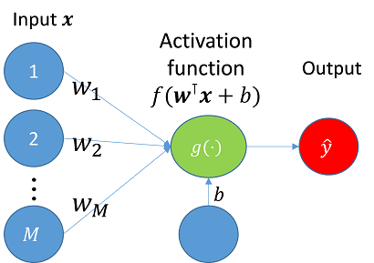
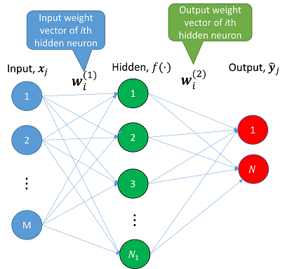

# 類神經網路(neural network)

## 神經元(Neuron)

一個神經元是有$$M+1$$個輸入的函數$$g$$得到初步輸出後，再經啟動函數得到最後的輸出$$\hat{y}$$。

* $$\hat{y} =f(\mathbf{w^{\top} x} + b)$$
* $$\mathbf{x} \in \mathbb{R}^{M \times 1}$$：輸入向量(input vector), 每筆資料是有$$M$$個特徵(維度)的實數值。
* $$\mathbf{w} \in \mathbb{R}^{M \times 1}$$ ：權重向量(weights vector)，每個特徵到神經元的權重值。
* $$b \in \mathbb{R}$$：神經元的偏差量(bias)。
* $$f(\cdot)$$：使用者自訂的啟動函數(activation function)。
* $$\hat{y} \in \mathbb{R}$$：輸出值或預測值(output value or predicting value)。

也可將偏差值與輸出合併視為輸入與權重$$\mathbf{x, w} \in \mathbb{R}^{(M+1) \times 1}$$，其中 $$x_{M+1} = b, w_{M+1}=1$$。

## 前饋神經網路(Feed-forward network, FNN)

* 此類網路資訊只有從輸入傳遞到輸出，沒有由輸出送回輸入的連結。
* single-hidden layer feedforward neural networks (SLFNs)是一個層狀的前饋結構，分為輸入層(input layer)，隱藏層(hidden layer)，與輸出層(output layer)，每一層都包含許多處理單元(神經元)。
* 網路系統中的每個處理單元都和其下一層的所有處理單元連接，但是同一層內的處理單元都不互相連接。

## 單隱藏層前饋神經網路(Single hidden layer feedforward network, SLFN)

令$$D$$為相異樣本的數量，$$(\mathbf{x}_i,\mathbf{y}_i)\in \mathbb{R}^{M+N}$$, $$i=1,2,\ldots, D$$，資料的維度為$$D\times (M+N)$$。

* $$\mathbf{x}_i = \begin{bmatrix} x_{i,1} \\ x_{i,2} \\ \vdots \\ x_{i, M}\end{bmatrix} \in \mathbb{R}^{M \times 1}, \ i=1,2,\ldots, D$$，每筆輸入資料有$$M$$個特徵。
* $$\mathbf{y}_i = \begin{bmatrix} y_{i,1} \\ y_{i,2} \\ \vdots \\ y_{i, N}\end{bmatrix} \in \mathbb{R}^{N \times 1}, \ i=1,2,\ldots, D$$，每筆資料的輸出有$$N$$個特徵。
* 輸入層為第0層，隱藏層為第$$1,2,\ldots, (L-1)$$層，輸出層為第$$L$$層。
* 每一層的神經元個數為$$N_0, N_1,\ldots, N_L$$。
*   $$\mathbf{W}^{(k)} \equiv [w_{i,j}^{(k)}] \in \mathbb{R}^{N_{k-1} \times N_k}, \ k=1,2,\ldots, L$$為連接第$$k-1$$層與第$$k$$層的權重矩陣。

    * $$\mathbf{w}_{i, \cdot}^{(k)} \in \mathbb{R}^{N_k}$$為權重矩陣第$$i$$列(row)之向量，為第$$k-1$$層的第$$i$$個神經元的輸出權重向量。
    * $$\mathbf{w}_{\cdot,j}^{(k)} \in \mathbb{R}^{N_k-1}$$為權重矩陣第$$j$$行(column)之向量，為第$$k$$層的第$$j$$個神經元的輸入權重向量。

    第$$k$$層中，第$$j$$個神經元

    * 輸入值為 $$z_j^{(k)} =\sum_{i=1}^{N_{k-1}}w_{i,j}^{(k)}o_{i}^{(k-1)}$$
    * 輸出值為 $$oj^{(k)} =f^{(k)}(z_j^{(k)}), \ k=0,1,\ldots, L, \ j=1,2,\ldots, N_k$$

因此令輸入的資料$$\mathbf{x}=\mathbf{o}^{(0)}\in \mathbb{R}^M$$， 多層的前饋神經網路的輸出為 $$\mathbf{o}^{(k+1)}=f^{(k+1)} ((\mathbf{w}^{(k+1)})^{\top}\mathbf{o}^{(k)}+\mathbf{b}^{(k)}) \in \mathbb{R}^{N_k+1}$$, $$k=0,1,\ldots, L-1$$。而SLFN為$$L=3$$的特例。

