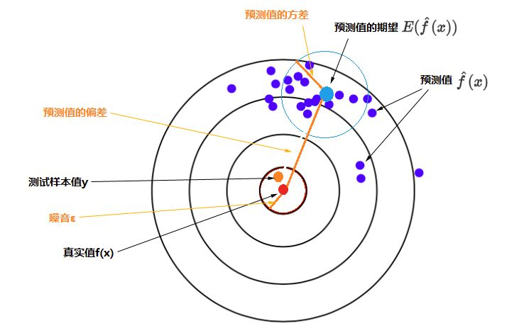

# Bias-Variance Tradeoff

## 問題簡介

所有模型都是錯的，但有的是有用的；特徵決定誤差上限，模型用來達到這個誤差上限。

在監督學習中，已知樣本 $$(x_1,y_1), (x_2,y_2),\ldots, (x_N, y_N)$$ ，要求擬合出一個模型（函數）$$\hat{f}$$ ，其預測值 $$\hat{y} ={f}(x)$$ 與樣本實際值$$y$$ 的期望誤差最小。

考慮到樣本資料其實是採樣得出， $$y$$並不是真實值本身，假設真實模型（函數）是$$f$$ ，則採樣值$$y=f(x)+\epsilon$$ ，其中$$\epsilon$$代表白噪音，其均值為0，變異數為$$\sigma^2$$(但不必為常態分佈)。

擬合函數$$\hat{f}$$的主要目的是希望它能對新的樣本進行預測，所以，擬合出函數$$\hat{f}$$後，需要在測試集（訓練時未見過的資料）上檢測其預測值$$\hat{y}$$與實際值$$y$$之間的誤差。可以採用平方誤差函數（mean squared error）來度量其擬合的好壞程度，即$$(y - \hat{y})^2$$。

### 誤差期望值的分解

經過進一步的研究發現，對於某種特定的模型，<mark style="color:red;">其誤差的期望值可以分解為三個部分：樣本噪音、模型預測值的變異數、預測值相對真實值的偏差</mark>。

* $$E[(y-\hat{f}(x))^2]=\sigma^2 +Var(\hat{f}(x)) + (Bias(\hat{f}(x))^2$$
* $$Bias(\hat{f}(x)) = E[\hat{f}(x)-f(x)]$$
* 誤差的期望值 = 噪音的變異數 + 模型預測值的變異數 + 預測值相對真實值的偏差的平方

* 靶心（紅點）是測試樣本的真實值，測試樣本的$$y$$（柳丁色點）是真實值加上噪音，特定模型重復多次訓練會得到多個具體的模型，每一個具體模型對測試樣本進行一次預測，就在靶上打出一個預測值（圖上藍色的點）。
* 所有預測值的平均就是預測值的期望（較大的淺藍色點），淺藍色的圓圈表示預測值的離散程度，即預測值的變異數。
* 所以，**特定模型的預測值與真實值的誤差的期望值**，分解為上面公式中的三個部分，對應到圖上的三條柳丁色線段：預測值的偏差、預測值的變異數、樣本噪音變異數。

### 誤差期望值的意義

期望值的含義是指在同樣的條件下重復多次隨機試驗，得到的所有**可**<mark style="color:red;">**能狀態的平均結果**</mark>。

* 對於機器學習來說，這種實驗就是我們選擇一種演算法（並選定超參數），以及設置一個固定的訓練集大小，這就是同樣的條件，也就是上文所說的特定的模型。
* 然後每次訓練時從樣本空間中選擇一批樣本作為訓練集，但每次都隨機抽取不同的樣本，這樣重復進行多次訓練。
* 每次訓練會得到一個具體的模型，每個具體模型對同一個未見過的樣本進行預測可以得到預測值。不斷重復訓練和預測，就能得到一系列預測值，根據樣本和這些預測值計算出變異數和偏差，就可以幫助我們考察該特定模型的預測誤差的期望值，也就能衡量該特定模型的效能。對比多個特定模型的誤差的期望值，可以幫助我們選擇合適的模型。

## 過度擬合與低度擬合

* <mark style="color:red;">**過度擬合(Overfitting)**</mark>：找出來的模型受到訓練資料的影響太大，使得對預測的效果不佳。可由訓練集的低誤差與測試集的高誤差中觀察得到。
* <mark style="color:red;">**低度(欠)擬合(Underfitting)**</mark>：模型對於資料的描述能力太差，無法正確解釋資料。可由訓練集與測試集均為高誤差觀察得到。

偏差(Bias)就是我們模型的準度，我們希望模型越準越好，也就是希望Bias降很低，但此時我們又會遇到另一個問題，要是模型針對我們訓練集資料學得很好，就會降低對其他資料的準度，也就是變異(Variance)會提高，所以我們在做的是一個取捨，用過度擬合與低度擬合的角度來看的話：

* 過度擬合：試圖去降低偏差，到最後偏差變很小，然而變異卻提高許多。
* 低度擬合：偏差很高，準度不足。

低偏差的模型在訓練集合上更加準確，低變異的模型在不同的訓練集合上性能更加穩定。舉兩個極端的例子：

* 記住訓練集合上所有資料的答案(類別)，這樣的系統是低偏差、高變異。
* 無論輸入什麼資料，總是預測一個相同的答案(類別)，這樣的系統是高偏差、低變異。

因此在模型的選擇上需要進行偏差和變異的權衡。

<mark style="color:red;">理想中，我們希望得到一個偏差和方差都很小的模型（下圖左上）</mark>，但實際上往往很困難。選擇相對較好的模型的順序：**變異數小，偏差小 > 變異數小，偏差大 > 變異數大，偏差小 > 變異數大，偏差大**。

變異數小，偏差大 之所以在實際中排位相對靠前，是因為它比較穩定。很多時候實際中無法獲得非常全面的數據集，那麼，如果一個模型在可獲得的樣本上有較小的變異數，說明它對不同數據集的敏感度不高，可以期望它對新數據集的預測效果比較穩定。

顯然複雜的模型能更好的擬合訓練集合能更好的擬合訓練集合上的點，但是同時高複雜度的模型泛化能力差，造成了高變異。

下圖中橫坐標的右側是過度擬合的情況，而左側是低度擬合的情況。過度擬合可以這麼解釋：

* 訓練樣本得到的輸出和其期望的輸出總誤差很小，但是測試樣本得到的輸出和其期望的輸出誤差卻很大。
* 因此為了得到一致的輸出誤差，使得模型變得相當複雜。

想像某個學習算法產生了一個過度擬合的分類器，這個分類器能夠百分之百正確地分類樣本資料，但也就為了能夠對樣本完全正確的分類，使得它的構造如此複雜，規則如此嚴格，以至於任何與樣本數據稍有不同的資料它全都認為不屬於這個類別(低泛化能力)。

隨著模型複雜度的增加，偏差會越來越低；而變異數卻呈現了越來越高的趨勢，兩者之值是反向的，只有在模型複雜度適中的時候，才有辦法得到最低的總誤差。

如果這部分一樣把 模型的複雜度 與 模型預測的誤差 畫成圖表的話，

那可能有人會想說，既然如此，能得到最佳總誤差的點會落在總誤差函數的轉折點，而總誤差又是從偏差跟 變異數而來，應該能寫出一個數學式子來找出那個最佳模型複雜度是多少。理論上是這麼說沒錯，不過在實務上有時候我們可能會很難去計算模型的偏差與變異數。

所以在實務上我們更常透過模型外在的表現來判斷它現在是低度還是過度擬合，再透過調整模型的超參數( Hyperparameter ) 來調整模型的複雜度。<mark style="color:red;">實際操作上，一般我們會將資料集切割成訓練集(training set)跟 驗證集(validation set)，訓練集用於訓練模型參數；而驗證集將不會參與訓練，用於評估模型是否過度擬合。</mark>

下圖可以觀察到：

* 在低度擬合的時候，不論是在訓練集還是驗證集(測試集)的誤差都很高。
* 在過度擬合的時候，訓練集的誤差已經將降低了，但驗證集(測試集)上的誤差會很高。

​有了這兩個重要的觀察，在訓練的時候我們就可以很容易的判斷模型擬合資料的好壞。

## 選擇模型就是選擇假設集合

很多時候，機器學習所面臨的問題，我們事先並不確切的知道要擬合的是一個怎樣形式的函數，是幾次多項式，是幾層神經網絡，選擇樣本的哪些特徵，等等，都缺乏先驗的知識來幫助我們選擇。我們在一個基本上無窮大的假設（模型）集合中，憑借有限的經驗進行嘗試和選擇。

機器學習有多種演算法，以及每種演算法中經常又可以選擇不同的結構和超參數。它們所覆蓋的假設集合有不同的大小。所以，選擇一種演算法（包括其結構和超參數），就是選擇（限定）了一個假設集合。我們期望真實模型存在於我們所選定的假設集合范圍內，並且該假設集合越小越好。

下圖粗略表現了不同假設集合的關系：

監督學習的整個流程，其實就是一個不斷縮小假設集合的過程。從大的方面看可以分為兩個步驟。

1. 選擇一個假設集合，包括某種演算法模型及相關結構、超參數等。
2. 使用樣本資料進行訓練，使該模型盡量擬合資料，就是從上面選定的假設集合中找到一個特定的假設（模型）。

上面第一個步驟中，我們可以選擇一些不同的假設集合，然後通過考察它們的偏差與變異數，對各假設集合的效能進行評估。比如不同次數多項式的假設集合，比如真實模型是一個二次多項式，那麼線性函數集合中的模型會欠擬合（變異數低，偏差太高），高次多項式集合中的模型容易過擬合（變異數太高，偏差低），二項式集合中的模型能夠有較好的折中（變異數和偏差都相對較低），總體誤差最小。

## 訓練誤差與測試誤差

### 低度擬合

當訓練一個模型時，**若發現不論是在訓練集或是測試集資料都無法達到一定的準度時，就可能是遇到低度擬合的狀況**。通常造成低度擬合的主要原因包含『訓練時間不足』、『模型複雜度不足』，而這兩種狀況都不難解決。可以透過增加訓練迭代的次數來解決「訓練時間不足」的問題，透過調整參數數量來解決「模型複雜度不足」的問題。如果上述調整仍然無法改善，可能就要考慮是訓練資料本身的問題。

### 過度擬合

當隨個訓練的時間增長、迭代的次數增加，我們訓練集與測試集的誤差都會逐步的下降，但當我們觀察到訓練集與測試集的誤差開始分道揚鑣時，就可能是過度擬合狀況發生。

**用一句話描述過度擬合：模型過度去學習、硬背訓練資料**。

### 總結

低度擬合：
發生低度擬合的根本原因是由於模型太過簡單，所以根本的解決方案就是提高模型的複雜度，可以透過：

* 增加訓練的疊代次數
* 調整超參數 ( 修改模型架構 )
* 生成更多的特徵來訓練模型
* 如果有使用正規化 ( Regularization ) 可先將其移除
* 更換一個更複雜的模型

過度擬合：發生過度擬合的根本原因是由於模型太過複雜，所以根本的解決方案就是降低模型的複雜度，可以透過：

* Early Stopping
* 增加訓練資料
* 降低特徵維度
* 如果沒有使用正規化 ( Regularization ) 可以將其加入
* 調整超參數 ( 修改模型架構 )
* 更換一個較為簡單的模型​
