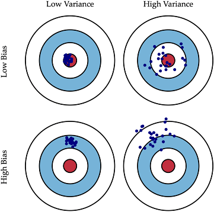
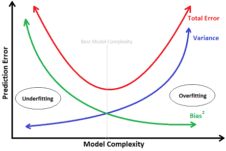
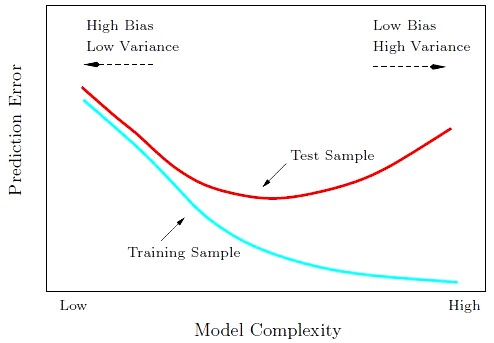
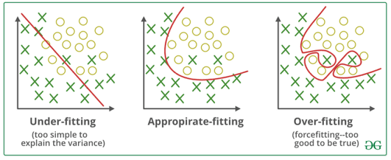

# Bias-Variance Tradeoff

## 問題簡介

* 過度擬合\(Overfitting\)：找出來的模型受到訓練資料的影響太大，使得對預測的效果不佳。
* 低度擬合\(Underfitting\)：模型對於資料的描述能力太差，無法正確解釋資料。

偏差-變異權衡\(Bias-Variance Tradeoff\) 的意思是，當我們的模型太接近訓練資料造成過度擬合，此時會產生低偏差、高變異；反之，如果模型的泛化能力不夠的話，對於資料預測效果不好，會成高偏差、低變異。所以必須要在「訓練得像」跟「泛化能力」中去調整，不能跟訓練資料差太遠，又要能準確的預測資料。

低偏差的模型在訓練集合上更加準確，低變異的模型在不同的訓練集合上性能更加穩定。舉兩個極端的例子：

* 記住訓練集合上所有資料的答案\(類別\)，這樣的系統是低偏差、高變異。
* 無論輸入什麼資料，總是預測一個相同的答案\(類別\)，這樣的系統是高偏差、低變異。

因此在模型的選擇上需要進行偏差和變異的權衡。

顯然複雜的模型能更好的擬合訓練集合能更好的擬合訓練集合上的點，但是同時高複雜度的模型泛化能力差，造成了高變異。

下圖中橫坐標的右側是過度擬合的情況，而左側是低度擬合的情況。過度擬合可以這麼解釋：

* 訓練樣本得到的輸出和其期望的輸出總誤差很小，但是測試樣本得到的輸出和其期望的輸出誤差卻很大。
* 因此為了得到一致的輸出誤差，使得模型變得相當複雜。

想像某個學習算法產生了一個過度擬合的分類器，這個分類器能夠百分之百正確地分類樣本資料，但也就為了能夠對樣本完全正確的分類，使得它的構造如此複雜，規則如此嚴格，以至於任何與樣本數據稍有不同的資料它全都認為不屬於這個類別\(低泛化能力\)。

## 訓練誤差與測試誤差

