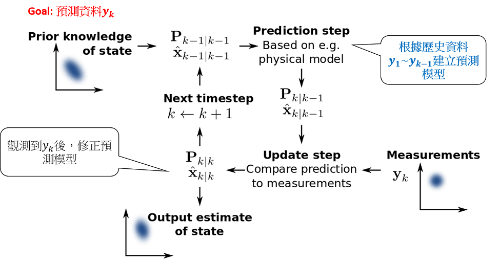

# 卡爾曼濾波器\(Kalman filter\)

## 簡介

卡爾曼濾波器（Kalman filter, KF）能夠從一系列的不完全及包含雜訊的測量中，估計動態系統的狀態
。**KF的假設是訊號狀態變化為線性，且系統誤差與量測誤差均為高斯白噪音**。

註：預設台灣加權指數，KF的MAE比naive方法高，可認為台灣加權指數不是線性，且誤差均為高斯白噪音。

## 濾波流程

KF的流程和貝式方法相同，首先依目前的證據（歷史狀態）建立模型，到下一期時，依據新觀測的證據（狀態）調整模型的參數。

### 狀態空間模型（state-space model）

> * \[processing model\] $$x_k=A_k x_{k-1} + B_k u_k +w_k$$
> * \[measurement model\] $$z_k = H_k x_k+ v_k$$

processing model

* $$x_k \in \mathbb{R}^n$$：系統在時間$$k$$的**真實狀態**。
* $$A_k \in \mathbb{R}^{n \times n}$$：系統在時間$$k$$時的狀態轉移矩陣
  。
* $$B_k \in \mathbb{R}^{n \times n}$$：外部輸入矩陣
  。
* $$u_k \in \mathbb{R}^n$$：外部輸入向量
  。
* $$w_k \in \mathbb{R}^n$$：系統雜訊，白噪音\($$N(0, Q_k)$$\)

measurement model

* $$z_k \in \mathbb{R}^m$$：在時間$$k$$時的量測值（或觀測值）。
* $$H_k \in \mathbb{R}^{m \times m}$$：時間$$k$$時的狀態，量測值轉移矩陣
  。
* $$v_k \in \mathbb{R}^m$$：量測雜訊，白噪音（$$N(0, R_k)$$）
* $$w_k, v_k$$兩雜訊獨立。

>

