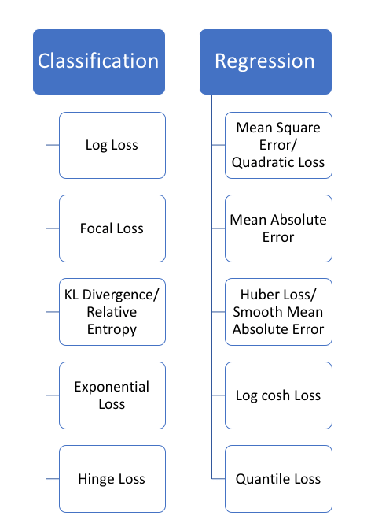
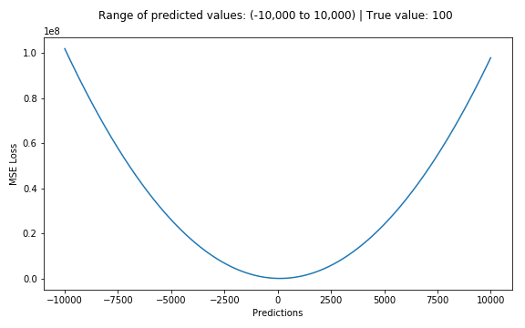
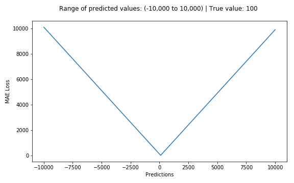
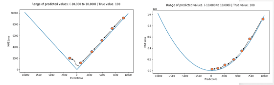
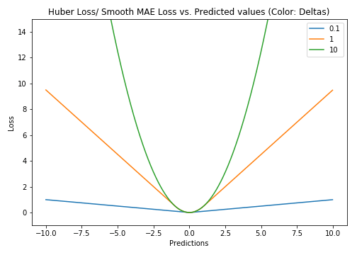
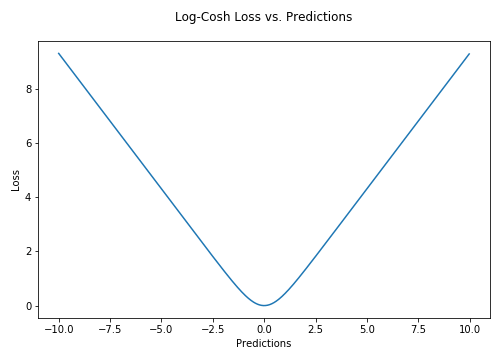
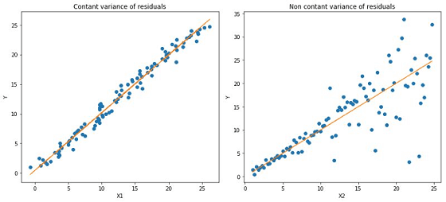
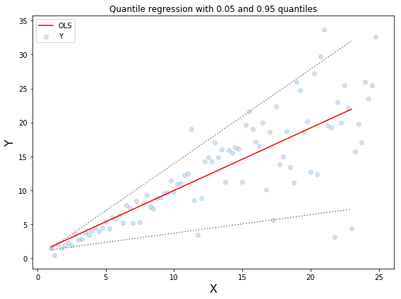
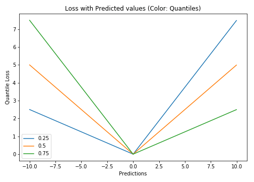

# 損失函數\(loss function\)

## 簡介

沒有一個損失函數可以適用於所有類型的資料。損失函數的選擇取決於許多因素，包括是否有離群點，機器學習演演算法的選擇，運行梯度下降的時間效率，是否易於找到函數的導數，以及預測結果的信賴區間。

機器學習中的所有演算法都依賴於最小化或最大化某一個函數，我們稱之為「目標函數」\(objective function\)。最小化的這組函數被稱為「損失函數」。損失函數是衡量預測模型預測期望結果表現的指標。尋找函數最小值的最常用方法是「梯度下降」\(gradient descent\)。把損失函數想像成起伏的山脈，梯度下降就像從山頂滑下，目的是到達山脈的最低點。


損失函數可以大致分為兩類：分類損失（Classification Loss）和迴歸損失（Regression Loss）。



## 均方誤差，二次損失，L2 損失 \(Mean Square Error, Quadratic Loss, L2 Loss\)

均方誤差（MSE）是最常用的回歸損失函數。MSE 是目標變量與預測值之間距離平方之和。

$$
MSE =\frac{1}{N} \sum_{i=1}^{N}(y_i -\hat{y}_i)^2
$$



```python
def mse(pred, real):
    return np.mean((pred-real)**2)
    
def rmse(pred, real):
    return np.sqrt(mse(pred,real))
```

## 平均絕對誤差，L1損失\(Mean Absolute Error, L1 Loss\)

平均絕對誤差（MAE）是另一種用於回歸模型的損失函數。MAE是目標變量和預測變量之間差異絕對值之和。因此，它在一組預測中衡量誤差的平均大小，而不考慮誤差的方向。損失范圍也是 0 到 $$\infty$$。

$$
MAE=\frac{1}{N} \sum_{i=1}^N | y_i - \hat{y}_i|
$$



```python
def mae(pred, real):
    return np.mean(np.abs(pred - real))
```

### MSE vs MAE （L2損失 vs L1損失）

使用平方誤差更容易求解，但使用絕對誤差對離群點更加穩健。每當我們訓練機器學習模型時，我們的目標就是找到最小化損失函數的點。當然，當預測值正好等於真實值時，這兩個損失函數都達到最小值。

由於 MSE 對誤差進行平方加權，如果誤差較大時，誤差的值會增加很多。如果我們的數據中有一個離群點，誤差的平方值會遠遠大於絕對值。這將使得和以 MAE 為損失的模型相比，以 MSE 為損失的模型會賦予更高的權重給離群點。因此MSE會犧牲其他正常數據點的預測效果為代價，這最終會降低模型的整體效能。

* **MAE  損失適用於訓練數據被離群點損壞的時候（即，在訓練數據而非測試數據中，我們錯誤地獲得了不切實際的過大正值或負值）**。

使用 MAE 損失（特別是對於神經網絡）的一個大問題是它的梯度始終是相同的，這意味著即使對於小的損失值，其梯度也是大的。這對模型的學習可不好。為瞭解決這個問題，我們可以使用隨著接近最小值而減小的動態學習率。MSE 在這種情況下的表現很好，即使採用固定的學習率也會收斂。MSE 損失的梯度在損失值較高時會比較大，隨著損失接近 0 時而下降，從而使其在訓練結束時更加精確。



## 決定使用哪種損失函數？

如果離群點是會影響業務、而且是應該被檢測到的異常值，那麼我們應該使用 MSE。另一方面，如果我們認為離群點僅僅代表數據損壞，那麼我們應該選擇 MAE 作為損失。

MAE損失對異常值更加穩健，但其導數並不連續，因此求解效率很低。MSE損失對異常值敏感，但給出了更穩定的閉式解（closed form solution）（通過將其導數設置為0）。

## 兩種損失函數的問題

可能會出現這樣的情況，即任何一種損失函數都不能給出理想的預測。例如，如果我們數據中 90％ 的觀測數據的真實目標值是 150，其餘 10％ 的真實目標值在 0-30 之間。那麼，一個以 MAE 為損失的模型可能對所有觀測數據都預測為 150，而忽略 10％ 的離群情況，因為它會嘗試去接近中值。同樣地，以 MSE 為損失的模型會給出許多范圍在 0 到 30 的預測，因為它被離群點弄糊塗了。這兩種結果在許多業務中都是不可取的。

## Huber Loss，平滑的平均絕對誤差

Huber Loss 對資料離群點的敏感度低於平方誤差損失。它在0處也可微分。基本上它是絕對誤差，當誤差很小時，誤差是二次形式的。誤差何時需要變成二次形式取決於一個超參數$$\delta$$，該超參數可以進行微調。

當$$\delta \rightarrow 0$$時，Huber loss接近MAE；當$$\delta \rightarrow \infty$$時，Huber loss接近MSE。

$$
L_{\delta}(y,f(x))=\bigg\{ \begin{align}& \frac{1}{2}(y-f(x))^2  & \forall  |y-f(x)| \leq \delta \\ & \delta|y-f(x)|-\frac{1}{2} \delta^2 & \text{ otherwise} \end{align}
$$



$$\delta$$的選擇非常重要，因為它決定了你認為什麼數據是離群點。大於$$\delta$$的殘差用 L1 最小化（對較大的離群點較不敏感），而小於$$\delta$$的殘差則用 L2 最小化。

```python
def Huber_loss(pred, real, delta):
    loss = np.where(np.abs(real-pred) < delta, 0.5*((pred-real)**2), 
    delta*np.abs(real-pred)-0.5*delta*deta)
    return np.sum(loss)
```

### 為什麼使用Huber Loss？

使用 MAE 訓練神經網絡的一個大問題是經常會遇到很大的梯度，使用梯度下降時可能導致訓練結束時錯過最小值。對於 MSE，梯度會隨著損失接近最小值而降低，從而使其更加精確。


在這種情況下，Huber Loss 可能會非常有用，因為它會使最小值附近彎曲，從而降低梯度。另外它比 MSE 對異常值更穩健。因此，它結合了 MSE 和 MAE 的優良特性。但是，Huber Loss 的問題是我們可能需要迭代地訓練超參數$$\delta$$。

## Log-Cosh Loss

Log-cosh 是用於回歸任務的另一種損失函數，它比 L2 更加平滑。Log-cosh 是預測誤差的雙曲餘弦的對數。

$$
L(y,f(x))=\sum_{i=1}^N \log(\cosh(f(x_i)-y_i))
$$



 $$\log(\cosh(x))$$ 對於較小的$$x$$來說，其大約等於$$\frac{x^{2}}{2}$$，而對於大的$$ x$$ 來說，其大約等於 $$|x| - \log(2)$$。這意味著 log-cosh函數的作用大部分與均方誤差一樣，但不會受到偶爾出現的極端不正確預測的強烈影響。**它具有Huber Loss 的所有優點，和 Huber Loss 不同之處在於，其處處二次可導**。


為什麼我們需要二階導數？許多機器學習模型的實現（如XGBoost）使用牛頓方法來尋找最優解，這就是為什麼需要二階導數（Hessian）的原因。但 Log-cosh Loss 並不完美。它仍然存在梯度和 Hessian 問題，對於誤差很大的預測，其梯度和 Hessian 是恆定的。

```python
def logcosh(pred, real):
    loss = np.log(np.cosh(pred-real))
    return np.sum(loss)
```

## Quantile Loss（分位數損失）

在大多數真實預測問題中，我們通常想瞭解我們預測的不確定性。瞭解預測值的范圍而不僅僅是單一的預測點可以顯著改善許多業務問題的決策過程。

當我們有興趣預測一個區間而不僅僅是預測一個點時，Quantile Loss 函數就很有用。最小二乘迴歸的預測區間是基於這樣一個假設：**殘差**$$y-\hat{y}$$**在獨立變量的值之間具有不變的變異數**。我們不能相信線性回歸模型，因為它違反了這一假設。當然，我們也不能僅僅認為這種情況一般使用非線性函數或基於樹的模型就可以更好地建模，而簡單地拋棄擬合線性回歸模型作為基線的想法。這時，Quantile Loss 就派上用場了。因為基於 Quantile Loss 的回歸模型可以提供合理的預測區間，即使是對於具有非常數變異數或非常態分佈的殘差亦是如此。





基於 Quantile 迴歸的目的是，在給定預測變量的某些值時，估計應變量的條件「分位數」。Quantile Loss 實際上只是 MAE 的擴展形式（當分位數是第 50 個百分位時，Quantile Loss 退化為 MAE）。

**Quantile Loss 的思想是根據我們是打算給正誤差還是負誤差更多的值來選擇分位數數值**。損失函數根據所選 quantile  $$\gamma$$ 的值對高估和低估的預測值給予不同的懲罰值。個例子，$$\gamma= 0.25$$ 的 Quantile Loss 函數給高估的預測值更多的懲罰，並試圖使預測值略低於中位數。

$$
L_{\gamma}(y,f(x))=\sum_{\{i \vert y_i < f(x_i) \} } (\gamma-1)|y_i - f(x_i)| + \sum_{i \vert y_i \geq f(x_i)} \gamma|y_i - f(x_i)|,\ 0 \leq \gamma \leq 1
$$



