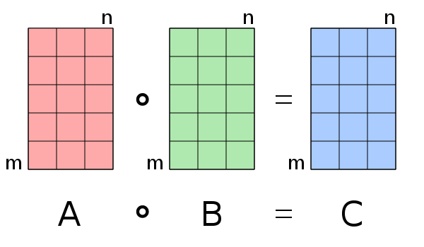

# 哈達瑪乘積\(Hadamard product\)

## Hadamard product

Hadamard product即矩陣內元素element-wise的乘法，因此相乘的兩個矩陣大小必須相等。

$$A \odot B = [A]_{ij} [B]_{ij}$$

例如 $$\begin{bmatrix} a_{11} & a_{12} \\ a_{21} & a_{22} \\ a_{31} & a_{32} \end{bmatrix} \odot \begin{bmatrix} b_{11} & b_{12} \\ b_{21} & b_{22} \\ b_{31} & b_{32} \end{bmatrix} = \begin{bmatrix} a_{11}b_{11} & a_{12} b_{12} \\ a_{21} b_{21} & a_{22} b_{22} \\ a_{31} b_{31}  & a_{32} b_{32}\end{bmatrix}$$

### 性質

> * $$A \odot B = B \odot A$$
> * $$(A \odot B) \odot C = A \odot (B \odot C)$$
> * $$A \odot (B+ C) = A \odot B + A \odot C$$
> * $$k \in F$$，$$(kA) \odot B = A \odot (k B) = k (A \odot B)$$
> * $$A \odot 0 = 0 \odot A = 0$$
> * $$rank(A \odot B) \leq rank(A) rank(B)$$
> * $$\det(A \odot B)  \geq \det(A) \det(B)$$

