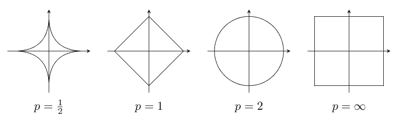
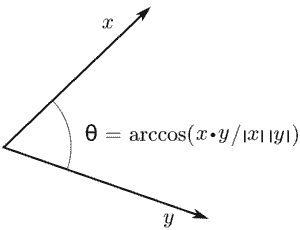

# 內積空間(inner product space)

## 內積算子(inner product operator)

> 向量空間$$V$$定義在體$$F$$，定義<mark style="color:red;">內積函數</mark>$$\langle \cdot, \cdot \rangle:V \times V \rightarrow F$$滿足：
>
> 1. $$\forall u,v, w \in V$$，$$\langle u+v, w\rangle = \langle u, w\rangle + \langle v, w\rangle$$。
> 2. $$\forall u,v \in V, c \in F$$，$$\langle cu, v\rangle = c \langle u, v\rangle$$。
> 3. $$\forall u,v \in V$$，$$\langle u, v\rangle = \overline{\langle u, v \rangle}$$ （共軛交換性）
> 4. $$\forall v \in V, v \neq 0$$，$$\langle v, v \rangle > 0$$。
>
> 註：<mark style="color:red;">內積算子為向量間角度</mark>，可得$$\langle u, v \rangle = \|u \| \|v\| \cos \theta$$，為向量$$u$$投影在向量$$v$$時長度的乘積，$$\theta$$為兩向量$$u, v$$間的夾角，$$\|v\|$$為向量的範數（norm, 長度的擴充）。
>
> 因此條件1$$\langle u+v, w\rangle$$為合成向量$$u+v$$投影在$$w$$的長度，等於向量$$u,v$$分別投影在$$w$$上長度的總和。條件2也可以用投影的方式解釋。
>
> 條件3中，$$\langle u, v\rangle$$是向量$$u$$以夾角$$\theta$$投影至$$v$$的長度；而$$\langle v,u \rangle$$是向量$$v$$以角度$$-\theta$$投影至$$u$$的長度，在複數時，等於共軛向量的投影。

* $$\forall v \in V, ~\langle v, v\rangle =0 \Leftrightarrow v=0$$。
  * 由於$$\langle v, v \rangle = \| v\| \| v\| \cos \theta =0$$，且向量$$v$$與$$v$$之間的夾角為0，所以$$\cos \theta=1$$，因此$$v=0$$。
* $$\forall u, v, w \in V, a,b \in F, \langle u, av+bw\rangle= \overline{a}\langle u ,v\rangle+\overline{b}\langle u,w\rangle$$
  * $$\langle u, av+bw\rangle = \overline{\langle av + bw, u\rangle} = \overline{a\langle v, u\rangle + b \langle w, u\rangle} = \overline{a\langle v,u\rangle}+\overline{b\langle w, u\rangle}=\overline{a} \langle u,v \rangle+ \overline{b} \langle u, w\rangle$$

### 常見內積

* $$V=\mathbb{C}^{N \times N}$$，$$\forall A,B \in V$$，定義<mark style="color:red;">方陣的內積</mark>為$$\langle A, B\rangle=tr(AB^{\mathrm {H}})$$。
* $$V=C[a,b]$$為定義在閉區間$$[a,b]$$的所有連續函數，$$F=\mathbb{C}$$，則$$\forall f,g \in V$$，定義<mark style="color:red;">連續函數內積</mark>$$\langle f, g \rangle=\int_a^b f(x)\overline{g(x)}dx$$。
* 歐式空間 $$V=\mathbb{R}^N$$, $$F=\mathbb{R}$$，<mark style="color:red;">標準內積</mark>$$\langle x, y\rangle = x^\top y=y^\top x=\sum_{i=1} ^N x_i y_i$$
* $$V=F^{N \times 1}, F = \mathbb{C}$$，<mark style="color:red;">標準（行向量）內積</mark>$$\langle x,  y\rangle =y^{\mathrm{H}}x=x_1\overline{y_1} + \dots + x_N\overline{y_N}$$。

### 內積值與角度

給定兩單位向量$$u, v$$，如果兩向量的夾角：

* 為銳角($$< 90^{\circ}$$或$$< \frac{\pi}{2}$$)，則$$u^\top v > 0$$。
* 為直角($$=90^\circ$$或$$=\frac{\pi}{2}$$)，則$$u^\top v = 0$$。
* 為鈍角($$> 90^\circ$$或$$> \frac{\pi}{2}$$)，則$$u^\top v < 0$$。

## 內積空間(inner product space)

> 向量空間$$V$$定義在體$$F$$，若向量空間$$V$$上定義內積算子，則稱$$V$$為內積空間。
>
> 註：向量空間只有定義0向量、向量的合成與縮放。其維度是由基底（同時為最小生成集與最大獨立集）決定。向量間的角度是由內積決定（但內積之值為純量），向量的長度由範數決定。
>
> 度量空間的距離函數是定義在集合上，不必為向量空間，但也可以用在向量空間上。

* 只有三維空間中，才有外積(cross product)的定義，且外積的值為向量而非純量。
* &#x20;兩個向量的內積，並不是個向量，而是個純量(scalar)。

### 內積算子的性質

> $$V$$為定義在體$$F$$的內積空間，$$B=\{b_1, \dots, b_N\}$$為$$V$$的基底。
>
> 1. &#x20;$$\forall v \in V, \langle v,0 \rangle=\langle 0,v \rangle=0$$ （零向量的內積必為0）
> 2. $$\forall u,v \in V, \langle u,v \rangle=0 \Leftrightarrow \langle v, u \rangle=0$$
> 3. $$\displaystyle \forall u_i,v \in V, c_i \in F, ~ \left \langle \sum_{i=1}^K c_i u_i,v \right\rangle =\sum_{i=1}^K c_i  \langle u_i, v\rangle$$
> 4. $$\forall u,v \in V, c \in F, ~ \langle u, cv\rangle = \overline{\langle cv, u\rangle} = \overline{c} \langle u, v\rangle$$
> 5. $$\displaystyle ∀u,v_i \in V, c_i \in F, ~  \left\langle u, \sum_{i=1}^K c_iv_i \right\rangle  =\sum_{i=1}^K \overline{c_i} \langle u, v_i \rangle$$
> 6. $$\langle u,v\rangle=0, \forall v \in V\Leftrightarrow u=0$$ （只有零向量與所有向量內積為0）
> 7. $$\langle u,v \rangle = \langle w,v\rangle, \forall v \in V \Leftrightarrow u=w$$（$$\forall v \in V$$是必須的條件，否則有可能是剛好選到讓$$u,w$$內積相同的$$v$$）
> 8. $$u=0 \Leftrightarrow  \langle u,b_i \rangle=0, ~\forall i=1,2,\dots,N$$
>    &#x20;（因為向量空間間所有的向量均可由基底生成，而只有0向量與所有向量內積為0）

Proof (1)

* $$\langle u,0 \rangle= \langle u,0+0 \rangle= \langle u,0 \rangle+ \langle u,0 \rangle \Rightarrow \langle u,0\rangle=0$$
* 同理$$\langle 0,u \rangle=0$$ (QED)

Proof (6):

* 若$$f \langle u,v \rangle =0,~\forall v \in V$$
* 則$$\langle u,u \rangle=0 \Rightarrow u=0$$&#x20;
* 反之若$$u=0 \Rightarrow \langle u,v \rangle =0, ~\forall v \in V$$  (QED)

Proof (7):

* 若$$u=w$$，則$$\langle u,v \rangle=\langle w,v \rangle$$
* 若$$\langle u,v \rangle= \langle w,v \rangle, ~ \forall v \in V$$
* 可得$$\langle u,v \rangle− \langle w,v \rangle=0, ~\forall v \in V$$
* 整理得 $$\langle u−w,v \rangle =0, ~\forall v \in V$$
* 由(6)知$$u−w=0 \Rightarrow u=w$$ (QED)

### 範數(norm)

> $$V$$為定義在體$$F$$的內積空間，定義$$\|v\|_2 = \sqrt{\langle v, v \rangle}, ~ \forall v \in V$$為<mark style="color:red;">向量</mark>$$v$$<mark style="color:red;">的長度（範數）</mark>。
>
> 兩個向量間的距離為$$\| u -v \| = \| v - u\|$$
>
> • 也可以不使用內積定義向量空間元素的長度，只要定義函數$$\|\cdot\|: V\rightarrow F$$滿足範數的條件即可：
>
> * (faithfulness) $$\|x\|=0\Leftrightarrow x=0$$（只有0向量長度為0）
> * &#x20;(homogeneity) $$\forall c \in F, ~\|cx\|=|c|\|x\|$$
> * &#x20;(subadditivity) $$\|x+y\| \leq |x\|+\|y\|$$（三角不等式）
>
> 因此可定義p-norm為$$\displaystyle \|x\|_p = \left(\sum_{i=1}^N  |x_i|^p \right)^{\frac{1}{p}}$$，此處$$\|x_i|$$的絕對值不可省略，因為$$x_i \$$為複數時，必須使用絕對值求長度。
>
> * 1-norm：$$\|x\|_1=|x_1|+|x_2|+\dots+|x_N|$$。
> * 2-norm：$$\|x\|_2 =(|x_1|^2+|x_2|^2+\dots+|x_N|^2)^{\frac{1}{2}}$$。
> * $$\infty$$-norm：$$\|x\|_\infty=\max\{|x_1|, |x_2|, \dots, |x_N|\}$$。

### 範數的性質

> $$V$$為定義在體$$F$$的內積空間，則$$\forall v \in V, c \in F$$，$$\|v\|=\sqrt{\langle v, v\rangle}$$
>
> * $$\|v\| \geq 0$$且$$\|v\|=0 \Rightarrow v=0$$
> * $$\| cv\| = |c| \|v\|$$

* $$\|v\|=\sqrt{\langle v, v \rangle}=0 \Rightarrow \langle v, v \rangle=0 \Leftrightarrow v=0$$
* $$\| cv\| =\langle cv, cv \rangle=c\overline{c} \langle v, v \rangle =|c|^2\|v\|^2=(|c| \|v\|)^2$$

### 內積為向量投影後長度有方向性的乘積

> * Cauchy-Schwartz不等式: $$|  \langle u,v \rangle  | \leq \| u \| \|v\|$$
>   * 所以$$-1 \leq \frac{\langle u ,v \rangle}{\|u\| \|v\|} \leq 1$$
>   * 即$$\exists \theta \in [0, \pi ] \ni \frac{\langle u ,v \rangle}{\|u\| \|v\|}  = \cos \theta$$
>   * $$\theta = \cos^{-1}\left(  \frac{\langle u ,v \rangle}{\|u\| \|v\|} \right)$$為兩向量間的夾角。
> * 三角不等式：$$\| u+v\| \leq \|u\| + \|v\|$$

Proof Cauchy-Schwarz inequality:

* $$v=0$$時顯然成立。
* $$v \neq 0$$時，取$$c=\frac{\langle u,v\rangle}{ \langle v,v \rangle}  \in F$$
* $$0\leq \|u−cv\|^2= \langle u−cv,u−cv \rangle$$
* 展開得 $$\langle u,u−cv \rangle−c \langle v,u−cv \rangle=\langle u,u \rangle−\overline{c} \langle u,v \rangle −c \langle v,u \rangle + c \overline{c}\langle v,v\rangle$$
* 將$$c$$代換得
* $$\langle u,u \rangle − \overline{\frac{\langle u,v \rangle}{ \langle v,v \rangle }} \langle u,v \rangle−\frac{\langle u,v \rangle}{ \langle v,v \rangle }   \langle u,v \rangle +\frac{\langle u,v \rangle}{ \langle v,v \rangle } \overline{\frac{\langle u,v \rangle}{ \langle v,v \rangle }} \langle v,v \rangle=\|u\|^2−\frac{|\langle u,v\rangle|^2}{\|v\|^2} −\frac{|\langle u,v\rangle|^2}{\|v\|^2} +\frac{|\langle u,v\rangle|^2}{\|v\|^2} =\|u\|^2−\frac{|\langle u,v\rangle|^2}{\|v\|^2}$$
* 整理可得 $$\frac{|\langle u,v\rangle |^2}{\|v\|^2}  \leq \|u\|^2 \Rightarrow |\langle u,v\rangle |^2 \leq \|u\|^2 \|v\|^2 \Rightarrow | \langle u,v \rangle | \leq \|u\|\|v\|$$  (QED)

Proof triangle inequality
：

* $$\|u+v\|^2= \langle u+v,u+v \rangle=\langle u,u \rangle+\langle u,v\rangle+\langle v,u \rangle+\langle v,v \rangle$$
* 可得$$\|u\|^2+\|v\|^2+\langle u,v\rangle + \overline{\langle u,v\rangle}=\|u\|^2+\|v\|^2+2\mathrm{Re}( \langle u,v \rangle)\leq \|u\|^2+\|v\|^2+2| \langle u,v \rangle|$$
* 由Cauchy-Schwarz不等式得$$\|u\|^2+\|v\|^2+2| \langle u,v \rangle|\leq \|u\|^2+\|v\|^2+2\|u\|\|v\|  = (\|u\|+\|v\|)^2$$
* 所以$$\|u+v\| \leq \|u\|+\|v\|$$  (QED).

#### 範例：複數空間的標準內積

*   $$\displaystyle \left|\sum_{i=1}^N u_i \overline{v_i} \right| \leq \left(\sum_{i=1}^N |u_i |^2 \right)^{\frac{1}{2}} \left(\sum_{i=1}^N |v_i |^2 \right)^{\frac{1}{2}}$$

* $$\displaystyle \left(\sum_{i=1}^N |u_i+v_i |^2 \right)^{\frac{1}{2}} \leq \left(\sum_{i=1}^N |u_i |^2 \right)^\frac{1}{2}+\left(\sum_{i=1}^N |v_i |^2 \right)^{\frac{1}{2}}$$

#### 範例：連續函數的內積

* $$\displaystyle  \left|\int_0^1 f(x)g(x)dx \right| \leq \left(\int_0^1f^2 (x)dx\right)^{1/2} \left(\int_0^1 g^2 (x)dx\right)^{1/2}$$
* $$\displaystyle \left(\int_0^1 (f(x)+g(x))^2 dx\right) \leq \left(\int_0^1 f^2 (x)dx\right)^{1/2}+\left(\int_0^1 g^2 (x)dx\right)^{1/2}$$

## 正交(orthogonal)

> $$V$$為定義在體$$F$$的內積空間，若$$u,v \in V$$滿足$$\langle u, v\rangle=0$$，稱兩向量正交，記為$$u \bot v$$。
>
> 集合$$S \subseteq V$$，若$$\forall u,v \in V, u \neq v$$且$$\langle u, v \rangle=0$$，稱$$S$$為正交集（orthogonal set）。
>
> 若$$S$$中所有元素的長度均為1（$$\|v\|=1, \forall v \in V$$），稱$$S$$為單範正交集（orthnormal set）。

* 非單位向量$$u$$可用$$v=\frac{u}{\|u\|}$$  正規化為單位向量。
* $$\forall v \in V, \langle v,0 \rangle=0$$，所以**零向量與任意向量均正交**。
* 正交集合中可以包含零向量
  。但因為零向量不為單位向量，所以單範正交集中不含零向量。
* $$S=\{v_1,\dots,v_K\}$$為單範正交集的充要條件為$$\langle v_i,v_j \rangle=\delta_{ij}=\left\{  \begin{align}  0, \text{ if } i \neq j \\ 1, \text{ if } i=j \end{align} \right.$$。
* 若$$S$$為正交集且為$$V$$的基底，則稱$$S$$為$$V$$的正交基底(orthogonal basis)
  。
* 若$$S$$為單範正交集且為$$V$$的基底，則稱$$S$$為$$V$$的單範正交基底(orthonormal basis)。

#### 範例：Fourier級數

* $$V=C[0,2 \pi], F=\mathbb{C},  \langle f,g \rangle=\int_0^{2\pi} f(x) \overline{(g(x)} dx$$
* 則$$S=\{1,\cos ⁡x,\sin ⁡x,\cos⁡ 2x,\sin ⁡2x,\dots\}$$為正交集(Fourier 轉換的基底)
  。
* 而$$S=\{\frac{1}{\sqrt{2\pi}} ,\frac{\cos ⁡x}{\sqrt{x}}, \frac{\sin x}{\sqrt{\pi}}, \frac{\cos⁡ 2x}{\sqrt{\pi}}, \frac{\sin ⁡2x}{\sqrt{\pi}},\dots\}$$為單範正交集
  。

### 畢氏定理(Pythagorean theorem)

> $$V$$為定義在體$$F$$的內積空間，$$u,v \in V$$且$$u \bot v$$，則$$\|u+v\|^2 = \|u\|^2 + \|v\|^2$$。
>
> 若$$S=\{v_1, \dots, v_K\}$$為正交集，則$$\|\sum_{i=1}^K c_iv_i \|^2=\sum_{i=1}^K |c_i|^2 \|v_i\|^2$$。

proof:

* $$\displaystyle \left\|  \sum_{i=1}^K c_i v_i\right\|^2=\left\langle  \sum_{i=1}^K c_i v_i, \sum_{i=1}^K c_i v_i\right\rangle = \sum_{i=1}^K\sum_{j=1}^K c_i \overline{c_j} \langle v_i, v_j \rangle$$
* 因為$$\langle v_i, v_j \rangle= 0, \forall i \neq j$$，
* 所以$$\sum_{i=1}^K\sum_{j=1}^K c_i \overline{c_j} \langle v_i, v_j \rangle = \sum_{i=1}^K c_i \overline{c_i} \langle v_i, v_i \rangle= \sum_{i=1}^K |c_i|^2 \|v_i\|^2$$(QED)

## 三維空間的內積與外積

兩向量$$x=(x_1, x_2, x_3), y=(y_1, y_2, y_3)$$，

* 內積：$$\langle x, y\rangle = x_1 y_1 + x_2 y_2 +x_3 y_3 = \|x\| \|y\| \cos \theta$$為純量。
* 外積：$$x \times y=\begin{pmatrix} \begin{vmatrix} x_2 & x_3 \\y_2 & y_3\end{vmatrix} & \begin{vmatrix} x_3 & x_1 \\y_3 & y_1\end{vmatrix} & \begin{vmatrix} x_1 & x_2 \\y_1 & y_2\end{vmatrix} \end{pmatrix} = (\|x\| \|y\| \sin \theta  )n$$，其中 $$n$$ 是垂直於 $$x$$ 和 $$y$$ 所在平面並滿足右手定則的單位向量。
