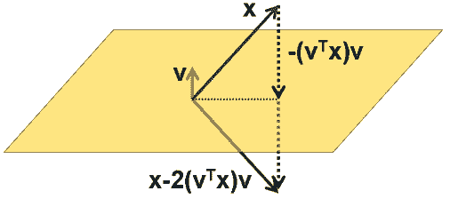
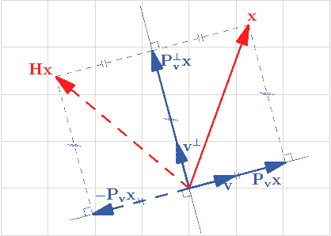

# Householder轉換(transformation)

## Householder matrix

> $$0 \neq v \in \mathbb{R}^{N \times 1}$$，$$H=I - \frac{2}{v^\top v} vv^\top \in \mathbb{R}^{ \times N}$$為相對於$$v$$的Householder matrix或基本鏡射算子（elementart reflector）。
>
> 當$$\|v\|=1$$時，$$H=I-2vv^\top \in \mathbb{R}^{N \times N}$$

給定向量$$v$$，可得正交於向量$$v$$的平面$$v^\bot$$，Householder轉換即求出向量$$x$$鏡射於平面$$v^\bot$$ 的向量$$y$$。

* 令向量$$y$$為$$x$$相對於平面鏡射後的結果，則$$y−x$$正交於平面。
* 因此$$y−x$$與向量$$v$$平行，可得$$y−x=cv, ~c \in \mathbb{R}$$。
* 令$$x$$投影在平面上的向量$$\mathrm{proj}_{v^\bot} (x)=x+\frac{1}{2} (y−x)=x+\frac{1}{2} cv$$
* 因$$\mathrm{proj}_{v^\bot} (x)$$與$$v$$正交，可得$$\langle \mathrm{proj}_{v^\bot} (x),v \rangle =v^\top (x+1/2 cv)=0$$
* 所以$$v^\top x+1/2 cv^\top v=0$$，$$c=\frac{−2w^\top x}{v^\top v}$$
* 得$$y=x+cw=x+\frac{−2v\top x}{v^\top v} v=x−\frac{2}{v^\top v} vv^\top x=(I−\frac{2}{v^\top v} vv^\top )x=Hx$$(QED)

### Householder矩陣的必要條件

> $$H=I−\frac{2}{v^\top v} vv^\top$$，則：
>
> 1. $$H$$為對稱矩陣($$H^\top=H$$)
> 2. $$H$$為正交矩陣($$H^\top H=HH^\top=I_N$$)
> 3. $$\det⁡(H)=−1$$
>

### Houserholder矩陣的性質

> * $$x,y\in \mathbb{R}^{N \times 1}$$，$$x \neq y$$，$$\|x\|_2=\|y\|_2$$
>   ，$$H$$是相對於x−y的Householder矩陣，則
>   * $$\|x−y\|_2=2(x−y)^\top x$$
>   * $$Hx=y$$
> * $$\forall x \in \mathbb{R}^{N \times 1}$$，若$$y=ce_1$$，$$c=\|x\|_2$$，$$w=x−ce_1$$，則$$Hx=ce_1$$。
> * 假設$$x=\begin{bmatrix}  x_1 \\ \vdots \\ x_k \\ x_{k+1} \vdots \\x_N \end{bmatrix} \in \mathbb{R}^N$$，則存在一個Householder matrix $$H \ni Hx=\begin{bmatrix}  b_1 \\ \vdots \\b_k \\ 0 \\ \vdots \\ 0 \end{bmatrix}$$，即$$Hx$$的後面$$n-k$$項均為0。

### &#x20;Householder矩陣與QR分解

> $$A \in \mathbb{R}^{M \times N}$$，則：
>
> * 存在最多$$N$$個Householder矩陣$$H_1,H_2,\dots,H_N$$ 使得$$H_N H_{N−1}\dots H_1 A=R, [R]_{ij}=0, \forall i>j$$(上三角矩陣)
> * 令$$Q=H_1 H_2\dots H_N$$，則$$Q$$為正交矩陣，且$$A=QR$$為$$A$$的QR分解。
>

> 註：QR分解是$$A$$的行向量，經Gram-Schmidt正交化過程後得到的單範正交矩陣$$Q$$，與其參數矩陣$$R$$。
