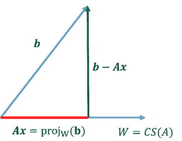

# 最小平方解\(least square solution\)

## 簡介

* 矩陣$$A \in F^{M \times N} , A=\begin{bmatrix} A_{:1} & \dots & A_{:N}\end{bmatrix},~ A^{\mathrm{H}}=  \begin{bmatrix} \overline{A_{:1}^\top} \\ \vdots \\ \overline{A_{:N}^\top}\end{bmatrix} = \begin{bmatrix} A_{:1}^{\mathrm{H}} \\ \vdots \\ A_{:N}^{\mathrm{H}}\end{bmatrix}$$
* $$A^{\mathrm{H}}A =  \begin{bmatrix}  A_{:1}^{\mathrm{H}}A_{:1} &  \dots &A_{:1}^{\mathrm{H}}A_{:N} \\  \vdots & \ddots & v\dots \\ A_{:N}^{\mathrm{H}}A_{:1} & \dots & A_{:N}^{\mathrm{H}}A_{:N}  \end{bmatrix} \in F^{N \times N}$$稱為正規矩陣（normal matrix）。
* 例如：$$A=\begin{bmatrix} a_{11} & a_{12} \\ a_{21} & a_{22} \\ a_{31} & a_{32}\end{bmatrix}$$，$$A^{\mathrm{H}}=\begin{bmatrix} \overline{a_{11}} & \overline{a_{21}} & \overline{a_{31}} \\ \overline{a_{12}} & \overline{a_{22}} & \overline{a_{32}} \end{bmatrix}$$，$$A^{\mathrm{H}}A=\begin{bmatrix}  A_{:1}^{\mathrm{H}}A_{:1} & A_{:1}^{\mathrm{H}}A_{:2} \\ A_{:2}^{\mathrm{H}}A_{:1} & A_{:2}^{\mathrm{H}}A_{:2}  \end{bmatrix}$$
* 給定矩陣$$A \in F^{M \times N}$$行向量獨立，但不必正交，則向量$$b \in F^{M \times 1}$$投影到$$CS(A) =\{Ax| x\in F^{N \times 1}\}$$的投影向量為$$\mathrm{proj}_{CS(A)} (b)=A(A^{\mathrm{H}} A)^{−1} A^\mathrm{H} b$$。
* 如果將$$A$$的獨立行向量先做Gram-Schmidt正交化得正交基底後，再將$$b$$投影到各基底得到合成向量可得到與$$\mathrm{proj}_{CS(A)} (b)$$相同之值。
* 而$$x^{*} \in \mathbb{C}^{N \times 1}$$為$$x^{*}=\arg\min_x{\|Ax-b\|}$$的最佳解$$\Leftrightarrow A^{\mathrm{H}}Ax=A^{\mathrm{H}}b$$之解。

## 正規矩陣的基本子空間與性質

> 令矩陣$$A \in F^{M \times N}$$，則：
>
> 1. $$ker(A^{\mathrm{H}}A) =ker(A)=\{x \in F^{N \times 1} | Ax=0\}$$
> 2. $$rank(A^{\mathrm{H}}A) = rank(A)$$\(只有rank相同，但值域不相同\)
> 3. $$Lker(A^{\mathrm{H}}A) = Lker(A)$$
> 4. 矩陣$$A$$行向量線性獨立$$\Leftrightarrow A^{\mathrm{H}} A$$為可逆矩陣。
> 5. 矩陣$$A$$列向量線性獨立$$\Leftrightarrow A^{\mathrm{H}} A$$為可逆矩陣。
>
> 註：
>
> * 矩陣$$A \in F^{M \times N}$$ 的行向量獨立$$\Leftrightarrow rank(A)=\dim⁡(CS(A))=\dim⁡(RS(A))=N=\dim⁡(F^{1 \times N}) )\Leftrightarrow A$$的列向量生成$$F^{1 \times N}$$。
> * 矩陣$$A \in F^{M \times N}$$ 的列向量獨立$$\Leftrightarrow rank(A)=\dim⁡(RS(A))=\dim⁡(CS(A))=M=\dim⁡(F^{M\times 1} )\Leftrightarrow A$$的行生成$$F^{M \times 1}$$。

Proof \(1\)
=&gt;

* $$\forall x \in ker⁡(A^\mathrm{H} A)$$，可得$$(A^\mathrm{H} A)x=0$$，因此$$x^\mathrm{H} A^\mathrm{H} Ax=0=x^\mathrm{H} 0=0$$
* 由標準內積得$$(Ax)^{\mathrm{H}} (Ax)=0\Rightarrow\langle Ax,Ax \rangle = \|Ax\|^2=0 $$
* 因為$$ \|Ax\|^2=0 \Rightarrow Ax=0 \Rightarrow x \in ker⁡(A)$$\(QED\)

 &lt;=

* $$\forall x \in ker⁡(A)$$，可得$$Ax=0 A^{\mathrm{H}} Ax=A^{\mathrm{H}} 0=0 \Rightarrow x \in ker⁡(A^{\mathrm{H}} A)$$
* 因為$$ker⁡(A^{\mathrm{H}} A) \subseteq ker⁡(A)$$且$$ker⁡(A) \subseteq ker⁡(A^{\mathrm{H}} A)$$  ，所以$$ker(A^{\mathrm{H}} A)=ker⁡(A)$$  \(QED\)

Proof \(2\)

* $$A \in ℂ^{M \times N}$$，by rank-nullity theorem
* $$N=nullity(A)+rank(A)=\dim⁡(ker⁡(A) )+\dim⁡(CS(A))$$
* 因為$$A^{\mathrm{H}} A \in \mathbb{C}^{N \times N}$$，所以$$N=nullity(A^\mathrm{H} A)+rank(A^\mathrm{H} A)$$
* 因為$$ker⁡(A^\mathrm{H} A)=ker⁡(A) \Rightarrow nullity(A^\mathrm{H} A)=nullity(A)$$
* 可得 $$rank(A^\mathrm{H} A)=rank(A)$$ \(QED\)

proof\(4\):

* 因為矩陣$$A$$的行向量獨立$$\Leftrightarrow Ax=0$$只有$$x=0$$的解$$\Leftrightarrow ker⁡(A)=\{0\}$$
* 因此$$ker⁡(A^\mathrm{H} A)=\{0\}$$，可得$$A^\mathrm{H} A$$為可逆矩陣 \(QED\)

## 歐式空間標準內積正交投影至矩陣的行向量公式

> * 矩陣$$A \in \mathbb{C}^{M \times N}$$，且$$A$$行向量線性獨立（但不一定正交），考慮由$$A$$的行向量生成的向量空間$$W=CS(A) $$。
> * 給定向量$$b \in \mathbb{C}^{M \times 1}$$，則在歐式空間標準內積下，向量$$b$$投影至向量空間$$W$$之值為
  $$\mathrm{proj}_W (b)=A(A^{\mathrm{H}} A)^{−1} A^\mathrm{H} b$$。
> * 因為矩陣$$A$$為的行向量線性獨立，所以$$A^\mathrm{H} A$$可逆，因此 $$(A^\mathrm{H} A)^{−1}$$ 必定存在，即$$A(A^\mathrm{H} A)^{−1} A^\mathrm{H} b$$必定可求值
  。

Proof:

* $$A(A^\mathrm{H} A)^{−1} A^\mathrm{H} b=A[(A^\mathrm{H} A)^{−1} A^\mathrm{H} b]   \in CS(A)=W$$，所以向量$$b$$投影後的向量在空間$$W$$。
* 因為向量空間$$W$$由$$CS(A)$$生成，因此$$\forall w \in W, \exists x\in \mathbb{C}^{N \times1} \ni w=Ax$$，即空間$$W$$的元素可由$$A$$的行向量線性組合而成。
* 由於正交向量$$b−A(A^\mathrm{H} A)^{−1} A^\mathrm{H} b$$應與$$W$$內的任意向量$$w$$內積值為0
  。
* 因此$$\begin{aligned} &\langle b−A(A^\mathrm{H} A)^{−1} A^\mathrm{H} b,~w\rangle  \\&=w^{\mathrm{H}} (b-A(A^\mathrm{H} A)^{−1} A^\mathrm{H} b) \\ &=(Ax)^{\mathrm{H}} (b-A(A^\mathrm{H} A)^{−1} A^\mathrm{H} b) \\ &=x^\mathrm{H} A^\mathrm{H} b−x^\mathrm{H} A^\mathrm{H} A(A^\mathrm{H} A)^{−1} A^\mathrm{H} b \\ &=x^\mathrm{H} A^\mathrm{H} b−x^\mathrm{H} A^\mathrm{H} b\\ &=0  \end{aligned}$$
* 所以$$w$$與$$ b−A(A^\mathrm{H} A)^{−1} A^\mathrm{H} b$$正交
* 因此$$\mathrm{proj}_W (b)= b−A(A^\mathrm{H} A)^{−1} A^\mathrm{H} b$$ \(QED\)

#### 範例：矩陣

* $$A=\begin{bmatrix} 1 & 1 \\2 & -1 \\-2 & 0 \\ 1 & 1\end{bmatrix}$$，$$b=\begin{bmatrix}1 \\ 2 \\3 \\4 \end{bmatrix}$$，因為矩陣$$A$$的行向量獨立，因此$$\mathrm{proj}_{CS(A)}(b)=A(A^\top A)^{-1} A^\top b=\begin{bmatrix}\frac{13}{10} \\ -\frac{2}{5} \\ - \frac{3}{5} \\ \frac{13}{10} \end{bmatrix}$$

#### 使用Gram-Schmidt正交化

* $$\langle v_1, v_2 \rangle =1 -2 +0 +1=0$$，所以兩行向量正交。
* $$\mathrm{proj}_{CS(A)}(b)  = \frac{\langle b, v_1\rangle}{\|v_1\|^2}v_1 + \frac{\langle b, v_2\rangle}{\|v_2\|^2}v_2 = \frac{3}{10}\begin{bmatrix} 1  \\2  \\-2  \\ 1 \end{bmatrix} + \frac{3}{3}\begin{bmatrix}1 \\ -1 \\0 \\1 \end{bmatrix} = \begin{bmatrix}\frac{13}{10} \\ -\frac{2}{5} \\ - \frac{3}{5} \\ \frac{13}{10} \end{bmatrix}$$

#### 範例：歐式空間

* $$S=\{(x,y,z)| x+y+z=0\}$$為$$\mathbb{R}^3$$的子空間。
* 取標準基底，則$$S=span\left\{ \begin{bmatrix} 1 \\ 0 \\ -1\end{bmatrix}, \begin{bmatrix} 0 \\ 1 \\ -1\end{bmatrix}\right\}$$
* 取$$A=\begin{bmatrix} 1 & 0 \\ 0  & 1\\ -1 &-1\end{bmatrix}$$，所以$$\mathrm{proj}_A\left(\begin{bmatrix} x \\y\\ z \end{bmatrix}\right) =  A(A^\top A)^{-1}A^\top \begin{bmatrix} x \\y\\ z \end{bmatrix} = \begin{bmatrix} \frac{2x-y-z}{3} \\ \frac{-x+2y-z}{3} \\ \frac{-x-y+2z}{3} \end{bmatrix}$$

##  歐式空間標準內積正規方程式\(normal equation\)

> $$A \in \mathbb{C}^{M \times N},~ W=CS(A), ~b \in \mathbb{C}^{M \times 1}$$，則：
>
> * $$\displaystyle x =\arg\min_x\|Ax−b| \Leftrightarrow A^{\mathrm{H}}Ax^{*}=A^{\mathrm{H}}b$$
> * 此時$$x^{*}$$為$$Ax=b$$的最小平方解\(least square solution\)。
>
> 註： 
>
> * 矩陣$$A$$的行向量不必獨立，此時$$rank(A^\mathrm{H} A)=rank(A)<N$$
>   * $$A^\mathrm{H} Ax=A^\mathrm{H} b$$有無限多解，但$$\mathrm{proj}_W (b)=Ax$$唯一解。
> * 矩陣$$A$$的行向量獨立時，$$A^\mathrm{H}A$$可逆，因此$$Ax=\mathrm{proj}_W (b)=A(A^\mathrm{H} A)^{−1} A^\mathrm{H} b$$。
>   * $$ x=(A^\mathrm{H} A)^{−1} A^\mathrm{H} b\Leftrightarrow A^\mathrm{H} Ax=A^\mathrm{H} b$$。
>   * 正規方程式$$A^\mathrm{H} Ax=A^\mathrm{H} b$$，$$x$$必定有解。
> * 當矩陣$$P$$將向量$$b$$對應至他的正交投影向量$$\mathrm{proj}_W (b)$$時，稱$$P$$為一投影在$$W$$上的正交投影矩陣\(orthogonal projection matrix\)。如$$A$$的行向量獨立時，$$P=A(A^\mathrm{H} A)^{−1} A^\mathrm{H}
  $$。

Proof:

* $$\|Ax−b\|$$為最小等價於$$\|b−Ax\|$$為最小。
* 因為$$Ax \in CS(A)=W$$
* 根據正交投影可知$$\|b−Ax\|$$之值最小$$\Leftrightarrow Ax=\mathrm{proj}_W (b)$$，
* 所以$$\|Ax−b\|$$之值最小時$$\Leftrightarrow \langle b−Ax,w \rangle=0, ~\forall w\in W$$
* $$\Leftrightarrow  \langle b−Ax,Ay \rangle=0, \forall y \in \mathbb{C}^{N \times 1}$$
* $$\Leftrightarrow  \langle b,Ay\rangle- \langle Ax,Ay \rangle=0, \forall y \in \mathbb{C}^{N \times 1}$$
* $$\Leftrightarrow  \langle b,Ay\rangle= \langle Ax,Ay \rangle, ~ \forall y \in \mathbb{C}^{N \times 1}$$
* 使用標準內積得$$\Leftrightarrow (Ay)^{\mathrm{H}}b=(Ay)^{\mathrm{H}}(Ax),~ \forall y \in \mathbb{C}^{N \times 1}$$
* $$\Leftrightarrow y^{\mathrm{H}} A^{\mathrm{H}} b = y^{\mathrm{H}} A^{\mathrm{H}} A x, ~ \forall y \in \mathbb{C}^{N \times 1}$$
* 使用標準內積得$$\Leftrightarrow \langle A^{\mathrm{H}}b, y \rangle = \langle A^{\mathrm{H}}Ax, y\rangle, ~\forall y \in \mathbb{C}^{N \times 1}$$
* 因此$$A^{\mathrm{H}}b = A^{\mathrm{H}}Ax$$ \(QED\)

### 範例：矩陣最小平方解

* $$A=\begin{bmatrix}2 & 1\\ 1 & 2\\1 & 1 \end{bmatrix},  x= \begin{bmatrix} x_1 \\ x_2 \end{bmatrix}, b=\begin{bmatrix}1\\ 1 \\1  \end{bmatrix}$$, 因為$$A$$的行向量獨立，所以最小平方解$$x^{*}=\arg\min_x \|Ax-b\|=(A^\top A)^{-1}A^\top b=\begin{bmatrix} \frac{4}{11} \\ \frac{4}{11} \end{bmatrix}$$。

### 範例：多項式最小平方解

連續函數向量空間$$V=C[0,1]$$，內積$$\langle f,g \rangle =\int_0^1 f(x)g(x)dx$$，求$$e^x$$的最小平方逼近。

* 令線性函數向量空間$$W=\{a+bx |a,b \in \mathbb{R}\}=span\{1,x\}$$。
* 由Gram-Schmidt正交化得$$W$$的正交基底$$\{u_1, u_2\}=\{1, x-\frac{1}{2}\}$$。
* 則$$e^x$$在$$W$$的最小平方逼近，即求投影向量$$\mathrm{proj}_W(e^x)$$。
* $$\mathrm{proj}_W(e^x) = \frac{\langle e^x, u_1 \rangle}{\langle u_1, u_1\rangle}u_1 +  \frac{\langle e^x, u_2 \rangle}{\langle u_2, u_2\rangle}u_2 = \frac{\int_0^1 e^xdx}{\int_0^1 1dx}1 + \frac{\int_0^1 e^x (x-\frac{1}{2})dx}{\int_0^1(x-\frac{1}{2})^2dx}(x-\frac{1}{2}) = (18-6e)x+(4e-10)$$

### 範例： 三角多項式的逼近\(Fourier series\)

* 一個三角多項式為$$t_n(x)=\frac{a_0}{2}+\sum_{k=1}^n (a_k \cos kx + b_k \sin kx)$$
* 向量空間$$V=C[-\pi, \pi]$$，$$\langle f, g \rangle=\frac{1}{\pi}\int_{-\pi}^{\pi}f(x)g(x)dx$$，則$$\{\frac{1}{\sqrt{2}}, \cos x, \sin x, \dots, \cos nx, \sin nx\}$$為單範正交集。
* 考慮$$f(x) \in V$$為具有週期$$2\pi$$的函數，則其三角多式項的最小平方逼近為$$\mathrm{proj}_V(f)$$。
* 因為$$V$$的基底為單範正交集，因此$$\langle u_1,u_1 \rangle=\dots=\langle u_n,u_n \rangle=1$$。
* 所以三角多式項的係數 $$\frac{a_0}{2} = \langle f, \frac{1}{\sqrt{2}} \rangle =\frac{1}{2\pi} \int_{-\pi}^{\pi}f(x)dx$$，得$$a_0  =\frac{1}{\pi} \int_{-\pi}^{\pi}f(x)dx$$
* $$a_k = \langle f, \cos kx \rangle= \frac{1}{\pi} \int_{-\pi}^{\pi}f(x)\cos kxdx$$。
* $$b_k = \langle f, \sin kx \rangle= \frac{1}{\pi} \int_{-\pi}^{\pi}f(x)\sin kxdx$$。

## 應用：最小平方直線\(least square line\)\(線性迴歸，linear regression\)

* 給定平面上不全相同的$$n$$個點$$D=\{(x_1, y_1), \dots, (x_n, y_n)\}$$，可使用最小平方逼近求一直線$$a+bx$$使得該直線的誤差平方總和最小，$$E=\sum_{i=1}^n(\hat{y}_i-y_i)^2 =\sum_{i=1}^n(a+bx_i - y)^2$$
* $$A=\begin{bmatrix}  1 & x_1 \\ 1 & x_2 \\ \vdots & \vdots \\ 1 & x_n \end{bmatrix}, x= \begin{bmatrix}  a \\ b \end{bmatrix}, y=\begin{bmatrix}  y_1 \\ y_2 \\ \vdots \\ y_n \end{bmatrix}, E=\|Ax-y\|^2$$
* 求$$a,b$$使得誤差$$E$$值最小，等價於求$$x$$使得$$\| Ax−y\|^2$$ 最小，即求$$x^{*}=\arg\min_{x} \|Ax-y\|^2$$。
* 即將向量$$y$$投影至一階多項式$$a+bx$$的空間上，而$$A$$的行項量為多項式的生成集。
* 求解$$A^\top A x = A^\top y \Rightarrow x=(A^\top A)^{-1}A^\top y$$
* $$A^\top A=\begin{bmatrix}  n & \sum_{i=1}^n x_i \\ \sum_{i=1}^n x_i & \sum_{i=1}^n x_i^2 \end{bmatrix}$$
* $$A^\top y=\begin{bmatrix}  \sum_{i=1}^n y_i \\  \sum_{i=1}^n x_i y_i \end{bmatrix}$$
* 所以$$x=\begin{bmatrix}  n & \sum_{i=1}^n x_i \\ \sum_{i=1}^n x_i & \sum_{i=1}^n x_i^2 \end{bmatrix}^{-1} \begin{bmatrix}  \sum_{i=1}^n y_i \\  \sum_{i=1}^n x_i y_i \end{bmatrix}$$

### 一階多項式逼近

#### 二維平面

$$D=\{(-1,0), (1,1), (2,3)\}$$，逼近式$$y=ax+b$$

$$A=\begin{bmatrix} 1 & -1 \\ 1 & 1 \\ 1 & 2\end{bmatrix}, x=\begin{bmatrix} a\\ b\end{bmatrix}, y=\begin{bmatrix} 0 \\ 1 \\ 3\end{bmatrix}$$

$$x=(A^\top A)^{-1} A^\top y=\begin{bmatrix} \frac{5}{7}\\ \frac{13}{14}\end{bmatrix}$$，因此得$$y=\frac{13}{14}x+\frac{5}{7}$$。

#### 三維空間

* $$D=\{x_1, x_2, y\}=\{(−3,5,10), (−2,0,7), (−1,−3,4), (0,−4,2), \\(1,−3,5),(2,0,9), (3,5,13)\}$$
* 逼近式$$y=a+bx_1+cx_2$$

$$A=\begin{bmatrix} 1 & -3 & 5 \\ 1 & -2 & 0 \\ 1 & -1 & -3 \\ 1 & 0 & -4 \\ 1 & 1& -3 \\ 1 & 2 & 0 \\ 1 & 3 & 5\end{bmatrix}, x=\begin{bmatrix} a\\b\\ c\end{bmatrix}, b=\begin{bmatrix} 10 \\ 7 \\4\\ 2\\ 5 \\9\\13\end{bmatrix}$$

$$x=(A^\top A)^{-1} A^\top y=\begin{bmatrix} \frac{50}{7}\\ \frac{1}{2}\\ \frac{20}{21}\end{bmatrix}$$

得$$y=\frac{50}{7}+ \frac{1}{2}x_1 + \frac{20}{21}x_2$$

### 二階多項式逼近

* $$D＝\{(2,0), (3,−10), (5,−48), (6, −76)\}$$
* 逼近式$$y=c_0 + c_1 x + c_2x^2$$
* $$A=\begin{bmatrix}  1 & 2 & 2^2\\ 1 & 3 & 3^2 \\ 1 & 5 & 5^2 \\ 1 & 6 & 6^2 \end{bmatrix} , x=\begin{bmatrix} c_0\\ c_1 \\ c_2\end{bmatrix}, y=\begin{bmatrix} 0 \\ -10 \\ -48 \\ -76 \end{bmatrix}$$
* $$x=(A^\top A)^{-1} A^\top y=\begin{bmatrix} 2 \\ 5 \\ -3\end{bmatrix}$$
* 得$$y=2 + 5x-3x^2$$

### 圓形逼近

* $$D=\{(1,0),(2,2), (3,0), (2,−2)\}$$
* 逼近式$$(x-c_1)^2 + y(-c_2)^2=r$$
* 整理得$$x^2+y^2=2xc_1 + 2yc_2+(r^2 -c_1^2 - c_2^2)$$
* $$A=\begin{bmatrix} 2x_1 & 2y_1  & 1 \\ 2 x_2 & y_2 & 1 \\ 2x_3 & 2 y_3 & 1\\ 2 x_4 & 2y_4& 1  \end{bmatrix}=\begin{bmatrix}  2 & 0 & 1\\ 4 & 4 & 1\\ 6 & 0 & 1\\ 4 & -4 & 1 \end{bmatrix}$$
* $$x=\begin{bmatrix} c_1 \\c_2 \\ r^2 -c_1^2 -c_2^2\end{bmatrix}, b=\begin{bmatrix}  x_1^2 + y_1^2 \\ x_2^2 + y_2^2 \\ x_3^2 + y_3^2 \\ x_4^2 + y_4^2 \end{bmatrix} = \begin{bmatrix}1\\8\\9\\8 \end{bmatrix}$$
* $$x=(A^\top A)^{-1} A^\top y=\begin{bmatrix} 2 \\ 0 \\ -\frac{3}{2}\end{bmatrix}$$
* 得$$(x-2)^2=\frac{5}{2}$$

## 將矩陣作QR分解求最小平方值之解

> 矩陣$$A \in \mathbb{C}^{M \times N} ~,b \in \mathbb{C}^{M \times 1}$$
>
> * $$A=QR$$為矩陣$$A$$的$$QR$$分解，必定存在，$$Q$$為$$A$$的單範正交行向量形成，$$R$$為相對應的上三角係數矩陣\)，則：
> * $$x \in \mathbb{C}^{N \times 1}\ni \|Ax−b\|$$為最小$$\Leftrightarrow Rx=Q^{\mathrm{H}} b$$

