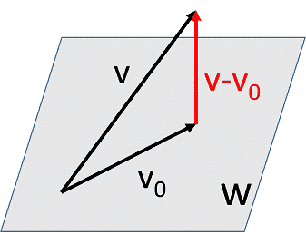

# 正交投影\(orthogonal projection\)

正交投影除了幾何上的意義之外，在最佳化的時候（如最小二乘法或求最短距離）時經常被使用。

## 正交投影向量\(orthogonal projection vector\)

> $$V$$為定義在體$$F$$上的內積空間，$$W$$為$$V$$的子空間。
>
> 向量$$v \in V$$，若存在$$v_0 \in W \ni \langle v-v_0, w\rangle =0, ~ \forall w \in W$$，則稱$$v_0$$為$$v$$在$$W$$上的（正交）投影向量，記為$$v_0=\mathrm{proj}_W(v)$$，而$$\mathrm{proj_W}$$稱為投影算子。
>
> 註：線性轉換中，$$\forall v \in V, ~T^2(v) = T(v)$$稱為[投影算子](../linear-transform/projection-operator.md#tou-ying-suan-zi-projection-operator)。

* 此性質告訴我們向量$$v$$相對於向量空間$$W \subseteq V$$可拆解成投影向量$$\mathrm{proj}_W (v)$$與正交向量$$v−\mathrm{proj}_W (v)$$兩部份。
* $$v=\mathrm{proj}_W(v)+(v-\mathrm{proj}_W(v)) = \mathrm{proj}_W(v) + \mathrm{proj}_{W^\bot}(v)$$

### 向量v與空間W正交若且唯若向量v與空間W所有基底向量正交

> $$V$$為定義在體$$F$$上的內積空間，$$W$$為$$V$$的子空間。令$$B=\{b_1, b_2, \dots, b_K\}$$為$$W$$的一組基底，$$v \in V$$，則向量$$v$$與空間$$W$$正交，即$$\langle v, w \rangle=0,~ \forall v \in W \Leftrightarrow \langle v ,b_i \rangle=0, ~i=1,2,\dots, K$$。

proof =&gt;: 由定義得出。

proof &lt;=:

* $$\forall w \in W, w=\sum_{i=1}^K c_i b_i$$
* 所以$$\langle v,w \rangle = \langle v, \sum_{i=1}^Kc_i b_i \rangle = \sum_{i=1}^K \overline{c_i}\langle v, b_i \rangle=\sum_{i=1}^K \overline{c_i} \cdot 0 = 0$$\(QED\)

## 正交投影公式

> $$V$$為定義在體$$F$$上的內積空間，$$W$$為$$V$$的子空間。令$$B=\{b_1, b_2, \dots, b_K\}$$為$$W$$的一組正交基底（即$$\langle b_i, b_j \rangle =0, ~\forall i \neq j$$），$$v \in V$$，則：
>
> * $$\mathrm{proj}_W(v)\equiv v_0=\sum_{i=1}^K \frac{\langle v, b_i \rangle}{\langle b_i, b_i \rangle} b_i \in W$$為$$v$$在向量空間$$W$$上的正交投影向量（即$$v−v_0$$ 與所有$$W$$中的元素正交）。
> * $$v$$在$$W$$上的正交投影向量唯一。
>
>  若生成集或基底非正交時，可使用Gram-Schmidt正交化預處理。

Proof \(1\)

* 因為$$v_0\in W$$ 為基底的線性組合，所以$$v_0 \in span\{b_1,b_2,\dots,b_K \}=W
  $$。
* $$\forall j=1,2, \dots,K$$

  * $$\begin{aligned} \langle v−v_0,b_j \rangle &= \langle v−\sum_{i=1}^K \frac{\langle v,b_i \rangle}{\langle b_i,b_i \rangle}  b_i,b_j ⟩ \\ &=\langle v,b_j \rangle−\langle \sum_{i=1}^K\frac{\langle v,b_i \rangle}{ \langle b_i,b_i \rangle}  b_i,b_j \rangle \\ &=\langle v,b_j \rangle−\sum_{i=1}^K \frac{\langle v,b_i \rangle}{\langle b_i, b_i \rangle} \langle b_i,b_j \rangle \{\because \langle b_i,b_j \rangle=0, ~\forall i \neq j\} \\ &=\langle v,b_j \rangle−\frac{\langle v,b_j \rangle}{\langle b_j,b_j \rangle}  \langle b_j,b_j \rangle \\ & =\langle v,b_j \rangle− \langle v,b_j \rangle=0  \end{aligned}$$
  * 由上一個定理知$$\langle v−v_0,w \rangle=0, ~ \forall w \in W$$，所以$$v_0$$ 為$$v$$在$$W$$上的投影向量。\(QED\)

  Proof \(2\)

  * 令$$u_0$$ 為$$v$$在$$W$$上的正交投影向量，所以$$u_0 \in W$$
  * 因此$$u_0$$為基底的線性組合，即$$\exists c_1,\dots,a_k \in F \ni u_0=\sum_{i=1}^K c_i b_i $$
  * $$0= \langle v−u_0,b_j  \rangle= \langle v−\sum_{i=1}^K  c_i b_i  ,b_j \rangle= \langle v,b_j \rangle  −\langle \sum_{i=1}^K a_i b_i,b_j  \rangle= \langle v,b_j \rangle=\sum_{i=1}^K a_i  \langle b_i,b_j \rangle= \langle v,b_j \rangle−a_j  \langle b_j,b_j \rangle $$
  * 所以$$a_j \langle b_j,b_j \rangle= \langle v,b_j \rangle \Rightarrow a_j=\frac{\langle v,b_j \rangle}{ \langle b_j,b_j \rangle } $$
  * 可得$$u_0=\sum_{i=1}^K \frac{\langle v,b_j \rangle}{ \langle b_j,b_j \rangle}  b_i=v_0$$ \(QED\)

#### 範例：歐式空間

$$W=span\left\{  \begin{bmatrix} 1 \\ 0 \\ 1 \\0\end{bmatrix}, \begin{bmatrix} 1 \\ 1 \\ 1 \\0\end{bmatrix}. \begin{bmatrix} 1 \\ -1 \\ 0 \\1\end{bmatrix}  \right\}$$, $$v=\begin{bmatrix} 1 \\ 1 \\ 1 \\1\end{bmatrix}$$，求$$\mathrm{proj}_w (v)$$

因為$$W$$的生成集非正交，先做Gram-Schmidt正交化得正交集
：

* $$u_1=\begin{bmatrix} 1 \\ 0 \\ 1 \\0 \end{bmatrix}$$，$$u_2=v_2 - \frac{\langle v_2, u_1 \rangle}{\langle u_1, u_1 \rangle}u_1 = \begin{bmatrix} 0 \\ 1 \\ 0 \\0\end{bmatrix}$$，$$u_3 =  v_3 - \frac{\langle v_3, u_1 \rangle}{\langle u_1, u_1 \rangle}u_1 - \frac{\langle v_3, u_2 \rangle}{\langle u_2, u_2 \rangle}u_2 = \begin{bmatrix} \frac{1}{2} \\ 0 \\ -\frac{1}{2} \\1\end{bmatrix}$$

$$\mathrm{proj}_W(v) =\frac{\langle v, u_1 \rangle}{\langle u_1, u_1 \rangle}u_1 + \frac{\langle v, u_2 \rangle}{\langle u_2, u_2 \rangle}u_2 + \frac{\langle v, u_3 \rangle}{\langle u_3, u_3 \rangle}u_3 = u_1 +u_2+\frac{2}{3}u_3= \begin{bmatrix} \frac{4}{3} \\ 1 \\ \frac{1}{2} \\   \frac{2}{3} \end{bmatrix}$$

#### 範例：連續函數空間

$$V=C[0,1], F=\mathbb{R}$$，定義函數內積$$\langle f, g \rangle = \int_0^1 f(x)g(x)dx$$

$$W=span\{1, x \}, f(x)=x^2$$，求$$\mathrm{proj}_W(f)$$

先做Gram-Schmidt正交化得$$W$$正交生成集$$u_1(x)=1, u_2(x)=x-\frac{1}{2}$$

$$\mathrm{proj}_W(f)=\frac{\langle f, u_1 \rangle}{\langle u_1, u_1 \rangle}u_1 + \frac{\langle f, u_2 \rangle}{\langle u_2, u_2 \rangle}u_2 = \frac{\int_0^1 x^2dx}{\int_0^1 1dx} 1 + \frac{\int_0^1 (x-\frac{1}{2}) dx}{\int_0^1 (x-\frac{1}{2})^2dx} 1 (x-\frac{1}{2})=x-\frac{1}{6}$$

### 正交投影算子的性質

> $$V$$為定義在體$$F$$上的內積空間，$$W$$為$$V$$的子空間，則：
>
> 1. $$v \in W \Leftrightarrow \mathrm{proj}_W(v)=v$$（若向量$$v$$為$$W$$中的元素，則投影值等於向量$$v$$之值）
> 2. $$\mathrm{proj}_W(0)=0$$  （零向量的投影值仍為零向量）
> 3. 若$$v \bot W$$，則$$\mathrm{proj}_W(v)=0$$（正交向量的投影值為零向量）

proof \(1\):

* =&gt; 若$$v \in W$$，則$$\langle v−v,w \rangle= \langle 0,w \rangle=0, ~\forall w \in W$$， 所以$$\mathrm{proj}_W (v)=v$$。
* &lt;= 若$$\mathrm{ proj}_W (v)=v$$，則$$ v \in W$$。

