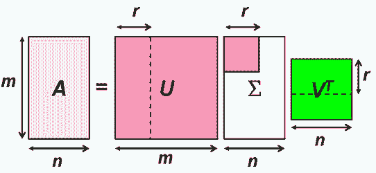
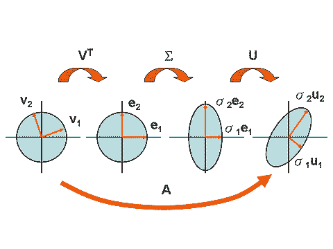

# 奇異值分解\(SVD, singular value decomposition\)

## 奇異值分解

> * 矩陣$$A \in \mathbb{F}^{M \times N}$$，$$s=\min\{m, n\}$$
> * 若存在$$U \in \mathbb{C}^{M \times M}, V \in \mathbb{C}^{N \times N}, \Sigma\in \mathbb{C}^{M \times N} \ni A=U \Sigma V^\mathrm{H}$$
> * 且$$U^\mathrm{H}U=I_M$$，$$V^\mathrm{H}V=I_N$$均為么正矩陣，
> * $$\Sigma$$為除了對角線元素外均為0的矩陣，且對角線元素由大至小排列。即$$[\Sigma]_{ij}=0, ~\forall i \neq j$$，$$[\Sigma]_{ii}=\sigma_i, i=1,2,\dots, s$$，且$$\sigma_1 \geq \sigma_2 \geq \dots \sigma_s$$。
> * 則稱$$A=U \Sigma V^\mathrm{H}$$為$$A$$的奇異值分解，$$\sigma_i$$為矩陣$$A$$的奇異值。
>
> 註：任何矩陣都可以做奇異值分解。

### 任何矩陣均可做奇異值分解

> $$A \in F^{M \times N}$$，則$$A$$必可做奇異值分解。

* 令$$A=U\Sigma V^\top$$ 為$$A$$的奇異值分解。
* 若$$\lambda_1, \dots,\lambda_N$$ 為$$A^\mathrm{H} A \in F^{N \times N}$$的特徵根，則$$A$$的奇異值為$$\sigma_1=\sqrt{\lambda_1 },\dots,\sigma_N=\sqrt{\lambda_N}$$。
* 且A的奇異值$$\sigma_1,\dots,\sigma_N $$唯一，但矩陣$$U,V$$不唯一。
* $$V$$的行向量為$$A^\mathrm{H} A$$的特徵向量，且為單範正交集（$$V^\mathrm{H}V=I_N$$）
* $$AA^\mathrm{H}=(U\Sigma V^\mathrm{H} ) (U\Sigma V^\mathrm{H} )^\mathrm{H}=U\Sigma V^\mathrm{H} V\Sigma^\mathrm{H} U^H=U\Sigma \Sigma^\mathrm{H} U^\mathrm{H}\Rightarrow U^\mathrm{H} AA^\mathrm{H} U=\Sigma \Sigma^\mathrm{H}$$ 為對角矩陣。所以$$U$$的行向量為$$AA^\mathrm{H}$$ 的特徵向量且為單範正交集（$$U^\mathrm{H}U=I_M$$）。
* 若$$rank(A)=r$$，則
  ：

  * $$v_1,\dots,v_r$$ 形成$$R(A^\mathrm{H})$$的單範正交基底。
  * $$v_{r+1},\dots,v_N$$ 形成$$ker⁡(A)$$的單範正交基底。
  * $$u_1,\dots,u_r$$ 形成$$R(A)$$的單範正交基底。
  * $$u_{r+1},\dots,u_M$$ 形成$$ker⁡(A^\mathrm{H})$$的單範正交基底。
  * $$rank(A)$$等於$$A$$的非零奇異值個數。

### 矩陣的長度為最大的奇異值

> 矩陣$$A \in F^{M \times N}$$ 具有SVD分解$$A=U\Sigma V^\mathrm{H}$$，則：
>
> $$\|A\|_2 \equiv \max_{\|x\|=1}\|Ax\|=\sigma_{\max}$$ 為A的最大奇異值。
>
> 註：若$$A$$為方陣時，$$\|A\|_2=\lambda_{\max}$$為其特徵根最大值。

Proof:

* $$A^\mathrm{H} A=(U\Sigma V^\mathrm{H} )^\mathrm{H} (U\Sigma V^\mathrm{H} )=V\Sigma^\mathrm{H} U^\mathrm{H} U\Sigma V^\mathrm{H}=V\Sigma^\mathrm{H} \Sigma V^\mathrm{H}$$
* 因為$$\|A\|_2=\sqrt{\lambda_{\max} (A^\mathrm{H} A)}=\sqrt{\lambda_{\max} (V\Sigma^\mathrm{H} \Sigma V^\mathrm{H})}$$
* 因為$$V\Sigma^\mathrm{H} \Sigma V^\mathrm{H}$$ 與$$\Sigma^\mathrm{H}\Sigma$$么正相似，所以$$\lambda_{\max} (V\Sigma^\mathrm{H} \Sigma V^\mathrm{H} )=\lambda_{\max} (\Sigma^\mathrm{H}\Sigma)$$
* 所以$$\|A\|_2=\sqrt{\lambda_{\max}(\Sigma^{\mathrm{H}}\Sigma) }= \sqrt{\sigma_{\max}^2}= \sigma_{\max}$$ \(QED\)

### 

