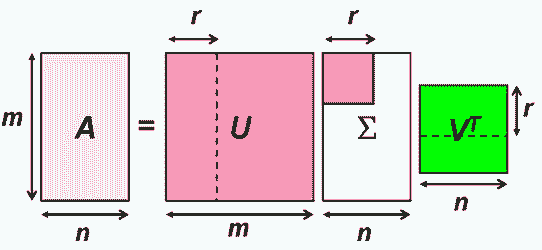

# 奇異值分解(SVD, singular value decomposition)

## 奇異值分解

> * 矩陣$$A \in \mathbb{F}^{M \times N}$$，$$s=\min\{m, n\}$$
> * 若存在$$U \in \mathbb{C}^{M \times M}, V \in \mathbb{C}^{N \times N}, \Sigma\in \mathbb{C}^{M \times N} \ni A=U \Sigma V^\mathrm{H}$$
> * 且$$U^\mathrm{H}U=I_M$$，$$V^\mathrm{H}V=I_N$$均為么正矩陣，
> * $$\Sigma$$為除了對角線元素外均為0的矩陣，且對角線元素由大至小排列。即$$[\Sigma]_{ij}=0, ~\forall i \neq j$$，$$[\Sigma]_{ii}=\sigma_i, i=1,2,\dots, s$$，且$$\sigma_1 \geq \sigma_2 \geq \dots \sigma_s$$。
> * 則稱$$A=U \Sigma V^\mathrm{H}$$為$$A$$的奇異值分解，$$\sigma_i$$為矩陣$$A$$的奇異值。
>
> 註：任何矩陣都可以做奇異值分解。

### 任何矩陣均可做奇異值分解

> $$A \in F^{M \times N}$$，則$$A$$必可做奇異值分解。
>

* 令$$A=U\Sigma V^\top$$ 為$$A$$的奇異值分解。
* 若$$\lambda_1, \dots,\lambda_N$$ 為$$A^\mathrm{H} A \in F^{N \times N}$$的特徵根，則$$A$$的奇異值為$$\sigma_1=\sqrt{\lambda_1 },\dots,\sigma_N=\sqrt{\lambda_N}$$。
* 且A的奇異值$$\sigma_1,\dots,\sigma_N$$唯一，但矩陣$$U,V$$不唯一。
* $$V$$的行向量為$$A^\mathrm{H} A$$的特徵向量，且為單範正交集（$$V^\mathrm{H}V=I_N$$）
* $$AA^\mathrm{H}=(U\Sigma V^\mathrm{H} ) (U\Sigma V^\mathrm{H} )^\mathrm{H}=U\Sigma V^\mathrm{H} V\Sigma^\mathrm{H} U^H=U\Sigma \Sigma^\mathrm{H} U^\mathrm{H}\Rightarrow U^\mathrm{H} AA^\mathrm{H} U=\Sigma \Sigma^\mathrm{H}$$ 為對角矩陣。所以$$U$$的行向量為$$AA^\mathrm{H}$$ 的特徵向量且為單範正交集（$$U^\mathrm{H}U=I_M$$）。
*   若$$rank(A)=r$$，則
    ：

    * $$v_1,\dots,v_r$$ 形成$$R(A^\mathrm{H})$$的單範正交基底。
    * $$v_{r+1},\dots,v_N$$ 形成$$ker⁡(A)$$的單範正交基底。
    * $$u_1,\dots,u_r$$ 形成$$R(A)$$的單範正交基底。
    * $$u_{r+1},\dots,u_M$$ 形成$$ker⁡(A^\mathrm{H})$$的單範正交基底。
    * $$rank(A)$$等於$$A$$的非零奇異值個數。

### 矩陣的長度為最大的奇異值

> 矩陣$$A \in F^{M \times N}$$ 具有SVD分解$$A=U\Sigma V^\mathrm{H}$$，則：
>
> $$\|A\|_2 \equiv \max_{\|x\|=1}\|Ax\|=\sigma_{\max}$$ 為A的最大奇異值。
>
> 註：$$\|A\|_2=\sqrt{\lambda_{\max}(A^\mathrm{H}A)}$$為其特徵根最大值的平方根。

Proof:

* $$A^\mathrm{H} A=(U\Sigma V^\mathrm{H} )^\mathrm{H} (U\Sigma V^\mathrm{H} )=V\Sigma^\mathrm{H} U^\mathrm{H} U\Sigma V^\mathrm{H}=V\Sigma^\mathrm{H} \Sigma V^\mathrm{H}$$
* 因為$$\|A\|_2=\sqrt{\lambda_{\max} (A^\mathrm{H} A)}=\sqrt{\lambda_{\max} (V\Sigma^\mathrm{H} \Sigma V^\mathrm{H})}$$
* 因為$$V\Sigma^\mathrm{H} \Sigma V^\mathrm{H}$$ 與$$\Sigma^\mathrm{H}\Sigma$$么正相似，所以$$\lambda_{\max} (V\Sigma^\mathrm{H} \Sigma V^\mathrm{H} )=\lambda_{\max} (\Sigma^\mathrm{H}\Sigma)$$
* 所以$$\|A\|_2=\sqrt{\lambda_{\max}(\Sigma^{\mathrm{H}}\Sigma) }= \sqrt{\sigma_{\max}^2}= \sigma_{\max}$$ (QED)

### 可逆矩陣的條件數為最大奇異值與最小奇異值的比值

> $$A \in F^{N \times N}$$ 為可逆矩陣，且具有SVD $$A=U\Sigma V^\mathrm{H}$$，則$$cond_2 (A)=\frac{\sigma_{\max}}{\sigma_{\min}}$$。

Proof:

* $$A^{−1}=(U\Sigma V^\mathrm{H} )^{−1}=V\Sigma^{−1} U^\mathrm{H}$$ 具有奇異值$$\frac{1}{\sigma_N} \geq  \frac{1}{\sigma_{N−1} } \geq \dots \geq \frac{1}{\sigma_1 }$$
* 所以$$cond_2 (A)=\|A\|_2 \|A\|_2^{−1}=\sigma_{\max}  \frac{1}{\sigma_{\min}} =\frac{\sigma_{\max}}{\sigma_{\min}}$$   (QED)

## 虛反矩陣(Pseudo-inverse matrix, Moore-Penrose generalized inverse )

> $$A \in F^{M \times N}$$，$$s=\min⁡(M,N)$$具有SVD $$A=U \Sigma V^\mathrm{H}$$。
>
> 定義$$A$$的虛反矩陣為$$A^+=VΣ^+ U^\mathrm{H}$$
>
> * $$\Sigma^+ \in F^{N \times M}$$ 滿足$$[\Sigma^+ ]_{ij}=0,~\forall i \neq j$$（只有對角線不為0）
> * $$[\Sigma^+ ]_{ii}= \left \{  \begin{align} &\frac{1}{\sigma_i},& \text{ if } \sigma_i \neq 0,\\ &0,& \text{ if } \sigma_i = 0 \end{align}  \right.$$（奇異值不為零的部份為倒數）


可得$$0^+ = 0$$。

* 若$$A$$可逆時，虛反矩陣$$A^{+}$$等於反矩陣$$A^{-1}$$。
* 若$$A$$不可逆時，則虛反矩陣$$A^+$$是$$Ax=I_M$$中，具有最小平方誤差的解。

### 虛反矩陣的性質

> $$A \in \mathbb{R}^{M \times N}$$，則：
>
> 1. $$rank(A)=rank(A^+ )$$
> 2. $$(A^+ )^\top=(A^\top )^+$$
> 3. 若$$A^\top=A$$為對稱矩陣，則$$(A^+ )^\top=A^+$$
> 4. $$(cA)^+=\frac{1}{c} A^+, ~\forall 0 \neq c \in \mathbb{R}$$。
> 5. $$(A^+ )^+=A$$
> 6. 若$$A \in \mathbb{R}^{N \times N}$$ 為逆矩陣，則$$A^+=A^{−1}$$。
>

令$$A$$的SVD為$$A=U\Sigma V^\top$$，則$$A^+=V\Sigma ^+ U^\top$$。

Proof (1)

* $$rank(A)=rank(\Sigma)=rank(\Sigma^+ )=rank(A^+)$$ (QED)


Proof (2)

* $$(A^+ )^\top=(V\Sigma^+ U^\top )^\top=U(\Sigma^+ )^\top V^\top$$
* $$(A^\top )^+=((U\Sigma V^\top )^\top )^+=(V\Sigma^\top U^\top )^+=U(\Sigma^\top )^+ V^\top$$
* $$(\Sigma^+ )^\top=(\Sigma^\top )^+$$$$\Rightarrow (A^+ )^\top=(A^\top )^+$$  (QED)


Proof (3)

* $$A^\top=A$$，所以$$(A^+ )^\top = (A^\top )^+=A^+$$  (QED)


Proof (4):

* $$cA=U(c\Sigma) V^\top$$
* 因為$$(c\Sigma)^+=\frac{1}{c}\Sigma^+$$
* 所以$$(cA)^+=V(c\Sigma)^+ U^\top=\frac{1}{c} V\Sigma^+ U^\top= \frac{1}{c} A^+$$  (QED)


Proof (5):

* $$(A^+ )^+=(V\Sigma^+ U^\top )^+=U(\Sigma^+ )^+ V^\top=U\Sigma V^\top=A$$ (QED)


Proof (6)

* 因為$$A$$可逆，所以$$rank(A)=N$$
* 所以$$\Sigma$$可逆且$$\Sigma^+=\Sigma^{−1}$$
* 得$$A^+=V\Sigma^+ U^\top=V \Sigma^{−1} U^\top=(U \Sigma V^\top )^{−1}=A^{−1}$$  (QED)

### Penrose conditions

> $$A \in \mathbb{R}^{M \times N}$$ 具有SVD $$A=U\Sigma V^\top$$，$$X=A^+$$ 為唯一滿足下列四個條件的矩陣：
>
> 1. $$AXA=A$$
> 2. $$XAX=X$$
> 3. $$(AX)^\top = AX$$
> 4. $$(XA)^\top = XA$$

Proof&#x20;

* $$AXA=AA^+ A=U \Sigma V^\top V\Sigma^+ U^\top U\Sigma V^\top=U\Sigma I \Sigma^+ I \Sigma V^\top=U \Sigma V^\top=A$$
* $$XAX=A^+ AA^+=V\Sigma^+ U^\top U \Sigma V^\top V \Sigma^+ U^\top=V \Sigma^+ \Sigma \Sigma^+ U^\top=V\Sigma^+ U^\top=A^+=X$$
* $$(AX)^\top=(AA^+ )^\top=(U\Sigma V^\top V\Sigma^+ U^\top )^\top=(U\Sigma \Sigma^+ U^\top )^\top=U(\Sigma \Sigma^+ )^\top U^\top=U\Sigma \Sigma^+ U^\top=U\Sigma V^\top V\Sigma^+ U^\top=AA^+=AX$$
* $$(XA)^\top=(A^+ A)^\top=(V\Sigma^+ U^top U\Sigma V^\top )^\top=(V\Sigma^+ \Sigma V^\top )^\top=V(\Sigma^+ \Sigma)^\top V^\top=V\Sigma^+ \Sigma V^\top=V\Sigma^+ U^\top U\Sigma V^\top=A^+ A=XA$$(QED)

唯一性，假設存在$$Y$$滿足以上四個條件。

* $$X=XAX=A^\top X^\top X=(AYA)^\top X^\top X=(A^\top Y^\top )(A^\top X^\top X)=TAXAX=YAX$$
* 因為$$Y=YAY=YY^\top A^\top=YY^\top (AXA)^\top＝Y（Y^\top A^\top ）(X^\top A^\top )=YAYAX=YAX$$
* 所以$$Y=X$$ (QED)

### 虛反矩陣可用於求Ax=b的最小平方解

> $$A \in F^{M \times N}$$ 具有SVD $$A=U \Sigma V^\mathrm{H}$$, $$rank(A)=N$$ (具有唯一解)。
>
> * 因此正規方程式$$A^\mathrm{H} Ax=A^\mathrm{H} b$$之解為$$x=A^+ b$$。
> * 此時$$A^+=(A^\mathrm{H} A)^{−1} A^\mathrm{H}$$。

* 可得$$\Sigma=\begin{bmatrix} \Sigma_1 \\ 0 \end{bmatrix}$$，$$\Sigma_1 \in F^{N \times N}$$可逆。
* $$A^\mathrm{H} A$$為可逆矩陣且$$(A^\mathrm{H} A)^{−1}=(V\Sigma^\mathrm{H} U^\mathrm{H} U\Sigma V^\mathrm{H} )^{−1}=(V\Sigma^\mathrm{H} \Sigma V^\mathrm{H} )^{−1}=V(\Sigma^\mathrm{H}\Sigma)^{−1} V^\mathrm{H} A^\mathrm{H} Ax=A^\mathrm{H} b$$
* $$x=(A^\mathrm{H} A)^{−1} A^\mathrm{H} b=V(\Sigma^\mathrm{H} \Sigma)^{−1} V^\mathrm{H} V\Sigma^H U^\mathrm{H} b=V(\Sigma^\mathrm{H} \Sigma)^{−1} \Sigma^\mathrm{H} U^\mathrm{H} b=V\Sigma^+ U^\mathrm{H} b=A^+ b$$ (QED)

Note:

* 用numpy.linalg.solve可求解$$Ax=b$$之解，但$$b=0$$時，只能得到$$x=0$$的解。
* 如果要求$$x \neq 0$$的解，可用SVD。

### &#x20;虛反矩陣的最小平方解為具有最小2-norm的解答

> $$A \in F^{M \times N}$$ 具有SVD $$A=U \Sigma V^\mathrm{H}$$，$$rank(A)=r<N$$ (具有無限多解)。
>
> * 則求$$Ax=b$$的最小平方解為$$x_o=A^+ b$$，即$$x_o= \arg\min_x⁡ \|Ax−b\|_2$$。
> * 若$$z= \{ x \in \mathbb{R}^{N \times 1} | Ax−b=0\}$$ ，則$$\|z\|_2 \geq  \|x_o \|_2$$。
