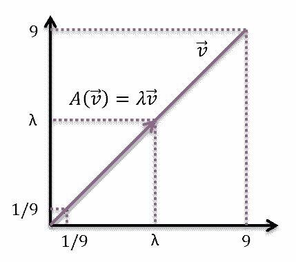
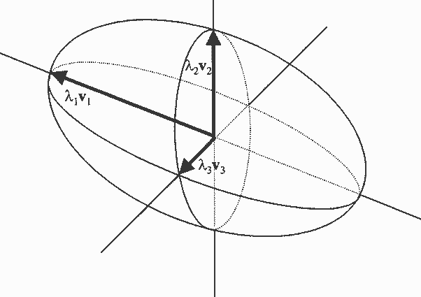

# 特徵向量\(eigenvector\)

## 特徵根、特徵向量\(eigenvalue, eigenvector\)

> 線性轉換$$T \in L(V,V)$$，純量$$\lambda \in F$$。
>
> 若存在非零向量$$v∈V \ni T(v)=\lambda v$$
（矩陣式為$$Ax = \lambda x$$），則稱
>
> * $$\lambda$$為相對於$$T$$的特徵根\(eigenvalue or characteristic value\)，
> * 且$$v$$為相對於$$T$$的特徵向量\(eigenvector or characteristic vector\)
> * $$T$$可能有多個特徵根，不同的特徵根對應不同的特徵向量。

### 對於同一個特徵值之特徵向量的任意線性組合，若不為零向量時，仍為相對於該特徵值的特徵向量

> 線性轉換$$T \in L(V,V),  \lambda \in F$$為$$T$$的特徵根。
>
> * 若$$v$$為$$T$$相對於$$\lambda $$的特徵向量，則$$cv, 0\neq c \in F$$也為$$T$$相對於$$\lambda $$的特徵向量。
> * 若$$v_1,v_2$$ 為$$T$$相對於$$\lambda$$的特徵向量且$$v_1+v_2\neq 0$$，則$$v_1+v_2$$ 也為$$T$$相對於$$\lambda$$的特徵向量。

Proof:

* 因為$$T(v)=\lambda, v\neq 0$$
* 所以$$T(cv)=cT(v)=c\lambda v=\lambda (cv), cv\neq 0$$ \(QED\)
* 因為$$T(v_1 )=\lambda v_1,~ T(v_2 )=\lambda v_2$$
* 所以$$T(v_1+v_2 )=T(v_1 )+T(v_2 )=\lambda (v_1+v_2 ), ~v_1+v_2 \neq 0$$ \(QED\)

## 算子的行列式與跡數

> 線性轉換$$T \in L(V,V)$$，$$B=\{b_1,b_2, \dots, b_N\}$$為$$V$$的一組基底。$$[T]_B=\begin{bmatrix}  [T(b_1)]_B & [T(b_2)]_B & \dots & [T(b_N)]_B \end{bmatrix}$$`。`
>
> * 定義$$\det⁡(T)=\det⁡([T]_B )$$
> * 定義$$tr(T)=tr([T]_B )$$

* 若$$B, R$$為$$V$$的兩組基底，則$$[T]_B \sim [T]_R$$  \(相似矩陣，存在可逆矩陣$$P\ni PA=PB$$\)，因此$$\det⁡ ([T]_B )=\det⁡([T]_R)$$。同理$$tr([T]_B )=tr([T]_R )$$。

### 特徵根的充要條件

> 線性轉換$$T \in L(V,V),  \lambda \in F$$ ，則：
>
> * $$\lambda $$為$$T$$的特徵根若且唯若$$ \det⁡(T−\lambda I)=0$$
> * 給定$$V$$的基底$$B$$, $$T−\lambda I \equiv [T−\lambda I]_B=[T]_B−\lambda [I]_B $$

Proof:

* $$\lambda$$為$$T$$的特徵根$$\Leftrightarrow \exists x \neq 0 \ni T(x)=\lambda x \Leftrightarrow x \neq 0, T(x)−\lambda x=0\Leftrightarrow x \neq 0 (T−\lambda I)x=0 \Leftrightarrow ker⁡(T−\lambda I)\neq \{0\}\Leftrightarrow T−\lambda I \text{ not invertible} \Leftrightarrow \det(T - \lambda I) = 0$$\(QED\)

## 特徵多項式\(characteristic polynomial\)

> 線性轉換$$T \in L(V,V),  \lambda \in F$$ ，定義$$f(x)=\det(T - \lambda I)$$為$$T$$的特徵多項式，記為$$char_T(x)$$。
>
> 因此$$\lambda$$為$$T$$的特徵根若且唯若$$\lambda$$為$$char_T(x)$$的根。

