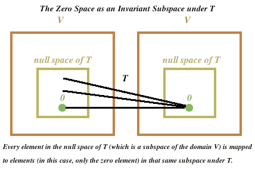

# 不變子空間\(invariant subspace\)

## 

## 不變子空間

> 線性轉換$$T \in L(V,V)$$，$$ W$$為$$V$$的子空間且滿足$$T(W) \subseteq W$$，則稱$$W$$為$$T$$-不變子空間\($$T$$-invariant subspace\)。
>
>  因為$$T$$是在相同空間做線性變換，不變子空間即轉換後，值域$$T(W)$$仍為定義域$$W$$子集合的集合。
>
> 證明$$W$$為$$T$$-不變子空間的方式為$$\forall w \in W \Rightarrow T(w) \in W$$。

* $$\{0\}, ~V, ~ker(T), ~R(T)$$ 均為$$T$$不變子空間。

  * $$\forall T \in L(V,V), T(0)=0∈\{0\}$$
  * $$\forall T \in L(V,V), T(V) \in V$$
  * $$ker⁡(T)=\{x \in V|T(x)=0\}, ~ T(ker⁡(A)) \subseteq ker⁡(A)$$
  * $$R(T)=\{T(x)| \forall x \in V\}, T(R(A)) \subseteq R(A)$$。

* 若$$W$$為$$T$$不變子空間，$$T$$在$$W$$上的限制函數$$T_w:W \rightarrow V$$定義為$$T_w (v)=T(v),  \forall v \in W$$\(與原始線性轉換$$T$$相同的函數，但定義域縮小為$$W$$\)，仍然為線性函數。
* 若$$W_1,\dots,W_k$$ 為$$T$$-不變子空間，則$$W_1\cap \dots \cap W_k$$ 與$$W_1+\dots+W_K$$ 均為$$T$$-不變子空間。
* $$T:F[x] \rightarrow F[x]$$為微分算子，$$W=F_n [x]$$，則$$W$$為$$T$$-不變子空間 \($$∵D(W)\subseteq W$$\)。

### 不變子空間之矩陣表示法

> 線性轉換$$T \in L(V,V)$$且$$W$$為$$T$$不變子空間，$$\dim(V)=N, \dim(W)=K \leq N$$，則$$V$$中存在一組基底$$B\ni [T]_B= \begin{bmatrix} A_1 & C \\ 0 & A_2 \end{bmatrix}$$，其中$$A_1=[T_W]_{B_1} \in F^{K \times K}$$且$$B_1$$為$$W$$的一組基底。

Proof:

* 令$$B_1=\{v_1,v_2,\dots,v_K \}$$為$$W$$的基底，則$$B_1$$ 為$$V$$中的線性獨立集。
* $$∃v_{K+1},\dots,v_N \in V \ni B=\{v_1,\dots,v_K, v_{K+1},\dots,v_N \}$$為$$V$$的基底。
* 因為$$W$$為$$T$$不變子空間，所以$$T(v_1 ),\dots,T(v_K ) \in W$$，所以可由$$W$$的基底生成。
* 令$$T(v_1 )=a_{11} v_1+a_{21} v_2+\dots+a_{k1} v_k$$
* $$T(v_2 )=a_{12} v_1+a_{22} v_2+\dots+a_{k2} v_k$$
* $$\vdots$$
* $$T(v_k )=a_{1K} v_1+a_{2K} v_2+\dots+a_{KK} v_k$$ 
* 因為$$T(v_{K+1} ),\dots,T(v_N ) \in V$$，所以可由$$V$$的基底生成。
* 令$$T(v_{K+1} )=a_{1,k+1} v_1+a_{2,k+1} v_2+\dots+a_{k,k+1} v_k+a_{k+1,k+1} v_{k+1}+\dots+a_{N,K+1} v_N$$
* $$T(v_{K+2} )=a_{1,k+2} v_1+a_{2,k+2} v_2+\dots+a_{k,k+2} v_k+a_{k+1,k+2} v_{k+1}+\dots+a_{N,K+2} v_N$$
* $$\vdots$$
* $$T(v_N )=a_{1,N} v_1+a_{2,N} v_2+\dots+a_{k,N} v_k+a_{k+1,N} v_{k+1}+\dots+a_{N,N} v_N$$
* 可得$$[T]_B=\begin{bmatrix}  a_{1,1} & a_{1,2} & \dots & a_{1,k} & a_{1, k+1} & \dots & a_{1,N}\\ \vdots & \vdots &  \ddots & \vdots & \vdots & \ddots & \vdots \\ a_{k,1} & a_{k,2} & \dots & a_{k,k} & a_{k, k+1} & \dots & a_{k,N}\\ 0 & 0 &  \ddots & 0 & a_{k+1, k+1} & \ddots & a_{k+1, N} \\    \vdots & \vdots &  \ddots & \vdots & \vdots & \ddots & \vdots \\ 0 & 0 &  \ddots & 0 & a_{N, k+1} & \ddots & a_{N, N} \\    \end{bmatrix}  = \begin{bmatrix} A_1 & C \\ 0 & A_2\end{bmatrix}$$

\(QED\)

### 直和空間與不變子空間的性質

> 線性轉換$$T \in L(V,V)$$且$$W_1, W_2$$為$$T$$不變子空間且為獨立子空間，$$V=W_1 \oplus W_2$$，$$B_1,B_2$$分別為$$W_1,W_2$$的基底，則$$B=B_1 \cup B_2$$為$$V$$的基底，且$$[T]_B = \begin{bmatrix} A_1 & 0 \\ 0 & A_2\end{bmatrix}$$，$$A_1 = [T_{W_1}]_{B_1}$$，$$A_2 = [T_{W_2}]_{B_2}$$
>
> 可擴充到$$K$$個$$T$$不變子空間且為獨立子空間：$$V=W_1 \oplus W_2 \oplus \cdots \oplus W_K$$，$$B_i$$為$$W_i$$的基底，則$$B=\bigcup_{i=1}^K B_i$$為$$V$$的基底，且$$[T]_B = diag\{A_1, A_2, \dots, A_k\}$$，$$A_i = [T_{W_i}]_{B_i}, i=1,2,\dots,K$$

Proof:

* 因為$$W_1, W_2$$為獨立子空間，所以$$W_1\cap W_2=\{0\}$$。
* 令$$B_1=\{v_1,\dots,v_k \}, ~B_2=\{v_{k+1}, \dots,v_N \}$$，則$$B=\{v_1,\dots,v_k,v_{k+1},\dots,v_N \}$$。
* 因為$$W_1$$ 為$$T$$不變子空間，所以$$T(v_1 ),\dots,T(v_k ) \in W_1$$ 可由$$B_1$$ 生成。
  * $$T(v_1 )=a_{11} v_1+a_{21} v_2+\dots+a_{k1} v_k$$
  * $$T(v_2 )=a_{12} v_1+a_{22} v_2+\dots+a_{k2} v_k$$
  * $$\vdots$$
  * $$T(v_k )=a_{1K} v_1+a_{2K} v_2+\dots+a_{KK} v_k$$
* 因為$$W_2$$ 為$$T$$不變子空間，所以$$T(v_{k+1} ),\dots,T(v_n ) \in W_2$$ 可由$$B_2$$ 生成。
  * $$T(v_{K+1} )=a_{k+1,k+1} v_{k+1}+\dots+a_{N,K+1} v_N$$
  * $$T(v_{K+2} )=a_{k+1,k+2} v_{k+1}+\dots+a_{N,K+2} v_N$$
  * $$\vdots$$
  * $$T(v_N )=a_{k+1,N} v_{k+1}+\dots+a_{N,N} v_N$$
* $$[T]_B=\begin{bmatrix}  a_{1,1} & a_{1,2} & \dots & a_{1,k} & 0 & \dots & 0\\ \vdots & \vdots &  \ddots & \vdots & \vdots & \ddots & \vdots \\ a_{k,1} & a_{k,2} & \dots & a_{k,k} & 0 & \dots & 0\\ 0 & 0 &  \ddots & 0 & a_{k+1, k+1} & \ddots & a_{k+1, N} \\    \vdots & \vdots &  \ddots & \vdots & \vdots & \ddots & \vdots \\ 0 & 0 &  \ddots & 0 & a_{N, k+1} & \ddots & a_{N, N} \\    \end{bmatrix}  = \begin{bmatrix} A_1 & 0 \\ 0 & A_2\end{bmatrix}$$

  \(QED\)

