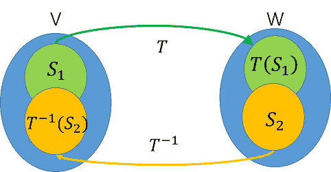

# 核空間及像集\(kernel space and image\)

## 直像與反像\(direct image and inverse image\)

> 線性轉換$$T \in L(V,W)$$，令集合$$S_1 \subseteq V$$，$$S_2 \subseteq W$$，則
>
> * $$T(S_1) =\{ T(v) | \forall v \in S_1 \}$$為集合$$S_1$$ 在$$T$$轉換後的直像\(direct image\)，或稱函數的值域\(range\)。
> * $$T^{-1}(S) = \{v \in V | T(v) = S_2\}$$為$$S_2$$在$$T$$轉換的前像\(inverse image, pre-image\)。
>
> $$T^{−1}$$ 並非指$$T$$可逆，只是一個符號，代表從$$W\rightarrow V$$的映射。
 此定義可用於一般的函數，而非只是線性函數。

* 在[函數的映像與前象](../../math-analysis/set/function.md#han-shu-de-ying-xiang-yu-qian-xiang)中，若$$T$$為一對一函數時，$$S_1 = T^{−1} (T(S_1 ))$$。
* 若$$T$$為映成函數時，$$T(T^{−1} (S_2 )) = S_2$$ 。

