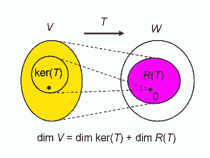

# 核空間及像集\(kernel space and image\)

## 直像與反像\(direct image and inverse image\)

> 線性轉換$$T \in L(V,W)$$，令集合$$S_1 \subseteq V$$，$$S_2 \subseteq W$$，則
>
> * $$T(S_1) =\{ T(v) | \forall v \in S_1 \}$$為集合$$S_1$$ 在$$T$$轉換後的直像\(direct image\)，或稱函數的值域\(range\)。
> * $$T^{-1}(S) = \{v \in V | T(v) = S_2\}$$為$$S_2$$在$$T$$轉換的前像\(inverse image, pre-image\)。
>
> $$T^{−1}$$ 並非指$$T$$可逆，只是一個符號，代表從$$W\rightarrow V$$的映射。
 此定義可用於一般的函數，而非只是線性函數。

* 在[函數的映像與前象](../../math-analysis/set/function.md#han-shu-de-ying-xiang-yu-qian-xiang)中，若$$T$$為一對一函數時，$$S_1 = T^{−1} (T(S_1 ))$$。
* 若$$T$$為映成函數時，$$T(T^{−1} (S_2 )) = S_2$$ 。

### 子空間經線性轉換後仍為子空間

> 線性轉換$$T \in L(V,W)$$，且$$V_s$$為$$V$$的子空間，$$W_s$$為$$W$$的子空間，則$$T(V_s)$$為$$W$$的子空間，$$T^{-1}(W_s)$$為$$V$$的子空間。
>
> 子空間的充要條件是空間內元素的任意線性組合仍在空間中（且包含0 向量）。而線性轉換可保持此性質。

proof:

* 因為$$0 = T(0) \in T(V_s)$$，所以$$T(V_s) \neq \emptyset$$。
* 因為$$T \in L(V,W)$$且$$V_s \subseteq V$$，所以$$\forall u, v \in T(V_s)$$存在$$x, y\in V \ni T(x)=u,  ~ T(y) = v$$。
* 因為$$V_s$$為$$V$$的子空間，所以$$\forall a,b \in F$$，$$ax+by \in V_s$$可得$$T(ax+by) \in T(V_s)$$。
* 依線性轉換定義可得 $$aT(x)+bT(y) \in T(V_s)$$，即$$au+bv \in T(V_s)$$。
* 所以$$T(V_s)$$為$$W$$的子空間。
* 同理可得$$T^{-1}(W_s)$$為$$V$$的子空間 \(QED\)

## 核空間與像\(kernel space and image\)

> 線性轉換$$T \in L(V,W)$$，定義：
>
> * $$ker(T)=\{v \in V | T(v)=0\} = T^{-1}(\{0\})$$稱為核空間\(kernel space, null space\)，有時記為$$N(T)$$。
> * $$Im(T)=T(V)=\{T(v) | \forall v \in V\}$$稱為像或值域\(image, range\)，有時記為$$R(T)$$或$$range(T)$$。

* 因為線性轉換為函數，依函數定義得所有在$$V$$的元素都有函數值，即$$\forall v \in V, T(v) \subseteq W$$。
* 由於維度為0的向量空間只有$$\{0\}$$，至少包含一個元素，因此$$ker(T) \neq \emptyset$$。
* 因為值域必定包含所有函數值，且$$ker(T) \neq \emptyset$$，所以$$ 0 \subseteq Im(T)$$。
* **由子空間經線性轉換後仍為子空間得**$$ker(T)$$**為**$$V$$**的子空間，且**$$Im(T)$$**為**$$W$$**的子空間**。

## 核數、秩\(nullity, rank\)

> 線性轉換$$T \in L(V,W)$$，定義：
>
> * $$nullity(T)=\dim(ker(T))$$：核空間的最大線性獨立生成集合元素個數。
> * $$rank(T)= \dim(R(T))$$：值域的最大線性獨立生成集合元素個數。

### 值域可由定義域生成集經線性轉換後生成

> 線性轉換$$T \in L(V,W)$$，$$B=\{b_1, b_2, \dots, b_N\}$$為向量空間$$V$$的有序基底，則$$R(T)\equiv \{T(v)| \forall v \in V\}=span(\{T(B)\})=span\{ T(b_1), T(b_2), \dots, T(b_N)\}$$。

* 條件可放寬至只要集合$$B$$能夠生成$$V$$即可，不必為基底。
* 直觀想法：$$V$$中的所有元素$$v$$均可使用集合$$B$$生成\(線性線合\)，因此$$v$$經線性轉換$$T$$後的結果，仍可由$$T(B)$$生成\(線性組合\)。

Proof:

* 因為$$B$$為$$V$$的基底，因此$$\forall v \in V, ~ v=\sum_{i=1}^N a_i b_i $$
* 所以$$T(v)=T(\sum_{i=1}^N a_i b_i)=\sum_{i=1}^N a_i T(b_i ) \in span(\{T(b_1 ), T(b_2 ), \dots,T(b_N )\})$$
* 因為 $$T(v) \in R(T)$$, 
  所以$$R(T) \subseteq span(\{T(b_1 ), T(b_2 ),⋯,T(b_N )\})$$-- \(1\)
* 因為$$span(\{T(b_1 ), T(b_2 ),\dots,T(b_N )\})$$為包含$$\{T(b_1 ), T(b_2 ),\dots,T(b_N )\}$$的最小集合
* 所以$$span(\{T(b_1 ), T(b_2 ),⋯,T(b_N )\}) \subseteq R(T)$$--\(2\)
* 由\(1\)\(2\)得$$R(T)=span(T(B))$$  \(QED\)

#### 範例

* $$T\left(  \begin{bmatrix} x_1 \\ x_2 \\ x_3 \\ x_4 \end{bmatrix}\right) = \begin{bmatrix}    2x_1 + x_2 \\ x_1 - x_2 \\ 3x_3 + 2x_4 \end{bmatrix}  : \mathbb{R}^4 \rightarrow \mathbb{R}^3$$
* $$ker(T) =\left\{ x = \begin{bmatrix} x_1 \\ x_2 \\ x_3 \\ x_4\end{bmatrix} \in \mathbb{R}^4 | Tx=0\right\}$$
* $$Tx=\begin{bmatrix} 2x_1 + x_2 \\ x_1 - x_2 \\ 3x_3 + 2x_4 \end{bmatrix} = \begin{bmatrix} 0 \\0 \\ 0\end{bmatrix} \Rightarrow \begin{bmatrix} x_1 \\ x_2 \\ x_3 \end{bmatrix}= \begin{bmatrix}  0 \\ 0 \\ \ -\frac{2}{3}x_4 \end{bmatrix}$$
* 所以$$ker(T) = span\left\{ \begin{bmatrix}  0 \\ 0\\ -2 \\ 3 \end{bmatrix} \right\}$$，因為只有一個向量，所以線性獨立為基底。
* 取$$\mathbb{R}^4$$的標準基底，$$R(T)=span\left\{ T \left(  \begin{bmatrix} 1\\0 \\0 \\ 0 \end{bmatrix}\right), T \left(  \begin{bmatrix} 0\\1 \\0 \\ 0 \end{bmatrix}\right), T \left(  \begin{bmatrix}  0\\0 \\1 \\ 0 \end{bmatrix} \right) T \left(  \begin{bmatrix}  0\\0 \\0 \\ 1\end{bmatrix}\right)  \right\} = span\left\{  \begin{bmatrix} 2 \\ 1 \\ 0  \end{bmatrix}, \begin{bmatrix} 1 \\ -1 \\ 0  \end{bmatrix}, \begin{bmatrix} 0 \\ 0 \\ 3  \end{bmatrix},  \begin{bmatrix} 0 \\ 0 \\ 2  \end{bmatrix} \right\}$$
* 其中$$\begin{bmatrix} 0 \\  \\ 2  \end{bmatrix}$$可由$$\begin{bmatrix} 0 \\ 0 \\3  \end{bmatrix}$$生成，其它向量線性獨立，所以$$R(T)$$的基底是$$\left\{  \begin{bmatrix} 2 \\ 1 \\ 0  \end{bmatrix}, \begin{bmatrix} 1 \\ -1 \\ 0  \end{bmatrix}, \begin{bmatrix} 0 \\ 0 \\ 3  \end{bmatrix} \right\}$$。

## 維度定理\(Sylvester 1st law or dimension theorem, Rank–nullity theorem\)

> 線性轉換$$T \in L(V,W)$$且$$\dim(V) < \infty$$，則$$\dim(V) = \dim(ker(T) + \dim(R(T))$$。
>
> 若$$T\in F^{M \times N}$$為矩陣，則$$\dim(V)=N, ~ \dim(W)=M$$。

