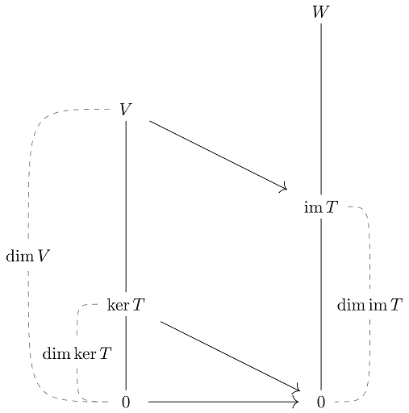
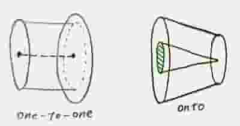

# 核空間及像集(kernel space and image)

## 直像與反像(direct image and inverse image)

> 線性轉換$$T \in L(V,W)$$，令集合$$S_1 \subseteq V$$，$$S_2 \subseteq W$$，則
>
> * $$T(S_1) =\{ T(v) | \forall v \in S_1 \}$$為集合$$S_1$$ 在$$T$$轉換後的直像(direct image)，或稱函數的值域(range)。
> * $$T^{-1}(S) = \{v \in V | T(v) = S_2\}$$為$$S_2$$在$$T$$轉換的前像(inverse image, pre-image)。
>
> $$T^{−1}$$ 並非指$$T$$可逆，只是一個符號，代表從$$W\rightarrow V$$的映射。
> &#x20;此定義可用於一般的函數，而非只是線性函數。

* 在[函數的映像與前象](../../math-analysis/set/function.md#han-shu-de-ying-xiang-yu-qian-xiang)中，若$$T$$為一對一函數時，$$S_1 = T^{−1} (T(S_1 ))$$。
* 若$$T$$為映成函數時，$$T(T^{−1} (S_2 )) = S_2$$ 。

### 子空間經線性轉換後仍為子空間

> 線性轉換$$T \in L(V,W)$$，且$$V_s$$為$$V$$的子空間，$$W_s$$為$$W$$的子空間，則$$T(V_s)$$為$$W$$的子空間，$$T^{-1}(W_s)$$為$$V$$的子空間。
>
> 子空間的充要條件是空間內元素的任意線性組合仍在空間中（且包含0 向量）。而線性轉換可保持此性質。

proof:

* 因為$$0 = T(0) \in T(V_s)$$，所以$$T(V_s) \neq \emptyset$$。
* 因為$$T \in L(V,W)$$且$$V_s \subseteq V$$，所以$$\forall u, v \in T(V_s)$$存在$$x, y\in V \ni T(x)=u,  ~ T(y) = v$$。
* 因為$$V_s$$為$$V$$的子空間，所以$$\forall a,b \in F$$，$$ax+by \in V_s$$可得$$T(ax+by) \in T(V_s)$$。
* 依線性轉換定義可得 $$aT(x)+bT(y) \in T(V_s)$$，即$$au+bv \in T(V_s)$$。
* 所以$$T(V_s)$$為$$W$$的子空間。
* 同理可得$$T^{-1}(W_s)$$為$$V$$的子空間 (QED)

## 核空間與像(kernel space and image)

> 線性轉換$$T \in L(V,W)$$，定義：
>
> * $$ker(T)=\{v \in V | T(v)=0\} = T^{-1}(\{0\})$$稱為核空間(kernel space, null space)，有時記為$$N(T)$$。
> * $$Im(T)=T(V)=\{T(v) | \forall v \in V\}$$稱為像或值域(image, range)，有時記為$$R(T)$$或$$range(T)$$。

* 因為線性轉換為函數，依函數定義得所有在$$V$$的元素都有函數值，即$$\forall v \in V, T(v) \subseteq W$$。
* 由於維度為0的向量空間只有$$\{0\}$$，至少包含一個元素，因此$$ker(T) \neq \emptyset$$。
* 因為值域必定包含所有函數值，且$$ker(T) \neq \emptyset$$，所以$$0 \subseteq Im(T)$$。
* **由子空間經線性轉換後仍為子空間得**$$ker(T)$$**為**$$V$$**的子空間，且**$$Im(T)$$**為**$$W$$**的子空間**。

## 核數、秩(nullity, rank)

> 線性轉換$$T \in L(V,W)$$，定義：
>
> * $$nullity(T)=\dim(ker(T))$$：核空間的最大線性獨立生成集合元素個數。
> * $$rank(T)= \dim(R(T))$$：值域的最大線性獨立生成集合元素個數。

### 值域可由定義域生成集經線性轉換後生成

> 線性轉換$$T \in L(V,W)$$，$$B=\{b_1, b_2, \dots, b_N\}$$為向量空間$$V$$的有序基底，則$$R(T)\equiv \{T(v)| \forall v \in V\}=span(\{T(B)\})=span\{ T(b_1), T(b_2), \dots, T(b_N)\}$$。

* 條件可放寬至只要集合$$B$$能夠生成$$V$$即可，不必為基底。
* 直觀想法：$$V$$中的所有元素$$v$$均可使用集合$$B$$生成(線性線合)，因此$$v$$經線性轉換$$T$$後的結果，仍可由$$T(B)$$生成(線性組合)。

Proof:

* 因為$$B$$為$$V$$的基底，因此$$\forall v \in V, ~ v=\sum_{i=1}^N a_i b_i$$
* 所以$$T(v)=T(\sum_{i=1}^N a_i b_i)=\sum_{i=1}^N a_i T(b_i ) \in span(\{T(b_1 ), T(b_2 ), \dots,T(b_N )\})$$
* 因為 $$T(v) \in R(T)$$,&#x20;
  所以$$R(T) \subseteq span(\{T(b_1 ), T(b_2 ),⋯,T(b_N )\})$$-- (1)
* 因為$$span(\{T(b_1 ), T(b_2 ),\dots,T(b_N )\})$$為包含$$\{T(b_1 ), T(b_2 ),\dots,T(b_N )\}$$的最小集合
* 所以$$span(\{T(b_1 ), T(b_2 ),⋯,T(b_N )\}) \subseteq R(T)$$--(2)
* 由(1)(2)得$$R(T)=span(T(B))$$  (QED)

#### 範例

* $$T\left(  \begin{bmatrix} x_1 \\ x_2 \\ x_3 \\ x_4 \end{bmatrix}\right) = \begin{bmatrix}    2x_1 + x_2 \\ x_1 - x_2 \\ 3x_3 + 2x_4 \end{bmatrix}  : \mathbb{R}^4 \rightarrow \mathbb{R}^3$$
* $$ker(T) =\left\{ x = \begin{bmatrix} x_1 \\ x_2 \\ x_3 \\ x_4\end{bmatrix} \in \mathbb{R}^4 | Tx=0\right\}$$
* $$Tx=\begin{bmatrix} 2x_1 + x_2 \\ x_1 - x_2 \\ 3x_3 + 2x_4 \end{bmatrix} = \begin{bmatrix} 0 \\0 \\ 0\end{bmatrix} \Rightarrow \begin{bmatrix} x_1 \\ x_2 \\ x_3 \end{bmatrix}= \begin{bmatrix}  0 \\ 0 \\ \ -\frac{2}{3}x_4 \end{bmatrix}$$
* 所以$$ker(T) = span\left\{ \begin{bmatrix}  0 \\ 0\\ -2 \\ 3 \end{bmatrix} \right\}$$，因為只有一個向量，所以線性獨立為基底。
* 取$$\mathbb{R}^4$$的標準基底，$$R(T)=span\left\{ T \left(  \begin{bmatrix} 1\\0 \\0 \\ 0 \end{bmatrix}\right), T \left(  \begin{bmatrix} 0\\1 \\0 \\ 0 \end{bmatrix}\right), T \left(  \begin{bmatrix}  0\\0 \\1 \\ 0 \end{bmatrix} \right) T \left(  \begin{bmatrix}  0\\0 \\0 \\ 1\end{bmatrix}\right)  \right\} = span\left\{  \begin{bmatrix} 2 \\ 1 \\ 0  \end{bmatrix}, \begin{bmatrix} 1 \\ -1 \\ 0  \end{bmatrix}, \begin{bmatrix} 0 \\ 0 \\ 3  \end{bmatrix},  \begin{bmatrix} 0 \\ 0 \\ 2  \end{bmatrix} \right\}$$
* 其中$$\begin{bmatrix} 0 \\  \\ 2  \end{bmatrix}$$可由$$\begin{bmatrix} 0 \\ 0 \\3  \end{bmatrix}$$生成，其它向量線性獨立，所以$$R(T)$$的基底是$$\left\{  \begin{bmatrix} 2 \\ 1 \\ 0  \end{bmatrix}, \begin{bmatrix} 1 \\ -1 \\ 0  \end{bmatrix}, \begin{bmatrix} 0 \\ 0 \\ 3  \end{bmatrix} \right\}$$。

## 維度定理(Sylvester 1st law or dimension theorem, Rank–nullity theorem)

> 線性轉換$$T \in L(V,W)$$且$$\dim(V) < \infty$$，則$$\dim(V) = \dim(ker(T) + \dim(R(T))$$。
>
> 若$$T\in F^{M \times N}$$為矩陣，則$$\dim(V)=N, ~ \dim(W)=M$$。
>
> 令$$\{ u_1, u_2, \dots, u_k\}$$為$$ker(T)$$的基底，$$\{w_1, w_2, \dots, w_r\}$$為$$R(T)$$的基底，證明$$\{u_1, \dots,u_k, w_1, \dots, w_r\}$$為$$V$$的基底。
>
> * 即$$\forall v \in V, \exists !b_i, a_j \in F \ni v=\sum_{i=1}^kb_i u_i + \sum_{j=1}^r a_j w_j$$且
> * $$\{u_1, \dots,u_k, w_1, \dots, w_r\}$$為線性獨立集，$$\sum_{i=1}^kb_i u_i + \sum_{j=1}^r a_j w_j =0 \Rightarrow b_i =a_j = 0 \forall, i, j$$。

proof：

&#x20;先證明$$span(\{u_1,u_2,\dots,u_k w_1,w_2,\dots,w_r \})=V$$

* $$\forall v \in V$$，因為$$T(v) \in R(T)$$，所以$$T(v)$$可用$$R(T)$$的基底唯一生成。
* $$∃a_1,a_2,\dots,a_r \in F \ni T(v)=\sum_{j=1}^r a_j w_j = \sum_{j=1}^r  a_j T(v_j ) =T(\sum_{j=1}^r a_j v_j )$$
* 移項得$$T(v)−T(\sum_{j=1}^r a_j v_j)=0 \Rightarrow T(v−\sum_{j=1}^r a_j v_j )=0$$
* 所以$$v−\sum_{j=1}^r a_j v_j \in ker⁡(T)$$，即$$v−\sum_{j=1}^r a_j v_j$$ 可用$$ker⁡(T)$$的基底唯一生成。
* $$\exists b_1,b_2,\dots ,b_k \in F \ni v−\sum_{j=1}^ra_j v_j =\sum_{i=1}^k b_i u_i$$
* 可得$$v=\sum_{i=1}^k b_i u_i +\sum_{j=1}^r a_j v_j   \in span(\{u_1,u_2,\dots,u_k w_1,w_2,\dots,w_r \}), \forall v \in V$$ (QED)


&#x20;證明$$\{u_1,u_2,\dots,u_k w_1,w_2,\dots,w_r \}$$為線性獨立集合。

* 若$$\sum_{i=1}^k b_i u_i+\sum_{j=1}^r a_j v_j=0$$-- (1)
* 則$$T(\sum_{i=1}^k b_i u_i +\sum_{j=1}^r a_j v_j )=T(0)=0$$
* 因此$$\sum_{i=1}^k b_i T(u_i ) +\sum_{j=1}^r a_j T(v_j )=0$$
* 因為$$\{u_1,u_2,\dots,u_k \} \in ker⁡(T)$$，所以$$T(u_i )=0, ~i=1,2,\dots,k$$
* 所以$$\sum_{j=1}^r a_j T(v_j )=0 \Rightarrow \sum_{j=1}^r a_j w_j =0$$
* 因為$$\{w_1,w_2,\dots,w_r \}$$為線性獨立集合，所以$$a_1=a_2=\dots=a_r=0$$
* 代回(1)可得 $$\sum_{i=1}^k b_i u_i=0$$
* 因為$$\{u_1,u_2,\dots,u_k \}$$為線性獨立集合，所以$$b_1=b_2=\dots=b_k=0$$
* 所以$$\sum_{i=1}^k b_i u_i +\sum_{j=1}^r a_j v_j =0\Leftrightarrow a_1=a_2=\dots=a_r=b_1=b_2=\dots=b_k=0$$
* 得$$\{u_1,u_2,\dots,u_k w_1,w_2,\dots,w_r \}$$為線性獨立集合 (QED)

### 一對一函數為滿秩

> 線性轉換$$T \in L(V,W)$$且$$\dim(V) < \infty$$，則$$T$$為一對一函數若且唯若$$ker(T)= \{0\} \subseteq V$$。

Proof =>

* $$\forall v \in ker⁡(T), T(v)=0=T(0)$$
* 因為$$T$$為一對一函數，所以$$v=0$$ (QED)


Proof <=

* 若$$T(u)=T(v)\Rightarrow 0=T(u)−T(v)=T(u−v)\Rightarrow u−v \in ker⁡(T)$$
* 因為$$ker⁡(T)=\{0\}$$，所以$$u−v=0$$，得$$u=v$$ ，因此$$T$$為一對一函數(QED)

### 以維度判斷線性轉換為一對一或映成函數

> 線性轉換$$T \in L(V,W)$$且$$\dim(V) < \infty$$。
>
> T為一對一線性函數$$\Leftrightarrow \dim⁡(V) \leq \dim⁡(W)$$
>
> 當$$\dim⁡(V)>\dim⁡(W)$$時，$$T$$不可能是一對一函數，因為$$V$$中部分元素無法唯一映射至$$W$$中。
>
> 想法：由函數的定義可知一對一函數中，定義域的元素只能唯一對應到值域中的元素，而值域為$$W$$的子集合，因此定義域的空間小於等於值域的空間。
>
>
>

* $$\dim⁡(V)=\dim⁡(ker⁡(T))+\dim⁡(R(T))$$
* $$\dim⁡(ker⁡(T) )=0 \Rightarrow \dim⁡(V)=\dim⁡(R(T))\leq dim⁡(W) (\because R(T)\subseteq W)$$

> $$T$$為映成線性函數$$\Leftrightarrow \dim⁡(V) \geq \dim⁡(W)$$。
>
> 當$$\dim⁡(V)<\dim⁡(W)$$時，$$T$$不可能是映成函數，否則$$V$$中部份元素會出現一對多的結果，不符函數的定義。
>
> &#x20;想法：由函數的定義可知，若為映成函數，則對應域$$W$$的空間等於函數值域，因為函數關係可為一對一或是多對一，因此可知定義域$$V$$的空間大於等於$$W$$的空間。
>

* $$\dim⁡(V)=\dim⁡(ker⁡(T))+\dim⁡(R(T))$$
* 映成函數即$$R(T)=W \Rightarrow \dim⁡(R(T))=\dim⁡(W)$$
* 因為$$\dim⁡(ker⁡(T))\geq 0$$，所以$$\dim⁡(V) \geq \dim⁡(W)$$

> $$T$$為一對一且映成函數$$\Leftrightarrow \dim⁡(V)=\dim⁡(W)$$
>
> 此結論與集合的基數一致，可用一對一且映成函數表示兩集合中有相同的元素個數（有限或無限元素均可）。但此處$$T$$為線性函數，討論是向量空間的維度。
>

### 基本子空間的維度

> 矩陣$$A \in F^{M \times N}$$，則：
>
> * $$\dim(ker(A)) + \dim(CS(A)) = N$$
> * $$\dim(Lker(A))+\dim(RS(A))=M$$

* $$ker⁡(L_A )=\{x\in F^{N \times 1} |Ax=0\}=ker⁡(A)$$
* $$R(L_A )=\{ Ax|F^{N \times 1} \}=CS(A)$$
* $$N=ker⁡(A)+CS(A)$$

### 矩陣行獨立與行生成對應一對一與映成函數

> 矩陣$$A \in F^{M \times N}$$，則：
>
> * $$Ax=0$$只有$$x =0 \in F^{N \times 1}$$的解 $$\Leftrightarrow A$$為行獨立 $$\Leftrightarrow ker(A) = \{0\} \Leftrightarrow Ax$$ 為一對一函數。
> * 矩陣$$A$$行生成$$F^{M \times 1} \Leftrightarrow CS(A)=F^{M \times 1} \Leftrightarrow R(A) = F^{M \times 1} \Leftrightarrow Ax$$為映成函數。

Proof (1)

* $$Ax=0\Leftrightarrow \begin{bmatrix}  A_{:1} & A_{:2} & \dots & A_{:N} \end{bmatrix} \begin{bmatrix} x_1 \\ x_2 \\ \vdots \\ x_M \end{bmatrix} = x_1 A_{:1} + x_2 A_{:2} + \dots +X_N A_{:N} =0$$
* 如果$$x_1 A_{:1} + x_2 A_{:2} + \dots +X_N A_{:N} =0$$只有$$x_1=x_2=\dots=x_N=0$$唯一解時，則$$\begin{bmatrix}  A_{:1} & A_{:2} & \dots & A_{:N} \end{bmatrix}$$為線性獨立集，即矩陣$$A$$為行獨立，此時$$ker⁡(A)=\{0\}$$，因此$$Ax$$為一對一函數。(QED)

Sylvester's 2nd law(向量空間V為線性轉換T的核空間與值域的直和)

> 線性轉換$$T \in L(V,V)$$，則下列敘述等價
> ：
>
> 1. $$V=ker⁡(T) \oplus R(T)$$  (直和空間)
> 2. $$V=ker⁡(T)+R(T)$$  (和空間)
> 3. $$ker⁡(T) \cap R(T)=\{0\}$$  (獨立子空間)
>

Proof (1)->(2): 由定義成立 (QED)

Proof (2)->(3): 證明$$\dim⁡(ker⁡(T)\cap R(T))=0$$

* $$\dim⁡(ker⁡(T)\cap R(T))=\dim⁡(ker⁡(T))+\dim⁡(R(T))−\dim⁡(ker⁡(T)+R(T))=\dim⁡(V)− \dim⁡(ker⁡(T)+R(T))$$
* 因為$$V=ker⁡(T)+R(T)$$
* 所以$$\dim⁡(ker⁡(T)+R(T))=\dim⁡(V)$$
* 所以$$\dim⁡(ker⁡(T)\cap R(T))=\dim⁡(V)− \dim⁡(V)=0$$ (QED)

Proof (3)->(1): 證明$$V=ker⁡(T)+R(T)$$

* 因為$$ker⁡(T), R(T)$$均為$$V$$的子空間，只要證明$$\dim⁡(V)=\dim⁡(ker⁡(T)+R(T))$$即可。
* $$\dim⁡(ker⁡(T)+R(T))=\dim⁡(ker⁡(T) )+\dim⁡(R(T))−\dim⁡(ker⁡(T)\cap R(T))=\dim⁡(V)−\dim⁡(ker⁡(T)+R(T))$$
* 因為$$\ker⁡(T)\cap R(T)=0$$，所以$$\dim⁡(ker⁡(T)\cap R(T))=0$$
* 所以$$\dim⁡(ker⁡(T)+R(T))=\dim⁡(V)−0=\dim⁡(V)$$ (QED).

## 保相依、保獨立、保生成

> 線性轉換$$T \in L(V,W)$$且$$\dim(V) < \infty$$，集合$$S \subseteq V$$：
>
> * 若$$S$$為線性相依集，且$$T(S)$$為線性相依集，則稱線性轉換$$T$$保相依。
> *
> * 若$$S$$為線性獨立集，且$$T(S)$$為線性獨立集，則稱線性轉換$$T$$保獨立。
> * 若$$S$$為$$V$$的生成集，且$$T(S)$$為$$W$$的生成集，則稱$$T$$保生成。

### 任意線性函數必定保相依

> 線性轉換$$T \in L(V,W)$$，若$$S \subseteq V$$為線性相依集，則$$T(S) \subseteq W$$也為線性相依集。

proof：

* 令$$S \subseteq V$$, 且$$S$$為線性相依集。
* 則存在$$v_1\dots,v_k \in S$$, $$a_1,\dots,a_k \in F$$不全為$$0\ni a_1 v_1+a_2 v_2+\dots+a_k v_k=0$$
* 因為$$0=T(0)=T(a_1 v_1+a_2 v_2+\dots+a_k v_k )=a_1 T(v_1 )+\dots+a_kT(v_k )$$
* 可得$$T(v_1 ),\dots,T(v_k ) \in T(S)$$且$$a_1, \dots,a_k\in F$$不全為0
* 所以$$T(S)$$為線性相依集。(QED)

### 一對一線線性函數保獨立

> 一對一線性轉換$$T \in L(V,W)$$若且唯若$$S \subseteq V$$為線性獨立集，則$$T(S) \subseteq W$$也為線性獨立集。
>
> 一對一函數：$$\forall v_1, v_2 \in V T(v_1)=T(v_2) \Rightarrow  v_1 =v_2$$。

proof: <=, 只須證明$$\ker⁡(T)=\{0\}$$即可。

* 令$$ker⁡(T)\neq \{0\}$$
  ，則 $$∃v \neq 0 \ni v \in ker⁡(T)$$
* 因為$$v$$線性獨立，且$$T$$保獨立
* 所以$$T(v)$$為線性獨立集可得$$T(v)\neq 0 \Rightarrow v \notin ker⁡(T)$$ (矛盾)
* 所以$$ker⁡(T)=\{0\}$$ (QED)


proof =>

* 令$$S \subseteq V$$為線性獨立集。
* 令$$v_1, \dots ,v_k \in S$$， $$T(v_1 ),\dots ,T(v_k ) \in T(S)$$
* 若$$a_1 T(v_1 )+a_2 T(v_2 )+\dots+a_k T(v_k )=0$$
* 所以$$T(a_1 v_1+\dots+a_k v_k )=0=T(0)$$
* 因為$$T$$為一對一函數，所以$$a_1 v_1+\dots+a_k v_k=0$$
* 因為$$S$$為線性獨立集，所以$$a_1=\dots=a_k=0$$
* 所以$$T(S)$$為線性獨立集。(QED)

### 映成線性函數保生成

> 映成線性函數$$T \in L(V,W)$$若且唯若 $$S\subseteq V, span(S)=V$$，則$$span(T(S))=W$$。

proof <=, 證明$$R(T)=W$$

* 取$$B$$為$$V$$的基底，所以$$span(B)=V$$
* 因為$$T$$保生成，所以$$span(T(B))=W$$
* 因為$$span(T(B))=R(T)$$
* 所以$$W=R(T)$$(QED)


proof =>

* 令$$S\subseteq V$$, $$span(S)=V$$
* 所以$$span(T(S))=R(T)$$
* 因為$$T$$為映成函數，所以$$R(T)=W$$
* 可得$$span(T(S))=W$$ (QED)

## 矩陣的秩(rank)

### 列秩(row rank)、行秩(column rank)&#xD;

> 給定矩陣$$A \in F^{M \times N}$$，定義
>
> * 列秩$$rr(A) = \dim(RS(A))$$。
> * 行秩$$cr(A) = \dim(CS(A))$$。

### 矩陣秩的最大值為列秩與行秩的最小值

> 給定矩陣$$A \in F^{M \times N}$$，則$$rank(A) = rr(A) = cr(A) = \min\{rr(A), cr(A)\}$$。
>
> * 矩陣的秩與之前定義經列梯陣計算後，非零列個數的定義等價。
> * 矩陣的秩也可解釋為矩陣中列(行)線性獨立的個數。
>

> * 因為$$CS(A)$$為$$F^{M \times 1}$$ 的子空間，所以$$\dim⁡(CS(A)) \leq \dim⁡(F^{M \times 1} ) \Rightarrow rank(A)\leq M$$。
> * 因為$$RS(A)$$為$$F^{N \times 1}$$ 的子空間，所以$$\dim⁡(RS(A)) \leq \dim⁡(F^{N \times 1} ) \Rightarrow rank(A) \leq N$$。
> * 所以$$rank(A) \leq min⁡\{M,N\}$$
> * 若$$A$$列等價於$$B$$，則$$RS(A)=RS(B)\Rightarrow rank(A)=rank(B)$$。
> * 若$$A$$行等價於$$B$$，則$$CS(A)=CS(B) \Rightarrow rank(A)=rank(B)$$。
>

Proof:

* 令$$A$$經列梯陣運算後，得到梯形矩陣$$U$$，且有$$v_1,v_2,\dots,v_r$$ 個非零列(row)。
* 因此矩陣$$A$$與$$U$$同構(isomorphism)，所以$$\dim⁡(RS(A))=\dim⁡(RS(U))$$。
* 因為$$v_1,\dots,v_r$$ 線性獨立（因為由列梯陣計算得出），且$$RS(U)=span(\{v_1,\dots,v_r \})$$，所以$$v_1,\dots,v_r$$ 為$$RS(U)$$的基底。
* 因此$$\dim⁡(RS(A))=\dim⁡(RS(U))=r$$。
* 解線性系統$$Ax=0$$時，將矩陣$$A$$列運算到矩陣$$U$$有$$r$$個非零列，即$$x \in F^{N \times 1}$$ 有$$N-r$$個自由變數。
* 所以$$ker⁡(A)$$的基底包含了$$N-r$$個元素，即$$\dim⁡(ker⁡(A))=N−r$$。
* 由維度定理知$$\dim⁡(F^{N×1} )=\dim⁡(ker⁡(A))+\dim⁡(CS(A))$$
* 所以$$cr(A)=N−(N−r)=r=rr(A)$$  (QED)

### 矩陣加法的子空間與秩

> 給定矩陣$$A,B \in F^{M \times N}$$，則：
>
> * $$CS(A+B) \subseteq CS(A) + CS(B)$$
> * $$RS(A+B) \subseteq RS(A) + RS(B)$$
> * $$rank(A+B) \leq rank(A) + rank(B)$$

### 矩陣乘法的子空間與秩

> 給定矩陣$$A \in F^{M \times N},~B \in F^{N \times P}$$，則：
>
> * $$CS(AB) \subseteq CS(A)$$
> * $$RS(AB) \subseteq R(A)$$
> * $$rank(AB) \leq \min\{rank(A), rank(B)\}$$

### 線性代數基本定理(fundamental theorem of linear algebra)

> 給定矩陣$$A\in F^{M \times N}, ~rank(A)=r$$，則：
>
> * $$\dim⁡(R(A))=\dim⁡(CS(A))=r$$
> * $$\dim⁡(N(A))=\dim⁡(ker⁡(A) )=N−r$$
> * $$\dim⁡(R(A^\top ))=\dim⁡(RS(A))=r$$
> * $$\dim⁡(N(A^\top ))=\dim(Lker(A))=M−r$$

## 線性映射的合成與可逆

### 線性映射的合成

> 線性函數$$T,U \in L(V,W)$$，且$$\dim(V)=N, \dim(W)=M$$，$$B=\{b_1, \dots ,b_N\}$$為$$V$$的基底，$$R=\{r_1, \dots, r_M\}$$為$$W$$的基底，則：
>
> * $$[T+U]_B^R=[T]_B^R + [U]_B^R$$
> * $$[cT]B^R = c[T]B^R, \forall c\in F$$

### 可逆函數(invertible function)

> 線性函數$$T \in L(V,W)$$，若存在函數$$U: W \rightarrow V \ni  TU=I_w$$且$$UT=I_v$$，則稱$$T$$為可逆函數，且$$U$$為$$T$$的反函數，記為$$U=T^{-1}$$。
>
> 註：$$T$$為可逆函數若且唯若$$T$$為一對一且映成的函數。

### 同維向量空間即同構

> $$V,W$$為定義在體$$F$$上的有限維度向量空間，則$$V,W$$同構（兩向量空間存在一對一且映成的線性數）若且唯若$$\dim(V) = \dim(W) < \infty$$。

### 線性轉換的維度

> $$V,W$$為定義在體$$F$$上的有限維度向量空間，則$$\dim(L(V,W)) = \dim(V) \times \dim(W)$$。
>
> 註：線性轉換$$L(V,W)$$可用矩陣$$A \in F^{\dim(W) \times \dim(V)}$$表示。
