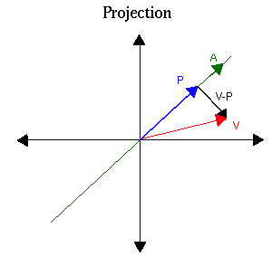

# 投影算子\(projection operator\)

## 簡介

$$T^2=T$$稱為投影算子可理解為若將向量$$V$$投影到$$P$$後，再做一次相同（投影）轉換仍為向量$$P$$時，此性質與空間向量投影性質相同，如下圖。

$$T^2=T\Rightarrow T^3=T(T^2 )=T^2=T$$，由數學歸納法可得$$T^N=T, N \geq 2$$。

## 投影算子\(projection operator\)

> * 線性轉換$$T \in L(V,V)$$，若$$T^2=T$$，則稱$$T$$為$$V$$上的一個投影算子，或稱冪等算子\(idempotent operator\)。
> * 矩陣$$A \in F^{N \times N}$$，若$$A^2=A$$，則稱$$A$$為投影矩陣\(projection matrix\)或稱冪等矩陣\(idempotent matrix\)。

* 若$$T^2=T$$，則$$R(T^2 )=R(T)$$，即值域相等，但反之未必成立
  。
  * 取$$A=\begin{bmatrix} 2 & 0 \\ 0 & 2 \end{bmatrix}$$，$$T=L_A
    $$
  * $$R(T)=R(L_A )=CS(A)=span \left\{ \begin{bmatrix}  2 \\ 0\end{bmatrix} \right\}$$
  * $$R(T^2)=R(L_A^2 )=CS(A^2)=span \left\{ \begin{bmatrix}  4 \\ 0\end{bmatrix} \right\}$$
  * 所以$$R(T^2 )=R(T)$$但$$T \neq T^2$$
* $$T^2=T$$時，$$T$$為映成\(onto\)函數
  。

### 一般線性轉換核空間會越來越大，值域會越來越小

> 線性轉換$$T \in L(V,V)$$，則：
>
> * $$ker⁡(T) \subseteq ker⁡(T^2 )$$ （核空間會隨線性轉換次數逐漸增大）
> * $$R(T^2 )\subseteq R(T)$$ （值域會隨線性轉換次數逐漸縮小）

Proof: \(1\)

* $$\forall v \in ker⁡(T), ~ T(v)=0 $$
* 若$$T(v) =0$$，則$$T^2 (v)=T(T(v))=T(0)=0$$
* 所以$$v \in ker⁡(T^2 )$$，因此$$ker⁡(T) \subseteq ker⁡(T^2 )$$  \(QED\)

Proof \(2\)

* $$\forall v \in R(T^2 )~  \exists u \in V \ni T^2 (u)=v
  $$
* 所以$$v=T(w), ~ w=T(u) \in V
  $$，得$$v \in R(T) $$
* 所以$$R(T^2 ) \subseteq R(T)$$ \(QED\)

### 投影算子的性質

> 線性轉換$$T \in L(V,V)$$，則以下性質等價
：
>
> 1. $$R(T^2 )=R(T)
   $$
> 2. $$rank(T^2 )=rank(T)
   $$
> 3. $$nullity(T^2 )=nullity(T)
   $$
> 4. $$ker⁡(T^2 )=ker⁡(T)
   $$

Proof \(1\)-&gt;\(2\):

因為$$R(T^2 )=R(T) \Rightarrow \dim⁡(R(T^2 ))=\dim⁡(R(T)) \Rightarrow rank(T^2 )=rank(T)$$ \(QED\)

Proof \(2\)-&gt;\(1\):

* 因為$$R(T^2 ) \subseteq R(T) \Rightarrow R(T^2 )$$為$$R(T)$$的子空間
* 因為$$dim⁡(R(T^2 ))=rank(T^2 )=rank(T)=\dim⁡(R(T))$$
* 所以$$R(T^2 )=R(T)$$  \(QED\).

Proof \(2\) 等價\(3\)

* 由rank-nullity theorem
  得
* * $$\dim⁡(V)=rank(T)+nullity(T)$$
  * $$\dim⁡(V)=rank(T^2 )+nullity(T^2 )
    $$
* 所以$$rank(T^2 )=rank(T)\Leftrightarrow nullity(T^2 )=nullity(T) $$\(QED\).

