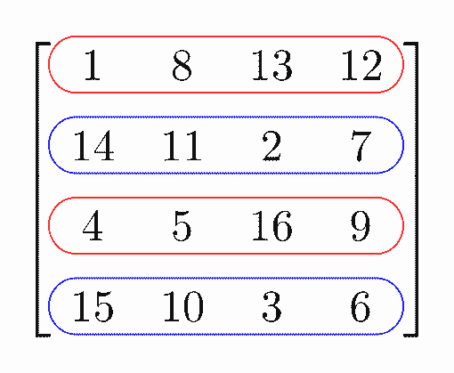
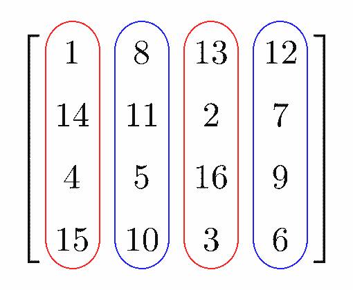
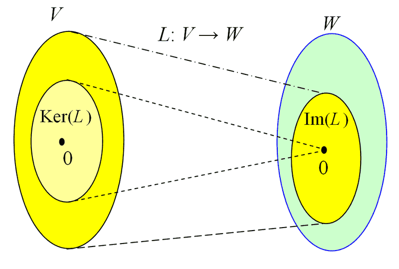

# 基本子空間\(fundamental subspace\)

## 基本子空間

給定矩陣$$A \in F^{M \times N}$$，定義以下四個子空間：

### 列空間\(row space\)

$$RS(A)=\{xA| x \in F^{1\times M}\}=\begin{bmatrix} x_1 & \dots & x_M\end{bmatrix} \begin{bmatrix}A_{1:} \\ \vdots \\ A_{M:} \end{bmatrix} = x_1A_{1:} +\cdots +x_M A_{M:} \subseteq F^{1 \times N} $$為由矩陣$$A$$的列\(row\)生成的子空間。

### 行空間\(column space\)

$$CS(A)=\{Ax| x \in F^{1\times N}\}=\begin{bmatrix}A_{: 1} & \dots & A_{:M} \end{bmatrix} \begin{bmatrix} x_1 \\ \vdots \\ x_M\end{bmatrix} = x_1A_{:1} +\cdots +x_M A_{:M} \subseteq F^{M \times 1} $$為由矩陣$$A$$的行\(column\)生成的子空間。

### 核空間\(kernel space, null space\)

$$ker(A) = \{x \in F^{N \times 1} | Ax =0 \} \subseteq F^{N \times 1}$$

### 左核空間\(left kernel space\)

$$Lker(A) =\{ x \in F^{1 \times M} | xA=0\} \subseteq F^{1 \times M}$$

由定義與上圖可知$$ker(A), Lker(A)$$是定義在線性轉換$$A$$的定義域$$V$$。$$RS(A), CS(A)$$是定義在線性轉換$$A$$的值域$$W$$。

### 列、行、核、左核空間為子空間

> * $$RS(A)$$為$$F^{1 \times N}$$的子空間。 （矩陣$$A$$中列的任意線性組合必定為$$RS(A)$$的元素）
> * $$CS(A)$$為$$F^{1\times M}$$的子空間。（矩陣$$A$$中行的任意線性組合必定為$$CS(A)$$的元素）
> * $$ker(A)$$為$$F^{N \times 1}$$的子空間。（$$\{x \in F^{N \times 1}|Ax=0\}$$的任意線性組合為$$ker(A)$$的元素）
> * $$Lker(A)$$為$$F^{1 \times M}$$的子空間。

proof :

* $$RS(A)$$與$$CS(A)$$因為其中任意向量的線性組合必定仍在同空間中，所以為子空間。
* 因為 $$ker⁡(A) \subseteq F^{N×1}$$且$$ker⁡(A) \neq \emptyset$$ \(至少存在$$x=0$$\)
* 所以$$\forall x_1,x_2 \in ker⁡(A), a,b \in F, Ax_1=0 and Ax_2=0
  $$可得 $$A(a x_1+bx_2 )=aAx_1+bAx_2=a⋅0+b⋅0=0 \in ker⁡(A)$$ \(QED\)

### 等價子空間

> 矩陣$$A,B \in F^{M \times N}$$兩者列等價（$$A$$的列\(row\)經過基本列運算後可得到$$B$$，因此存在可逆矩陣$$P \in F^{M×M} \ni B=PA$$\)，則
>
> * $$RS(A)=RS(B)
  $$
> * $$ker⁡(A)=ker⁡(B)
  $$

> 因為$$RS(A)$$為$$A$$中列向量任意線性組合形成的空間，而$$B$$可由$$A$$經過基本列運算後得出，即$$B$$可由$$A$$的列向量之線性組合得到，因此$$RS(B)$$與$$RS(A)$$可生成相同空間，即$$RS(A)=RS(B)
$$。

Proof:

* $$\forall y \in RS(A),~ y=xA,  ~x \in F^{1×M} $$
* $$y=xI_MA=xP^{−1} PA=(xP^{−1} )(PA)=zB, ~z=xP^{−1} \in F^{１×M} $$
* 所以$$y \in RS(B) \Rightarrow RS(A) \subseteq RS(B) --(1)$$
* $$\forall y \in RS(B), ~ y=xB, ~x \in F^{1×M} $$
* $$y=x(PA)=(xP)A=zA,  ~z=xP \in F^{1×M} $$
* $$y \in RS(A)\Rightarrow RS(B) \subseteq RS(A)-- (2)$$
* 由\(1,2\)得$$RS(A) = RS(B)$$。\(QED\)
* $$x \in ker⁡(A)\Rightarrow Ax=0 \Rightarrow Bx=PAx=P \cdot 0=0 \Rightarrow x \in ker⁡(B), \therefore ker⁡(A)\subseteq ker⁡(B) $$
* $$\forall x \in ker⁡(B) \Rightarrow 0=Bx=PAx \Rightarrow Ax=P^{−1} \cdot 0=0 \Rightarrow x\in ker⁡(A) \therefore ker⁡(B)\subseteq ker⁡(A)$$\)
* 可得$$ker(A)
  =ker(B)$$ \(QED\)

