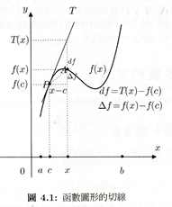
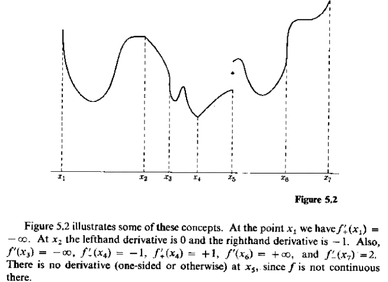

# 微分、導數\(derivative\)

## 瞬時變化率與斜率\(slope\)

* 函數$$f:(a,b) \rightarrow \mathbb{R}$$, $$c,x \in(a,b)$$ 且 $$c<x$$。
* 則當點$$c$$逐漸向點$$x$$靠近時，函數值也在由$$f(c)$$往$$f(x)$$變化。
*  函數$$f$$在區間$$[c,x]$$的平均變化率為 $$\frac{f(x)−f(c)}{(x−c) }$$。
*  若$$\displaystyle \lim_{x \rightarrow c}⁡\frac{f(x)−f(c)}{x−c}$$  存在，則函數$$f$$在點$$c$$的瞬時變化率為 $$\displaystyle \lim_{x \rightarrow c}⁡\frac{f(x)−f(c)}{x−c}$$。

## 切線斜率\(tangent slope\)

* 令平面上點$$P=(c, f(c))$$，點$$A=(x, f(x))$$，則割線$$PA$$的斜率為 $$\tan \theta = \frac{f(x)-f(c)}{x-c}$$。
* 若 $$\displaystyle \lim_{x \rightarrow c}⁡\frac{f(x)−f(c)}{x−c}$$，存在，則點$$P$$的切線斜率為$$\displaystyle \tan \alpha = \lim_{x \rightarrow c} \tan \theta = \lim_{x \rightarrow c} \frac{f(x)-f(c)}{x-c}$$。

## 實值函數在單點可微分

函數$$f$$定義在開區間$$(a,b)$$， 若內點$$c \in (a,b)$$，則
函數$$f$$在點$$c$$可微分若且唯若$$\displaystyle f^{'}(c) \equiv \lim_{x\rightarrow c}⁡\frac{f(x)−f(c)}{x−c}$$  存在，或者$$\displaystyle f^{′}(c) \equiv \lim_{h \rightarrow 0}\frac{f(c+h−f(c)}{h} $$。

*  $$f^{′}$$ 稱為一階導數\(first derivative of function f\)
  。
* 常見符號為 $$f^′ (c)=Df(c)=\frac{df}{dx}(c)=\frac{dy}{dx}|_{x=c}$$。
* $$n \in \mathbb{N}$$，函數$$f$$的$$n$$階導數為 $$f^{(n)} \equiv \frac{df^{(n-1)}}{dx}$$。

## 可微分函數與導函數\(differentiable function and derivative\)

函數$$f:[a,b] \rightarrow \mathbb{R}$$在閉區間$$[a,b]$$的每一點$$x \in [a,b]$$ 均可微分，則稱$$f$$在閉區間$$[a,b]$$為可微分函數。

* 若函數$$f$$在點$$a$$右導數$$f_+^′ (a)$$存在，則稱$$f$$在點$$a$$可微分。
*  函數$$f$$在點$$b$$左導數$$f_−^′ (b)$$存在，稱$$f$$在點$$b$$可微分。
* 而稱$$f^′ (a,b) \rightarrow \mathbb{R}$$ 為函數$$f$$的導函數
  。

## 連續可微函數的集合

若函數$$f:(a,b) \rightarrow \mathbb{R}$$之導函數$$f^′:(a,b) \rightarrow \mathbb{R}$$ 存在且為一連續函數時，稱$$f$$為$$C^1$$ 函數。
記為$$f \in C^1 (a,b)
$$。

同理可得若$$f \in C^n (a,b)$$ ，即f為$$n$$階可微分且微分函數連續的函數。

## 單邊微分\(one-side derivative\)

前述函數在點$$c$$可微分的定義，是建立在$$c$$為函數$$f$$定義域的內點，現在考慮函數$$f$$定義域的邊界點之微分。

函數$$f$$定義在閉區間$$S$$，$$c \in S$$且函數$$f$$在點$$c$$連續，則

* 函數$$f$$在點$$c$$右側微分（righthand derivative）存在 $$\Leftrightarrow$$
  $$\displaystyle  f_+^′ (c) \equiv  \lim_{x \rightarrow c^+}⁡\frac{f(x)−f(c)}{x−c} \equiv \lim_{h \rightarrow 0^+}⁡\frac{f(x+h−f(x)}{h}$$ 存在（可為$$\pm \infty$$）。
* 函數$$f$$在點$$c$$左側微分（lefthand derivative）存在 $$\Leftrightarrow$$$$\displaystyle f_−^′ (c) \equiv \lim_{x \rightarrow c^− }⁡\frac{f(x)−f(c)}{x−c} \equiv \lim_{h -\rightarrow 0^− }\frac{f(x＋h)−f(x)}{h }$$存在（可為$$\pm \infty$$）。

**微分值為正負無窮大的概念與微分不存在不同**；**微分值為正負無窮大表示函數在該點的切線為垂直線；而微分值不存在是無法確定函數在該點的切線斜率（例如**不連續點或是尖點）。

**由定義可得若**$$c \in S$$**為內點，函數**$$f$$**在點**$$c$$**可微分若且唯若**$$f$$**在點**$$c$$**的左側微分等於點**$$c$$**的右側微分，即** $$f^′ (c)=f_−^′ (c)=f_+^′ (c)$$
**。**

## **函數在一點二階可微\(2nd differentiable at one point\)**

令函數 $$f:(a,b) \rightarrow \mathbb{R}$$ 為可微函數，若導函數$$f^′$$ 在點$$c \in (a,b)$$的極限$$\displaystyle  \lim_{h \rightarrow 0}⁡\frac{f^′ (c+h)−f^′ (c)}{h} $$ 存在，則稱函數$$f$$在點$$c$$二階可微分，記為 $$\displaystyle f^{′′} (c)\equiv f^{(2)}(c) \equiv \frac{d^2 f}{dx^2 }(c) \equiv \lim_{h \rightarrow 0}\frac{f^′ (c+h)−f^′ (c)}{h}$$。

### 二階可微函數與導函數\(2nd differentiable function and 2nd derivative\)

函數 $$f:(a,b) \rightarrow \mathbb{R}$$在每一點$$c \in (a,b)$$ 均為二階可微，則稱$$f$$為二階可微函數，$$f^′′:(a,b) \rightarrow \mathbb{R}$$ 為二階導函數
。

